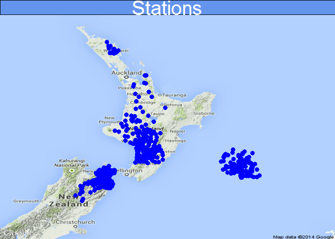

# Using SOS 2.0 to access time-series data
Sean Hodges  
Monday, July 28, 2014  

##Introduction
Accessing data across organisations has traditionally required the physical transfer of data from one organisation to another. In the geospatial world, standard publishing mechanisms exist that allow data to be shared as 'Services' (a URL call), that can be interpretted and loaded as a layer into many different GIS Desktop tools. Recently, time-series data has been able to adopt this approach to data sharing, conceivably allowing a single point of publishing to many different users and desktop tools. In a national context, 16 Regional / Unitary Authorities publishing **water** data this way potentially allows for aggregation of data **across** organisation boundaries. Should this eventuate, it will deliver a paradigm shift in water data delivery and consumption by everyone with an interest in water (allocation, availability, quality, life-sustaining capacity, etc).

For the NZ situation, there are seven agencies that have systems in place - Northland Rc, Waikato RC, Horizons RC, Marlborough DC, ECan, Environment Southland & NIWA - with more coming online as systems are updated. The driver behind this is LAWA (http://www.lawa.org.nz). Here, the chief executives of the represented organisations behind LAWA have agreed to make data available for consumption through the LAWA website. Data is currently manually exchanged and aggregated to support LAWA. With each organisation bringing data servers online, however, the need to manually exchange and aggregate can be replaced by automated processing steps. These automated processing steps then allow validation and reporting on data, replacing the more onerous manual processing steps that currently exist. This will also allow for transfer of knowledge from one organisation to another, with sharing of standard scripts for data access, retrieval and validation.

For this document, three of the above listed agencies are accessed to demonstrate how a cross-agency data summary might be constructed. The approach taken is to:
1. Aggregate sites across selected agencies and determine whether a given measurement has any data available (the equivalent of a GetDataAvailability call, but without date range);
2. Retrieve the last recorded data value from each site determined at step 1.
3. Produce a summary table of results
4. Make a map of values


##Specification
The R code this document is built around assumes the following OGC request and data format standards are supported:

- WFS 1.1.0 to encode location (requires valid `<gml:pos>` element - no assumption is made about data schema)
- SOS 2.0 requests (the `GetObservation` request is supported *without* `temporalFilter` argument, currently)
- WaterML 2.0 encoded data responses (requires valid `<wml2:time>` & `<wml2:value>` elements)

Some error checking is undertaken. Sites are exluded where location coordinates are not available or coordinates do not fall within NZ. Where an exception report is raised for a SOS 2.0 request, this is handled gracefully.


##Demonstrated federated data access
The R script below sets up data access to each Council and pulls time-series data via SOS-based requests.

###Loading libraries


```r
library(XML)
library(sp)
library(RgoogleMaps)
library(pixmap)
```


###Build reference data
**Site table**


```r
#===================================================================================================
# INIT Settings
source("SOS_Ref.R")

USE_CACHE <- TRUE #TRUE
runStatus <- TRUE    ## Pulling site and measurement information takes time.
                      ## The WFS Scan and site table build only need be run
                      ## As new councils are added, or on a nightly basis to
                      ## update the data in the reference table.

# Council SOS domain addresses
# These addresses are currently the property of their respective councils. Please request permission 
# from respective Hydrology teams to use the data from their servers
servers <- c("http://hilltop.nrc.govt.nz/data.hts?",
             "http://envdata.waikatoregion.govt.nz:8080/KiWIS/KiWIS?datasource=0&",
             "http://hilltopserver.horizons.govt.nz/data.hts?",
             "http://hydro.marlborough.govt.nz/data.hts?",
             "http://odp.es.govt.nz/data.hts?")

## ===============================================================================
## Getting Site Data - THIS SHOULD ONLY BE RUN DAILY IN ITS CURRENT FORM
## KiWIS Servers and Hilltop Servers take slighty different approaches
## to serving WFS.

## KISTERS
## http://envdata.waikatoregion.govt.nz:8080/KiWIS/KiWIS?datasource=0&service=WFS&request=GetFeature&typename=KiWIS:Station&version=1.1.0

## HILLTOP
## http://hilltopserver.horizons.govt.nz/data.hts?service=WFS&request=GetFeature&typename=SiteList

## For simplicities sake, unique WFS calls will be defined for each agency
wfs <- c("http://hilltop.nrc.govt.nz/data.hts?service=WFS&request=GetFeature&typename=SiteList",
         "http://envdata.waikatoregion.govt.nz:8080/KiWIS/KiWIS?datasource=0&service=WFS&request=GetFeature&typename=KiWIS:Station&version=1.0.0",
         "http://hilltopserver.horizons.govt.nz/data.hts?service=WFS&request=GetFeature&typename=SiteList",
         "http://hydro.marlborough.govt.nz/data.hts?service=WFS&request=GetFeature&typename=SiteList",
         "http://odp.es.govt.nz/data.hts?service=WFS&request=GetFeature&typename=SiteList")

wfs_site_element <- c("Site","KiWIS:station_no","Site","Site","Site")


if(USE_CACHE){
    ## Load the one prepared earlier
    load("dfSitesCouncils.Rdata")
    ds <- dfsites
    
} else{
    # For each council server specified...
    # Assumption is that gml:pos has coordinates recorded in lat,lon order
    for(i in 1:length(wfs)){
        getSites.xml <- xmlInternalTreeParse(wfs[i])
        
        # In WFS, the <Site> element value is the sitename
        site.list<-sapply(getNodeSet(getSites.xml,paste("//gml:pos/../../../",wfs_site_element[i],sep="")),xmlValue)
        
        # In WFS, lat lon are specified as the value in the <gml:pos> element, separated by a single space.
        data.latlon <- sapply(getNodeSet(getSites.xml,"//gml:pos"),xmlValue)
        latlon <- sapply(strsplit(data.latlon," "),as.numeric)
        
        ## Lats and Longs are stored in a different order for waikatoregion service
        ## Reverse association for this Waikato
        if(i!=2){
            data.lat <- latlon[1,]
            data.lon <- latlon[2,]
        } else {
            data.lat <- latlon[2,]
            data.lon <- latlon[1,]
        }
        
        if(i==1){
            ds <-data.frame(site.list,data.lat,data.lon,Sys.time(), stringsAsFactors=FALSE)
            ds$source <- servers[i]
        } else {
            ds1 <-data.frame(site.list,data.lat,data.lon,Sys.time(), stringsAsFactors=FALSE)
            ds1$source <- servers[i]
    
            ds <- rbind(ds,ds1)
        }
    }
    rm(ds1,data.lat,data.lon,latlon,data.latlon,site.list,getSites.xml,i)
    names(ds) <- c("SiteName","Lat","Lon","lastrun","source")
    # removing resource consent flow monitoring sites
    ds <- subset(ds,substr(ds$SiteName,1,3) !="RC_")
    # Remove site with strange latlon values
    ds <- ds[-2,]
    save(ds,file="dfSitesCouncils.Rdata")
    
} 

MakeMap(ds)
```

 

**GetDataAvailability**
With a valid list of sites, the next step is to establish what data is available. A `GetDataAvailability` call against a SOS server would be convenient. However, for those servers not currently supporting this call, a slightly longer process is required to *discover* what is avialable. The only pre-condition is that the names of the `observedProperty` can be determined by other means beforehand. For this purposes of this example, the following `observedProperty` values have been chosen: Flow, Rainfall, Water Temperature.

The example below could be modified to return valid date ranges for the `observedProperty`'s in question if necessary.


```r
# Measurements to scan
measurements <- c("Flow","Rainfall")

## GetDataAvailability for each measurement
if(USE_CACHE){
    cat("Loading cached data ...\n")
    load("dsmMeasurements.Rdata")
    
} else {
    dsm <- rcData(ds,measurements)
    save(dsm,file="dsmMeasurements.Rdata")
    
}
```

```
## Loading cached data ...
```

```r
# Just select sites that have  flow data
ds_flow <- subset(dsm,dsm$Flow == "OK")
ds_rain <- subset(dsm,dsm$Rainfall == "OK")

## ===============================================================================
## Getting Measurement Data for Mapping.
## For each site that has measurement data, get the last value ...
df_flow <- rcLastTVP(ds_flow,"Flow")
#df_rain <- rcLastTVP(ds_rain,"Rainfall")
```


###Make a map


 
