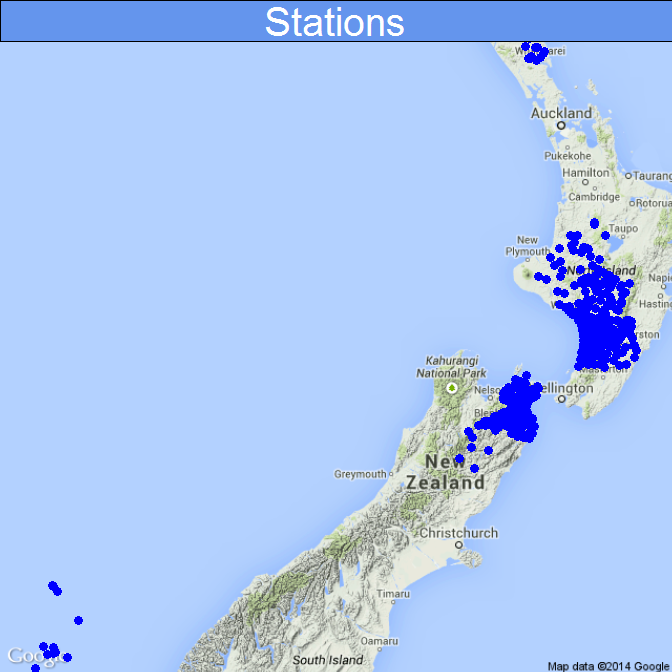
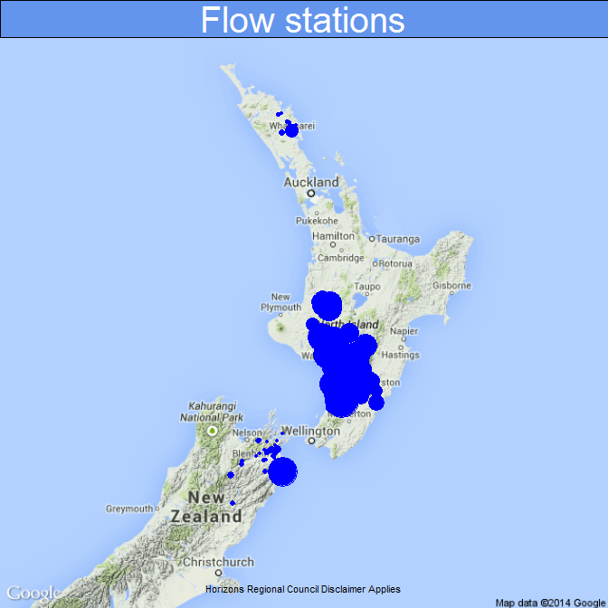

# Using SOS 2.0 to access time-series data
August 8, 2014  

##Introduction
Accessing data from other organisations has traditionally required the physical transfer of data. Data is moved using common file formats as defacto encodings (for example, fixed format text, delimited text or Excel files). The structure of data stored within the file format is based on presentation. Generally, there is a need to explain the method of presentation to the consumer. This is compounded when requesting data from many organisations - with no generally accepted uniform way to provide data, subtle or substantive differences in data presentation will occur (even when requests are relatively simple). The resulting back-and-forth explanation of data presentation has long been the bane of both the data provider and the data consumer - it is left up the consumer to piece it all together.

In the geospatial world, recognising that there were a range of different software vendors with different encoding formats, standardised specifications were established by the Open Geospatial Consortium (OGC), allowing data to be exchanged in a platform-neutral manner. It was then up to individual GIS/mapping clients to interpret platform-neutral content and demonstrate compliance with open specifications.

Recently, work has been completed that allows time-series data to adopt this approach for data sharing. The introduction of request (SOS 2.0) and response (WaterML 2.0) specifications by the OGC allows software clients to adopt a common framework, simplifying data exchange. In the New Zealand context, the implication organisations publishing **water** data this way potentially allows for aggregation of data **across** organisation boundaries. Extending this to other domains (biodiversity, biosecurity, land, air, coast) has the potential to revolutionise public access to a wide range of previously hard to access information.

To date, there are six NZ agencies that have OGC-compliant systems for sharing time-series data - Northland RC, Waikato RC, Horizons RC, Marlborough DC, ECan, Environment Southland & NIWA - with more coming online as systems are updated. A lot of activity has occurred over the last 12 months in space, with two main drivers:

1. LAWA (http://www.lawa.org.nz),  where, the Regional Council Chief Executives  and Chairs have agreed to make data available for consumption through the LAWA website. 
2. CRI's investing in systems specialising in environmental data discovery and delivery.

The net result is that a critical mass of agencies adopting OGC specifications for data exchange in the environmental domains has been achieved. While other mechanisms for data exchange are also available (but platform dependent, such as *Kisters Query Service*), the acceptance of OGC as providing the core data exchange specification is a significant step in improving data exchange to support the delivery of portals such as LAWA.

For this document, five of the above listed agencies are accessed using the OGC specifications to demonstrate how a cross-agency data summary might be constructed. The approach taken is as follows:
1. Aggregate location information across selected agencies, creating `featureOfInterest` reference data.
2. From an *a priori* list, determine whether an `observedProperty` has any data available for a specific locatoin (the equivalent of a GetDataAvailability call, but without date range);
3. Retrieve the last recorded data value from each `observedProperty` (and `procedure` where required) for the `featureOfInterest` determined at step 1.
4. Make a simple table to summarise responses
5. Make a map of values


##Methods
The R code this document assumes the following OGC request and data format standards are supported:

- WFS 1.1.0 to encode location (requires valid `<gml:pos>` element - no assumption is made about data schema)
- SOS 2.0 requests (the `GetObservation` request is supported *without* `temporalFilter` argument. It is intended to add this at a later date)
- WaterML 2.0 encoded data responses (requires valid `<wml2:time>` & `<wml2:value>` elements)

Some error checking is undertaken. Sites are exluded where location coordinates are not available or coordinates do not fall near NZ. Order of Lat-lon values has been considered for different implementations. Coordinates may fall outside NZ where servers have not been correctly configured to handle projections. Server maintainers may be notified where this is discovered. Finally, where an exception reports or other unexpected responses are returned from SOS requests, a `tryCatch()` approach has been adopted to ensure code execution is not interrupted..


##Demonstrated federated data access using R
[R](http://R-project.org/), a language and environment for statistical computing, is being used to demonstrated federated data access.

The R code chunks below set up data access to each Council and pulls time-series data via SOS-based requests. Some of the requests used below are easier to implement in the host systems native RESTful services, but this would defeat the purpose of this document. Federation of water data, based on OGC specifications, is the key component to implementing a common set of rules for engangement between agencies.

The demonstration that follows is a trivial use-case of showing the last recorded value for discharge at a water-level monitoring site. In undertaking this exercise, evaluation of using OGC specifications for a request/response framework can be undertaken.

###Loading libraries


```r
library(XML)
library(sp)
library(RgoogleMaps)
library(googleVis)
```

```
## Warning: package 'googleVis' was built under R version 3.1.1
```

```
## 
## Welcome to googleVis version 0.5.4
## 
## Please read the Google API Terms of Use
## before you start using the package:
## https://developers.google.com/terms/
## 
## Note, the plot method of googleVis will by default use
## the standard browser to display its output.
## 
## See the googleVis package vignettes for more details,
## or visit http://github.com/mages/googleVis.
## 
## To suppress this message use:
## suppressPackageStartupMessages(library(googleVis))
```

```r
op <- options(gvis.plot.tag='chart')
```


###Build reference data
**Site table**

The first step is to build a list of sites where environmental data are recorded. Accessing the WFS services and requesting a list of sites enables this list of sites to be created. 

Limitation: Schemas are potentially different across servers, so the simple approach here is to simply retrieve the lat/long data and hard code the call to retrieve the site name that will be used later to retrieve data via the SOS request.

Defining a schema for site data, based on terms used by SOS, would simplify compilation of reference data.


```r
#===================================================================================================
# INIT Settings
source("SOS_Ref.R")

USE_CACHE_SITES <- TRUE# Scan WFS endpoints
USE_CACHE_GDA   <- TRUE  # GetDataAvailability
# Council SOS domain addresses
# These addresses are currently the property of their respective councils. Please request permission 
# from respective Hydrology teams to use the data from their servers
servers <- c("http://hilltop.nrc.govt.nz/data.hts?",
             "http://envdata.waikatoregion.govt.nz:8080/KiWIS/KiWIS?datasource=0&",
             "http://hilltopserver.horizons.govt.nz/data.hts?",
             "http://hydro.marlborough.govt.nz/data.hts?",
             "http://odp.es.govt.nz/data.hts?")

## ===============================================================================
## Getting Site Data - THIS SHOULD ONLY BE RUN DAILY IN ITS CURRENT FORM
## KiWIS Servers and Hilltop Servers take slighty different approaches
## to serving WFS.

## KISTERS
## http://envdata.waikatoregion.govt.nz:8080/KiWIS/KiWIS?datasource=0&service=WFS&request=GetFeature&typename=KiWIS:Station&version=1.1.0

## HILLTOP
## http://hilltopserver.horizons.govt.nz/data.hts?service=WFS&request=GetFeature&typename=SiteList

## For simplicities sake, unique WFS calls will be defined for each agency
wfs <- c("http://hilltop.nrc.govt.nz/data.hts?service=WFS&request=GetFeature&typename=SiteList",
         "http://envdata.waikatoregion.govt.nz:8080/KiWIS/KiWIS?datasource=0&service=WFS&request=GetFeature&typename=KiWIS:Station&version=1.1.0",
         "http://hilltopserver.horizons.govt.nz/data.hts?service=WFS&request=GetFeature&typename=SiteList",
         "http://hydro.marlborough.govt.nz/data.hts?service=WFS&request=GetFeature&typename=SiteList",
         "http://odp.es.govt.nz/data.hts?service=WFS&request=GetFeature&typename=SiteList")

wfs_site_element <- c("Site","KiWIS:station_no","Site","Site","Site")


if(USE_CACHE_SITES){
    ## Load the one prepared earlier
    load("dfSitesCouncils.Rdata")
    #ds <- dfsites
    
} else{
    # For each council server specified...
    # Assumption is that gml:pos has coordinates recorded in lat,lon order
    for(i in 1:length(wfs)){
                     
        #cat(wfs[i],"\n")
        # Code is susceptible to loss of web services (HTTP 503 errors will stop code execution)
        # The tryCatch() approach will enable the code to continue running, but at the expense
        # of lost services. This may have unintended consequences.
        getSites.xml <- xmlInternalTreeParse(wfs[i])
        
         # In WFS, the <Site> element value is the sitename
        site.list<-sapply(getNodeSet(getSites.xml,paste("//gml:pos/../../../",wfs_site_element[i],sep="")),xmlValue)
        
        # In WFS, lat lon are specified as the value in the <gml:pos> element, separated by a single space.
        data.latlon <- sapply(getNodeSet(getSites.xml,"//gml:pos"),xmlValue)
        latlon <- sapply(strsplit(data.latlon," "),as.numeric)
        
        ## Lats and Longs are stored in a different order for waikatoregion service
        ## Reverse association for this Waikato
        if(i!=2){
            data.lat <- latlon[1,]
            data.lon <- latlon[2,]
        } else {
            data.lat <- latlon[2,]
            data.lon <- latlon[1,]
        }
        
        # bind rows together from successive loops
        if(i==1){
            ds <-data.frame(site.list,data.lat,data.lon,Sys.time(), stringsAsFactors=FALSE)
            ds$source <- servers[i]
        } else {
            ds1 <-data.frame(site.list,data.lat,data.lon,Sys.time(), stringsAsFactors=FALSE)
            ds1$source <- servers[i]
        
            ds <- rbind(ds,ds1)
        }

    }
    
    rm(ds1,data.lat,data.lon,latlon,data.latlon,site.list,getSites.xml,i)
    names(ds) <- c("SiteName","Lat","Lon","lastrun","source")
    # removing resource consent flow monitoring sites
    ds <- subset(ds,substr(ds$SiteName,1,3) !="RC_")
    # Remove site with strange latlon values
    ds <- ds[-2,]
    save(ds,file="dfSitesCouncils.Rdata")

}
```

**Site Map**

A quick map to show the what reference data has been constructed. A tabular summary of Council and number of sites would also be useful here.
 

**GetDataAvailability**

With a valid list of sites, the next step is to establish what data is available. A `GetDataAvailability` call against a SOS server would be convenient. However, for those servers not currently supporting this call, a slightly longer process is required to *discover* what is avialable. The only pre-condition is that the names of the `observedProperty` can be determined by other means beforehand. For this purposes of this example, the following `observedProperty` values have been chosen: Flow, Rainfall, Water Temperature.

The example below could be modified to return valid date ranges for the `observedProperty`'s in question if necessary.


```r
# Measurements to scan
# These are locally defined terms. Alternatives may be Discharge, Precipitation
measurements <- c("Flow")

## GetDataAvailability for each measurement
if(USE_CACHE_GDA){
    cat("Loading cached data ...\n")
    load("dsmMeasurements.Rdata")
    
} else {
    dsm <- rcData(ds,measurements)
    save(dsm,file="dsmMeasurements.Rdata")
    
}
```

```
## Loading cached data ...
```

```r
# Just select sites that have  flow data
ds_flow <- subset(dsm,dsm$Flow == "OK")
#ds_rain <- subset(dsm,dsm$Rainfall == "OK")

## ===============================================================================
## Getting Measurement Data for Mapping.
## For each site that has measurement data, get the last value ...

#df_flow <- rcLastTVP(ds_flow,"Flow")

df <-ds_flow
measurement <- "Flow"

for(i in 1:length(df[,1])){
    
    if(substrRight(df$source[i],1)=="&"){
        
        ## Using some Kister and Waikato specific KVP's
        SOS_url <- paste(df$source[i],"service=SOS&version=2.0",
                     "&request=GetObservation",
                     "&featureOfInterest=",df$SiteName[i],
                     "&procedure=Cmd.P",
                     "&observedProperty=Discharge",
                     sep="")
    } else{
        ## Using the minimal Hilltop KVPs
        SOS_url <- paste(df$source[i],"service=SOS",
                     "&request=GetObservation",
                     "&featureOfInterest=",df$SiteName[i],
                     "&observedProperty=",measurement,
                     sep="")
    }  
    
    SOS_url <- gsub(" ","%20",SOS_url)
    
    #Waikato Kisters request for river flow
    # http://envdata.waikatoregion.govt.nz:8080/KiWIS/KiWIS?datasource=0&service=SOS&version=2.0
    #                   &request=GetObservation
    #                   &featureOfInterest=64
    #                   &procedure=Cmd.P
    #                   &observedProperty=Discharge
    #                   &temporalFilter=om:phenomenonTime,2014-01-28T15:00:00/2014-01-29T15:00:00
    
    
    #Waikato Kisters request for Precipitation
    # http://envdata.waikatoregion.govt.nz:8080/KiWIS/KiWIS?datasource=0&service=SOS&version=2.0
    #                   &request=GetObservation
    #                   &featureOfInterest=21
    #                   &procedure=CmdTotal.P
    #                   &observedProperty=Precipitation
    #                   &temporalFilter=om:phenomenonTime,2014-01-28T15:00:00/2014-01-29T15:00:00
    
    
    #cat(SOS_url,"\n")
    
    result = tryCatch({
        getData.xml <- xmlInternalTreeParse(SOS_url)
        
    }, warning = function(w) {
        
    }, error = function(e) {
        if(i==1){
            wml2Time <- NA
            wml2Value <- NA
        } else {
            wml2Time1 <- NA
            wml2Value1 <- NA
            
            wml2Time <- c(wml2Time,wml2Time1)
            wml2Value <- c(wml2Value,wml2Value1) 
        } 
        
    }, finally = {
        xmltop <- xmlRoot(getData.xml)
        
        if(xmlName(xmltop)!="ExceptionReport"){
            if(length(getNodeSet(getData.xml,"//wml2:point"))!=0){
                wml2time<-sapply(getNodeSet(getData.xml,"//wml2:time"),xmlValue)[1]
                wml2value<-sapply(getNodeSet(getData.xml,"//wml2:value"),xmlValue)[1]
                #cat(wml2time,"\n")
                #cat(wml2value,"\n")
            } else {wml2time<-NA
                wml2value<-NA}
        }
        
        if(i==1){
            wml2_Time <- wml2time
            wml2_Value <-as.numeric(wml2value)
            ## Horizons stores flow as L/s. Others store it as m3/s. The following line adusts Horizons value
            if(df$source[i]=="http://hilltopserver.horizons.govt.nz/data.hts?"){wml2_Value <- wml2_Value/1000}
            ## Recoding negative values to NA
            if(!anyNA(wml2_Value)){
                if(wml2_Value < 0){wml2_Value <- NA}
            }

        } else {
            wml2_Time1 <- wml2time
            wml2_Value1 <- as.numeric(wml2value)
            ## Horizons stores flow as L/s. Others store it as m3/s. The following line adusts Horizons value
            if(df$source[i]=="http://hilltopserver.horizons.govt.nz/data.hts?"){wml2_Value1 <- wml2_Value1/1000}
            ## Recoding negative values to NA
            if(!anyNA(wml2_Value1)){
                if(wml2_Value1 < 0){wml2_Value1 <- NA}
            }
            
            wml2_Time <- c(wml2_Time,wml2_Time1)
            wml2_Value <- c(wml2_Value,wml2_Value1) 
            rm(wml2_Time1,wml2_Value1)
        }
        rm(SOS_url,wml2time,wml2value)
    })
    
}


## Append each measurements output vector to the data.frame as a new column

# DateTime inclusion and conversion to POSIXlt DateTime
df[,length(df)+1] <- wml2_Time  ### Add wml2Time
colnames(df)[length(df)] <-  c("DateTime")
df$DateTime<-strptime(df$DateTime,"%Y-%m-%dT%H:%M:%S")

# Measurement value. Data type set to numeric when vector created.
df[,length(df)+1] <- wml2_Value  ### Add wml2Value
colnames(df)[length(df)] <-  c("Value")

# Housekeeping
rm(wml2_Time,wml2_Value,xmltop)
```


###Make a map


 

###Charting

A final examination of the SOS request is the inclusion of the `temporalFilter` element. The time period can be explicitly specified using a date range, with date/time representations based on the ISO8601 standard. Further, fixed time ranges can be specified using a duration string. This will be tested across servers. A single site from each region has been selected for testing.


```r
stations <- c(11,33,123)

measurement <- "Flow"

TimeSeriesSlider(df_flow,1,measurement)
```

http://envdata.waikatoregion.govt.nz:8080/KiWIS/KiWIS?datasource=0&service=SOS&version=2.0&request=GetObservation&featureOfInterest=2&procedure=Cmd.P&observedProperty=Discharge&temporalFilter=om:phenomenonTime,2014-08-01T00:00:00/2014-08-08T00:00:00 

```
## Warning: the condition has length > 1 and only the first element will be
## used
```

<!-- AnnotatedTimeLine generated in R 3.1.0 by googleVis 0.5.4 package -->
<!-- Thu Aug 07 23:25:59 2014 -->


<!-- jsHeader -->
<script type="text/javascript">
 
// jsData 
function gvisDataAnnotatedTimeLineID12204ea1e9a () {
var data = new google.visualization.DataTable();
var datajson =
[
 [
 new Date(2014,7,1,12,0,0),
60.447754 
],
[
 new Date(2014,7,1,12,5,0),
60.384335 
],
[
 new Date(2014,7,1,12,10,0),
60.384335 
],
[
 new Date(2014,7,1,12,15,0),
60.289208 
],
[
 new Date(2014,7,1,12,20,0),
60.194083 
],
[
 new Date(2014,7,1,12,25,0),
60.225791 
],
[
 new Date(2014,7,1,12,30,0),
60.130667 
],
[
 new Date(2014,7,1,12,35,0),
60.130667 
],
[
 new Date(2014,7,1,12,40,0),
60.035545 
],
[
 new Date(2014,7,1,12,45,0),
60.035545 
],
[
 new Date(2014,7,1,12,50,0),
59.972131 
],
[
 new Date(2014,7,1,12,55,0),
59.972131 
],
[
 new Date(2014,7,1,13,0,0),
59.908717 
],
[
 new Date(2014,7,1,13,5,0),
59.845305 
],
[
 new Date(2014,7,1,13,10,0),
59.750187 
],
[
 new Date(2014,7,1,13,15,0),
59.750187 
],
[
 new Date(2014,7,1,13,20,0),
59.718482 
],
[
 new Date(2014,7,1,13,25,0),
59.655071 
],
[
 new Date(2014,7,1,13,30,0),
59.591661 
],
[
 new Date(2014,7,1,13,35,0),
59.559956 
],
[
 new Date(2014,7,1,13,40,0),
59.496547 
],
[
 new Date(2014,7,1,13,45,0),
59.496547 
],
[
 new Date(2014,7,1,13,50,0),
59.464843 
],
[
 new Date(2014,7,1,13,55,0),
59.338026 
],
[
 new Date(2014,7,1,14,0,0),
59.338026 
],
[
 new Date(2014,7,1,14,5,0),
59.338026 
],
[
 new Date(2014,7,1,14,10,0),
59.274618 
],
[
 new Date(2014,7,1,14,15,0),
59.242915 
],
[
 new Date(2014,7,1,14,20,0),
59.179507 
],
[
 new Date(2014,7,1,14,25,0),
59.179507 
],
[
 new Date(2014,7,1,14,30,0),
59.084397 
],
[
 new Date(2014,7,1,14,35,0),
59.084397 
],
[
 new Date(2014,7,1,14,40,0),
59.020991 
],
[
 new Date(2014,7,1,14,45,0),
58.989288 
],
[
 new Date(2014,7,1,14,50,0),
58.925882 
],
[
 new Date(2014,7,1,14,55,0),
58.925882 
],
[
 new Date(2014,7,1,15,0,0),
58.830774 
],
[
 new Date(2014,7,1,15,5,0),
58.767368 
],
[
 new Date(2014,7,1,15,10,0),
58.799071 
],
[
 new Date(2014,7,1,15,15,0),
58.767368 
],
[
 new Date(2014,7,1,15,20,0),
58.703963 
],
[
 new Date(2014,7,1,15,25,0),
58.640558 
],
[
 new Date(2014,7,1,15,30,0),
58.608856 
],
[
 new Date(2014,7,1,15,35,0),
58.608856 
],
[
 new Date(2014,7,1,15,40,0),
58.545451 
],
[
 new Date(2014,7,1,15,45,0),
58.545451 
],
[
 new Date(2014,7,1,15,50,0),
58.545451 
],
[
 new Date(2014,7,1,15,55,0),
58.482046 
],
[
 new Date(2014,7,1,16,0,0),
58.418641 
],
[
 new Date(2014,7,1,16,5,0),
58.323534 
],
[
 new Date(2014,7,1,16,10,0),
58.323534 
],
[
 new Date(2014,7,1,16,15,0),
58.323534 
],
[
 new Date(2014,7,1,16,20,0),
58.228426 
],
[
 new Date(2014,7,1,16,25,0),
58.228426 
],
[
 new Date(2014,7,1,16,30,0),
58.165022 
],
[
 new Date(2014,7,1,16,35,0),
58.133319 
],
[
 new Date(2014,7,1,16,40,0),
58.133319 
],
[
 new Date(2014,7,1,16,45,0),
58.069914 
],
[
 new Date(2014,7,1,16,50,0),
58.069914 
],
[
 new Date(2014,7,1,16,55,0),
58.069914 
],
[
 new Date(2014,7,1,17,0,0),
58.006509 
],
[
 new Date(2014,7,1,17,5,0),
57.943103 
],
[
 new Date(2014,7,1,17,10,0),
57.943103 
],
[
 new Date(2014,7,1,17,15,0),
57.9114 
],
[
 new Date(2014,7,1,17,20,0),
57.847995 
],
[
 new Date(2014,7,1,17,25,0),
57.847995 
],
[
 new Date(2014,7,1,17,30,0),
57.816292 
],
[
 new Date(2014,7,1,17,35,0),
57.752885 
],
[
 new Date(2014,7,1,17,40,0),
57.657776 
],
[
 new Date(2014,7,1,17,45,0),
57.689479 
],
[
 new Date(2014,7,1,17,50,0),
57.657776 
],
[
 new Date(2014,7,1,17,55,0),
57.657776 
],
[
 new Date(2014,7,1,18,0,0),
57.594369 
],
[
 new Date(2014,7,1,18,5,0),
57.594369 
],
[
 new Date(2014,7,1,18,10,0),
57.530961 
],
[
 new Date(2014,7,1,18,15,0),
57.530961 
],
[
 new Date(2014,7,1,18,20,0),
57.467553 
],
[
 new Date(2014,7,1,18,25,0),
57.435849 
],
[
 new Date(2014,7,1,18,30,0),
57.372441 
],
[
 new Date(2014,7,1,18,35,0),
57.372441 
],
[
 new Date(2014,7,1,18,40,0),
57.277328 
],
[
 new Date(2014,7,1,18,45,0),
57.277328 
],
[
 new Date(2014,7,1,18,50,0),
57.213918 
],
[
 new Date(2014,7,1,18,55,0),
57.213918 
],
[
 new Date(2014,7,1,19,0,0),
57.213918 
],
[
 new Date(2014,7,1,19,5,0),
57.150508 
],
[
 new Date(2014,7,1,19,10,0),
57.213918 
],
[
 new Date(2014,7,1,19,15,0),
57.118803 
],
[
 new Date(2014,7,1,19,20,0),
57.055392 
],
[
 new Date(2014,7,1,19,25,0),
57.055392 
],
[
 new Date(2014,7,1,19,30,0),
56.99198 
],
[
 new Date(2014,7,1,19,35,0),
56.99198 
],
[
 new Date(2014,7,1,19,40,0),
56.960274 
],
[
 new Date(2014,7,1,19,45,0),
56.896862 
],
[
 new Date(2014,7,1,19,50,0),
56.896862 
],
[
 new Date(2014,7,1,19,55,0),
56.801741 
],
[
 new Date(2014,7,1,20,0,0),
56.801741 
],
[
 new Date(2014,7,1,20,5,0),
56.801741 
],
[
 new Date(2014,7,1,20,10,0),
56.738327 
],
[
 new Date(2014,7,1,20,15,0),
56.70662 
],
[
 new Date(2014,7,1,20,20,0),
56.70662 
],
[
 new Date(2014,7,1,20,25,0),
56.643204 
],
[
 new Date(2014,7,1,20,30,0),
56.643204 
],
[
 new Date(2014,7,1,20,35,0),
56.643204 
],
[
 new Date(2014,7,1,20,40,0),
56.579788 
],
[
 new Date(2014,7,1,20,45,0),
56.516371 
],
[
 new Date(2014,7,1,20,50,0),
56.516371 
],
[
 new Date(2014,7,1,20,55,0),
56.516371 
],
[
 new Date(2014,7,1,21,0,0),
56.516371 
],
[
 new Date(2014,7,1,21,5,0),
56.484662 
],
[
 new Date(2014,7,1,21,10,0),
56.421244 
],
[
 new Date(2014,7,1,21,15,0),
56.389534 
],
[
 new Date(2014,7,1,21,20,0),
56.326115 
],
[
 new Date(2014,7,1,21,25,0),
56.326115 
],
[
 new Date(2014,7,1,21,30,0),
56.262694 
],
[
 new Date(2014,7,1,21,35,0),
56.230983 
],
[
 new Date(2014,7,1,21,40,0),
56.230983 
],
[
 new Date(2014,7,1,21,45,0),
56.167561 
],
[
 new Date(2014,7,1,21,50,0),
56.167561 
],
[
 new Date(2014,7,1,21,55,0),
56.167561 
],
[
 new Date(2014,7,1,22,0,0),
56.104138 
],
[
 new Date(2014,7,1,22,5,0),
56.104138 
],
[
 new Date(2014,7,1,22,10,0),
56.104138 
],
[
 new Date(2014,7,1,22,15,0),
56.040714 
],
[
 new Date(2014,7,1,22,20,0),
56.009002 
],
[
 new Date(2014,7,1,22,25,0),
55.945576 
],
[
 new Date(2014,7,1,22,30,0),
55.945576 
],
[
 new Date(2014,7,1,22,35,0),
55.945576 
],
[
 new Date(2014,7,1,22,40,0),
55.882149 
],
[
 new Date(2014,7,1,22,45,0),
55.850435 
],
[
 new Date(2014,7,1,22,50,0),
55.787007 
],
[
 new Date(2014,7,1,22,55,0),
55.818721 
],
[
 new Date(2014,7,1,23,0,0),
55.818721 
],
[
 new Date(2014,7,1,23,5,0),
55.787007 
],
[
 new Date(2014,7,1,23,10,0),
55.723577 
],
[
 new Date(2014,7,1,23,15,0),
55.691862 
],
[
 new Date(2014,7,1,23,20,0),
55.691862 
],
[
 new Date(2014,7,1,23,25,0),
55.691862 
],
[
 new Date(2014,7,1,23,30,0),
55.691862 
],
[
 new Date(2014,7,1,23,35,0),
55.62843 
],
[
 new Date(2014,7,1,23,40,0),
55.62843 
],
[
 new Date(2014,7,1,23,45,0),
55.62843 
],
[
 new Date(2014,7,1,23,50,0),
55.564997 
],
[
 new Date(2014,7,1,23,55,0),
55.469846 
],
[
 new Date(2014,7,2,0,0,0),
55.469846 
],
[
 new Date(2014,7,2,0,5,0),
55.469846 
],
[
 new Date(2014,7,2,0,10,0),
55.438128 
],
[
 new Date(2014,7,2,0,15,0),
55.438128 
],
[
 new Date(2014,7,2,0,20,0),
55.438128 
],
[
 new Date(2014,7,2,0,25,0),
55.374691 
],
[
 new Date(2014,7,2,0,30,0),
55.311253 
],
[
 new Date(2014,7,2,0,35,0),
55.311253 
],
[
 new Date(2014,7,2,0,40,0),
55.279534 
],
[
 new Date(2014,7,2,0,45,0),
55.311253 
],
[
 new Date(2014,7,2,0,50,0),
55.216094 
],
[
 new Date(2014,7,2,0,55,0),
55.216094 
],
[
 new Date(2014,7,2,1,0,0),
55.216094 
],
[
 new Date(2014,7,2,1,5,0),
55.216094 
],
[
 new Date(2014,7,2,1,10,0),
55.216094 
],
[
 new Date(2014,7,2,1,15,0),
55.216094 
],
[
 new Date(2014,7,2,1,20,0),
55.152653 
],
[
 new Date(2014,7,2,1,25,0),
55.152653 
],
[
 new Date(2014,7,2,1,30,0),
55.089211 
],
[
 new Date(2014,7,2,1,35,0),
55.089211 
],
[
 new Date(2014,7,2,1,40,0),
54.994047 
],
[
 new Date(2014,7,2,1,45,0),
54.994047 
],
[
 new Date(2014,7,2,1,50,0),
54.994047 
],
[
 new Date(2014,7,2,1,55,0),
54.962325 
],
[
 new Date(2014,7,2,2,0,0),
54.962325 
],
[
 new Date(2014,7,2,2,5,0),
54.898882 
],
[
 new Date(2014,7,2,2,10,0),
54.962325 
],
[
 new Date(2014,7,2,2,15,0),
54.86716 
],
[
 new Date(2014,7,2,2,20,0),
54.835438 
],
[
 new Date(2014,7,2,2,25,0),
54.835438 
],
[
 new Date(2014,7,2,2,30,0),
54.835438 
],
[
 new Date(2014,7,2,2,35,0),
54.835438 
],
[
 new Date(2014,7,2,2,40,0),
54.771994 
],
[
 new Date(2014,7,2,2,45,0),
54.70855 
],
[
 new Date(2014,7,2,2,50,0),
54.70855 
],
[
 new Date(2014,7,2,2,55,0),
54.70855 
],
[
 new Date(2014,7,2,3,0,0),
54.70855 
],
[
 new Date(2014,7,2,3,5,0),
54.613385 
],
[
 new Date(2014,7,2,3,10,0),
54.613385 
],
[
 new Date(2014,7,2,3,15,0),
54.613385 
],
[
 new Date(2014,7,2,3,20,0),
54.613385 
],
[
 new Date(2014,7,2,3,25,0),
54.581664 
],
[
 new Date(2014,7,2,3,30,0),
54.518222 
],
[
 new Date(2014,7,2,3,35,0),
54.518222 
],
[
 new Date(2014,7,2,3,40,0),
54.486501 
],
[
 new Date(2014,7,2,3,45,0),
54.518222 
],
[
 new Date(2014,7,2,3,50,0),
54.42306 
],
[
 new Date(2014,7,2,3,55,0),
54.42306 
],
[
 new Date(2014,7,2,4,0,0),
54.45478 
],
[
 new Date(2014,7,2,4,5,0),
54.42306 
],
[
 new Date(2014,7,2,4,10,0),
54.359619 
],
[
 new Date(2014,7,2,4,15,0),
54.359619 
],
[
 new Date(2014,7,2,4,20,0),
54.359619 
],
[
 new Date(2014,7,2,4,25,0),
54.3279 
],
[
 new Date(2014,7,2,4,30,0),
54.296181 
],
[
 new Date(2014,7,2,4,35,0),
54.232743 
],
[
 new Date(2014,7,2,4,40,0),
54.232743 
],
[
 new Date(2014,7,2,4,45,0),
54.232743 
],
[
 new Date(2014,7,2,4,50,0),
54.201025 
],
[
 new Date(2014,7,2,4,55,0),
54.201025 
],
[
 new Date(2014,7,2,5,0,0),
54.201025 
],
[
 new Date(2014,7,2,5,5,0),
54.201025 
],
[
 new Date(2014,7,2,5,10,0),
54.13759 
],
[
 new Date(2014,7,2,5,15,0),
54.13759 
],
[
 new Date(2014,7,2,5,20,0),
54.074156 
],
[
 new Date(2014,7,2,5,25,0),
54.13759 
],
[
 new Date(2014,7,2,5,30,0),
54.04244 
],
[
 new Date(2014,7,2,5,35,0),
54.04244 
],
[
 new Date(2014,7,2,5,40,0),
54.04244 
],
[
 new Date(2014,7,2,5,45,0),
53.947295 
],
[
 new Date(2014,7,2,5,50,0),
54.010725 
],
[
 new Date(2014,7,2,5,55,0),
54.010725 
],
[
 new Date(2014,7,2,6,0,0),
53.947295 
],
[
 new Date(2014,7,2,6,5,0),
53.947295 
],
[
 new Date(2014,7,2,6,10,0),
53.947295 
],
[
 new Date(2014,7,2,6,15,0),
53.788732 
],
[
 new Date(2014,7,2,6,20,0),
53.852156 
],
[
 new Date(2014,7,2,6,25,0),
53.852156 
],
[
 new Date(2014,7,2,6,30,0),
53.757022 
],
[
 new Date(2014,7,2,6,35,0),
53.883868 
],
[
 new Date(2014,7,2,6,40,0),
53.788732 
],
[
 new Date(2014,7,2,6,45,0),
53.852156 
],
[
 new Date(2014,7,2,6,50,0),
53.788732 
],
[
 new Date(2014,7,2,6,55,0),
53.788732 
],
[
 new Date(2014,7,2,7,0,0),
53.757022 
],
[
 new Date(2014,7,2,7,5,0),
53.757022 
],
[
 new Date(2014,7,2,7,10,0),
53.757022 
],
[
 new Date(2014,7,2,7,15,0),
53.757022 
],
[
 new Date(2014,7,2,7,20,0),
53.757022 
],
[
 new Date(2014,7,2,7,25,0),
53.757022 
],
[
 new Date(2014,7,2,7,30,0),
53.725312 
],
[
 new Date(2014,7,2,7,35,0),
53.661894 
],
[
 new Date(2014,7,2,7,40,0),
53.661894 
],
[
 new Date(2014,7,2,7,45,0),
53.661894 
],
[
 new Date(2014,7,2,7,50,0),
53.661894 
],
[
 new Date(2014,7,2,7,55,0),
53.661894 
],
[
 new Date(2014,7,2,8,0,0),
53.630186 
],
[
 new Date(2014,7,2,8,5,0),
53.630186 
],
[
 new Date(2014,7,2,8,10,0),
53.661894 
],
[
 new Date(2014,7,2,8,15,0),
53.598479 
],
[
 new Date(2014,7,2,8,20,0),
53.598479 
],
[
 new Date(2014,7,2,8,25,0),
53.566773 
],
[
 new Date(2014,7,2,8,30,0),
53.566773 
],
[
 new Date(2014,7,2,8,35,0),
53.566773 
],
[
 new Date(2014,7,2,8,40,0),
53.566773 
],
[
 new Date(2014,7,2,8,45,0),
53.566773 
],
[
 new Date(2014,7,2,8,50,0),
53.535068 
],
[
 new Date(2014,7,2,8,55,0),
53.535068 
],
[
 new Date(2014,7,2,9,0,0),
53.535068 
],
[
 new Date(2014,7,2,9,5,0),
53.535068 
],
[
 new Date(2014,7,2,9,10,0),
53.503363 
],
[
 new Date(2014,7,2,9,15,0),
53.408255 
],
[
 new Date(2014,7,2,9,20,0),
53.535068 
],
[
 new Date(2014,7,2,9,25,0),
53.471659 
],
[
 new Date(2014,7,2,9,30,0),
53.408255 
],
[
 new Date(2014,7,2,9,35,0),
53.408255 
],
[
 new Date(2014,7,2,9,40,0),
53.439957 
],
[
 new Date(2014,7,2,9,45,0),
53.408255 
],
[
 new Date(2014,7,2,9,50,0),
53.408255 
],
[
 new Date(2014,7,2,9,55,0),
53.408255 
],
[
 new Date(2014,7,2,10,0,0),
53.408255 
],
[
 new Date(2014,7,2,10,5,0),
53.408255 
],
[
 new Date(2014,7,2,10,10,0),
53.344854 
],
[
 new Date(2014,7,2,10,15,0),
53.313155 
],
[
 new Date(2014,7,2,10,20,0),
53.313155 
],
[
 new Date(2014,7,2,10,25,0),
53.281457 
],
[
 new Date(2014,7,2,10,30,0),
53.281457 
],
[
 new Date(2014,7,2,10,35,0),
53.313155 
],
[
 new Date(2014,7,2,10,40,0),
53.313155 
],
[
 new Date(2014,7,2,10,45,0),
53.313155 
],
[
 new Date(2014,7,2,10,50,0),
53.313155 
],
[
 new Date(2014,7,2,10,55,0),
53.313155 
],
[
 new Date(2014,7,2,11,0,0),
53.24976 
],
[
 new Date(2014,7,2,11,5,0),
53.186369 
],
[
 new Date(2014,7,2,11,10,0),
53.186369 
],
[
 new Date(2014,7,2,11,15,0),
53.186369 
],
[
 new Date(2014,7,2,11,20,0),
53.186369 
],
[
 new Date(2014,7,2,11,25,0),
53.186369 
],
[
 new Date(2014,7,2,11,30,0),
53.154675 
],
[
 new Date(2014,7,2,11,35,0),
53.154675 
],
[
 new Date(2014,7,2,11,40,0),
53.154675 
],
[
 new Date(2014,7,2,11,45,0),
53.154675 
],
[
 new Date(2014,7,2,11,50,0),
53.154675 
],
[
 new Date(2014,7,2,11,55,0),
53.09129 
],
[
 new Date(2014,7,2,12,0,0),
53.09129 
],
[
 new Date(2014,7,2,12,5,0),
53.09129 
],
[
 new Date(2014,7,2,12,10,0),
53.09129 
],
[
 new Date(2014,7,2,12,15,0),
53.09129 
],
[
 new Date(2014,7,2,12,20,0),
53.09129 
],
[
 new Date(2014,7,2,12,25,0),
53.09129 
],
[
 new Date(2014,7,2,12,30,0),
53.09129 
],
[
 new Date(2014,7,2,12,35,0),
53.09129 
],
[
 new Date(2014,7,2,12,40,0),
52.996222 
],
[
 new Date(2014,7,2,12,45,0),
53.02791 
],
[
 new Date(2014,7,2,12,50,0),
53.02791 
],
[
 new Date(2014,7,2,12,55,0),
52.869481 
],
[
 new Date(2014,7,2,13,0,0),
52.774439 
],
[
 new Date(2014,7,2,13,5,0),
52.837799 
],
[
 new Date(2014,7,2,13,10,0),
52.901165 
],
[
 new Date(2014,7,2,13,15,0),
53.02791 
],
[
 new Date(2014,7,2,13,20,0),
52.869481 
],
[
 new Date(2014,7,2,13,25,0),
52.711084 
],
[
 new Date(2014,7,2,13,30,0),
52.932849 
],
[
 new Date(2014,7,2,13,35,0),
53.02791 
],
[
 new Date(2014,7,2,13,40,0),
53.02791 
],
[
 new Date(2014,7,2,13,45,0),
53.02791 
],
[
 new Date(2014,7,2,13,50,0),
52.869481 
],
[
 new Date(2014,7,2,13,55,0),
52.584391 
],
[
 new Date(2014,7,2,14,0,0),
52.806118 
],
[
 new Date(2014,7,2,14,5,0),
52.901165 
],
[
 new Date(2014,7,2,14,10,0),
52.869481 
],
[
 new Date(2014,7,2,14,15,0),
52.711084 
],
[
 new Date(2014,7,2,14,20,0),
52.932849 
],
[
 new Date(2014,7,2,14,25,0),
52.711084 
],
[
 new Date(2014,7,2,14,30,0),
52.742761 
],
[
 new Date(2014,7,2,14,35,0),
52.679409 
],
[
 new Date(2014,7,2,14,40,0),
52.711084 
],
[
 new Date(2014,7,2,14,45,0),
52.869481 
],
[
 new Date(2014,7,2,14,50,0),
52.869481 
],
[
 new Date(2014,7,2,14,55,0),
52.869481 
],
[
 new Date(2014,7,2,15,0,0),
52.616062 
],
[
 new Date(2014,7,2,15,5,0),
52.616062 
],
[
 new Date(2014,7,2,15,10,0),
52.521053 
],
[
 new Date(2014,7,2,15,15,0),
52.742761 
],
[
 new Date(2014,7,2,15,20,0),
52.616062 
],
[
 new Date(2014,7,2,15,25,0),
52.869481 
],
[
 new Date(2014,7,2,15,30,0),
52.901165 
],
[
 new Date(2014,7,2,15,35,0),
52.996222 
],
[
 new Date(2014,7,2,15,40,0),
52.964535 
],
[
 new Date(2014,7,2,15,45,0),
52.742761 
],
[
 new Date(2014,7,2,15,50,0),
52.901165 
],
[
 new Date(2014,7,2,15,55,0),
52.901165 
],
[
 new Date(2014,7,2,16,0,0),
52.806118 
],
[
 new Date(2014,7,2,16,5,0),
52.869481 
],
[
 new Date(2014,7,2,16,10,0),
52.869481 
],
[
 new Date(2014,7,2,16,15,0),
52.806118 
],
[
 new Date(2014,7,2,16,20,0),
52.869481 
],
[
 new Date(2014,7,2,16,25,0),
52.616062 
],
[
 new Date(2014,7,2,16,30,0),
52.521053 
],
[
 new Date(2014,7,2,16,35,0),
52.869481 
],
[
 new Date(2014,7,2,16,40,0),
52.616062 
],
[
 new Date(2014,7,2,16,45,0),
52.932849 
],
[
 new Date(2014,7,2,16,50,0),
53.09129 
],
[
 new Date(2014,7,2,16,55,0),
53.0596 
],
[
 new Date(2014,7,2,17,0,0),
53.09129 
],
[
 new Date(2014,7,2,17,5,0),
53.09129 
],
[
 new Date(2014,7,2,17,10,0),
53.09129 
],
[
 new Date(2014,7,2,17,15,0),
53.09129 
],
[
 new Date(2014,7,2,17,20,0),
53.0596 
],
[
 new Date(2014,7,2,17,25,0),
53.09129 
],
[
 new Date(2014,7,2,17,30,0),
53.09129 
],
[
 new Date(2014,7,2,17,35,0),
53.09129 
],
[
 new Date(2014,7,2,17,40,0),
53.09129 
],
[
 new Date(2014,7,2,17,45,0),
52.901165 
],
[
 new Date(2014,7,2,17,50,0),
52.964535 
],
[
 new Date(2014,7,2,17,55,0),
53.154675 
],
[
 new Date(2014,7,2,18,0,0),
53.439957 
],
[
 new Date(2014,7,2,18,5,0),
53.503363 
],
[
 new Date(2014,7,2,18,10,0),
53.408255 
],
[
 new Date(2014,7,2,18,15,0),
53.566773 
],
[
 new Date(2014,7,2,18,20,0),
53.661894 
],
[
 new Date(2014,7,2,18,25,0),
53.630186 
],
[
 new Date(2014,7,2,18,30,0),
53.535068 
],
[
 new Date(2014,7,2,18,35,0),
53.757022 
],
[
 new Date(2014,7,2,18,40,0),
53.566773 
],
[
 new Date(2014,7,2,18,45,0),
53.535068 
],
[
 new Date(2014,7,2,18,50,0),
53.661894 
],
[
 new Date(2014,7,2,18,55,0),
53.661894 
],
[
 new Date(2014,7,2,19,0,0),
53.820444 
],
[
 new Date(2014,7,2,19,5,0),
53.883868 
],
[
 new Date(2014,7,2,19,10,0),
53.883868 
],
[
 new Date(2014,7,2,19,15,0),
53.883868 
],
[
 new Date(2014,7,2,19,20,0),
53.947295 
],
[
 new Date(2014,7,2,19,25,0),
53.947295 
],
[
 new Date(2014,7,2,19,30,0),
53.947295 
],
[
 new Date(2014,7,2,19,35,0),
54.04244 
],
[
 new Date(2014,7,2,19,40,0),
54.105873 
],
[
 new Date(2014,7,2,19,45,0),
54.13759 
],
[
 new Date(2014,7,2,19,50,0),
54.13759 
],
[
 new Date(2014,7,2,19,55,0),
54.232743 
],
[
 new Date(2014,7,2,20,0,0),
54.232743 
],
[
 new Date(2014,7,2,20,5,0),
54.296181 
],
[
 new Date(2014,7,2,20,10,0),
54.232743 
],
[
 new Date(2014,7,2,20,15,0),
54.264462 
],
[
 new Date(2014,7,2,20,20,0),
54.359619 
],
[
 new Date(2014,7,2,20,25,0),
54.486501 
],
[
 new Date(2014,7,2,20,30,0),
54.486501 
],
[
 new Date(2014,7,2,20,35,0),
54.486501 
],
[
 new Date(2014,7,2,20,40,0),
54.613385 
],
[
 new Date(2014,7,2,20,45,0),
54.676829 
],
[
 new Date(2014,7,2,20,50,0),
54.613385 
],
[
 new Date(2014,7,2,20,55,0),
54.676829 
],
[
 new Date(2014,7,2,21,0,0),
54.676829 
],
[
 new Date(2014,7,2,21,5,0),
54.803716 
],
[
 new Date(2014,7,2,21,10,0),
54.835438 
],
[
 new Date(2014,7,2,21,15,0),
54.898882 
],
[
 new Date(2014,7,2,21,20,0),
54.898882 
],
[
 new Date(2014,7,2,21,25,0),
54.962325 
],
[
 new Date(2014,7,2,21,30,0),
54.994047 
],
[
 new Date(2014,7,2,21,35,0),
55.089211 
],
[
 new Date(2014,7,2,21,40,0),
55.216094 
],
[
 new Date(2014,7,2,21,45,0),
55.216094 
],
[
 new Date(2014,7,2,21,50,0),
55.216094 
],
[
 new Date(2014,7,2,21,55,0),
55.469846 
],
[
 new Date(2014,7,2,22,0,0),
55.564997 
],
[
 new Date(2014,7,2,22,5,0),
55.533281 
],
[
 new Date(2014,7,2,22,10,0),
55.62843 
],
[
 new Date(2014,7,2,22,15,0),
55.755292 
],
[
 new Date(2014,7,2,22,20,0),
55.787007 
],
[
 new Date(2014,7,2,22,25,0),
55.913863 
],
[
 new Date(2014,7,2,22,30,0),
55.913863 
],
[
 new Date(2014,7,2,22,35,0),
56.167561 
],
[
 new Date(2014,7,2,22,40,0),
55.945576 
],
[
 new Date(2014,7,2,22,45,0),
56.167561 
],
[
 new Date(2014,7,2,22,50,0),
56.230983 
],
[
 new Date(2014,7,2,22,55,0),
56.230983 
],
[
 new Date(2014,7,2,23,0,0),
56.421244 
],
[
 new Date(2014,7,2,23,5,0),
56.421244 
],
[
 new Date(2014,7,2,23,10,0),
56.484662 
],
[
 new Date(2014,7,2,23,15,0),
56.516371 
],
[
 new Date(2014,7,2,23,20,0),
56.579788 
],
[
 new Date(2014,7,2,23,25,0),
56.579788 
],
[
 new Date(2014,7,2,23,30,0),
56.643204 
],
[
 new Date(2014,7,2,23,35,0),
56.70662 
],
[
 new Date(2014,7,2,23,40,0),
56.643204 
],
[
 new Date(2014,7,2,23,45,0),
56.801741 
],
[
 new Date(2014,7,2,23,50,0),
56.643204 
],
[
 new Date(2014,7,2,23,55,0),
56.643204 
],
[
 new Date(2014,7,3,0,0,0),
56.801741 
],
[
 new Date(2014,7,3,0,5,0),
56.801741 
],
[
 new Date(2014,7,3,0,10,0),
56.70662 
],
[
 new Date(2014,7,3,0,15,0),
56.99198 
],
[
 new Date(2014,7,3,0,20,0),
56.801741 
],
[
 new Date(2014,7,3,0,25,0),
56.801741 
],
[
 new Date(2014,7,3,0,30,0),
56.960274 
],
[
 new Date(2014,7,3,0,35,0),
57.023686 
],
[
 new Date(2014,7,3,0,40,0),
57.118803 
],
[
 new Date(2014,7,3,0,45,0),
56.896862 
],
[
 new Date(2014,7,3,0,50,0),
57.118803 
],
[
 new Date(2014,7,3,0,55,0),
57.182213 
],
[
 new Date(2014,7,3,1,0,0),
57.182213 
],
[
 new Date(2014,7,3,1,5,0),
57.182213 
],
[
 new Date(2014,7,3,1,10,0),
57.435849 
],
[
 new Date(2014,7,3,1,15,0),
57.372441 
],
[
 new Date(2014,7,3,1,20,0),
57.277328 
],
[
 new Date(2014,7,3,1,25,0),
57.435849 
],
[
 new Date(2014,7,3,1,30,0),
57.277328 
],
[
 new Date(2014,7,3,1,35,0),
57.213918 
],
[
 new Date(2014,7,3,1,40,0),
57.213918 
],
[
 new Date(2014,7,3,1,45,0),
57.277328 
],
[
 new Date(2014,7,3,1,50,0),
57.309032 
],
[
 new Date(2014,7,3,1,55,0),
57.499257 
],
[
 new Date(2014,7,3,2,0,0),
57.657776 
],
[
 new Date(2014,7,3,2,5,0),
57.530961 
],
[
 new Date(2014,7,3,2,10,0),
57.435849 
],
[
 new Date(2014,7,3,2,15,0),
57.594369 
],
[
 new Date(2014,7,3,2,20,0),
57.594369 
],
[
 new Date(2014,7,3,2,25,0),
57.657776 
],
[
 new Date(2014,7,3,2,30,0),
57.752885 
],
[
 new Date(2014,7,3,2,35,0),
57.752885 
],
[
 new Date(2014,7,3,2,40,0),
57.847995 
],
[
 new Date(2014,7,3,2,45,0),
57.689479 
],
[
 new Date(2014,7,3,2,50,0),
57.847995 
],
[
 new Date(2014,7,3,2,55,0),
57.689479 
],
[
 new Date(2014,7,3,3,0,0),
57.816292 
],
[
 new Date(2014,7,3,3,5,0),
57.943103 
],
[
 new Date(2014,7,3,3,10,0),
58.038211 
],
[
 new Date(2014,7,3,3,15,0),
58.006509 
],
[
 new Date(2014,7,3,3,20,0),
58.069914 
],
[
 new Date(2014,7,3,3,25,0),
58.165022 
],
[
 new Date(2014,7,3,3,30,0),
58.165022 
],
[
 new Date(2014,7,3,3,35,0),
58.228426 
],
[
 new Date(2014,7,3,3,40,0),
58.482046 
],
[
 new Date(2014,7,3,3,45,0),
58.418641 
],
[
 new Date(2014,7,3,3,50,0),
58.418641 
],
[
 new Date(2014,7,3,3,55,0),
58.608856 
],
[
 new Date(2014,7,3,4,0,0),
58.767368 
],
[
 new Date(2014,7,3,4,5,0),
58.767368 
],
[
 new Date(2014,7,3,4,10,0),
58.799071 
],
[
 new Date(2014,7,3,4,15,0),
58.925882 
],
[
 new Date(2014,7,3,4,20,0),
59.084397 
],
[
 new Date(2014,7,3,4,25,0),
59.179507 
],
[
 new Date(2014,7,3,4,30,0),
59.274618 
],
[
 new Date(2014,7,3,4,35,0),
59.401434 
],
[
 new Date(2014,7,3,4,40,0),
59.591661 
],
[
 new Date(2014,7,3,4,45,0),
59.813599 
],
[
 new Date(2014,7,3,4,50,0),
59.877011 
],
[
 new Date(2014,7,3,4,55,0),
60.130667 
],
[
 new Date(2014,7,3,5,0,0),
60.320916 
],
[
 new Date(2014,7,3,5,5,0),
60.416044 
],
[
 new Date(2014,7,3,5,10,0),
60.542884 
],
[
 new Date(2014,7,3,5,15,0),
60.669728 
],
[
 new Date(2014,7,3,5,20,0),
60.764864 
],
[
 new Date(2014,7,3,5,25,0),
60.986857 
],
[
 new Date(2014,7,3,5,30,0),
61.145432 
],
[
 new Date(2014,7,3,5,35,0),
61.177147 
],
[
 new Date(2014,7,3,5,40,0),
61.399167 
],
[
 new Date(2014,7,3,5,45,0),
61.462605 
],
[
 new Date(2014,7,3,5,50,0),
61.74809 
],
[
 new Date(2014,7,3,5,55,0),
62.033606 
],
[
 new Date(2014,7,3,6,0,0),
62.223967 
],
[
 new Date(2014,7,3,6,5,0),
62.414345 
],
[
 new Date(2014,7,3,6,10,0),
62.604738 
],
[
 new Date(2014,7,3,6,15,0),
62.795149 
],
[
 new Date(2014,7,3,6,20,0),
62.922099 
],
[
 new Date(2014,7,3,6,25,0),
63.144282 
],
[
 new Date(2014,7,3,6,30,0),
63.334745 
],
[
 new Date(2014,7,3,6,35,0),
63.525228 
],
[
 new Date(2014,7,3,6,40,0),
63.683979 
],
[
 new Date(2014,7,3,6,45,0),
63.874501 
],
[
 new Date(2014,7,3,6,50,0),
64.033286 
],
[
 new Date(2014,7,3,6,55,0),
64.223848 
],
[
 new Date(2014,7,3,7,0,0),
64.414434 
],
[
 new Date(2014,7,3,7,5,0),
64.668587 
],
[
 new Date(2014,7,3,7,10,0),
64.827456 
],
[
 new Date(2014,7,3,7,15,0),
64.986342 
],
[
 new Date(2014,7,3,7,20,0),
65.208814 
],
[
 new Date(2014,7,3,7,25,0),
65.463114 
],
[
 new Date(2014,7,3,7,30,0),
65.558489 
],
[
 new Date(2014,7,3,7,35,0),
65.78106 
],
[
 new Date(2014,7,3,7,40,0),
66.003671 
],
[
 new Date(2014,7,3,7,45,0),
66.162705 
],
[
 new Date(2014,7,3,7,50,0),
66.353574 
],
[
 new Date(2014,7,3,7,55,0),
66.512656 
],
[
 new Date(2014,7,3,8,0,0),
66.703585 
],
[
 new Date(2014,7,3,8,5,0),
66.894548 
],
[
 new Date(2014,7,3,8,10,0),
67.053709 
],
[
 new Date(2014,7,3,8,15,0),
67.212895 
],
[
 new Date(2014,7,3,8,20,0),
67.372105 
],
[
 new Date(2014,7,3,8,25,0),
67.595042 
],
[
 new Date(2014,7,3,8,30,0),
67.690602 
],
[
 new Date(2014,7,3,8,35,0),
67.913612 
],
[
 new Date(2014,7,3,8,40,0),
68.072936 
],
[
 new Date(2014,7,3,8,45,0),
68.232288 
],
[
 new Date(2014,7,3,8,50,0),
68.423546 
],
[
 new Date(2014,7,3,8,55,0),
68.646732 
],
[
 new Date(2014,7,3,9,0,0),
68.774293 
],
[
 new Date(2014,7,3,9,5,0),
69.029469 
],
[
 new Date(2014,7,3,9,10,0),
69.188993 
],
[
 new Date(2014,7,3,9,15,0),
69.508132 
],
[
 new Date(2014,7,3,9,20,0),
69.667747 
],
[
 new Date(2014,7,3,9,25,0),
69.923199 
],
[
 new Date(2014,7,3,9,30,0),
70.146787 
],
[
 new Date(2014,7,3,9,35,0),
70.46631 
],
[
 new Date(2014,7,3,9,40,0),
70.722026 
],
[
 new Date(2014,7,3,9,45,0),
70.945852 
],
[
 new Date(2014,7,3,9,50,0),
71.201739 
],
[
 new Date(2014,7,3,9,55,0),
71.425719 
],
[
 new Date(2014,7,3,10,0,0),
71.649774 
],
[
 new Date(2014,7,3,10,5,0),
71.873907 
],
[
 new Date(2014,7,3,10,10,0),
72.162193 
],
[
 new Date(2014,7,3,10,15,0),
72.354459 
],
[
 new Date(2014,7,3,10,20,0),
72.48267 
],
[
 new Date(2014,7,3,10,25,0),
72.642973 
],
[
 new Date(2014,7,3,10,30,0),
72.93163 
],
[
 new Date(2014,7,3,10,35,0),
73.092057 
],
[
 new Date(2014,7,3,10,40,0),
73.348837 
],
[
 new Date(2014,7,3,10,45,0),
73.413051 
],
[
 new Date(2014,7,3,10,50,0),
73.702106 
],
[
 new Date(2014,7,3,10,55,0),
73.894898 
],
[
 new Date(2014,7,3,11,0,0),
74.08776 
],
[
 new Date(2014,7,3,11,5,0),
74.248534 
],
[
 new Date(2014,7,3,11,10,0),
74.473704 
],
[
 new Date(2014,7,3,11,15,0),
74.570237 
],
[
 new Date(2014,7,3,11,20,0),
74.763359 
],
[
 new Date(2014,7,3,11,25,0),
74.89215 
],
[
 new Date(2014,7,3,11,30,0),
75.053187 
],
[
 new Date(2014,7,3,11,35,0),
75.214278 
],
[
 new Date(2014,7,3,11,40,0),
75.375426 
],
[
 new Date(2014,7,3,11,45,0),
75.536629 
],
[
 new Date(2014,7,3,11,50,0),
75.76241 
],
[
 new Date(2014,7,3,11,55,0),
75.859207 
],
[
 new Date(2014,7,3,12,0,0),
76.020584 
],
[
 new Date(2014,7,3,12,5,0),
76.117438 
],
[
 new Date(2014,7,3,12,10,0),
76.117438 
],
[
 new Date(2014,7,3,12,15,0),
76.214313 
],
[
 new Date(2014,7,3,12,20,0),
76.40813 
],
[
 new Date(2014,7,3,12,25,0),
76.602033 
],
[
 new Date(2014,7,3,12,30,0),
76.763687 
],
[
 new Date(2014,7,3,12,35,0),
76.893056 
],
[
 new Date(2014,7,3,12,40,0),
77.151914 
],
[
 new Date(2014,7,3,12,45,0),
77.54051 
],
[
 new Date(2014,7,3,12,50,0),
77.637717 
],
[
 new Date(2014,7,3,12,55,0),
77.864629 
],
[
 new Date(2014,7,3,13,0,0),
77.961917 
],
[
 new Date(2014,7,3,13,5,0),
78.189018 
],
[
 new Date(2014,7,3,13,10,0),
78.448727 
],
[
 new Date(2014,7,3,13,15,0),
78.513682 
],
[
 new Date(2014,7,3,13,20,0),
78.741114 
],
[
 new Date(2014,7,3,13,25,0),
79.033732 
],
[
 new Date(2014,7,3,13,30,0),
79.228941 
],
[
 new Date(2014,7,3,13,35,0),
79.424256 
],
[
 new Date(2014,7,3,13,40,0),
79.652259 
],
[
 new Date(2014,7,3,13,45,0),
79.880409 
],
[
 new Date(2014,7,3,13,50,0),
80.108709 
],
[
 new Date(2014,7,3,13,55,0),
80.402461 
],
[
 new Date(2014,7,3,14,0,0),
80.598436 
],
[
 new Date(2014,7,3,14,5,0),
80.859916 
],
[
 new Date(2014,7,3,14,10,0),
81.121602 
],
[
 new Date(2014,7,3,14,15,0),
81.350749 
],
[
 new Date(2014,7,3,14,20,0),
81.580059 
],
[
 new Date(2014,7,3,14,25,0),
81.842328 
],
[
 new Date(2014,7,3,14,30,0),
82.104816 
],
[
 new Date(2014,7,3,14,35,0),
82.334673 
],
[
 new Date(2014,7,3,14,40,0),
82.663338 
],
[
 new Date(2014,7,3,14,45,0),
82.860707 
],
[
 new Date(2014,7,3,14,50,0),
83.255833 
],
[
 new Date(2014,7,3,14,55,0),
83.486565 
],
[
 new Date(2014,7,3,15,0,0),
83.750481 
],
[
 new Date(2014,7,3,15,5,0),
84.047672 
],
[
 new Date(2014,7,3,15,10,0),
84.345171 
],
[
 new Date(2014,7,3,15,15,0),
84.609875 
],
[
 new Date(2014,7,3,15,20,0),
84.841696 
],
[
 new Date(2014,7,3,15,25,0),
85.173202 
],
[
 new Date(2014,7,3,15,30,0),
85.438695 
],
[
 new Date(2014,7,3,15,35,0),
85.837418 
],
[
 new Date(2014,7,3,15,40,0),
86.170139 
],
[
 new Date(2014,7,3,15,45,0),
86.40329 
],
[
 new Date(2014,7,3,15,50,0),
86.736722 
],
[
 new Date(2014,7,3,15,55,0),
87.037175 
],
[
 new Date(2014,7,3,16,0,0),
87.40487 
],
[
 new Date(2014,7,3,16,5,0),
87.739597 
],
[
 new Date(2014,7,3,16,10,0),
88.041231 
],
[
 new Date(2014,7,3,16,15,0),
88.343227 
],
[
 new Date(2014,7,3,16,20,0),
88.74645 
],
[
 new Date(2014,7,3,16,25,0),
89.015623 
],
[
 new Date(2014,7,3,16,30,0),
89.352491 
],
[
 new Date(2014,7,3,16,35,0),
89.757323 
],
[
 new Date(2014,7,3,16,40,0),
90.095175 
],
[
 new Date(2014,7,3,16,45,0),
90.467329 
],
[
 new Date(2014,7,3,16,50,0),
90.772221 
],
[
 new Date(2014,7,3,16,55,0),
91.179308 
],
[
 new Date(2014,7,3,17,0,0),
91.51904 
],
[
 new Date(2014,7,3,17,5,0),
91.85922 
],
[
 new Date(2014,7,3,17,10,0),
92.233935 
],
[
 new Date(2014,7,3,17,15,0),
92.540923 
],
[
 new Date(2014,7,3,17,20,0),
92.916625 
],
[
 new Date(2014,7,3,17,25,0),
93.224421 
],
[
 new Date(2014,7,3,17,30,0),
93.635381 
],
[
 new Date(2014,7,3,17,35,0),
93.909713 
],
[
 new Date(2014,7,3,17,40,0),
94.356116 
],
[
 new Date(2014,7,3,17,45,0),
94.700019 
],
[
 new Date(2014,7,3,17,50,0),
95.078831 
],
[
 new Date(2014,7,3,17,55,0),
95.492701 
],
[
 new Date(2014,7,3,18,0,0),
95.907219 
],
[
 new Date(2014,7,3,18,5,0),
96.287762 
],
[
 new Date(2014,7,3,18,10,0),
96.66885 
],
[
 new Date(2014,7,3,18,15,0),
96.946347 
],
[
 new Date(2014,7,3,18,20,0),
97.328376 
],
[
 new Date(2014,7,3,18,25,0),
97.676147 
],
[
 new Date(2014,7,3,18,30,0),
98.094068 
],
[
 new Date(2014,7,3,18,35,0),
98.442831 
],
[
 new Date(2014,7,3,18,40,0),
98.792045 
],
[
 new Date(2014,7,3,18,45,0),
99.246697 
],
[
 new Date(2014,7,3,18,50,0),
99.561902 
],
[
 new Date(2014,7,3,18,55,0),
100.017845 
],
[
 new Date(2014,7,3,19,0,0),
100.298804 
],
[
 new Date(2014,7,3,19,5,0),
100.720785 
],
[
 new Date(2014,7,3,19,10,0),
101.108172 
],
[
 new Date(2014,7,3,19,15,0),
101.496106 
],
[
 new Date(2014,7,3,19,20,0),
101.849248 
],
[
 new Date(2014,7,3,19,25,0),
102.202842 
],
[
 new Date(2014,7,3,19,30,0),
102.663191 
],
[
 new Date(2014,7,3,19,35,0),
103.017826 
],
[
 new Date(2014,7,3,19,40,0),
103.372913 
],
[
 new Date(2014,7,3,19,45,0),
103.728453 
],
[
 new Date(2014,7,3,19,50,0),
104.084446 
],
[
 new Date(2014,7,3,19,55,0),
104.476562 
],
[
 new Date(2014,7,3,20,0,0),
104.904951 
],
[
 new Date(2014,7,3,20,5,0),
105.22667 
],
[
 new Date(2014,7,3,20,10,0),
105.763686 
],
[
 new Date(2014,7,3,20,15,0),
106.194034 
],
[
 new Date(2014,7,3,20,20,0),
106.517224 
],
[
 new Date(2014,7,3,20,25,0),
106.840781 
],
[
 new Date(2014,7,3,20,30,0),
107.272764 
],
[
 new Date(2014,7,3,20,35,0),
107.59718 
],
[
 new Date(2014,7,3,20,40,0),
108.030308 
],
[
 new Date(2014,7,3,20,45,0),
108.319423 
],
[
 new Date(2014,7,3,20,50,0),
108.60883 
],
[
 new Date(2014,7,3,20,55,0),
109.115968 
],
[
 new Date(2014,7,3,21,0,0),
109.587608 
],
[
 new Date(2014,7,3,21,5,0),
109.878172 
],
[
 new Date(2014,7,3,21,10,0),
110.314452 
],
[
 new Date(2014,7,3,21,15,0),
110.605578 
],
[
 new Date(2014,7,3,21,20,0),
110.969771 
],
[
 new Date(2014,7,3,21,25,0),
111.40719 
],
[
 new Date(2014,7,3,21,30,0),
111.73551 
],
[
 new Date(2014,7,3,21,35,0),
112.064031 
],
[
 new Date(2014,7,3,21,40,0),
112.465805 
],
[
 new Date(2014,7,3,21,45,0),
112.721608 
],
[
 new Date(2014,7,3,21,50,0),
113.160335 
],
[
 new Date(2014,7,3,21,55,0),
113.59929 
],
[
 new Date(2014,7,3,22,0,0),
113.818841 
],
[
 new Date(2014,7,3,22,5,0),
114.148245 
],
[
 new Date(2014,7,3,22,10,0),
114.441114 
],
[
 new Date(2014,7,3,22,15,0),
114.80727 
],
[
 new Date(2014,7,3,22,20,0),
115.246728 
],
[
 new Date(2014,7,3,22,25,0),
115.612975 
],
[
 new Date(2014,7,3,22,30,0),
115.905977 
],
[
 new Date(2014,7,3,22,35,0),
116.272217 
],
[
 new Date(2014,7,3,22,40,0),
116.63842 
],
[
 new Date(2014,7,3,22,45,0),
116.967953 
],
[
 new Date(2014,7,3,22,50,0),
117.297421 
],
[
 new Date(2014,7,3,22,55,0),
117.663401 
],
[
 new Date(2014,7,3,23,0,0),
117.992678 
],
[
 new Date(2014,7,3,23,5,0),
118.321838 
],
[
 new Date(2014,7,3,23,10,0),
118.614314 
],
[
 new Date(2014,7,3,23,15,0),
119.016274 
],
[
 new Date(2014,7,3,23,20,0),
119.198902 
],
[
 new Date(2014,7,3,23,25,0),
119.636979 
],
[
 new Date(2014,7,3,23,30,0),
120.001774 
],
[
 new Date(2014,7,3,23,35,0),
120.293416 
],
[
 new Date(2014,7,3,23,40,0),
120.548452 
],
[
 new Date(2014,7,3,23,45,0),
120.948919 
],
[
 new Date(2014,7,3,23,50,0),
121.203556 
],
[
 new Date(2014,7,3,23,55,0),
121.567027 
],
[
 new Date(2014,7,4,0,0,0),
121.93013 
],
[
 new Date(2014,7,4,0,5,0),
122.292842 
],
[
 new Date(2014,7,4,0,10,0),
122.546495 
],
[
 new Date(2014,7,4,0,15,0),
122.836126 
],
[
 new Date(2014,7,4,0,20,0),
123.197759 
],
[
 new Date(2014,7,4,0,25,0),
123.558921 
],
[
 new Date(2014,7,4,0,30,0),
123.811441 
],
[
 new Date(2014,7,4,0,35,0),
124.171749 
],
[
 new Date(2014,7,4,0,40,0),
124.423648 
],
[
 new Date(2014,7,4,0,45,0),
124.639348 
],
[
 new Date(2014,7,4,0,50,0),
124.926632 
],
[
 new Date(2014,7,4,0,55,0),
125.1777 
],
[
 new Date(2014,7,4,1,0,0),
125.53586 
],
[
 new Date(2014,7,4,1,5,0),
125.821942 
],
[
 new Date(2014,7,4,1,10,0),
126.143295 
],
[
 new Date(2014,7,4,1,15,0),
126.499727 
],
[
 new Date(2014,7,4,1,20,0),
126.677688 
],
[
 new Date(2014,7,4,1,25,0),
127.033088 
],
[
 new Date(2014,7,4,1,30,0),
127.352337 
],
[
 new Date(2014,7,4,1,35,0),
127.706382 
],
[
 new Date(2014,7,4,1,40,0),
127.953808 
],
[
 new Date(2014,7,4,1,45,0),
128.236185 
],
[
 new Date(2014,7,4,1,50,0),
128.377222 
],
[
 new Date(2014,7,4,1,55,0),
128.694196 
],
[
 new Date(2014,7,4,2,0,0),
128.97555 
],
[
 new Date(2014,7,4,2,5,0),
129.256545 
],
[
 new Date(2014,7,4,2,10,0),
129.502133 
],
[
 new Date(2014,7,4,2,15,0),
129.817523 
],
[
 new Date(2014,7,4,2,20,0),
130.062555 
],
[
 new Date(2014,7,4,2,25,0),
130.412213 
],
[
 new Date(2014,7,4,2,30,0),
130.58688 
],
[
 new Date(2014,7,4,2,35,0),
130.831243 
],
[
 new Date(2014,7,4,2,40,0),
131.110283 
],
[
 new Date(2014,7,4,2,45,0),
131.458761 
],
[
 new Date(2014,7,4,2,50,0),
131.563239 
],
[
 new Date(2014,7,4,2,55,0),
131.876505 
],
[
 new Date(2014,7,4,3,0,0),
132.119993 
],
[
 new Date(2014,7,4,3,5,0),
132.293834 
],
[
 new Date(2014,7,4,3,10,0),
132.571851 
],
[
 new Date(2014,7,4,3,15,0),
132.849727 
],
[
 new Date(2014,7,4,3,20,0),
133.162188 
],
[
 new Date(2014,7,4,3,25,0),
133.335718 
],
[
 new Date(2014,7,4,3,30,0),
133.61329 
],
[
 new Date(2014,7,4,3,35,0),
133.890783 
],
[
 new Date(2014,7,4,3,40,0),
134.029506 
],
[
 new Date(2014,7,4,3,45,0),
134.306912 
],
[
 new Date(2014,7,4,3,50,0),
134.480272 
],
[
 new Date(2014,7,4,3,55,0),
134.757628 
],
[
 new Date(2014,7,4,4,0,0),
134.965638 
],
[
 new Date(2014,7,4,4,5,0),
135.173651 
],
[
 new Date(2014,7,4,4,10,0),
135.416344 
],
[
 new Date(2014,7,4,4,15,0),
135.65906 
],
[
 new Date(2014,7,4,4,20,0),
135.936495 
],
[
 new Date(2014,7,4,4,25,0),
136.213992 
],
[
 new Date(2014,7,4,4,30,0),
136.387466 
],
[
 new Date(2014,7,4,4,35,0),
136.595683 
],
[
 new Date(2014,7,4,4,40,0),
136.803958 
],
[
 new Date(2014,7,4,4,45,0),
137.081759 
],
[
 new Date(2014,7,4,4,50,0),
137.255452 
],
[
 new Date(2014,7,4,4,55,0),
137.498715 
],
[
 new Date(2014,7,4,5,0,0),
137.672548 
],
[
 new Date(2014,7,4,5,5,0),
137.916026 
],
[
 new Date(2014,7,4,5,10,0),
138.090024 
],
[
 new Date(2014,7,4,5,15,0),
138.264097 
],
[
 new Date(2014,7,4,5,20,0),
138.542782 
],
[
 new Date(2014,7,4,5,25,0),
138.717071 
],
[
 new Date(2014,7,4,5,30,0),
138.996123 
],
[
 new Date(2014,7,4,5,35,0),
139.135742 
],
[
 new Date(2014,7,4,5,40,0),
139.34529 
],
[
 new Date(2014,7,4,5,45,0),
139.52003 
],
[
 new Date(2014,7,4,5,50,0),
139.6599 
],
[
 new Date(2014,7,4,5,55,0),
139.799842 
],
[
 new Date(2014,7,4,6,0,0),
140.009895 
],
[
 new Date(2014,7,4,6,5,0),
140.220122 
],
[
 new Date(2014,7,4,6,10,0),
140.39545 
],
[
 new Date(2014,7,4,6,15,0),
140.606015 
],
[
 new Date(2014,7,4,6,20,0),
140.746499 
],
[
 new Date(2014,7,4,6,25,0),
140.992561 
],
[
 new Date(2014,7,4,6,30,0),
141.133294 
],
[
 new Date(2014,7,4,6,35,0),
141.45029 
],
[
 new Date(2014,7,4,6,40,0),
141.626614 
],
[
 new Date(2014,7,4,6,45,0),
141.732485 
],
[
 new Date(2014,7,4,6,50,0),
141.873736 
],
[
 new Date(2014,7,4,6,55,0),
142.085811 
],
[
 new Date(2014,7,4,7,0,0),
142.262727 
],
[
 new Date(2014,7,4,7,5,0),
142.368959 
],
[
 new Date(2014,7,4,7,10,0),
142.617083 
],
[
 new Date(2014,7,4,7,15,0),
142.794532 
],
[
 new Date(2014,7,4,7,20,0),
142.972167 
],
[
 new Date(2014,7,4,7,25,0),
143.149992 
],
[
 new Date(2014,7,4,7,30,0),
143.328012 
],
[
 new Date(2014,7,4,7,35,0),
143.47057 
],
[
 new Date(2014,7,4,7,40,0),
143.577573 
],
[
 new Date(2014,7,4,7,45,0),
143.756076 
],
[
 new Date(2014,7,4,7,50,0),
143.970555 
],
[
 new Date(2014,7,4,7,55,0),
144.113711 
],
[
 new Date(2014,7,4,8,0,0),
144.364569 
],
[
 new Date(2014,7,4,8,5,0),
144.364569 
],
[
 new Date(2014,7,4,8,10,0),
144.508109 
],
[
 new Date(2014,7,4,8,15,0),
144.651789 
],
[
 new Date(2014,7,4,8,20,0),
144.831583 
],
[
 new Date(2014,7,4,8,25,0),
145.011592 
],
[
 new Date(2014,7,4,8,30,0),
145.011592 
],
[
 new Date(2014,7,4,8,35,0),
145.263961 
],
[
 new Date(2014,7,4,8,40,0),
145.444476 
],
[
 new Date(2014,7,4,8,45,0),
145.552884 
],
[
 new Date(2014,7,4,8,50,0),
145.697545 
],
[
 new Date(2014,7,4,8,55,0),
145.806125 
],
[
 new Date(2014,7,4,9,0,0),
145.987256 
],
[
 new Date(2014,7,4,9,5,0),
146.204878 
],
[
 new Date(2014,7,4,9,10,0),
146.277483 
],
[
 new Date(2014,7,4,9,15,0),
146.459132 
],
[
 new Date(2014,7,4,9,20,0),
146.531847 
],
[
 new Date(2014,7,4,9,25,0),
146.604592 
],
[
 new Date(2014,7,4,9,30,0),
146.640977 
],
[
 new Date(2014,7,4,9,35,0),
146.823016 
],
[
 new Date(2014,7,4,9,40,0),
146.932331 
],
[
 new Date(2014,7,4,9,45,0),
147.005246 
],
[
 new Date(2014,7,4,9,50,0),
147.151167 
],
[
 new Date(2014,7,4,9,55,0),
147.260687 
],
[
 new Date(2014,7,4,10,0,0),
147.479928 
],
[
 new Date(2014,7,4,10,5,0),
147.626236 
],
[
 new Date(2014,7,4,10,10,0),
147.662831 
],
[
 new Date(2014,7,4,10,15,0),
147.699433 
],
[
 new Date(2014,7,4,10,20,0),
147.809285 
],
[
 new Date(2014,7,4,10,25,0),
147.919201 
],
[
 new Date(2014,7,4,10,30,0),
147.992514 
],
[
 new Date(2014,7,4,10,35,0),
148.175923 
],
[
 new Date(2014,7,4,10,40,0),
148.175923 
],
[
 new Date(2014,7,4,10,45,0),
148.286052 
],
[
 new Date(2014,7,4,10,50,0),
148.249335 
],
[
 new Date(2014,7,4,10,55,0),
148.43299 
],
[
 new Date(2014,7,4,11,0,0),
148.543266 
],
[
 new Date(2014,7,4,11,5,0),
148.616818 
],
[
 new Date(2014,7,4,11,10,0),
148.837638 
],
[
 new Date(2014,7,4,11,15,0),
148.800817 
],
[
 new Date(2014,7,4,11,20,0),
148.874465 
],
[
 new Date(2014,7,4,11,25,0),
148.948139 
],
[
 new Date(2014,7,4,11,30,0),
148.984986 
],
[
 new Date(2014,7,4,11,35,0),
149.058701 
],
[
 new Date(2014,7,4,11,40,0),
149.243103 
],
[
 new Date(2014,7,4,11,45,0),
149.243103 
],
[
 new Date(2014,7,4,11,50,0),
149.243103 
],
[
 new Date(2014,7,4,11,55,0),
149.42767 
],
[
 new Date(2014,7,4,12,0,0),
149.42767 
],
[
 new Date(2014,7,4,12,5,0),
149.464603 
],
[
 new Date(2014,7,4,12,10,0),
149.538488 
],
[
 new Date(2014,7,4,12,15,0),
149.612399 
],
[
 new Date(2014,7,4,12,20,0),
149.649364 
],
[
 new Date(2014,7,4,12,25,0),
149.797289 
],
[
 new Date(2014,7,4,12,30,0),
149.612399 
],
[
 new Date(2014,7,4,12,35,0),
149.871289 
],
[
 new Date(2014,7,4,12,40,0),
149.908299 
],
[
 new Date(2014,7,4,12,45,0),
149.908299 
],
[
 new Date(2014,7,4,12,50,0),
149.871289 
],
[
 new Date(2014,7,4,12,55,0),
149.908299 
],
[
 new Date(2014,7,4,13,0,0),
150.0564 
],
[
 new Date(2014,7,4,13,5,0),
150.09344 
],
[
 new Date(2014,7,4,13,10,0),
150.09344 
],
[
 new Date(2014,7,4,13,15,0),
150.2046 
],
[
 new Date(2014,7,4,13,20,0),
150.167541 
],
[
 new Date(2014,7,4,13,25,0),
150.2046 
],
[
 new Date(2014,7,4,13,30,0),
150.352899 
],
[
 new Date(2014,7,4,13,35,0),
150.352899 
],
[
 new Date(2014,7,4,13,40,0),
150.278737 
],
[
 new Date(2014,7,4,13,45,0),
150.241665 
],
[
 new Date(2014,7,4,13,50,0),
150.427085 
],
[
 new Date(2014,7,4,13,55,0),
150.167541 
],
[
 new Date(2014,7,4,14,0,0),
150.315815 
],
[
 new Date(2014,7,4,14,5,0),
150.2046 
],
[
 new Date(2014,7,4,14,10,0),
149.908299 
],
[
 new Date(2014,7,4,14,15,0),
150.167541 
],
[
 new Date(2014,7,4,14,20,0),
150.352899 
],
[
 new Date(2014,7,4,14,25,0),
150.538409 
],
[
 new Date(2014,7,4,14,30,0),
150.649787 
],
[
 new Date(2014,7,4,14,35,0),
150.538409 
],
[
 new Date(2014,7,4,14,40,0),
150.649787 
],
[
 new Date(2014,7,4,14,45,0),
150.724069 
],
[
 new Date(2014,7,4,14,50,0),
150.649787 
],
[
 new Date(2014,7,4,14,55,0),
150.612655 
],
[
 new Date(2014,7,4,15,0,0),
150.649787 
],
[
 new Date(2014,7,4,15,5,0),
150.724069 
],
[
 new Date(2014,7,4,15,10,0),
150.649787 
],
[
 new Date(2014,7,4,15,15,0),
150.649787 
],
[
 new Date(2014,7,4,15,20,0),
150.649787 
],
[
 new Date(2014,7,4,15,25,0),
150.649787 
],
[
 new Date(2014,7,4,15,30,0),
150.649787 
],
[
 new Date(2014,7,4,15,35,0),
150.575529 
],
[
 new Date(2014,7,4,15,40,0),
150.649787 
],
[
 new Date(2014,7,4,15,45,0),
150.761219 
],
[
 new Date(2014,7,4,15,50,0),
150.649787 
],
[
 new Date(2014,7,4,15,55,0),
150.649787 
],
[
 new Date(2014,7,4,16,0,0),
150.464187 
],
[
 new Date(2014,7,4,16,5,0),
150.501295 
],
[
 new Date(2014,7,4,16,10,0),
150.649787 
],
[
 new Date(2014,7,4,16,15,0),
150.538409 
],
[
 new Date(2014,7,4,16,20,0),
150.464187 
],
[
 new Date(2014,7,4,16,25,0),
150.464187 
],
[
 new Date(2014,7,4,16,30,0),
150.464187 
],
[
 new Date(2014,7,4,16,35,0),
150.464187 
],
[
 new Date(2014,7,4,16,40,0),
150.389989 
],
[
 new Date(2014,7,4,16,45,0),
150.389989 
],
[
 new Date(2014,7,4,16,50,0),
150.352899 
],
[
 new Date(2014,7,4,16,55,0),
150.352899 
],
[
 new Date(2014,7,4,17,0,0),
150.352899 
],
[
 new Date(2014,7,4,17,5,0),
150.2046 
],
[
 new Date(2014,7,4,17,10,0),
150.241665 
],
[
 new Date(2014,7,4,17,15,0),
150.130487 
],
[
 new Date(2014,7,4,17,20,0),
150.130487 
],
[
 new Date(2014,7,4,17,25,0),
150.130487 
],
[
 new Date(2014,7,4,17,30,0),
149.982337 
],
[
 new Date(2014,7,4,17,35,0),
150.09344 
],
[
 new Date(2014,7,4,17,40,0),
150.019365 
],
[
 new Date(2014,7,4,17,45,0),
149.982337 
],
[
 new Date(2014,7,4,17,50,0),
149.871289 
],
[
 new Date(2014,7,4,17,55,0),
149.834286 
],
[
 new Date(2014,7,4,18,0,0),
149.834286 
],
[
 new Date(2014,7,4,18,5,0),
149.686336 
],
[
 new Date(2014,7,4,18,10,0),
149.760298 
],
[
 new Date(2014,7,4,18,15,0),
149.760298 
],
[
 new Date(2014,7,4,18,20,0),
149.57544 
],
[
 new Date(2014,7,4,18,25,0),
149.538488 
],
[
 new Date(2014,7,4,18,30,0),
149.612399 
],
[
 new Date(2014,7,4,18,35,0),
149.42767 
],
[
 new Date(2014,7,4,18,40,0),
149.390743 
],
[
 new Date(2014,7,4,18,45,0),
149.280003 
],
[
 new Date(2014,7,4,18,50,0),
149.243103 
],
[
 new Date(2014,7,4,18,55,0),
149.169322 
],
[
 new Date(2014,7,4,19,0,0),
149.243103 
],
[
 new Date(2014,7,4,19,5,0),
149.058701 
],
[
 new Date(2014,7,4,19,10,0),
149.02184 
],
[
 new Date(2014,7,4,19,15,0),
149.02184 
],
[
 new Date(2014,7,4,19,20,0),
148.948139 
],
[
 new Date(2014,7,4,19,25,0),
148.727197 
],
[
 new Date(2014,7,4,19,30,0),
148.690397 
],
[
 new Date(2014,7,4,19,35,0),
148.727197 
],
[
 new Date(2014,7,4,19,40,0),
148.616818 
],
[
 new Date(2014,7,4,19,45,0),
148.543266 
],
[
 new Date(2014,7,4,19,50,0),
148.5065 
],
[
 new Date(2014,7,4,19,55,0),
148.396245 
],
[
 new Date(2014,7,4,20,0,0),
148.322776 
],
[
 new Date(2014,7,4,20,5,0),
148.212625 
],
[
 new Date(2014,7,4,20,10,0),
148.212625 
],
[
 new Date(2014,7,4,20,15,0),
148.065856 
],
[
 new Date(2014,7,4,20,20,0),
148.065856 
],
[
 new Date(2014,7,4,20,25,0),
147.919201 
],
[
 new Date(2014,7,4,20,30,0),
147.919201 
],
[
 new Date(2014,7,4,20,35,0),
147.809285 
],
[
 new Date(2014,7,4,20,40,0),
147.736043 
],
[
 new Date(2014,7,4,20,45,0),
147.662831 
],
[
 new Date(2014,7,4,20,50,0),
147.626236 
],
[
 new Date(2014,7,4,20,55,0),
147.553067 
],
[
 new Date(2014,7,4,21,0,0),
147.370274 
],
[
 new Date(2014,7,4,21,5,0),
147.260687 
],
[
 new Date(2014,7,4,21,10,0),
147.114676 
],
[
 new Date(2014,7,4,21,15,0),
147.187666 
],
[
 new Date(2014,7,4,21,20,0),
147.078192 
],
[
 new Date(2014,7,4,21,25,0),
146.932331 
],
[
 new Date(2014,7,4,21,30,0),
146.968785 
],
[
 new Date(2014,7,4,21,35,0),
146.823016 
],
[
 new Date(2014,7,4,21,40,0),
146.786593 
],
[
 new Date(2014,7,4,21,45,0),
146.640977 
],
[
 new Date(2014,7,4,21,50,0),
146.568216 
],
[
 new Date(2014,7,4,21,55,0),
146.459132 
],
[
 new Date(2014,7,4,22,0,0),
146.350119 
],
[
 new Date(2014,7,4,22,5,0),
146.277483 
],
[
 new Date(2014,7,4,22,10,0),
146.277483 
],
[
 new Date(2014,7,4,22,15,0),
146.204878 
],
[
 new Date(2014,7,4,22,20,0),
146.096031 
],
[
 new Date(2014,7,4,22,25,0),
146.023506 
],
[
 new Date(2014,7,4,22,30,0),
145.91478 
],
[
 new Date(2014,7,4,22,35,0),
145.73373 
],
[
 new Date(2014,7,4,22,40,0),
145.661367 
],
[
 new Date(2014,7,4,22,45,0),
145.661367 
],
[
 new Date(2014,7,4,22,50,0),
145.589037 
],
[
 new Date(2014,7,4,22,55,0),
145.480604 
],
[
 new Date(2014,7,4,23,0,0),
145.372245 
],
[
 new Date(2014,7,4,23,5,0),
145.191814 
],
[
 new Date(2014,7,4,23,10,0),
145.191814 
],
[
 new Date(2014,7,4,23,15,0),
145.083655 
],
[
 new Date(2014,7,4,23,20,0),
145.011592 
],
[
 new Date(2014,7,4,23,25,0),
144.903561 
],
[
 new Date(2014,7,4,23,30,0),
144.831583 
],
[
 new Date(2014,7,4,23,35,0),
144.723681 
],
[
 new Date(2014,7,4,23,40,0),
144.651789 
],
[
 new Date(2014,7,4,23,45,0),
144.579932 
],
[
 new Date(2014,7,4,23,50,0),
144.472211 
],
[
 new Date(2014,7,4,23,55,0),
144.400441 
],
[
 new Date(2014,7,5,0,0,0),
144.221169 
],
[
 new Date(2014,7,5,0,5,0),
144.185341 
],
[
 new Date(2014,7,5,0,10,0),
144.149521 
],
[
 new Date(2014,7,5,0,15,0),
143.934787 
],
[
 new Date(2014,7,5,0,20,0),
143.934787 
],
[
 new Date(2014,7,5,0,25,0),
143.827535 
],
[
 new Date(2014,7,5,0,30,0),
143.68465 
],
[
 new Date(2014,7,5,0,35,0),
143.64895 
],
[
 new Date(2014,7,5,0,40,0),
143.577573 
],
[
 new Date(2014,7,5,0,45,0),
143.399275 
],
[
 new Date(2014,7,5,0,50,0),
143.50623 
],
[
 new Date(2014,7,5,0,55,0),
143.328012 
],
[
 new Date(2014,7,5,1,0,0),
143.292392 
],
[
 new Date(2014,7,5,1,5,0),
143.043274 
],
[
 new Date(2014,7,5,1,10,0),
142.972167 
],
[
 new Date(2014,7,5,1,15,0),
142.972167 
],
[
 new Date(2014,7,5,1,20,0),
142.90109 
],
[
 new Date(2014,7,5,1,25,0),
142.865563 
],
[
 new Date(2014,7,5,1,30,0),
142.617083 
],
[
 new Date(2014,7,5,1,35,0),
142.617083 
],
[
 new Date(2014,7,5,1,40,0),
142.510701 
],
[
 new Date(2014,7,5,1,45,0),
142.510701 
],
[
 new Date(2014,7,5,1,50,0),
142.439816 
],
[
 new Date(2014,7,5,1,55,0),
142.333541 
],
[
 new Date(2014,7,5,2,0,0),
142.156557 
],
[
 new Date(2014,7,5,2,5,0),
142.085811 
],
[
 new Date(2014,7,5,2,10,0),
142.050449 
],
[
 new Date(2014,7,5,2,15,0),
141.979744 
],
[
 new Date(2014,7,5,2,20,0),
141.909065 
],
[
 new Date(2014,7,5,2,25,0),
141.803097 
],
[
 new Date(2014,7,5,2,30,0),
141.697188 
],
[
 new Date(2014,7,5,2,35,0),
141.626614 
],
[
 new Date(2014,7,5,2,40,0),
141.556066 
],
[
 new Date(2014,7,5,2,45,0),
141.379804 
],
[
 new Date(2014,7,5,2,50,0),
141.379804 
],
[
 new Date(2014,7,5,2,55,0),
141.27412 
],
[
 new Date(2014,7,5,3,0,0),
141.203695 
],
[
 new Date(2014,7,5,3,5,0),
141.168491 
],
[
 new Date(2014,7,5,3,10,0),
141.098102 
],
[
 new Date(2014,7,5,3,15,0),
140.992561 
],
[
 new Date(2014,7,5,3,20,0),
140.85192 
],
[
 new Date(2014,7,5,3,25,0),
140.85192 
],
[
 new Date(2014,7,5,3,30,0),
140.781634 
],
[
 new Date(2014,7,5,3,35,0),
140.641128 
],
[
 new Date(2014,7,5,3,40,0),
140.500709 
],
[
 new Date(2014,7,5,3,45,0),
140.500709 
],
[
 new Date(2014,7,5,3,50,0),
140.39545 
],
[
 new Date(2014,7,5,3,55,0),
140.220122 
],
[
 new Date(2014,7,5,4,0,0),
140.150027 
],
[
 new Date(2014,7,5,4,5,0),
140.114986 
],
[
 new Date(2014,7,5,4,10,0),
139.974874 
],
[
 new Date(2014,7,5,4,15,0),
139.974874 
],
[
 new Date(2014,7,5,4,20,0),
139.834839 
],
[
 new Date(2014,7,5,4,25,0),
139.904847 
],
[
 new Date(2014,7,5,4,30,0),
139.729862 
],
[
 new Date(2014,7,5,4,35,0),
139.6599 
],
[
 new Date(2014,7,5,4,40,0),
139.589956 
],
[
 new Date(2014,7,5,4,45,0),
139.450121 
],
[
 new Date(2014,7,5,4,50,0),
139.450121 
],
[
 new Date(2014,7,5,4,55,0),
139.38023 
],
[
 new Date(2014,7,5,5,0,0),
139.275424 
],
[
 new Date(2014,7,5,5,5,0),
139.275424 
],
[
 new Date(2014,7,5,5,10,0),
139.205575 
],
[
 new Date(2014,7,5,5,15,0),
139.065925 
],
[
 new Date(2014,7,5,5,20,0),
138.996123 
],
[
 new Date(2014,7,5,5,25,0),
138.926338 
],
[
 new Date(2014,7,5,5,30,0),
138.856567 
],
[
 new Date(2014,7,5,5,35,0),
138.821688 
],
[
 new Date(2014,7,5,5,40,0),
138.786812 
],
[
 new Date(2014,7,5,5,45,0),
138.751939 
],
[
 new Date(2014,7,5,5,50,0),
138.647345 
],
[
 new Date(2014,7,5,5,55,0),
138.47309 
],
[
 new Date(2014,7,5,6,0,0),
138.403413 
],
[
 new Date(2014,7,5,6,5,0),
138.403413 
],
[
 new Date(2014,7,5,6,10,0),
138.264097 
],
[
 new Date(2014,7,5,6,15,0),
138.194458 
],
[
 new Date(2014,7,5,6,20,0),
138.194458 
],
[
 new Date(2014,7,5,6,25,0),
138.020416 
],
[
 new Date(2014,7,5,6,30,0),
137.881235 
],
[
 new Date(2014,7,5,6,35,0),
137.846447 
],
[
 new Date(2014,7,5,6,40,0),
137.846447 
],
[
 new Date(2014,7,5,6,45,0),
137.776879 
],
[
 new Date(2014,7,5,6,50,0),
137.7421 
],
[
 new Date(2014,7,5,6,55,0),
137.672548 
],
[
 new Date(2014,7,5,7,0,0),
137.568241 
],
[
 new Date(2014,7,5,7,5,0),
137.568241 
],
[
 new Date(2014,7,5,7,10,0),
137.4292 
],
[
 new Date(2014,7,5,7,15,0),
137.359693 
],
[
 new Date(2014,7,5,7,20,0),
137.255452 
],
[
 new Date(2014,7,5,7,25,0),
137.290197 
],
[
 new Date(2014,7,5,7,30,0),
137.15123 
],
[
 new Date(2014,7,5,7,35,0),
137.081759 
],
[
 new Date(2014,7,5,7,40,0),
137.081759 
],
[
 new Date(2014,7,5,7,45,0),
136.977569 
],
[
 new Date(2014,7,5,7,50,0),
136.838676 
],
[
 new Date(2014,7,5,7,55,0),
136.803958 
],
[
 new Date(2014,7,5,8,0,0),
136.769241 
],
[
 new Date(2014,7,5,8,5,0),
136.699813 
],
[
 new Date(2014,7,5,8,10,0),
136.630391 
],
[
 new Date(2014,7,5,8,15,0),
136.595683 
],
[
 new Date(2014,7,5,8,20,0),
136.456866 
],
[
 new Date(2014,7,5,8,25,0),
136.456866 
],
[
 new Date(2014,7,5,8,30,0),
136.318072 
],
[
 new Date(2014,7,5,8,35,0),
136.318072 
],
[
 new Date(2014,7,5,8,40,0),
136.213992 
],
[
 new Date(2014,7,5,8,45,0),
136.213992 
],
[
 new Date(2014,7,5,8,50,0),
136.109922 
],
[
 new Date(2014,7,5,8,55,0),
136.005862 
],
[
 new Date(2014,7,5,9,0,0),
135.971178 
],
[
 new Date(2014,7,5,9,5,0),
135.936495 
],
[
 new Date(2014,7,5,9,10,0),
135.867131 
],
[
 new Date(2014,7,5,9,15,0),
135.867131 
],
[
 new Date(2014,7,5,9,20,0),
135.693737 
],
[
 new Date(2014,7,5,9,25,0),
135.693737 
],
[
 new Date(2014,7,5,9,30,0),
135.58971 
],
[
 new Date(2014,7,5,9,35,0),
135.520362 
],
[
 new Date(2014,7,5,9,40,0),
135.520362 
],
[
 new Date(2014,7,5,9,45,0),
135.485688 
],
[
 new Date(2014,7,5,9,50,0),
135.416344 
],
[
 new Date(2014,7,5,9,55,0),
135.416344 
],
[
 new Date(2014,7,5,10,0,0),
135.27766 
],
[
 new Date(2014,7,5,10,5,0),
135.173651 
],
[
 new Date(2014,7,5,10,10,0),
135.173651 
],
[
 new Date(2014,7,5,10,15,0),
135.138981 
],
[
 new Date(2014,7,5,10,20,0),
135.138981 
],
[
 new Date(2014,7,5,10,25,0),
134.965638 
],
[
 new Date(2014,7,5,10,30,0),
134.965638 
],
[
 new Date(2014,7,5,10,35,0),
134.896302 
],
[
 new Date(2014,7,5,10,40,0),
134.896302 
],
[
 new Date(2014,7,5,10,45,0),
134.72296 
],
[
 new Date(2014,7,5,10,50,0),
134.653622 
],
[
 new Date(2014,7,5,10,55,0),
134.653622 
],
[
 new Date(2014,7,5,11,0,0),
134.618952 
],
[
 new Date(2014,7,5,11,5,0),
134.618952 
],
[
 new Date(2014,7,5,11,10,0),
134.549613 
],
[
 new Date(2014,7,5,11,15,0),
134.376258 
],
[
 new Date(2014,7,5,11,20,0),
134.341585 
],
[
 new Date(2014,7,5,11,25,0),
134.341585 
],
[
 new Date(2014,7,5,11,30,0),
134.272239 
],
[
 new Date(2014,7,5,11,35,0),
134.341585 
],
[
 new Date(2014,7,5,11,40,0),
134.029506 
],
[
 new Date(2014,7,5,11,45,0),
134.029506 
],
[
 new Date(2014,7,5,11,50,0),
134.098862 
],
[
 new Date(2014,7,5,11,55,0),
133.960146 
],
[
 new Date(2014,7,5,12,0,0),
133.821416 
],
[
 new Date(2014,7,5,12,5,0),
133.68267 
],
[
 new Date(2014,7,5,12,10,0),
133.821416 
],
[
 new Date(2014,7,5,12,15,0),
133.543905 
],
[
 new Date(2014,7,5,12,20,0),
133.821416 
],
[
 new Date(2014,7,5,12,25,0),
133.578598 
],
[
 new Date(2014,7,5,12,30,0),
133.578598 
],
[
 new Date(2014,7,5,12,35,0),
133.509211 
],
[
 new Date(2014,7,5,12,40,0),
133.370419 
],
[
 new Date(2014,7,5,12,45,0),
133.370419 
],
[
 new Date(2014,7,5,12,50,0),
133.301015 
],
[
 new Date(2014,7,5,12,55,0),
133.196897 
],
[
 new Date(2014,7,5,13,0,0),
133.301015 
],
[
 new Date(2014,7,5,13,5,0),
132.988617 
],
[
 new Date(2014,7,5,13,10,0),
133.023334 
],
[
 new Date(2014,7,5,13,15,0),
133.05805 
],
[
 new Date(2014,7,5,13,20,0),
132.849727 
],
[
 new Date(2014,7,5,13,25,0),
132.78027 
],
[
 new Date(2014,7,5,13,30,0),
132.849727 
],
[
 new Date(2014,7,5,13,35,0),
132.78027 
],
[
 new Date(2014,7,5,13,40,0),
132.78027 
],
[
 new Date(2014,7,5,13,45,0),
132.641333 
],
[
 new Date(2014,7,5,13,50,0),
132.606593 
],
[
 new Date(2014,7,5,13,55,0),
132.641333 
],
[
 new Date(2014,7,5,14,0,0),
132.606593 
],
[
 new Date(2014,7,5,14,5,0),
132.224305 
],
[
 new Date(2014,7,5,14,10,0),
132.259071 
],
[
 new Date(2014,7,5,14,15,0),
132.224305 
],
[
 new Date(2014,7,5,14,20,0),
132.293834 
],
[
 new Date(2014,7,5,14,25,0),
132.224305 
],
[
 new Date(2014,7,5,14,30,0),
131.980874 
],
[
 new Date(2014,7,5,14,35,0),
131.980874 
],
[
 new Date(2014,7,5,14,40,0),
131.980874 
],
[
 new Date(2014,7,5,14,45,0),
131.911297 
],
[
 new Date(2014,7,5,14,50,0),
131.841709 
],
[
 new Date(2014,7,5,14,55,0),
131.806911 
],
[
 new Date(2014,7,5,15,0,0),
131.876505 
],
[
 new Date(2014,7,5,15,5,0),
131.702498 
],
[
 new Date(2014,7,5,15,10,0),
131.632875 
],
[
 new Date(2014,7,5,15,15,0),
131.702498 
],
[
 new Date(2014,7,5,15,20,0),
131.563239 
],
[
 new Date(2014,7,5,15,25,0),
131.528416 
],
[
 new Date(2014,7,5,15,30,0),
131.528416 
],
[
 new Date(2014,7,5,15,35,0),
131.458761 
],
[
 new Date(2014,7,5,15,40,0),
131.284565 
],
[
 new Date(2014,7,5,15,45,0),
131.284565 
],
[
 new Date(2014,7,5,15,50,0),
131.180006 
],
[
 new Date(2014,7,5,15,55,0),
131.145146 
],
[
 new Date(2014,7,5,16,0,0),
131.040545 
],
[
 new Date(2014,7,5,16,5,0),
130.970793 
],
[
 new Date(2014,7,5,16,10,0),
131.040545 
],
[
 new Date(2014,7,5,16,15,0),
130.970793 
],
[
 new Date(2014,7,5,16,20,0),
130.796346 
],
[
 new Date(2014,7,5,16,25,0),
130.761445 
],
[
 new Date(2014,7,5,16,30,0),
130.691631 
],
[
 new Date(2014,7,5,16,35,0),
130.656718 
],
[
 new Date(2014,7,5,16,40,0),
130.551955 
],
[
 new Date(2014,7,5,16,45,0),
130.517026 
],
[
 new Date(2014,7,5,16,50,0),
130.447155 
],
[
 new Date(2014,7,5,16,55,0),
130.342317 
],
[
 new Date(2014,7,5,17,0,0),
130.342317 
],
[
 new Date(2014,7,5,17,5,0),
130.23744 
],
[
 new Date(2014,7,5,17,10,0),
130.167499 
],
[
 new Date(2014,7,5,17,15,0),
130.132523 
],
[
 new Date(2014,7,5,17,20,0),
130.027565 
],
[
 new Date(2014,7,5,17,25,0),
130.027565 
],
[
 new Date(2014,7,5,17,30,0),
129.95757 
],
[
 new Date(2014,7,5,17,35,0),
129.922565 
],
[
 new Date(2014,7,5,17,40,0),
129.817523 
],
[
 new Date(2014,7,5,17,45,0),
129.817523 
],
[
 new Date(2014,7,5,17,50,0),
129.642357 
],
[
 new Date(2014,7,5,17,55,0),
129.642357 
],
[
 new Date(2014,7,5,18,0,0),
129.572255 
],
[
 new Date(2014,7,5,18,5,0),
129.572255 
],
[
 new Date(2014,7,5,18,10,0),
129.502133 
],
[
 new Date(2014,7,5,18,15,0),
129.361828 
],
[
 new Date(2014,7,5,18,20,0),
129.256545 
],
[
 new Date(2014,7,5,18,25,0),
129.151213 
],
[
 new Date(2014,7,5,18,30,0),
129.116091 
],
[
 new Date(2014,7,5,18,35,0),
128.97555 
],
[
 new Date(2014,7,5,18,40,0),
128.940401 
],
[
 new Date(2014,7,5,18,45,0),
128.940401 
],
[
 new Date(2014,7,5,18,50,0),
128.870085 
],
[
 new Date(2014,7,5,18,55,0),
128.799747 
],
[
 new Date(2014,7,5,19,0,0),
128.694196 
],
[
 new Date(2014,7,5,19,5,0),
128.694196 
],
[
 new Date(2014,7,5,19,10,0),
128.588592 
],
[
 new Date(2014,7,5,19,15,0),
128.482934 
],
[
 new Date(2014,7,5,19,20,0),
128.447703 
],
[
 new Date(2014,7,5,19,25,0),
128.377222 
],
[
 new Date(2014,7,5,19,30,0),
128.271454 
],
[
 new Date(2014,7,5,19,35,0),
128.165629 
],
[
 new Date(2014,7,5,19,40,0),
128.130342 
],
[
 new Date(2014,7,5,19,45,0),
128.024441 
],
[
 new Date(2014,7,5,19,50,0),
127.953808 
],
[
 new Date(2014,7,5,19,55,0),
127.847808 
],
[
 new Date(2014,7,5,20,0,0),
127.812462 
],
[
 new Date(2014,7,5,20,5,0),
127.635629 
],
[
 new Date(2014,7,5,20,10,0),
127.706382 
],
[
 new Date(2014,7,5,20,15,0),
127.529447 
],
[
 new Date(2014,7,5,20,20,0),
127.564848 
],
[
 new Date(2014,7,5,20,25,0),
127.423202 
],
[
 new Date(2014,7,5,20,30,0),
127.316894 
],
[
 new Date(2014,7,5,20,35,0),
127.281443 
],
[
 new Date(2014,7,5,20,40,0),
127.13957 
],
[
 new Date(2014,7,5,20,45,0),
127.104083 
],
[
 new Date(2014,7,5,20,50,0),
127.033088 
],
[
 new Date(2014,7,5,20,55,0),
126.926542 
],
[
 new Date(2014,7,5,21,0,0),
126.891013 
],
[
 new Date(2014,7,5,21,5,0),
126.784382 
],
[
 new Date(2014,7,5,21,10,0),
126.748824 
],
[
 new Date(2014,7,5,21,15,0),
126.570932 
],
[
 new Date(2014,7,5,21,20,0),
126.499727 
],
[
 new Date(2014,7,5,21,25,0),
126.392868 
],
[
 new Date(2014,7,5,21,30,0),
126.428494 
],
[
 new Date(2014,7,5,21,35,0),
126.321594 
],
[
 new Date(2014,7,5,21,40,0),
126.214634 
],
[
 new Date(2014,7,5,21,45,0),
126.143295 
],
[
 new Date(2014,7,5,21,50,0),
126.036235 
],
[
 new Date(2014,7,5,21,55,0),
125.893399 
],
[
 new Date(2014,7,5,22,0,0),
125.821942 
],
[
 new Date(2014,7,5,22,5,0),
125.786203 
],
[
 new Date(2014,7,5,22,10,0),
125.750459 
],
[
 new Date(2014,7,5,22,15,0),
125.678951 
],
[
 new Date(2014,7,5,22,20,0),
125.500071 
],
[
 new Date(2014,7,5,22,25,0),
125.428476 
],
[
 new Date(2014,7,5,22,30,0),
125.356856 
],
[
 new Date(2014,7,5,22,35,0),
125.285212 
],
[
 new Date(2014,7,5,22,40,0),
125.1777 
],
[
 new Date(2014,7,5,22,45,0),
125.070135 
],
[
 new Date(2014,7,5,22,50,0),
124.962516 
],
[
 new Date(2014,7,5,22,55,0),
124.818944 
],
[
 new Date(2014,7,5,23,0,0),
124.747123 
],
[
 new Date(2014,7,5,23,5,0),
124.711203 
],
[
 new Date(2014,7,5,23,10,0),
124.675279 
],
[
 new Date(2014,7,5,23,15,0),
124.495571 
],
[
 new Date(2014,7,5,23,20,0),
124.423648 
],
[
 new Date(2014,7,5,23,25,0),
124.351704 
],
[
 new Date(2014,7,5,23,30,0),
124.243747 
],
[
 new Date(2014,7,5,23,35,0),
124.099729 
],
[
 new Date(2014,7,5,23,40,0),
124.063712 
],
[
 new Date(2014,7,5,23,45,0),
123.883544 
],
[
 new Date(2014,7,5,23,50,0),
123.811441 
],
[
 new Date(2014,7,5,23,55,0),
123.631095 
],
[
 new Date(2014,7,6,0,0,0),
123.667174 
],
[
 new Date(2014,7,6,0,5,0),
123.522826 
],
[
 new Date(2014,7,6,0,10,0),
123.522826 
],
[
 new Date(2014,7,6,0,15,0),
123.3784 
],
[
 new Date(2014,7,6,0,20,0),
123.233897 
],
[
 new Date(2014,7,6,0,25,0),
123.089318 
],
[
 new Date(2014,7,6,0,30,0),
123.125469 
],
[
 new Date(2014,7,6,0,35,0),
123.017 
],
[
 new Date(2014,7,6,0,40,0),
122.908489 
],
[
 new Date(2014,7,6,0,45,0),
122.836126 
],
[
 new Date(2014,7,6,0,50,0),
122.727547 
],
[
 new Date(2014,7,6,0,55,0),
122.65514 
],
[
 new Date(2014,7,6,1,0,0),
122.474044 
],
[
 new Date(2014,7,6,1,5,0),
122.474044 
],
[
 new Date(2014,7,6,1,10,0),
122.437812 
],
[
 new Date(2014,7,6,1,15,0),
122.256589 
],
[
 new Date(2014,7,6,1,20,0),
122.111537 
],
[
 new Date(2014,7,6,1,25,0),
122.038986 
],
[
 new Date(2014,7,6,1,30,0),
122.002705 
],
[
 new Date(2014,7,6,1,35,0),
121.82124 
],
[
 new Date(2014,7,6,1,40,0),
121.748626 
],
[
 new Date(2014,7,6,1,45,0),
121.712314 
],
[
 new Date(2014,7,6,1,50,0),
121.639678 
],
[
 new Date(2014,7,6,1,55,0),
121.494362 
],
[
 new Date(2014,7,6,2,0,0),
121.385336 
],
[
 new Date(2014,7,6,2,5,0),
121.348987 
],
[
 new Date(2014,7,6,2,10,0),
121.16719 
],
[
 new Date(2014,7,6,2,15,0),
121.05807 
],
[
 new Date(2014,7,6,2,20,0),
120.912529 
],
[
 new Date(2014,7,6,2,25,0),
120.839739 
],
[
 new Date(2014,7,6,2,30,0),
120.766936 
],
[
 new Date(2014,7,6,2,35,0),
120.657708 
],
[
 new Date(2014,7,6,2,40,0),
120.621293 
],
[
 new Date(2014,7,6,2,45,0),
120.512028 
],
[
 new Date(2014,7,6,2,50,0),
120.366298 
],
[
 new Date(2014,7,6,2,55,0),
120.366298 
],
[
 new Date(2014,7,6,3,0,0),
120.220522 
],
[
 new Date(2014,7,6,3,5,0),
120.074701 
],
[
 new Date(2014,7,6,3,10,0),
120.038239 
],
[
 new Date(2014,7,6,3,15,0),
119.928836 
],
[
 new Date(2014,7,6,3,20,0),
119.819409 
],
[
 new Date(2014,7,6,3,25,0),
119.746445 
],
[
 new Date(2014,7,6,3,30,0),
119.709959 
],
[
 new Date(2014,7,6,3,35,0),
119.454488 
],
[
 new Date(2014,7,6,3,40,0),
119.454488 
],
[
 new Date(2014,7,6,3,45,0),
119.308452 
],
[
 new Date(2014,7,6,3,50,0),
119.198902 
],
[
 new Date(2014,7,6,3,55,0),
119.162381 
],
[
 new Date(2014,7,6,4,0,0),
119.016274 
],
[
 new Date(2014,7,6,4,5,0),
118.906672 
],
[
 new Date(2014,7,6,4,10,0),
118.833594 
],
[
 new Date(2014,7,6,4,15,0),
118.687415 
],
[
 new Date(2014,7,6,4,20,0),
118.650865 
],
[
 new Date(2014,7,6,4,25,0),
118.614314 
],
[
 new Date(2014,7,6,4,30,0),
118.431529 
],
[
 new Date(2014,7,6,4,35,0),
118.358404 
],
[
 new Date(2014,7,6,4,40,0),
118.285271 
],
[
 new Date(2014,7,6,4,45,0),
118.138987 
],
[
 new Date(2014,7,6,4,50,0),
118.102412 
],
[
 new Date(2014,7,6,4,55,0),
117.992678 
],
[
 new Date(2014,7,6,5,0,0),
117.882931 
],
[
 new Date(2014,7,6,5,5,0),
117.773172 
],
[
 new Date(2014,7,6,5,10,0),
117.590214 
],
[
 new Date(2014,7,6,5,15,0),
117.590214 
],
[
 new Date(2014,7,6,5,20,0),
117.517023 
],
[
 new Date(2014,7,6,5,25,0),
117.480425 
],
[
 new Date(2014,7,6,5,30,0),
117.224212 
],
[
 new Date(2014,7,6,5,35,0),
117.151 
],
[
 new Date(2014,7,6,5,40,0),
117.041174 
],
[
 new Date(2014,7,6,5,45,0),
117.041174 
],
[
 new Date(2014,7,6,5,50,0),
116.967953 
],
[
 new Date(2014,7,6,5,55,0),
116.894728 
],
[
 new Date(2014,7,6,6,0,0),
116.784886 
],
[
 new Date(2014,7,6,6,5,0),
116.601802 
],
[
 new Date(2014,7,6,6,10,0),
116.491945 
],
[
 new Date(2014,7,6,6,15,0),
116.418704 
],
[
 new Date(2014,7,6,6,20,0),
116.345461 
],
[
 new Date(2014,7,6,6,25,0),
116.235594 
],
[
 new Date(2014,7,6,6,30,0),
116.125724 
],
[
 new Date(2014,7,6,6,35,0),
116.015852 
],
[
 new Date(2014,7,6,6,40,0),
115.942602 
],
[
 new Date(2014,7,6,6,45,0),
115.869352 
],
[
 new Date(2014,7,6,6,50,0),
115.796102 
],
[
 new Date(2014,7,6,6,55,0),
115.686226 
],
[
 new Date(2014,7,6,7,0,0),
115.57635 
],
[
 new Date(2014,7,6,7,5,0),
115.466474 
],
[
 new Date(2014,7,6,7,10,0),
115.319976 
],
[
 new Date(2014,7,6,7,15,0),
115.319976 
],
[
 new Date(2014,7,6,7,20,0),
115.136858 
],
[
 new Date(2014,7,6,7,25,0),
115.026991 
],
[
 new Date(2014,7,6,7,30,0),
114.953749 
],
[
 new Date(2014,7,6,7,35,0),
114.843889 
],
[
 new Date(2014,7,6,7,40,0),
114.770651 
],
[
 new Date(2014,7,6,7,45,0),
114.697416 
],
[
 new Date(2014,7,6,7,50,0),
114.587568 
],
[
 new Date(2014,7,6,7,55,0),
114.51434 
],
[
 new Date(2014,7,6,8,0,0),
114.331282 
],
[
 new Date(2014,7,6,8,5,0),
114.331282 
],
[
 new Date(2014,7,6,8,10,0),
114.221457 
],
[
 new Date(2014,7,6,8,15,0),
114.148245 
],
[
 new Date(2014,7,6,8,20,0),
114.038434 
],
[
 new Date(2014,7,6,8,25,0),
113.855437 
],
[
 new Date(2014,7,6,8,30,0),
113.928632 
],
[
 new Date(2014,7,6,8,35,0),
113.782246 
],
[
 new Date(2014,7,6,8,40,0),
113.70906 
],
[
 new Date(2014,7,6,8,45,0),
113.59929 
],
[
 new Date(2014,7,6,8,50,0),
113.489532 
],
[
 new Date(2014,7,6,8,55,0),
113.416367 
],
[
 new Date(2014,7,6,9,0,0),
113.416367 
],
[
 new Date(2014,7,6,9,5,0),
113.270054 
],
[
 new Date(2014,7,6,9,10,0),
113.160335 
],
[
 new Date(2014,7,6,9,15,0),
113.123765 
],
[
 new Date(2014,7,6,9,20,0),
113.014065 
],
[
 new Date(2014,7,6,9,25,0),
112.867822 
],
[
 new Date(2014,7,6,9,30,0),
112.685059 
],
[
 new Date(2014,7,6,9,35,0),
112.611966 
],
[
 new Date(2014,7,6,9,40,0),
112.611966 
],
[
 new Date(2014,7,6,9,45,0),
112.575423 
],
[
 new Date(2014,7,6,9,50,0),
112.429269 
],
[
 new Date(2014,7,6,9,55,0),
112.283148 
],
[
 new Date(2014,7,6,10,0,0),
112.283148 
],
[
 new Date(2014,7,6,10,5,0),
112.137061 
],
[
 new Date(2014,7,6,10,10,0),
112.027519 
],
[
 new Date(2014,7,6,10,15,0),
112.027519 
],
[
 new Date(2014,7,6,10,20,0),
111.954503 
],
[
 new Date(2014,7,6,10,25,0),
111.844996 
],
[
 new Date(2014,7,6,10,30,0),
111.73551 
],
[
 new Date(2014,7,6,10,35,0),
111.589564 
],
[
 new Date(2014,7,6,10,40,0),
111.553084 
],
[
 new Date(2014,7,6,10,45,0),
111.480132 
],
[
 new Date(2014,7,6,10,50,0),
111.480132 
],
[
 new Date(2014,7,6,10,55,0),
111.40719 
],
[
 new Date(2014,7,6,11,0,0),
111.334259 
],
[
 new Date(2014,7,6,11,5,0),
111.188429 
],
[
 new Date(2014,7,6,11,10,0),
111.115532 
],
[
 new Date(2014,7,6,11,15,0),
111.188429 
],
[
 new Date(2014,7,6,11,20,0),
110.969771 
],
[
 new Date(2014,7,6,11,25,0),
110.969771 
],
[
 new Date(2014,7,6,11,30,0),
110.860481 
],
[
 new Date(2014,7,6,11,35,0),
110.787636 
],
[
 new Date(2014,7,6,11,40,0),
110.678392 
],
[
 new Date(2014,7,6,11,45,0),
110.569176 
],
[
 new Date(2014,7,6,11,50,0),
110.496381 
],
[
 new Date(2014,7,6,11,55,0),
110.4236 
],
[
 new Date(2014,7,6,12,0,0),
110.314452 
],
[
 new Date(2014,7,6,12,5,0),
110.205335 
],
[
 new Date(2014,7,6,12,10,0),
110.205335 
],
[
 new Date(2014,7,6,12,15,0),
110.096249 
],
[
 new Date(2014,7,6,12,20,0),
109.95085 
],
[
 new Date(2014,7,6,12,25,0),
109.878172 
],
[
 new Date(2014,7,6,12,30,0),
109.878172 
],
[
 new Date(2014,7,6,12,35,0),
109.841838 
],
[
 new Date(2014,7,6,12,40,0),
109.660226 
],
[
 new Date(2014,7,6,12,45,0),
109.551304 
],
[
 new Date(2014,7,6,12,50,0),
109.551304 
],
[
 new Date(2014,7,6,12,55,0),
109.406128 
],
[
 new Date(2014,7,6,13,0,0),
109.115968 
],
[
 new Date(2014,7,6,13,5,0),
109.115968 
],
[
 new Date(2014,7,6,13,10,0),
108.717431 
],
[
 new Date(2014,7,6,13,15,0),
109.007225 
],
[
 new Date(2014,7,6,13,20,0),
108.75364 
],
[
 new Date(2014,7,6,13,25,0),
108.75364 
],
[
 new Date(2014,7,6,13,30,0),
108.75364 
],
[
 new Date(2014,7,6,13,35,0),
108.75364 
],
[
 new Date(2014,7,6,13,40,0),
108.572638 
],
[
 new Date(2014,7,6,13,45,0),
108.500268 
],
[
 new Date(2014,7,6,13,50,0),
108.536451 
],
[
 new Date(2014,7,6,13,55,0),
108.500268 
],
[
 new Date(2014,7,6,14,0,0),
108.427917 
],
[
 new Date(2014,7,6,14,5,0),
108.283268 
],
[
 new Date(2014,7,6,14,10,0),
108.210971 
],
[
 new Date(2014,7,6,14,15,0),
107.994189 
],
[
 new Date(2014,7,6,14,20,0),
108.030308 
],
[
 new Date(2014,7,6,14,25,0),
107.958074 
],
[
 new Date(2014,7,6,14,30,0),
107.777571 
],
[
 new Date(2014,7,6,14,35,0),
107.885859 
],
[
 new Date(2014,7,6,14,40,0),
107.777571 
],
[
 new Date(2014,7,6,14,45,0),
107.777571 
],
[
 new Date(2014,7,6,14,50,0),
107.669323 
],
[
 new Date(2014,7,6,14,55,0),
107.45295 
],
[
 new Date(2014,7,6,15,0,0),
107.489001 
],
[
 new Date(2014,7,6,15,5,0),
107.272764 
],
[
 new Date(2014,7,6,15,10,0),
107.344825 
],
[
 new Date(2014,7,6,15,15,0),
107.344825 
],
[
 new Date(2014,7,6,15,20,0),
107.272764 
],
[
 new Date(2014,7,6,15,25,0),
107.200721 
],
[
 new Date(2014,7,6,15,30,0),
107.092692 
],
[
 new Date(2014,7,6,15,35,0),
106.948716 
],
[
 new Date(2014,7,6,15,40,0),
106.660982 
],
[
 new Date(2014,7,6,15,45,0),
106.804812 
],
[
 new Date(2014,7,6,15,50,0),
106.840781 
],
[
 new Date(2014,7,6,15,55,0),
106.732888 
],
[
 new Date(2014,7,6,16,0,0),
106.660982 
],
[
 new Date(2014,7,6,16,5,0),
106.589094 
],
[
 new Date(2014,7,6,16,10,0),
106.553156 
],
[
 new Date(2014,7,6,16,15,0),
106.481296 
],
[
 new Date(2014,7,6,16,20,0),
106.553156 
],
[
 new Date(2014,7,6,16,25,0),
106.373538 
],
[
 new Date(2014,7,6,16,30,0),
106.373538 
],
[
 new Date(2014,7,6,16,35,0),
106.194034 
],
[
 new Date(2014,7,6,16,40,0),
106.194034 
],
[
 new Date(2014,7,6,16,45,0),
106.194034 
],
[
 new Date(2014,7,6,16,50,0),
106.122264 
],
[
 new Date(2014,7,6,16,55,0),
106.014643 
],
[
 new Date(2014,7,6,17,0,0),
105.942918 
],
[
 new Date(2014,7,6,17,5,0),
105.942918 
],
[
 new Date(2014,7,6,17,10,0),
105.763686 
],
[
 new Date(2014,7,6,17,15,0),
105.763686 
],
[
 new Date(2014,7,6,17,20,0),
105.763686 
],
[
 new Date(2014,7,6,17,25,0),
105.692025 
],
[
 new Date(2014,7,6,17,30,0),
105.620382 
],
[
 new Date(2014,7,6,17,35,0),
105.512952 
],
[
 new Date(2014,7,6,17,40,0),
105.512952 
],
[
 new Date(2014,7,6,17,45,0),
105.477151 
],
[
 new Date(2014,7,6,17,50,0),
105.369775 
],
[
 new Date(2014,7,6,17,55,0),
105.26244 
],
[
 new Date(2014,7,6,18,0,0),
105.22667 
],
[
 new Date(2014,7,6,18,5,0),
105.155145 
],
[
 new Date(2014,7,6,18,10,0),
105.083638 
],
[
 new Date(2014,7,6,18,15,0),
105.01215 
],
[
 new Date(2014,7,6,18,20,0),
105.01215 
],
[
 new Date(2014,7,6,18,25,0),
104.976412 
],
[
 new Date(2014,7,6,18,30,0),
104.833507 
],
[
 new Date(2014,7,6,18,35,0),
104.797792 
],
[
 new Date(2014,7,6,18,40,0),
104.833507 
],
[
 new Date(2014,7,6,18,45,0),
104.690675 
],
[
 new Date(2014,7,6,18,50,0),
104.654978 
],
[
 new Date(2014,7,6,18,55,0),
104.654978 
],
[
 new Date(2014,7,6,19,0,0),
104.547915 
],
[
 new Date(2014,7,6,19,5,0),
104.476562 
],
[
 new Date(2014,7,6,19,10,0),
104.369567 
],
[
 new Date(2014,7,6,19,15,0),
104.369567 
],
[
 new Date(2014,7,6,19,20,0),
104.369567 
],
[
 new Date(2014,7,6,19,25,0),
104.262613 
],
[
 new Date(2014,7,6,19,30,0),
104.191333 
],
[
 new Date(2014,7,6,19,35,0),
104.084446 
],
[
 new Date(2014,7,6,19,40,0),
104.155699 
],
[
 new Date(2014,7,6,19,45,0),
104.048827 
],
[
 new Date(2014,7,6,19,50,0),
104.013212 
],
[
 new Date(2014,7,6,19,55,0),
103.941995 
],
[
 new Date(2014,7,6,20,0,0),
103.835204 
],
[
 new Date(2014,7,6,20,5,0),
103.906393 
],
[
 new Date(2014,7,6,20,10,0),
103.764032 
],
[
 new Date(2014,7,6,20,15,0),
103.728453 
],
[
 new Date(2014,7,6,20,20,0),
103.621744 
],
[
 new Date(2014,7,6,20,25,0),
103.621744 
],
[
 new Date(2014,7,6,20,30,0),
103.621744 
],
[
 new Date(2014,7,6,20,35,0),
103.515075 
],
[
 new Date(2014,7,6,20,40,0),
103.550627 
],
[
 new Date(2014,7,6,20,45,0),
103.372913 
],
[
 new Date(2014,7,6,20,50,0),
103.301859 
],
[
 new Date(2014,7,6,20,55,0),
103.230824 
],
[
 new Date(2014,7,6,21,0,0),
103.301859 
],
[
 new Date(2014,7,6,21,5,0),
103.195313 
],
[
 new Date(2014,7,6,21,10,0),
103.195313 
],
[
 new Date(2014,7,6,21,15,0),
103.195313 
],
[
 new Date(2014,7,6,21,20,0),
103.124304 
],
[
 new Date(2014,7,6,21,25,0),
103.088807 
],
[
 new Date(2014,7,6,21,30,0),
103.053314 
],
[
 new Date(2014,7,6,21,35,0),
103.017826 
],
[
 new Date(2014,7,6,21,40,0),
102.875917 
],
[
 new Date(2014,7,6,21,45,0),
102.875917 
],
[
 new Date(2014,7,6,21,50,0),
102.875917 
],
[
 new Date(2014,7,6,21,55,0),
102.80499 
],
[
 new Date(2014,7,6,22,0,0),
102.663191 
],
[
 new Date(2014,7,6,22,5,0),
102.627752 
],
[
 new Date(2014,7,6,22,10,0),
102.627752 
],
[
 new Date(2014,7,6,22,15,0),
102.592318 
],
[
 new Date(2014,7,6,22,20,0),
102.486043 
],
[
 new Date(2014,7,6,22,25,0),
102.450627 
],
[
 new Date(2014,7,6,22,30,0),
102.415216 
],
[
 new Date(2014,7,6,22,35,0),
102.344407 
],
[
 new Date(2014,7,6,22,40,0),
102.309009 
],
[
 new Date(2014,7,6,22,45,0),
102.309009 
],
[
 new Date(2014,7,6,22,50,0),
102.202842 
],
[
 new Date(2014,7,6,22,55,0),
102.273615 
],
[
 new Date(2014,7,6,23,0,0),
102.167462 
],
[
 new Date(2014,7,6,23,5,0),
102.06135 
],
[
 new Date(2014,7,6,23,10,0),
102.096717 
],
[
 new Date(2014,7,6,23,15,0),
102.06135 
],
[
 new Date(2014,7,6,23,20,0),
101.919931 
],
[
 new Date(2014,7,6,23,25,0),
101.919931 
],
[
 new Date(2014,7,6,23,30,0),
101.849248 
],
[
 new Date(2014,7,6,23,35,0),
101.778584 
],
[
 new Date(2014,7,6,23,40,0),
101.813914 
],
[
 new Date(2014,7,6,23,45,0),
101.743258 
],
[
 new Date(2014,7,6,23,50,0),
101.707937 
],
[
 new Date(2014,7,6,23,55,0),
101.672621 
],
[
 new Date(2014,7,7,0,0,0),
101.5314 
],
[
 new Date(2014,7,7,0,5,0),
101.566698 
],
[
 new Date(2014,7,7,0,10,0),
101.5314 
],
[
 new Date(2014,7,7,0,15,0),
101.460817 
],
[
 new Date(2014,7,7,0,20,0),
101.496106 
],
[
 new Date(2014,7,7,0,25,0),
101.390252 
],
[
 new Date(2014,7,7,0,30,0),
101.319705 
],
[
 new Date(2014,7,7,0,35,0),
101.319705 
],
[
 new Date(2014,7,7,0,40,0),
101.178665 
],
[
 new Date(2014,7,7,0,45,0),
101.143416 
],
[
 new Date(2014,7,7,0,50,0),
101.143416 
],
[
 new Date(2014,7,7,0,55,0),
101.178665 
],
[
 new Date(2014,7,7,1,0,0),
101.108172 
],
[
 new Date(2014,7,7,1,5,0),
101.037698 
],
[
 new Date(2014,7,7,1,10,0),
101.002467 
],
[
 new Date(2014,7,7,1,15,0),
100.86159 
],
[
 new Date(2014,7,7,1,20,0),
100.932019 
],
[
 new Date(2014,7,7,1,25,0),
100.86159 
],
[
 new Date(2014,7,7,1,30,0),
100.791178 
],
[
 new Date(2014,7,7,1,35,0),
100.791178 
],
[
 new Date(2014,7,7,1,40,0),
100.755979 
],
[
 new Date(2014,7,7,1,45,0),
100.615229 
],
[
 new Date(2014,7,7,1,50,0),
100.615229 
],
[
 new Date(2014,7,7,1,55,0),
100.580053 
],
[
 new Date(2014,7,7,2,0,0),
100.580053 
],
[
 new Date(2014,7,7,2,5,0),
100.474551 
],
[
 new Date(2014,7,7,2,10,0),
100.474551 
],
[
 new Date(2014,7,7,2,15,0),
100.404239 
],
[
 new Date(2014,7,7,2,20,0),
100.333945 
],
[
 new Date(2014,7,7,2,25,0),
100.333945 
],
[
 new Date(2014,7,7,2,30,0),
100.263669 
],
[
 new Date(2014,7,7,2,35,0),
100.193411 
],
[
 new Date(2014,7,7,2,40,0),
100.123171 
],
[
 new Date(2014,7,7,2,45,0),
100.088058 
],
[
 new Date(2014,7,7,2,50,0),
100.123171 
],
[
 new Date(2014,7,7,2,55,0),
100.088058 
],
[
 new Date(2014,7,7,3,0,0),
99.982745 
],
[
 new Date(2014,7,7,3,5,0),
99.982745 
],
[
 new Date(2014,7,7,3,10,0),
99.94765 
],
[
 new Date(2014,7,7,3,15,0),
99.877474 
],
[
 new Date(2014,7,7,3,20,0),
99.807315 
],
[
 new Date(2014,7,7,3,25,0),
99.807315 
],
[
 new Date(2014,7,7,3,30,0),
99.772243 
],
[
 new Date(2014,7,7,3,35,0),
99.702111 
],
[
 new Date(2014,7,7,3,40,0),
99.667052 
],
[
 new Date(2014,7,7,3,45,0),
99.596948 
],
[
 new Date(2014,7,7,3,50,0),
99.596948 
],
[
 new Date(2014,7,7,3,55,0),
99.596948 
],
[
 new Date(2014,7,7,4,0,0),
99.491825 
],
[
 new Date(2014,7,7,4,5,0),
99.491825 
],
[
 new Date(2014,7,7,4,10,0),
99.421766 
],
[
 new Date(2014,7,7,4,15,0),
99.491825 
],
[
 new Date(2014,7,7,4,20,0),
99.421766 
],
[
 new Date(2014,7,7,4,25,0),
99.281702 
],
[
 new Date(2014,7,7,4,30,0),
99.246697 
],
[
 new Date(2014,7,7,4,35,0),
99.176701 
],
[
 new Date(2014,7,7,4,40,0),
99.176701 
],
[
 new Date(2014,7,7,4,45,0),
99.141709 
],
[
 new Date(2014,7,7,4,50,0),
99.07174 
],
[
 new Date(2014,7,7,4,55,0),
99.001789 
],
[
 new Date(2014,7,7,5,0,0),
98.966821 
],
[
 new Date(2014,7,7,5,5,0),
98.966821 
],
[
 new Date(2014,7,7,5,10,0),
99.001789 
],
[
 new Date(2014,7,7,5,15,0),
98.896897 
],
[
 new Date(2014,7,7,5,20,0),
98.826991 
],
[
 new Date(2014,7,7,5,25,0),
98.826991 
],
[
 new Date(2014,7,7,5,30,0),
98.757103 
],
[
 new Date(2014,7,7,5,35,0),
98.652305 
],
[
 new Date(2014,7,7,5,40,0),
98.652305 
],
[
 new Date(2014,7,7,5,45,0),
98.652305 
],
[
 new Date(2014,7,7,5,50,0),
98.547548 
],
[
 new Date(2014,7,7,5,55,0),
98.547548 
],
[
 new Date(2014,7,7,6,0,0),
98.477732 
],
[
 new Date(2014,7,7,6,5,0),
98.477732 
],
[
 new Date(2014,7,7,6,10,0),
98.442831 
],
[
 new Date(2014,7,7,6,15,0),
98.373042 
],
[
 new Date(2014,7,7,6,20,0),
98.373042 
],
[
 new Date(2014,7,7,6,25,0),
98.373042 
],
[
 new Date(2014,7,7,6,30,0),
98.303272 
],
[
 new Date(2014,7,7,6,35,0),
98.233519 
],
[
 new Date(2014,7,7,6,40,0),
98.128924 
],
[
 new Date(2014,7,7,6,45,0),
98.128924 
],
[
 new Date(2014,7,7,6,50,0),
98.094068 
],
[
 new Date(2014,7,7,6,55,0),
98.024369 
],
[
 new Date(2014,7,7,7,0,0),
97.954689 
],
[
 new Date(2014,7,7,7,5,0),
97.954689 
],
[
 new Date(2014,7,7,7,10,0),
97.919855 
],
[
 new Date(2014,7,7,7,15,0),
97.919855 
],
[
 new Date(2014,7,7,7,20,0),
97.850202 
],
[
 new Date(2014,7,7,7,25,0),
97.780567 
],
[
 new Date(2014,7,7,7,30,0),
97.850202 
],
[
 new Date(2014,7,7,7,35,0),
97.710949 
],
[
 new Date(2014,7,7,7,40,0),
97.710949 
],
[
 new Date(2014,7,7,7,45,0),
97.710949 
],
[
 new Date(2014,7,7,7,50,0),
97.606557 
],
[
 new Date(2014,7,7,7,55,0),
97.606557 
],
[
 new Date(2014,7,7,8,0,0),
97.502205 
],
[
 new Date(2014,7,7,8,5,0),
97.502205 
],
[
 new Date(2014,7,7,8,10,0),
97.502205 
],
[
 new Date(2014,7,7,8,15,0),
97.502205 
],
[
 new Date(2014,7,7,8,20,0),
97.43266 
],
[
 new Date(2014,7,7,8,25,0),
97.43266 
],
[
 new Date(2014,7,7,8,30,0),
97.328376 
],
[
 new Date(2014,7,7,8,35,0),
97.328376 
],
[
 new Date(2014,7,7,8,40,0),
97.328376 
],
[
 new Date(2014,7,7,8,45,0),
97.258875 
],
[
 new Date(2014,7,7,8,50,0),
97.154659 
],
[
 new Date(2014,7,7,8,55,0),
97.085203 
],
[
 new Date(2014,7,7,9,0,0),
97.085203 
],
[
 new Date(2014,7,7,9,5,0),
96.981054 
],
[
 new Date(2014,7,7,9,10,0),
96.981054 
],
[
 new Date(2014,7,7,9,15,0),
96.981054 
],
[
 new Date(2014,7,7,9,20,0),
96.911644 
],
[
 new Date(2014,7,7,9,25,0),
96.911644 
],
[
 new Date(2014,7,7,9,30,0),
96.807563 
],
[
 new Date(2014,7,7,9,35,0),
96.807563 
],
[
 new Date(2014,7,7,9,40,0),
96.807563 
],
[
 new Date(2014,7,7,9,45,0),
96.807563 
],
[
 new Date(2014,7,7,9,50,0),
96.66885 
],
[
 new Date(2014,7,7,9,55,0),
96.634183 
],
[
 new Date(2014,7,7,10,0,0),
96.634183 
],
[
 new Date(2014,7,7,10,5,0),
96.564863 
],
[
 new Date(2014,7,7,10,10,0),
96.564863 
],
[
 new Date(2014,7,7,10,15,0),
96.53021 
],
[
 new Date(2014,7,7,10,20,0),
96.495561 
],
[
 new Date(2014,7,7,10,25,0),
96.391641 
],
[
 new Date(2014,7,7,10,30,0),
96.391641 
],
[
 new Date(2014,7,7,10,35,0),
96.287762 
],
[
 new Date(2014,7,7,10,40,0),
96.287762 
],
[
 new Date(2014,7,7,10,45,0),
96.14932 
],
[
 new Date(2014,7,7,10,50,0),
96.287762 
],
[
 new Date(2014,7,7,10,55,0),
96.253145 
],
[
 new Date(2014,7,7,11,0,0),
96.114721 
],
[
 new Date(2014,7,7,11,5,0),
96.183924 
],
[
 new Date(2014,7,7,11,10,0),
96.045535 
],
[
 new Date(2014,7,7,11,15,0),
95.976368 
],
[
 new Date(2014,7,7,11,20,0),
95.941791 
],
[
 new Date(2014,7,7,11,25,0),
95.872651 
],
[
 new Date(2014,7,7,11,30,0),
95.838088 
],
[
 new Date(2014,7,7,11,35,0),
95.803529 
],
[
 new Date(2014,7,7,11,40,0),
95.734425 
],
[
 new Date(2014,7,7,11,45,0),
95.734425 
],
[
 new Date(2014,7,7,11,50,0),
95.665338 
],
[
 new Date(2014,7,7,11,55,0),
95.59627 
],
[
 new Date(2014,7,7,12,0,0),
95.492701 
],
[
 new Date(2014,7,7,12,5,0),
95.492701 
],
[
 new Date(2014,7,7,12,10,0),
95.458187 
],
[
 new Date(2014,7,7,12,15,0),
95.389173 
],
[
 new Date(2014,7,7,12,20,0),
95.389173 
],
[
 new Date(2014,7,7,12,25,0),
95.320177 
],
[
 new Date(2014,7,7,12,30,0),
95.285685 
],
[
 new Date(2014,7,7,12,35,0),
95.285685 
],
[
 new Date(2014,7,7,12,40,0),
95.182238 
],
[
 new Date(2014,7,7,12,45,0),
95.147765 
],
[
 new Date(2014,7,7,12,50,0),
95.147765 
],
[
 new Date(2014,7,7,12,55,0),
95.078831 
],
[
 new Date(2014,7,7,13,0,0),
95.044371 
],
[
 new Date(2014,7,7,13,5,0),
95.044371 
],
[
 new Date(2014,7,7,13,10,0),
94.975465 
],
[
 new Date(2014,7,7,13,15,0),
94.941018 
],
[
 new Date(2014,7,7,13,20,0),
94.941018 
],
[
 new Date(2014,7,7,13,25,0),
94.872139 
],
[
 new Date(2014,7,7,13,30,0),
94.803277 
],
[
 new Date(2014,7,7,13,35,0),
94.803277 
],
[
 new Date(2014,7,7,13,40,0),
94.803277 
],
[
 new Date(2014,7,7,13,45,0),
94.768853 
],
[
 new Date(2014,7,7,13,50,0),
94.665608 
],
[
 new Date(2014,7,7,13,55,0),
94.596801 
],
[
 new Date(2014,7,7,14,0,0),
94.528011 
],
[
 new Date(2014,7,7,14,5,0),
94.528011 
],
[
 new Date(2014,7,7,14,10,0),
94.528011 
],
[
 new Date(2014,7,7,14,15,0),
94.459239 
],
[
 new Date(2014,7,7,14,20,0),
94.42486 
],
[
 new Date(2014,7,7,14,25,0),
94.287389 
],
[
 new Date(2014,7,7,14,30,0),
94.287389 
],
[
 new Date(2014,7,7,14,35,0),
94.287389 
],
[
 new Date(2014,7,7,14,40,0),
94.253032 
],
[
 new Date(2014,7,7,14,45,0),
94.184332 
],
[
 new Date(2014,7,7,14,50,0),
94.149989 
],
[
 new Date(2014,7,7,14,55,0),
94.081316 
],
[
 new Date(2014,7,7,15,0,0),
94.115651 
],
[
 new Date(2014,7,7,15,5,0),
94.012661 
],
[
 new Date(2014,7,7,15,10,0),
94.012661 
],
[
 new Date(2014,7,7,15,15,0),
93.909713 
],
[
 new Date(2014,7,7,15,20,0),
93.909713 
],
[
 new Date(2014,7,7,15,25,0),
93.909713 
],
[
 new Date(2014,7,7,15,30,0),
93.53258 
],
[
 new Date(2014,7,7,15,35,0),
93.669656 
],
[
 new Date(2014,7,7,15,40,0),
93.669656 
],
[
 new Date(2014,7,7,15,45,0),
93.566842 
],
[
 new Date(2014,7,7,15,50,0),
93.635381 
],
[
 new Date(2014,7,7,15,55,0),
93.498322 
],
[
 new Date(2014,7,7,16,0,0),
93.498322 
],
[
 new Date(2014,7,7,16,5,0),
93.498322 
],
[
 new Date(2014,7,7,16,10,0),
93.395576 
],
[
 new Date(2014,7,7,16,15,0),
93.42982 
],
[
 new Date(2014,7,7,16,20,0),
93.3271 
],
[
 new Date(2014,7,7,16,25,0),
93.3271 
],
[
 new Date(2014,7,7,16,30,0),
93.224421 
],
[
 new Date(2014,7,7,16,35,0),
93.224421 
],
[
 new Date(2014,7,7,16,40,0),
93.15599 
],
[
 new Date(2014,7,7,16,45,0),
93.15599 
],
[
 new Date(2014,7,7,16,50,0),
93.019183 
],
[
 new Date(2014,7,7,16,55,0),
93.087578 
],
[
 new Date(2014,7,7,17,0,0),
93.019183 
],
[
 new Date(2014,7,7,17,5,0),
92.950807 
],
[
 new Date(2014,7,7,17,10,0),
92.916625 
],
[
 new Date(2014,7,7,17,15,0),
92.882448 
],
[
 new Date(2014,7,7,17,20,0),
92.814107 
],
[
 new Date(2014,7,7,17,25,0),
92.779943 
],
[
 new Date(2014,7,7,17,30,0),
92.745784 
],
[
 new Date(2014,7,7,17,35,0),
92.643334 
],
[
 new Date(2014,7,7,17,40,0),
92.677479 
],
[
 new Date(2014,7,7,17,45,0),
92.643334 
],
[
 new Date(2014,7,7,17,50,0),
92.643334 
],
[
 new Date(2014,7,7,17,55,0),
92.643334 
],
[
 new Date(2014,7,7,18,0,0),
92.472672 
],
[
 new Date(2014,7,7,18,5,0),
92.472672 
],
[
 new Date(2014,7,7,18,10,0),
92.404439 
],
[
 new Date(2014,7,7,18,15,0),
92.404439 
],
[
 new Date(2014,7,7,18,20,0),
92.336224 
],
[
 new Date(2014,7,7,18,25,0),
92.268027 
],
[
 new Date(2014,7,7,18,30,0),
92.336224 
],
[
 new Date(2014,7,7,18,35,0),
92.233935 
],
[
 new Date(2014,7,7,18,40,0),
92.233935 
],
[
 new Date(2014,7,7,18,45,0),
92.131686 
],
[
 new Date(2014,7,7,18,50,0),
92.131686 
],
[
 new Date(2014,7,7,18,55,0),
92.063542 
],
[
 new Date(2014,7,7,19,0,0),
91.995417 
],
[
 new Date(2014,7,7,19,5,0),
92.029477 
],
[
 new Date(2014,7,7,19,10,0),
91.893262 
],
[
 new Date(2014,7,7,19,15,0),
91.825181 
],
[
 new Date(2014,7,7,19,20,0),
91.757119 
],
[
 new Date(2014,7,7,19,25,0),
91.723094 
],
[
 new Date(2014,7,7,19,30,0),
91.757119 
],
[
 new Date(2014,7,7,19,35,0),
91.689074 
],
[
 new Date(2014,7,7,19,40,0),
91.723094 
],
[
 new Date(2014,7,7,19,45,0),
91.655058 
],
[
 new Date(2014,7,7,19,50,0),
91.621047 
],
[
 new Date(2014,7,7,19,55,0),
91.553038 
],
[
 new Date(2014,7,7,20,0,0),
91.553038 
],
[
 new Date(2014,7,7,20,5,0),
91.485047 
],
[
 new Date(2014,7,7,20,10,0),
91.417073 
],
[
 new Date(2014,7,7,20,15,0),
91.383093 
],
[
 new Date(2014,7,7,20,20,0),
91.315147 
],
[
 new Date(2014,7,7,20,25,0),
91.315147 
],
[
 new Date(2014,7,7,20,30,0),
91.111415 
],
[
 new Date(2014,7,7,20,35,0),
91.14536 
],
[
 new Date(2014,7,7,20,40,0),
91.111415 
],
[
 new Date(2014,7,7,20,45,0),
91.111415 
],
[
 new Date(2014,7,7,20,50,0),
91.111415 
],
[
 new Date(2014,7,7,20,55,0),
91.111415 
],
[
 new Date(2014,7,7,21,0,0),
90.941762 
],
[
 new Date(2014,7,7,21,5,0),
91.00961 
],
[
 new Date(2014,7,7,21,10,0),
90.873932 
],
[
 new Date(2014,7,7,21,15,0),
90.873932 
],
[
 new Date(2014,7,7,21,20,0),
90.80612 
],
[
 new Date(2014,7,7,21,25,0),
90.738326 
],
[
 new Date(2014,7,7,21,30,0),
90.704436 
],
[
 new Date(2014,7,7,21,35,0),
90.67055 
],
[
 new Date(2014,7,7,21,40,0),
90.67055 
],
[
 new Date(2014,7,7,21,45,0),
90.67055 
],
[
 new Date(2014,7,7,21,50,0),
90.602792 
],
[
 new Date(2014,7,7,21,55,0),
90.535051 
],
[
 new Date(2014,7,7,22,0,0),
90.501188 
],
[
 new Date(2014,7,7,22,5,0),
90.535051 
],
[
 new Date(2014,7,7,22,10,0),
90.399624 
],
[
 new Date(2014,7,7,22,15,0),
90.365779 
],
[
 new Date(2014,7,7,22,20,0),
90.365779 
],
[
 new Date(2014,7,7,22,25,0),
90.365779 
],
[
 new Date(2014,7,7,22,30,0),
90.230441 
],
[
 new Date(2014,7,7,22,35,0),
90.196618 
],
[
 new Date(2014,7,7,22,40,0),
90.196618 
],
[
 new Date(2014,7,7,22,45,0),
90.196618 
],
[
 new Date(2014,7,7,22,50,0),
90.196618 
],
[
 new Date(2014,7,7,22,55,0),
90.095175 
],
[
 new Date(2014,7,7,23,0,0),
89.959981 
],
[
 new Date(2014,7,7,23,5,0),
89.959981 
],
[
 new Date(2014,7,7,23,10,0),
89.858632 
],
[
 new Date(2014,7,7,23,15,0),
89.858632 
] 
];
data.addColumn('datetime','Date');
data.addColumn('number','Value');
data.addRows(datajson);
return(data);
}
 
// jsDrawChart
function drawChartAnnotatedTimeLineID12204ea1e9a() {
var data = gvisDataAnnotatedTimeLineID12204ea1e9a();
var options = {};
options["width"] = "600px";
options["height"] = "350px";
options["displayAnnotations"] = false;

    var chart = new google.visualization.AnnotatedTimeLine(
    document.getElementById('AnnotatedTimeLineID12204ea1e9a')
    );
    chart.draw(data,options);
    

}
  
 
// jsDisplayChart
(function() {
var pkgs = window.__gvisPackages = window.__gvisPackages || [];
var callbacks = window.__gvisCallbacks = window.__gvisCallbacks || [];
var chartid = "annotatedtimeline";
  
// Manually see if chartid is in pkgs (not all browsers support Array.indexOf)
var i, newPackage = true;
for (i = 0; newPackage && i < pkgs.length; i++) {
if (pkgs[i] === chartid)
newPackage = false;
}
if (newPackage)
  pkgs.push(chartid);
  
// Add the drawChart function to the global list of callbacks
callbacks.push(drawChartAnnotatedTimeLineID12204ea1e9a);
})();
function displayChartAnnotatedTimeLineID12204ea1e9a() {
  var pkgs = window.__gvisPackages = window.__gvisPackages || [];
  var callbacks = window.__gvisCallbacks = window.__gvisCallbacks || [];
  window.clearTimeout(window.__gvisLoad);
  // The timeout is set to 100 because otherwise the container div we are
  // targeting might not be part of the document yet
  window.__gvisLoad = setTimeout(function() {
  var pkgCount = pkgs.length;
  google.load("visualization", "1", { packages:pkgs, callback: function() {
  if (pkgCount != pkgs.length) {
  // Race condition where another setTimeout call snuck in after us; if
  // that call added a package, we must not shift its callback
  return;
}
while (callbacks.length > 0)
callbacks.shift()();
} });
}, 100);
}
 
// jsFooter
</script>
 
<!-- jsChart -->  
<script type="text/javascript" src="https://www.google.com/jsapi?callback=displayChartAnnotatedTimeLineID12204ea1e9a"></script>
 
<!-- divChart -->
  
<div id="AnnotatedTimeLineID12204ea1e9a" 
  style="width: 600px; height: 350px;">
</div>

```r
TimeSeriesSlider(df_flow,34,measurement)
```

http://hilltopserver.horizons.govt.nz/data.hts?service=SOS&request=GetObservation&featureOfInterest=Manakau%20at%20S.H.1%20Bridge&observedProperty=Flow&temporalFilter=om:phenomenonTime,2014-08-01T00:00:00/2014-08-08T00:00:00 

```
## Warning: the condition has length > 1 and only the first element will be
## used
```

<!-- AnnotatedTimeLine generated in R 3.1.0 by googleVis 0.5.4 package -->
<!-- Thu Aug 07 23:26:02 2014 -->


<!-- jsHeader -->
<script type="text/javascript">
 
// jsData 
function gvisDataAnnotatedTimeLineID122021962da () {
var data = new google.visualization.DataTable();
var datajson =
[
 [
 new Date(2014,7,1,0,0,0),
0.107 
],
[
 new Date(2014,7,1,0,5,0),
0.107 
],
[
 new Date(2014,7,1,0,10,0),
0.107 
],
[
 new Date(2014,7,1,0,15,0),
0.107 
],
[
 new Date(2014,7,1,0,20,0),
0.107 
],
[
 new Date(2014,7,1,0,25,0),
0.107 
],
[
 new Date(2014,7,1,0,30,0),
0.107 
],
[
 new Date(2014,7,1,0,35,0),
0.107 
],
[
 new Date(2014,7,1,0,40,0),
0.107 
],
[
 new Date(2014,7,1,0,45,0),
0.107 
],
[
 new Date(2014,7,1,0,50,0),
0.107 
],
[
 new Date(2014,7,1,0,55,0),
0.107 
],
[
 new Date(2014,7,1,1,0,0),
0.107 
],
[
 new Date(2014,7,1,1,5,0),
0.107 
],
[
 new Date(2014,7,1,1,10,0),
0.107 
],
[
 new Date(2014,7,1,1,15,0),
0.107 
],
[
 new Date(2014,7,1,1,20,0),
0.107 
],
[
 new Date(2014,7,1,1,25,0),
0.107 
],
[
 new Date(2014,7,1,1,30,0),
0.107 
],
[
 new Date(2014,7,1,1,35,0),
0.107 
],
[
 new Date(2014,7,1,1,40,0),
0.107 
],
[
 new Date(2014,7,1,1,45,0),
0.107 
],
[
 new Date(2014,7,1,1,50,0),
0.108 
],
[
 new Date(2014,7,1,1,55,0),
0.108 
],
[
 new Date(2014,7,1,2,0,0),
0.108 
],
[
 new Date(2014,7,1,2,5,0),
0.108 
],
[
 new Date(2014,7,1,2,10,0),
0.108 
],
[
 new Date(2014,7,1,2,15,0),
0.108 
],
[
 new Date(2014,7,1,2,20,0),
0.108 
],
[
 new Date(2014,7,1,2,25,0),
0.11 
],
[
 new Date(2014,7,1,2,30,0),
0.11 
],
[
 new Date(2014,7,1,2,35,0),
0.11 
],
[
 new Date(2014,7,1,2,40,0),
0.11 
],
[
 new Date(2014,7,1,2,45,0),
0.11 
],
[
 new Date(2014,7,1,2,50,0),
0.11 
],
[
 new Date(2014,7,1,2,55,0),
0.11 
],
[
 new Date(2014,7,1,3,0,0),
0.11 
],
[
 new Date(2014,7,1,3,5,0),
0.11 
],
[
 new Date(2014,7,1,3,10,0),
0.11 
],
[
 new Date(2014,7,1,3,15,0),
0.11 
],
[
 new Date(2014,7,1,3,20,0),
0.11 
],
[
 new Date(2014,7,1,3,25,0),
0.11 
],
[
 new Date(2014,7,1,3,30,0),
0.11 
],
[
 new Date(2014,7,1,3,35,0),
0.11 
],
[
 new Date(2014,7,1,3,40,0),
0.11 
],
[
 new Date(2014,7,1,3,45,0),
0.11 
],
[
 new Date(2014,7,1,3,50,0),
0.11 
],
[
 new Date(2014,7,1,3,55,0),
0.11 
],
[
 new Date(2014,7,1,4,0,0),
0.11 
],
[
 new Date(2014,7,1,4,5,0),
0.11 
],
[
 new Date(2014,7,1,4,10,0),
0.11 
],
[
 new Date(2014,7,1,4,15,0),
0.111 
],
[
 new Date(2014,7,1,4,20,0),
0.111 
],
[
 new Date(2014,7,1,4,25,0),
0.111 
],
[
 new Date(2014,7,1,4,30,0),
0.111 
],
[
 new Date(2014,7,1,4,35,0),
0.111 
],
[
 new Date(2014,7,1,4,40,0),
0.111 
],
[
 new Date(2014,7,1,4,45,0),
0.111 
],
[
 new Date(2014,7,1,4,50,0),
0.111 
],
[
 new Date(2014,7,1,4,55,0),
0.111 
],
[
 new Date(2014,7,1,5,0,0),
0.111 
],
[
 new Date(2014,7,1,5,5,0),
0.111 
],
[
 new Date(2014,7,1,5,10,0),
0.111 
],
[
 new Date(2014,7,1,5,15,0),
0.111 
],
[
 new Date(2014,7,1,5,20,0),
0.111 
],
[
 new Date(2014,7,1,5,25,0),
0.111 
],
[
 new Date(2014,7,1,5,30,0),
0.111 
],
[
 new Date(2014,7,1,5,35,0),
0.113 
],
[
 new Date(2014,7,1,5,40,0),
0.113 
],
[
 new Date(2014,7,1,5,45,0),
0.113 
],
[
 new Date(2014,7,1,5,50,0),
0.113 
],
[
 new Date(2014,7,1,5,55,0),
0.113 
],
[
 new Date(2014,7,1,6,0,0),
0.113 
],
[
 new Date(2014,7,1,6,5,0),
0.113 
],
[
 new Date(2014,7,1,6,10,0),
0.113 
],
[
 new Date(2014,7,1,6,15,0),
0.113 
],
[
 new Date(2014,7,1,6,20,0),
0.113 
],
[
 new Date(2014,7,1,6,25,0),
0.113 
],
[
 new Date(2014,7,1,6,30,0),
0.113 
],
[
 new Date(2014,7,1,6,35,0),
0.113 
],
[
 new Date(2014,7,1,6,40,0),
0.113 
],
[
 new Date(2014,7,1,6,45,0),
0.113 
],
[
 new Date(2014,7,1,6,50,0),
0.113 
],
[
 new Date(2014,7,1,6,55,0),
0.113 
],
[
 new Date(2014,7,1,7,0,0),
0.113 
],
[
 new Date(2014,7,1,7,5,0),
0.113 
],
[
 new Date(2014,7,1,7,10,0),
0.113 
],
[
 new Date(2014,7,1,7,15,0),
0.113 
],
[
 new Date(2014,7,1,7,20,0),
0.113 
],
[
 new Date(2014,7,1,7,25,0),
0.113 
],
[
 new Date(2014,7,1,7,30,0),
0.113 
],
[
 new Date(2014,7,1,7,35,0),
0.113 
],
[
 new Date(2014,7,1,7,40,0),
0.113 
],
[
 new Date(2014,7,1,7,45,0),
0.113 
],
[
 new Date(2014,7,1,7,50,0),
0.113 
],
[
 new Date(2014,7,1,7,55,0),
0.113 
],
[
 new Date(2014,7,1,8,0,0),
0.114 
],
[
 new Date(2014,7,1,8,5,0),
0.114 
],
[
 new Date(2014,7,1,8,10,0),
0.114 
],
[
 new Date(2014,7,1,8,15,0),
0.114 
],
[
 new Date(2014,7,1,8,20,0),
0.114 
],
[
 new Date(2014,7,1,8,25,0),
0.114 
],
[
 new Date(2014,7,1,8,30,0),
0.114 
],
[
 new Date(2014,7,1,8,35,0),
0.114 
],
[
 new Date(2014,7,1,8,40,0),
0.114 
],
[
 new Date(2014,7,1,8,45,0),
0.116 
],
[
 new Date(2014,7,1,8,50,0),
0.116 
],
[
 new Date(2014,7,1,8,55,0),
0.116 
],
[
 new Date(2014,7,1,9,0,0),
0.116 
],
[
 new Date(2014,7,1,9,5,0),
0.116 
],
[
 new Date(2014,7,1,9,10,0),
0.116 
],
[
 new Date(2014,7,1,9,15,0),
0.116 
],
[
 new Date(2014,7,1,9,20,0),
0.116 
],
[
 new Date(2014,7,1,9,25,0),
0.116 
],
[
 new Date(2014,7,1,9,30,0),
0.116 
],
[
 new Date(2014,7,1,9,35,0),
0.117 
],
[
 new Date(2014,7,1,9,40,0),
0.117 
],
[
 new Date(2014,7,1,9,45,0),
0.117 
],
[
 new Date(2014,7,1,9,50,0),
0.117 
],
[
 new Date(2014,7,1,9,55,0),
0.117 
],
[
 new Date(2014,7,1,10,0,0),
0.119 
],
[
 new Date(2014,7,1,10,5,0),
0.119 
],
[
 new Date(2014,7,1,10,10,0),
0.119 
],
[
 new Date(2014,7,1,10,15,0),
0.119 
],
[
 new Date(2014,7,1,10,20,0),
0.119 
],
[
 new Date(2014,7,1,10,25,0),
0.119 
],
[
 new Date(2014,7,1,10,30,0),
0.119 
],
[
 new Date(2014,7,1,10,35,0),
0.119 
],
[
 new Date(2014,7,1,10,40,0),
0.119 
],
[
 new Date(2014,7,1,10,45,0),
0.119 
],
[
 new Date(2014,7,1,10,50,0),
0.119 
],
[
 new Date(2014,7,1,10,55,0),
0.119 
],
[
 new Date(2014,7,1,11,0,0),
0.119 
],
[
 new Date(2014,7,1,11,5,0),
0.119 
],
[
 new Date(2014,7,1,11,10,0),
0.119 
],
[
 new Date(2014,7,1,11,15,0),
0.119 
],
[
 new Date(2014,7,1,11,20,0),
0.119 
],
[
 new Date(2014,7,1,11,25,0),
0.119 
],
[
 new Date(2014,7,1,11,30,0),
0.119 
],
[
 new Date(2014,7,1,11,35,0),
0.119 
],
[
 new Date(2014,7,1,11,40,0),
0.119 
],
[
 new Date(2014,7,1,11,45,0),
0.119 
],
[
 new Date(2014,7,1,11,50,0),
0.119 
],
[
 new Date(2014,7,1,11,55,0),
0.119 
],
[
 new Date(2014,7,1,12,0,0),
0.119 
],
[
 new Date(2014,7,1,12,5,0),
0.119 
],
[
 new Date(2014,7,1,12,10,0),
0.119 
],
[
 new Date(2014,7,1,12,15,0),
0.119 
],
[
 new Date(2014,7,1,12,20,0),
0.119 
],
[
 new Date(2014,7,1,12,25,0),
0.119 
],
[
 new Date(2014,7,1,12,30,0),
0.119 
],
[
 new Date(2014,7,1,12,35,0),
0.119 
],
[
 new Date(2014,7,1,12,40,0),
0.119 
],
[
 new Date(2014,7,1,12,45,0),
0.119 
],
[
 new Date(2014,7,1,12,50,0),
0.119 
],
[
 new Date(2014,7,1,12,55,0),
0.119 
],
[
 new Date(2014,7,1,13,0,0),
0.119 
],
[
 new Date(2014,7,1,13,5,0),
0.119 
],
[
 new Date(2014,7,1,13,10,0),
0.119 
],
[
 new Date(2014,7,1,13,15,0),
0.117 
],
[
 new Date(2014,7,1,13,20,0),
0.117 
],
[
 new Date(2014,7,1,13,25,0),
0.119 
],
[
 new Date(2014,7,1,13,30,0),
0.119 
],
[
 new Date(2014,7,1,13,35,0),
0.119 
],
[
 new Date(2014,7,1,13,40,0),
0.119 
],
[
 new Date(2014,7,1,13,45,0),
0.119 
],
[
 new Date(2014,7,1,13,50,0),
0.119 
],
[
 new Date(2014,7,1,13,55,0),
0.119 
],
[
 new Date(2014,7,1,14,0,0),
0.117 
],
[
 new Date(2014,7,1,14,5,0),
0.119 
],
[
 new Date(2014,7,1,14,10,0),
0.119 
],
[
 new Date(2014,7,1,14,15,0),
0.117 
],
[
 new Date(2014,7,1,14,20,0),
0.117 
],
[
 new Date(2014,7,1,14,25,0),
0.117 
],
[
 new Date(2014,7,1,14,30,0),
0.117 
],
[
 new Date(2014,7,1,14,35,0),
0.117 
],
[
 new Date(2014,7,1,14,40,0),
0.117 
],
[
 new Date(2014,7,1,14,45,0),
0.117 
],
[
 new Date(2014,7,1,14,50,0),
0.117 
],
[
 new Date(2014,7,1,14,55,0),
0.117 
],
[
 new Date(2014,7,1,15,0,0),
0.117 
],
[
 new Date(2014,7,1,15,5,0),
0.117 
],
[
 new Date(2014,7,1,15,10,0),
0.117 
],
[
 new Date(2014,7,1,15,15,0),
0.117 
],
[
 new Date(2014,7,1,15,20,0),
0.117 
],
[
 new Date(2014,7,1,15,25,0),
0.117 
],
[
 new Date(2014,7,1,15,30,0),
0.117 
],
[
 new Date(2014,7,1,15,35,0),
0.117 
],
[
 new Date(2014,7,1,15,40,0),
0.117 
],
[
 new Date(2014,7,1,15,45,0),
0.117 
],
[
 new Date(2014,7,1,15,50,0),
0.117 
],
[
 new Date(2014,7,1,15,55,0),
0.117 
],
[
 new Date(2014,7,1,16,0,0),
0.117 
],
[
 new Date(2014,7,1,16,5,0),
0.117 
],
[
 new Date(2014,7,1,16,10,0),
0.117 
],
[
 new Date(2014,7,1,16,15,0),
0.116 
],
[
 new Date(2014,7,1,16,20,0),
0.116 
],
[
 new Date(2014,7,1,16,25,0),
0.116 
],
[
 new Date(2014,7,1,16,30,0),
0.116 
],
[
 new Date(2014,7,1,16,35,0),
0.116 
],
[
 new Date(2014,7,1,16,40,0),
0.116 
],
[
 new Date(2014,7,1,16,45,0),
0.116 
],
[
 new Date(2014,7,1,16,50,0),
0.116 
],
[
 new Date(2014,7,1,16,55,0),
0.116 
],
[
 new Date(2014,7,1,17,0,0),
0.116 
],
[
 new Date(2014,7,1,17,5,0),
0.116 
],
[
 new Date(2014,7,1,17,10,0),
0.116 
],
[
 new Date(2014,7,1,17,15,0),
0.116 
],
[
 new Date(2014,7,1,17,20,0),
0.116 
],
[
 new Date(2014,7,1,17,25,0),
0.116 
],
[
 new Date(2014,7,1,17,30,0),
0.114 
],
[
 new Date(2014,7,1,17,35,0),
0.114 
],
[
 new Date(2014,7,1,17,40,0),
0.114 
],
[
 new Date(2014,7,1,17,45,0),
0.114 
],
[
 new Date(2014,7,1,17,50,0),
0.114 
],
[
 new Date(2014,7,1,17,55,0),
0.114 
],
[
 new Date(2014,7,1,18,0,0),
0.114 
],
[
 new Date(2014,7,1,18,5,0),
0.114 
],
[
 new Date(2014,7,1,18,10,0),
0.114 
],
[
 new Date(2014,7,1,18,15,0),
0.114 
],
[
 new Date(2014,7,1,18,20,0),
0.114 
],
[
 new Date(2014,7,1,18,25,0),
0.113 
],
[
 new Date(2014,7,1,18,30,0),
0.113 
],
[
 new Date(2014,7,1,18,35,0),
0.113 
],
[
 new Date(2014,7,1,18,40,0),
0.113 
],
[
 new Date(2014,7,1,18,45,0),
0.113 
],
[
 new Date(2014,7,1,18,50,0),
0.113 
],
[
 new Date(2014,7,1,18,55,0),
0.113 
],
[
 new Date(2014,7,1,19,0,0),
0.113 
],
[
 new Date(2014,7,1,19,5,0),
0.113 
],
[
 new Date(2014,7,1,19,10,0),
0.113 
],
[
 new Date(2014,7,1,19,15,0),
0.113 
],
[
 new Date(2014,7,1,19,20,0),
0.113 
],
[
 new Date(2014,7,1,19,25,0),
0.113 
],
[
 new Date(2014,7,1,19,30,0),
0.113 
],
[
 new Date(2014,7,1,19,35,0),
0.113 
],
[
 new Date(2014,7,1,19,40,0),
0.113 
],
[
 new Date(2014,7,1,19,45,0),
0.113 
],
[
 new Date(2014,7,1,19,50,0),
0.113 
],
[
 new Date(2014,7,1,19,55,0),
0.113 
],
[
 new Date(2014,7,1,20,0,0),
0.113 
],
[
 new Date(2014,7,1,20,5,0),
0.113 
],
[
 new Date(2014,7,1,20,10,0),
0.113 
],
[
 new Date(2014,7,1,20,15,0),
0.113 
],
[
 new Date(2014,7,1,20,20,0),
0.113 
],
[
 new Date(2014,7,1,20,25,0),
0.113 
],
[
 new Date(2014,7,1,20,30,0),
0.113 
],
[
 new Date(2014,7,1,20,35,0),
0.113 
],
[
 new Date(2014,7,1,20,40,0),
0.111 
],
[
 new Date(2014,7,1,20,45,0),
0.113 
],
[
 new Date(2014,7,1,20,50,0),
0.113 
],
[
 new Date(2014,7,1,20,55,0),
0.111 
],
[
 new Date(2014,7,1,21,0,0),
0.111 
],
[
 new Date(2014,7,1,21,5,0),
0.111 
],
[
 new Date(2014,7,1,21,10,0),
0.111 
],
[
 new Date(2014,7,1,21,15,0),
0.111 
],
[
 new Date(2014,7,1,21,20,0),
0.111 
],
[
 new Date(2014,7,1,21,25,0),
0.111 
],
[
 new Date(2014,7,1,21,30,0),
0.111 
],
[
 new Date(2014,7,1,21,35,0),
0.111 
],
[
 new Date(2014,7,1,21,40,0),
0.113 
],
[
 new Date(2014,7,1,21,45,0),
0.113 
],
[
 new Date(2014,7,1,21,50,0),
0.113 
],
[
 new Date(2014,7,1,21,55,0),
0.113 
],
[
 new Date(2014,7,1,22,0,0),
0.113 
],
[
 new Date(2014,7,1,22,5,0),
0.113 
],
[
 new Date(2014,7,1,22,10,0),
0.113 
],
[
 new Date(2014,7,1,22,15,0),
0.113 
],
[
 new Date(2014,7,1,22,20,0),
0.114 
],
[
 new Date(2014,7,1,22,25,0),
0.114 
],
[
 new Date(2014,7,1,22,30,0),
0.114 
],
[
 new Date(2014,7,1,22,35,0),
0.114 
],
[
 new Date(2014,7,1,22,40,0),
0.114 
],
[
 new Date(2014,7,1,22,45,0),
0.116 
],
[
 new Date(2014,7,1,22,50,0),
0.116 
],
[
 new Date(2014,7,1,22,55,0),
0.116 
],
[
 new Date(2014,7,1,23,0,0),
0.116 
],
[
 new Date(2014,7,1,23,5,0),
0.116 
],
[
 new Date(2014,7,1,23,10,0),
0.117 
],
[
 new Date(2014,7,1,23,15,0),
0.117 
],
[
 new Date(2014,7,1,23,20,0),
0.117 
],
[
 new Date(2014,7,1,23,25,0),
0.119 
],
[
 new Date(2014,7,1,23,30,0),
0.119 
],
[
 new Date(2014,7,1,23,35,0),
0.119 
],
[
 new Date(2014,7,1,23,40,0),
0.12 
],
[
 new Date(2014,7,1,23,45,0),
0.12 
],
[
 new Date(2014,7,1,23,50,0),
0.12 
],
[
 new Date(2014,7,1,23,55,0),
0.122 
],
[
 new Date(2014,7,2,0,0,0),
0.122 
],
[
 new Date(2014,7,2,0,5,0),
0.122 
],
[
 new Date(2014,7,2,0,10,0),
0.123 
],
[
 new Date(2014,7,2,0,15,0),
0.123 
],
[
 new Date(2014,7,2,0,20,0),
0.123 
],
[
 new Date(2014,7,2,0,25,0),
0.123 
],
[
 new Date(2014,7,2,0,30,0),
0.125 
],
[
 new Date(2014,7,2,0,35,0),
0.125 
],
[
 new Date(2014,7,2,0,40,0),
0.127 
],
[
 new Date(2014,7,2,0,45,0),
0.127 
],
[
 new Date(2014,7,2,0,50,0),
0.129 
],
[
 new Date(2014,7,2,0,55,0),
0.131 
],
[
 new Date(2014,7,2,1,0,0),
0.132 
],
[
 new Date(2014,7,2,1,5,0),
0.134 
],
[
 new Date(2014,7,2,1,10,0),
0.136 
],
[
 new Date(2014,7,2,1,15,0),
0.138 
],
[
 new Date(2014,7,2,1,20,0),
0.14 
],
[
 new Date(2014,7,2,1,25,0),
0.142 
],
[
 new Date(2014,7,2,1,30,0),
0.146 
],
[
 new Date(2014,7,2,1,35,0),
0.148 
],
[
 new Date(2014,7,2,1,40,0),
0.148 
],
[
 new Date(2014,7,2,1,45,0),
0.148 
],
[
 new Date(2014,7,2,1,50,0),
0.148 
],
[
 new Date(2014,7,2,1,55,0),
0.15 
],
[
 new Date(2014,7,2,2,0,0),
0.15 
],
[
 new Date(2014,7,2,2,5,0),
0.152 
],
[
 new Date(2014,7,2,2,10,0),
0.154 
],
[
 new Date(2014,7,2,2,15,0),
0.156 
],
[
 new Date(2014,7,2,2,20,0),
0.158 
],
[
 new Date(2014,7,2,2,25,0),
0.16 
],
[
 new Date(2014,7,2,2,30,0),
0.163 
],
[
 new Date(2014,7,2,2,35,0),
0.165 
],
[
 new Date(2014,7,2,2,40,0),
0.167 
],
[
 new Date(2014,7,2,2,45,0),
0.169 
],
[
 new Date(2014,7,2,2,50,0),
0.174 
],
[
 new Date(2014,7,2,2,55,0),
0.178 
],
[
 new Date(2014,7,2,3,0,0),
0.187 
],
[
 new Date(2014,7,2,3,5,0),
0.192 
],
[
 new Date(2014,7,2,3,10,0),
0.196 
],
[
 new Date(2014,7,2,3,15,0),
0.201 
],
[
 new Date(2014,7,2,3,20,0),
0.206 
],
[
 new Date(2014,7,2,3,25,0),
0.21 
],
[
 new Date(2014,7,2,3,30,0),
0.218 
],
[
 new Date(2014,7,2,3,35,0),
0.227 
],
[
 new Date(2014,7,2,3,40,0),
0.237 
],
[
 new Date(2014,7,2,3,45,0),
0.25 
],
[
 new Date(2014,7,2,3,50,0),
0.262 
],
[
 new Date(2014,7,2,3,55,0),
0.278 
],
[
 new Date(2014,7,2,4,0,0),
0.303 
],
[
 new Date(2014,7,2,4,5,0),
0.337 
],
[
 new Date(2014,7,2,4,10,0),
0.379 
],
[
 new Date(2014,7,2,4,15,0),
0.429 
],
[
 new Date(2014,7,2,4,20,0),
0.484 
],
[
 new Date(2014,7,2,4,25,0),
0.546 
],
[
 new Date(2014,7,2,4,30,0),
0.614 
],
[
 new Date(2014,7,2,4,35,0),
0.697 
],
[
 new Date(2014,7,2,4,40,0),
0.81 
],
[
 new Date(2014,7,2,4,45,0),
0.953 
],
[
 new Date(2014,7,2,4,50,0),
1.156 
],
[
 new Date(2014,7,2,4,55,0),
1.374 
],
[
 new Date(2014,7,2,5,0,0),
1.621 
],
[
 new Date(2014,7,2,5,5,0),
1.937 
],
[
 new Date(2014,7,2,5,10,0),
2.328 
],
[
 new Date(2014,7,2,5,15,0),
2.851 
],
[
 new Date(2014,7,2,5,20,0),
3.358 
],
[
 new Date(2014,7,2,5,25,0),
3.802 
],
[
 new Date(2014,7,2,5,30,0),
4.228 
],
[
 new Date(2014,7,2,5,35,0),
4.612 
],
[
 new Date(2014,7,2,5,40,0),
5.069 
],
[
 new Date(2014,7,2,5,45,0),
5.575 
],
[
 new Date(2014,7,2,5,50,0),
6.069 
],
[
 new Date(2014,7,2,5,55,0),
6.468 
],
[
 new Date(2014,7,2,6,0,0),
6.83 
],
[
 new Date(2014,7,2,6,5,0),
7.148 
],
[
 new Date(2014,7,2,6,10,0),
7.397 
],
[
 new Date(2014,7,2,6,15,0),
7.593 
],
[
 new Date(2014,7,2,6,20,0),
7.712 
],
[
 new Date(2014,7,2,6,25,0),
7.692 
],
[
 new Date(2014,7,2,6,30,0),
7.732 
],
[
 new Date(2014,7,2,6,35,0),
7.732 
],
[
 new Date(2014,7,2,6,40,0),
7.732 
],
[
 new Date(2014,7,2,6,45,0),
7.732 
],
[
 new Date(2014,7,2,6,50,0),
7.712 
],
[
 new Date(2014,7,2,6,55,0),
7.692 
],
[
 new Date(2014,7,2,7,0,0),
7.792 
],
[
 new Date(2014,7,2,7,5,0),
7.833 
],
[
 new Date(2014,7,2,7,10,0),
7.893 
],
[
 new Date(2014,7,2,7,15,0),
7.934 
],
[
 new Date(2014,7,2,7,20,0),
7.934 
],
[
 new Date(2014,7,2,7,25,0),
7.954 
],
[
 new Date(2014,7,2,7,30,0),
7.833 
],
[
 new Date(2014,7,2,7,35,0),
7.732 
],
[
 new Date(2014,7,2,7,40,0),
7.573 
],
[
 new Date(2014,7,2,7,45,0),
7.397 
],
[
 new Date(2014,7,2,7,50,0),
7.129 
],
[
 new Date(2014,7,2,7,55,0),
6.848 
],
[
 new Date(2014,7,2,8,0,0),
6.539 
],
[
 new Date(2014,7,2,8,5,0),
6.258 
],
[
 new Date(2014,7,2,8,10,0),
5.934 
],
[
 new Date(2014,7,2,8,15,0),
5.639 
],
[
 new Date(2014,7,2,8,20,0),
5.371 
],
[
 new Date(2014,7,2,8,25,0),
5.166 
],
[
 new Date(2014,7,2,8,30,0),
4.946 
],
[
 new Date(2014,7,2,8,35,0),
4.77 
],
[
 new Date(2014,7,2,8,40,0),
4.612 
],
[
 new Date(2014,7,2,8,45,0),
4.443 
],
[
 new Date(2014,7,2,8,50,0),
4.29 
],
[
 new Date(2014,7,2,8,55,0),
4.141 
],
[
 new Date(2014,7,2,9,0,0),
4.006 
],
[
 new Date(2014,7,2,9,5,0),
3.897 
],
[
 new Date(2014,7,2,9,10,0),
3.779 
],
[
 new Date(2014,7,2,9,15,0),
3.674 
],
[
 new Date(2014,7,2,9,20,0),
3.57 
],
[
 new Date(2014,7,2,9,25,0),
3.48 
],
[
 new Date(2014,7,2,9,30,0),
3.402 
],
[
 new Date(2014,7,2,9,35,0),
3.303 
],
[
 new Date(2014,7,2,9,40,0),
3.227 
],
[
 new Date(2014,7,2,9,45,0),
3.152 
],
[
 new Date(2014,7,2,9,50,0),
3.078 
],
[
 new Date(2014,7,2,9,55,0),
3.005 
],
[
 new Date(2014,7,2,10,0,0),
2.932 
],
[
 new Date(2014,7,2,10,5,0),
2.861 
],
[
 new Date(2014,7,2,10,10,0),
2.8 
],
[
 new Date(2014,7,2,10,15,0),
2.741 
],
[
 new Date(2014,7,2,10,20,0),
2.682 
],
[
 new Date(2014,7,2,10,25,0),
2.634 
],
[
 new Date(2014,7,2,10,30,0),
2.567 
],
[
 new Date(2014,7,2,10,35,0),
2.52 
],
[
 new Date(2014,7,2,10,40,0),
2.483 
],
[
 new Date(2014,7,2,10,45,0),
2.436 
],
[
 new Date(2014,7,2,10,50,0),
2.4 
],
[
 new Date(2014,7,2,10,55,0),
2.355 
],
[
 new Date(2014,7,2,11,0,0),
2.31 
],
[
 new Date(2014,7,2,11,5,0),
2.275 
],
[
 new Date(2014,7,2,11,10,0),
2.24 
],
[
 new Date(2014,7,2,11,15,0),
2.197 
],
[
 new Date(2014,7,2,11,20,0),
2.162 
],
[
 new Date(2014,7,2,11,25,0),
2.128 
],
[
 new Date(2014,7,2,11,30,0),
2.095 
],
[
 new Date(2014,7,2,11,35,0),
2.062 
],
[
 new Date(2014,7,2,11,40,0),
2.021 
],
[
 new Date(2014,7,2,11,45,0),
1.991 
],
[
 new Date(2014,7,2,11,50,0),
1.968 
],
[
 new Date(2014,7,2,11,55,0),
1.937 
],
[
 new Date(2014,7,2,12,0,0),
1.915 
],
[
 new Date(2014,7,2,12,5,0),
1.885 
],
[
 new Date(2014,7,2,12,10,0),
1.863 
],
[
 new Date(2014,7,2,12,15,0),
1.833 
],
[
 new Date(2014,7,2,12,20,0),
1.811 
],
[
 new Date(2014,7,2,12,25,0),
1.79 
],
[
 new Date(2014,7,2,12,30,0),
1.761 
],
[
 new Date(2014,7,2,12,35,0),
1.74 
],
[
 new Date(2014,7,2,12,40,0),
1.718 
],
[
 new Date(2014,7,2,12,45,0),
1.697 
],
[
 new Date(2014,7,2,12,50,0),
1.676 
],
[
 new Date(2014,7,2,12,55,0),
1.656 
],
[
 new Date(2014,7,2,13,0,0),
1.635 
],
[
 new Date(2014,7,2,13,5,0),
1.621 
],
[
 new Date(2014,7,2,13,10,0),
1.601 
],
[
 new Date(2014,7,2,13,15,0),
1.581 
],
[
 new Date(2014,7,2,13,20,0),
1.567 
],
[
 new Date(2014,7,2,13,25,0),
1.547 
],
[
 new Date(2014,7,2,13,30,0),
1.534 
],
[
 new Date(2014,7,2,13,35,0),
1.521 
],
[
 new Date(2014,7,2,13,40,0),
1.501 
],
[
 new Date(2014,7,2,13,45,0),
1.488 
],
[
 new Date(2014,7,2,13,50,0),
1.475 
],
[
 new Date(2014,7,2,13,55,0),
1.456 
],
[
 new Date(2014,7,2,14,0,0),
1.449 
],
[
 new Date(2014,7,2,14,5,0),
1.43 
],
[
 new Date(2014,7,2,14,10,0),
1.418 
],
[
 new Date(2014,7,2,14,15,0),
1.405 
],
[
 new Date(2014,7,2,14,20,0),
1.393 
],
[
 new Date(2014,7,2,14,25,0),
1.386 
],
[
 new Date(2014,7,2,14,30,0),
1.374 
],
[
 new Date(2014,7,2,14,35,0),
1.362 
],
[
 new Date(2014,7,2,14,40,0),
1.355 
],
[
 new Date(2014,7,2,14,45,0),
1.343 
],
[
 new Date(2014,7,2,14,50,0),
1.337 
],
[
 new Date(2014,7,2,14,55,0),
1.331 
],
[
 new Date(2014,7,2,15,0,0),
1.325 
],
[
 new Date(2014,7,2,15,5,0),
1.313 
],
[
 new Date(2014,7,2,15,10,0),
1.307 
],
[
 new Date(2014,7,2,15,15,0),
1.301 
],
[
 new Date(2014,7,2,15,20,0),
1.289 
],
[
 new Date(2014,7,2,15,25,0),
1.283 
],
[
 new Date(2014,7,2,15,30,0),
1.277 
],
[
 new Date(2014,7,2,15,35,0),
1.271 
],
[
 new Date(2014,7,2,15,40,0),
1.265 
],
[
 new Date(2014,7,2,15,45,0),
1.259 
],
[
 new Date(2014,7,2,15,50,0),
1.253 
],
[
 new Date(2014,7,2,15,55,0),
1.253 
],
[
 new Date(2014,7,2,16,0,0),
1.253 
],
[
 new Date(2014,7,2,16,5,0),
1.247 
],
[
 new Date(2014,7,2,16,10,0),
1.247 
],
[
 new Date(2014,7,2,16,15,0),
1.247 
],
[
 new Date(2014,7,2,16,20,0),
1.247 
],
[
 new Date(2014,7,2,16,25,0),
1.247 
],
[
 new Date(2014,7,2,16,30,0),
1.247 
],
[
 new Date(2014,7,2,16,35,0),
1.253 
],
[
 new Date(2014,7,2,16,40,0),
1.253 
],
[
 new Date(2014,7,2,16,45,0),
1.259 
],
[
 new Date(2014,7,2,16,50,0),
1.265 
],
[
 new Date(2014,7,2,16,55,0),
1.271 
],
[
 new Date(2014,7,2,17,0,0),
1.283 
],
[
 new Date(2014,7,2,17,5,0),
1.289 
],
[
 new Date(2014,7,2,17,10,0),
1.301 
],
[
 new Date(2014,7,2,17,15,0),
1.313 
],
[
 new Date(2014,7,2,17,20,0),
1.319 
],
[
 new Date(2014,7,2,17,25,0),
1.337 
],
[
 new Date(2014,7,2,17,30,0),
1.349 
],
[
 new Date(2014,7,2,17,35,0),
1.368 
],
[
 new Date(2014,7,2,17,40,0),
1.386 
],
[
 new Date(2014,7,2,17,45,0),
1.399 
],
[
 new Date(2014,7,2,17,50,0),
1.418 
],
[
 new Date(2014,7,2,17,55,0),
1.437 
],
[
 new Date(2014,7,2,18,0,0),
1.462 
],
[
 new Date(2014,7,2,18,5,0),
1.501 
],
[
 new Date(2014,7,2,18,10,0),
1.547 
],
[
 new Date(2014,7,2,18,15,0),
1.601 
],
[
 new Date(2014,7,2,18,20,0),
1.656 
],
[
 new Date(2014,7,2,18,25,0),
1.718 
],
[
 new Date(2014,7,2,18,30,0),
1.797 
],
[
 new Date(2014,7,2,18,35,0),
1.885 
],
[
 new Date(2014,7,2,18,40,0),
1.991 
],
[
 new Date(2014,7,2,18,45,0),
2.128 
],
[
 new Date(2014,7,2,18,50,0),
2.284 
],
[
 new Date(2014,7,2,18,55,0),
2.455 
],
[
 new Date(2014,7,2,19,0,0),
2.624 
],
[
 new Date(2014,7,2,19,5,0),
2.791 
],
[
 new Date(2014,7,2,19,10,0),
2.973 
],
[
 new Date(2014,7,2,19,15,0),
3.152 
],
[
 new Date(2014,7,2,19,20,0),
3.303 
],
[
 new Date(2014,7,2,19,25,0),
3.424 
],
[
 new Date(2014,7,2,19,30,0),
3.502 
],
[
 new Date(2014,7,2,19,35,0),
3.559 
],
[
 new Date(2014,7,2,19,40,0),
3.57 
],
[
 new Date(2014,7,2,19,45,0),
3.559 
],
[
 new Date(2014,7,2,19,50,0),
3.536 
],
[
 new Date(2014,7,2,19,55,0),
3.491 
],
[
 new Date(2014,7,2,20,0,0),
3.457 
],
[
 new Date(2014,7,2,20,5,0),
3.402 
],
[
 new Date(2014,7,2,20,10,0),
3.358 
],
[
 new Date(2014,7,2,20,15,0),
3.303 
],
[
 new Date(2014,7,2,20,20,0),
3.248 
],
[
 new Date(2014,7,2,20,25,0),
3.195 
],
[
 new Date(2014,7,2,20,30,0),
3.141 
],
[
 new Date(2014,7,2,20,35,0),
3.088 
],
[
 new Date(2014,7,2,20,40,0),
3.046 
],
[
 new Date(2014,7,2,20,45,0),
3.015 
],
[
 new Date(2014,7,2,20,50,0),
2.984 
],
[
 new Date(2014,7,2,20,55,0),
2.963 
],
[
 new Date(2014,7,2,21,0,0),
2.963 
],
[
 new Date(2014,7,2,21,5,0),
2.953 
],
[
 new Date(2014,7,2,21,10,0),
2.953 
],
[
 new Date(2014,7,2,21,15,0),
2.963 
],
[
 new Date(2014,7,2,21,20,0),
2.994 
],
[
 new Date(2014,7,2,21,25,0),
3.026 
],
[
 new Date(2014,7,2,21,30,0),
3.078 
],
[
 new Date(2014,7,2,21,35,0),
3.141 
],
[
 new Date(2014,7,2,21,40,0),
3.205 
],
[
 new Date(2014,7,2,21,45,0),
3.292 
],
[
 new Date(2014,7,2,21,50,0),
3.391 
],
[
 new Date(2014,7,2,21,55,0),
3.502 
],
[
 new Date(2014,7,2,22,0,0),
3.593 
],
[
 new Date(2014,7,2,22,5,0),
3.697 
],
[
 new Date(2014,7,2,22,10,0),
3.767 
],
[
 new Date(2014,7,2,22,15,0),
3.814 
],
[
 new Date(2014,7,2,22,20,0),
3.862 
],
[
 new Date(2014,7,2,22,25,0),
3.885 
],
[
 new Date(2014,7,2,22,30,0),
3.897 
],
[
 new Date(2014,7,2,22,35,0),
3.897 
],
[
 new Date(2014,7,2,22,40,0),
3.874 
],
[
 new Date(2014,7,2,22,45,0),
3.838 
],
[
 new Date(2014,7,2,22,50,0),
3.791 
],
[
 new Date(2014,7,2,22,55,0),
3.744 
],
[
 new Date(2014,7,2,23,0,0),
3.685 
],
[
 new Date(2014,7,2,23,5,0),
3.639 
],
[
 new Date(2014,7,2,23,10,0),
3.593 
],
[
 new Date(2014,7,2,23,15,0),
3.57 
],
[
 new Date(2014,7,2,23,20,0),
3.536 
],
[
 new Date(2014,7,2,23,25,0),
3.536 
],
[
 new Date(2014,7,2,23,30,0),
3.548 
],
[
 new Date(2014,7,2,23,35,0),
3.548 
],
[
 new Date(2014,7,2,23,40,0),
3.593 
],
[
 new Date(2014,7,2,23,45,0),
3.616 
],
[
 new Date(2014,7,2,23,50,0),
3.651 
],
[
 new Date(2014,7,2,23,55,0),
3.697 
],
[
 new Date(2014,7,3,0,0,0),
3.755 
],
[
 new Date(2014,7,3,0,5,0),
3.802 
],
[
 new Date(2014,7,3,0,10,0),
3.862 
],
[
 new Date(2014,7,3,0,15,0),
3.921 
],
[
 new Date(2014,7,3,0,20,0),
3.957 
],
[
 new Date(2014,7,3,0,25,0),
4.006 
],
[
 new Date(2014,7,3,0,30,0),
4.079 
],
[
 new Date(2014,7,3,0,35,0),
4.141 
],
[
 new Date(2014,7,3,0,40,0),
4.19 
],
[
 new Date(2014,7,3,0,45,0),
4.278 
],
[
 new Date(2014,7,3,0,50,0),
4.379 
],
[
 new Date(2014,7,3,0,55,0),
4.482 
],
[
 new Date(2014,7,3,1,0,0),
4.599 
],
[
 new Date(2014,7,3,1,5,0),
4.73 
],
[
 new Date(2014,7,3,1,10,0),
4.837 
],
[
 new Date(2014,7,3,1,15,0),
4.932 
],
[
 new Date(2014,7,3,1,20,0),
5.028 
],
[
 new Date(2014,7,3,1,25,0),
5.083 
],
[
 new Date(2014,7,3,1,30,0),
5.124 
],
[
 new Date(2014,7,3,1,35,0),
5.208 
],
[
 new Date(2014,7,3,1,40,0),
5.236 
],
[
 new Date(2014,7,3,1,45,0),
5.25 
],
[
 new Date(2014,7,3,1,50,0),
5.264 
],
[
 new Date(2014,7,3,1,55,0),
5.236 
],
[
 new Date(2014,7,3,2,0,0),
5.222 
],
[
 new Date(2014,7,3,2,5,0),
5.194 
],
[
 new Date(2014,7,3,2,10,0),
5.166 
],
[
 new Date(2014,7,3,2,15,0),
5.138 
],
[
 new Date(2014,7,3,2,20,0),
5.11 
],
[
 new Date(2014,7,3,2,25,0),
5.097 
],
[
 new Date(2014,7,3,2,30,0),
5.083 
],
[
 new Date(2014,7,3,2,35,0),
5.069 
],
[
 new Date(2014,7,3,2,40,0),
5.055 
],
[
 new Date(2014,7,3,2,45,0),
5.014 
],
[
 new Date(2014,7,3,2,50,0),
5.014 
],
[
 new Date(2014,7,3,2,55,0),
4.987 
],
[
 new Date(2014,7,3,3,0,0),
4.959 
],
[
 new Date(2014,7,3,3,5,0),
4.959 
],
[
 new Date(2014,7,3,3,10,0),
4.959 
],
[
 new Date(2014,7,3,3,15,0),
4.946 
],
[
 new Date(2014,7,3,3,20,0),
4.987 
],
[
 new Date(2014,7,3,3,25,0),
5.041 
],
[
 new Date(2014,7,3,3,30,0),
5.152 
],
[
 new Date(2014,7,3,3,35,0),
5.293 
],
[
 new Date(2014,7,3,3,40,0),
5.48 
],
[
 new Date(2014,7,3,3,45,0),
5.753 
],
[
 new Date(2014,7,3,3,50,0),
6.035 
],
[
 new Date(2014,7,3,3,55,0),
6.362 
],
[
 new Date(2014,7,3,4,0,0),
6.702 
],
[
 new Date(2014,7,3,4,5,0),
7.072 
],
[
 new Date(2014,7,3,4,10,0),
7.339 
],
[
 new Date(2014,7,3,4,15,0),
7.554 
],
[
 new Date(2014,7,3,4,20,0),
7.813 
],
[
 new Date(2014,7,3,4,25,0),
7.975 
],
[
 new Date(2014,7,3,4,30,0),
8.057 
],
[
 new Date(2014,7,3,4,35,0),
8.139 
],
[
 new Date(2014,7,3,4,40,0),
8.139 
],
[
 new Date(2014,7,3,4,45,0),
8.139 
],
[
 new Date(2014,7,3,4,50,0),
8.243 
],
[
 new Date(2014,7,3,4,55,0),
8.222 
],
[
 new Date(2014,7,3,5,0,0),
8.243 
],
[
 new Date(2014,7,3,5,5,0),
8.305 
],
[
 new Date(2014,7,3,5,10,0),
8.389 
],
[
 new Date(2014,7,3,5,15,0),
8.368 
],
[
 new Date(2014,7,3,5,20,0),
8.41 
],
[
 new Date(2014,7,3,5,25,0),
8.495 
],
[
 new Date(2014,7,3,5,30,0),
8.602 
],
[
 new Date(2014,7,3,5,35,0),
8.688 
],
[
 new Date(2014,7,3,5,40,0),
8.796 
],
[
 new Date(2014,7,3,5,45,0),
8.883 
],
[
 new Date(2014,7,3,5,50,0),
8.993 
],
[
 new Date(2014,7,3,5,55,0),
9.103 
],
[
 new Date(2014,7,3,6,0,0),
9.17 
],
[
 new Date(2014,7,3,6,5,0),
9.259 
],
[
 new Date(2014,7,3,6,10,0),
9.304 
],
[
 new Date(2014,7,3,6,15,0),
9.349 
],
[
 new Date(2014,7,3,6,20,0),
9.304 
],
[
 new Date(2014,7,3,6,25,0),
9.304 
],
[
 new Date(2014,7,3,6,30,0),
9.282 
],
[
 new Date(2014,7,3,6,35,0),
9.214 
],
[
 new Date(2014,7,3,6,40,0),
9.059 
],
[
 new Date(2014,7,3,6,45,0),
8.905 
],
[
 new Date(2014,7,3,6,50,0),
8.753 
],
[
 new Date(2014,7,3,6,55,0),
8.538 
],
[
 new Date(2014,7,3,7,0,0),
8.284 
],
[
 new Date(2014,7,3,7,5,0),
8.077 
],
[
 new Date(2014,7,3,7,10,0),
7.853 
],
[
 new Date(2014,7,3,7,15,0),
7.633 
],
[
 new Date(2014,7,3,7,20,0),
7.417 
],
[
 new Date(2014,7,3,7,25,0),
7.186 
],
[
 new Date(2014,7,3,7,30,0),
6.959 
],
[
 new Date(2014,7,3,7,35,0),
6.756 
],
[
 new Date(2014,7,3,7,40,0),
6.521 
],
[
 new Date(2014,7,3,7,45,0),
6.327 
],
[
 new Date(2014,7,3,7,50,0),
6.189 
],
[
 new Date(2014,7,3,7,55,0),
6.001 
],
[
 new Date(2014,7,3,8,0,0),
5.818 
],
[
 new Date(2014,7,3,8,5,0),
5.671 
],
[
 new Date(2014,7,3,8,10,0),
5.575 
],
[
 new Date(2014,7,3,8,15,0),
5.433 
],
[
 new Date(2014,7,3,8,20,0),
5.34 
],
[
 new Date(2014,7,3,8,25,0),
5.236 
],
[
 new Date(2014,7,3,8,30,0),
5.152 
],
[
 new Date(2014,7,3,8,35,0),
5.083 
],
[
 new Date(2014,7,3,8,40,0),
5.014 
],
[
 new Date(2014,7,3,8,45,0),
4.946 
],
[
 new Date(2014,7,3,8,50,0),
4.891 
],
[
 new Date(2014,7,3,8,55,0),
4.811 
],
[
 new Date(2014,7,3,9,0,0),
4.757 
],
[
 new Date(2014,7,3,9,5,0),
4.704 
],
[
 new Date(2014,7,3,9,10,0),
4.664 
],
[
 new Date(2014,7,3,9,15,0),
4.612 
],
[
 new Date(2014,7,3,9,20,0),
4.559 
],
[
 new Date(2014,7,3,9,25,0),
4.508 
],
[
 new Date(2014,7,3,9,30,0),
4.469 
],
[
 new Date(2014,7,3,9,35,0),
4.417 
],
[
 new Date(2014,7,3,9,40,0),
4.379 
],
[
 new Date(2014,7,3,9,45,0),
4.354 
],
[
 new Date(2014,7,3,9,50,0),
4.328 
],
[
 new Date(2014,7,3,9,55,0),
4.29 
],
[
 new Date(2014,7,3,10,0,0),
4.253 
],
[
 new Date(2014,7,3,10,5,0),
4.228 
],
[
 new Date(2014,7,3,10,10,0),
4.203 
],
[
 new Date(2014,7,3,10,15,0),
4.19 
],
[
 new Date(2014,7,3,10,20,0),
4.165 
],
[
 new Date(2014,7,3,10,25,0),
4.141 
],
[
 new Date(2014,7,3,10,30,0),
4.104 
],
[
 new Date(2014,7,3,10,35,0),
4.091 
],
[
 new Date(2014,7,3,10,40,0),
4.055 
],
[
 new Date(2014,7,3,10,45,0),
4.03 
],
[
 new Date(2014,7,3,10,50,0),
3.982 
],
[
 new Date(2014,7,3,10,55,0),
3.945 
],
[
 new Date(2014,7,3,11,0,0),
3.921 
],
[
 new Date(2014,7,3,11,5,0),
3.885 
],
[
 new Date(2014,7,3,11,10,0),
3.838 
],
[
 new Date(2014,7,3,11,15,0),
3.802 
],
[
 new Date(2014,7,3,11,20,0),
3.755 
],
[
 new Date(2014,7,3,11,25,0),
3.72 
],
[
 new Date(2014,7,3,11,30,0),
3.674 
],
[
 new Date(2014,7,3,11,35,0),
3.651 
],
[
 new Date(2014,7,3,11,40,0),
3.605 
],
[
 new Date(2014,7,3,11,45,0),
3.559 
],
[
 new Date(2014,7,3,11,50,0),
3.525 
],
[
 new Date(2014,7,3,11,55,0),
3.491 
],
[
 new Date(2014,7,3,12,0,0),
3.469 
],
[
 new Date(2014,7,3,12,5,0),
3.435 
],
[
 new Date(2014,7,3,12,10,0),
3.402 
],
[
 new Date(2014,7,3,12,15,0),
3.391 
],
[
 new Date(2014,7,3,12,20,0),
3.358 
],
[
 new Date(2014,7,3,12,25,0),
3.325 
],
[
 new Date(2014,7,3,12,30,0),
3.325 
],
[
 new Date(2014,7,3,12,35,0),
3.292 
],
[
 new Date(2014,7,3,12,40,0),
3.259 
],
[
 new Date(2014,7,3,12,45,0),
3.227 
],
[
 new Date(2014,7,3,12,50,0),
3.205 
],
[
 new Date(2014,7,3,12,55,0),
3.184 
],
[
 new Date(2014,7,3,13,0,0),
3.163 
],
[
 new Date(2014,7,3,13,5,0),
3.152 
],
[
 new Date(2014,7,3,13,10,0),
3.12 
],
[
 new Date(2014,7,3,13,15,0),
3.088 
],
[
 new Date(2014,7,3,13,20,0),
3.067 
],
[
 new Date(2014,7,3,13,25,0),
3.057 
],
[
 new Date(2014,7,3,13,30,0),
3.015 
],
[
 new Date(2014,7,3,13,35,0),
2.994 
],
[
 new Date(2014,7,3,13,40,0),
2.963 
],
[
 new Date(2014,7,3,13,45,0),
2.932 
],
[
 new Date(2014,7,3,13,50,0),
2.912 
],
[
 new Date(2014,7,3,13,55,0),
2.891 
],
[
 new Date(2014,7,3,14,0,0),
2.861 
],
[
 new Date(2014,7,3,14,5,0),
2.841 
],
[
 new Date(2014,7,3,14,10,0),
2.81 
],
[
 new Date(2014,7,3,14,15,0),
2.791 
],
[
 new Date(2014,7,3,14,20,0),
2.791 
],
[
 new Date(2014,7,3,14,25,0),
2.761 
],
[
 new Date(2014,7,3,14,30,0),
2.741 
],
[
 new Date(2014,7,3,14,35,0),
2.731 
],
[
 new Date(2014,7,3,14,40,0),
2.702 
],
[
 new Date(2014,7,3,14,45,0),
2.682 
],
[
 new Date(2014,7,3,14,50,0),
2.663 
],
[
 new Date(2014,7,3,14,55,0),
2.634 
],
[
 new Date(2014,7,3,15,0,0),
2.615 
],
[
 new Date(2014,7,3,15,5,0),
2.586 
],
[
 new Date(2014,7,3,15,10,0),
2.567 
],
[
 new Date(2014,7,3,15,15,0),
2.539 
],
[
 new Date(2014,7,3,15,20,0),
2.51 
],
[
 new Date(2014,7,3,15,25,0),
2.492 
],
[
 new Date(2014,7,3,15,30,0),
2.464 
],
[
 new Date(2014,7,3,15,35,0),
2.446 
],
[
 new Date(2014,7,3,15,40,0),
2.427 
],
[
 new Date(2014,7,3,15,45,0),
2.409 
],
[
 new Date(2014,7,3,15,50,0),
2.391 
],
[
 new Date(2014,7,3,15,55,0),
2.364 
],
[
 new Date(2014,7,3,16,0,0),
2.346 
],
[
 new Date(2014,7,3,16,5,0),
2.328 
],
[
 new Date(2014,7,3,16,10,0),
2.319 
],
[
 new Date(2014,7,3,16,15,0),
2.292 
],
[
 new Date(2014,7,3,16,20,0),
2.284 
],
[
 new Date(2014,7,3,16,25,0),
2.266 
],
[
 new Date(2014,7,3,16,30,0),
2.266 
],
[
 new Date(2014,7,3,16,35,0),
2.266 
],
[
 new Date(2014,7,3,16,40,0),
2.257 
],
[
 new Date(2014,7,3,16,45,0),
2.24 
],
[
 new Date(2014,7,3,16,50,0),
2.231 
],
[
 new Date(2014,7,3,16,55,0),
2.214 
],
[
 new Date(2014,7,3,17,0,0),
2.197 
],
[
 new Date(2014,7,3,17,5,0),
2.188 
],
[
 new Date(2014,7,3,17,10,0),
2.188 
],
[
 new Date(2014,7,3,17,15,0),
2.197 
],
[
 new Date(2014,7,3,17,20,0),
2.222 
],
[
 new Date(2014,7,3,17,25,0),
2.257 
],
[
 new Date(2014,7,3,17,30,0),
2.292 
],
[
 new Date(2014,7,3,17,35,0),
2.346 
],
[
 new Date(2014,7,3,17,40,0),
2.382 
],
[
 new Date(2014,7,3,17,45,0),
2.409 
],
[
 new Date(2014,7,3,17,50,0),
2.427 
],
[
 new Date(2014,7,3,17,55,0),
2.418 
],
[
 new Date(2014,7,3,18,0,0),
2.409 
],
[
 new Date(2014,7,3,18,5,0),
2.391 
],
[
 new Date(2014,7,3,18,10,0),
2.364 
],
[
 new Date(2014,7,3,18,15,0),
2.346 
],
[
 new Date(2014,7,3,18,20,0),
2.319 
],
[
 new Date(2014,7,3,18,25,0),
2.301 
],
[
 new Date(2014,7,3,18,30,0),
2.284 
],
[
 new Date(2014,7,3,18,35,0),
2.266 
],
[
 new Date(2014,7,3,18,40,0),
2.24 
],
[
 new Date(2014,7,3,18,45,0),
2.222 
],
[
 new Date(2014,7,3,18,50,0),
2.197 
],
[
 new Date(2014,7,3,18,55,0),
2.179 
],
[
 new Date(2014,7,3,19,0,0),
2.154 
],
[
 new Date(2014,7,3,19,5,0),
2.137 
],
[
 new Date(2014,7,3,19,10,0),
2.112 
],
[
 new Date(2014,7,3,19,15,0),
2.087 
],
[
 new Date(2014,7,3,19,20,0),
2.07 
],
[
 new Date(2014,7,3,19,25,0),
2.045 
],
[
 new Date(2014,7,3,19,30,0),
2.029 
],
[
 new Date(2014,7,3,19,35,0),
2.014 
],
[
 new Date(2014,7,3,19,40,0),
1.998 
],
[
 new Date(2014,7,3,19,45,0),
1.983 
],
[
 new Date(2014,7,3,19,50,0),
1.968 
],
[
 new Date(2014,7,3,19,55,0),
1.952 
],
[
 new Date(2014,7,3,20,0,0),
1.937 
],
[
 new Date(2014,7,3,20,5,0),
1.93 
],
[
 new Date(2014,7,3,20,10,0),
1.915 
],
[
 new Date(2014,7,3,20,15,0),
1.9 
],
[
 new Date(2014,7,3,20,20,0),
1.892 
],
[
 new Date(2014,7,3,20,25,0),
1.877 
],
[
 new Date(2014,7,3,20,30,0),
1.863 
],
[
 new Date(2014,7,3,20,35,0),
1.855 
],
[
 new Date(2014,7,3,20,40,0),
1.848 
],
[
 new Date(2014,7,3,20,45,0),
1.833 
],
[
 new Date(2014,7,3,20,50,0),
1.819 
],
[
 new Date(2014,7,3,20,55,0),
1.811 
],
[
 new Date(2014,7,3,21,0,0),
1.804 
],
[
 new Date(2014,7,3,21,5,0),
1.79 
],
[
 new Date(2014,7,3,21,10,0),
1.783 
],
[
 new Date(2014,7,3,21,15,0),
1.775 
],
[
 new Date(2014,7,3,21,20,0),
1.761 
],
[
 new Date(2014,7,3,21,25,0),
1.754 
],
[
 new Date(2014,7,3,21,30,0),
1.747 
],
[
 new Date(2014,7,3,21,35,0),
1.733 
],
[
 new Date(2014,7,3,21,40,0),
1.725 
],
[
 new Date(2014,7,3,21,45,0),
1.718 
],
[
 new Date(2014,7,3,21,50,0),
1.711 
],
[
 new Date(2014,7,3,21,55,0),
1.704 
],
[
 new Date(2014,7,3,22,0,0),
1.69 
],
[
 new Date(2014,7,3,22,5,0),
1.683 
],
[
 new Date(2014,7,3,22,10,0),
1.676 
],
[
 new Date(2014,7,3,22,15,0),
1.663 
],
[
 new Date(2014,7,3,22,20,0),
1.656 
],
[
 new Date(2014,7,3,22,25,0),
1.649 
],
[
 new Date(2014,7,3,22,30,0),
1.642 
],
[
 new Date(2014,7,3,22,35,0),
1.628 
],
[
 new Date(2014,7,3,22,40,0),
1.621 
],
[
 new Date(2014,7,3,22,45,0),
1.614 
],
[
 new Date(2014,7,3,22,50,0),
1.608 
],
[
 new Date(2014,7,3,22,55,0),
1.601 
],
[
 new Date(2014,7,3,23,0,0),
1.594 
],
[
 new Date(2014,7,3,23,5,0),
1.587 
],
[
 new Date(2014,7,3,23,10,0),
1.581 
],
[
 new Date(2014,7,3,23,15,0),
1.574 
],
[
 new Date(2014,7,3,23,20,0),
1.567 
],
[
 new Date(2014,7,3,23,25,0),
1.561 
],
[
 new Date(2014,7,3,23,30,0),
1.554 
],
[
 new Date(2014,7,3,23,35,0),
1.541 
],
[
 new Date(2014,7,3,23,40,0),
1.541 
],
[
 new Date(2014,7,3,23,45,0),
1.534 
],
[
 new Date(2014,7,3,23,50,0),
1.527 
],
[
 new Date(2014,7,3,23,55,0),
1.521 
],
[
 new Date(2014,7,4,0,0,0),
1.514 
],
[
 new Date(2014,7,4,0,5,0),
1.508 
],
[
 new Date(2014,7,4,0,10,0),
1.501 
],
[
 new Date(2014,7,4,0,15,0),
1.495 
],
[
 new Date(2014,7,4,0,20,0),
1.488 
],
[
 new Date(2014,7,4,0,25,0),
1.482 
],
[
 new Date(2014,7,4,0,30,0),
1.475 
],
[
 new Date(2014,7,4,0,35,0),
1.469 
],
[
 new Date(2014,7,4,0,40,0),
1.462 
],
[
 new Date(2014,7,4,0,45,0),
1.456 
],
[
 new Date(2014,7,4,0,50,0),
1.456 
],
[
 new Date(2014,7,4,0,55,0),
1.449 
],
[
 new Date(2014,7,4,1,0,0),
1.443 
],
[
 new Date(2014,7,4,1,5,0),
1.437 
],
[
 new Date(2014,7,4,1,10,0),
1.43 
],
[
 new Date(2014,7,4,1,15,0),
1.424 
],
[
 new Date(2014,7,4,1,20,0),
1.418 
],
[
 new Date(2014,7,4,1,25,0),
1.418 
],
[
 new Date(2014,7,4,1,30,0),
1.405 
],
[
 new Date(2014,7,4,1,35,0),
1.405 
],
[
 new Date(2014,7,4,1,40,0),
1.399 
],
[
 new Date(2014,7,4,1,45,0),
1.393 
],
[
 new Date(2014,7,4,1,50,0),
1.386 
],
[
 new Date(2014,7,4,1,55,0),
1.38 
],
[
 new Date(2014,7,4,2,0,0),
1.38 
],
[
 new Date(2014,7,4,2,5,0),
1.368 
],
[
 new Date(2014,7,4,2,10,0),
1.368 
],
[
 new Date(2014,7,4,2,15,0),
1.362 
],
[
 new Date(2014,7,4,2,20,0),
1.355 
],
[
 new Date(2014,7,4,2,25,0),
1.349 
],
[
 new Date(2014,7,4,2,30,0),
1.343 
],
[
 new Date(2014,7,4,2,35,0),
1.337 
],
[
 new Date(2014,7,4,2,40,0),
1.337 
],
[
 new Date(2014,7,4,2,45,0),
1.331 
],
[
 new Date(2014,7,4,2,50,0),
1.325 
],
[
 new Date(2014,7,4,2,55,0),
1.319 
],
[
 new Date(2014,7,4,3,0,0),
1.313 
],
[
 new Date(2014,7,4,3,5,0),
1.307 
],
[
 new Date(2014,7,4,3,10,0),
1.307 
],
[
 new Date(2014,7,4,3,15,0),
1.301 
],
[
 new Date(2014,7,4,3,20,0),
1.295 
],
[
 new Date(2014,7,4,3,25,0),
1.289 
],
[
 new Date(2014,7,4,3,30,0),
1.289 
],
[
 new Date(2014,7,4,3,35,0),
1.283 
],
[
 new Date(2014,7,4,3,40,0),
1.277 
],
[
 new Date(2014,7,4,3,45,0),
1.271 
],
[
 new Date(2014,7,4,3,50,0),
1.265 
],
[
 new Date(2014,7,4,3,55,0),
1.265 
],
[
 new Date(2014,7,4,4,0,0),
1.259 
],
[
 new Date(2014,7,4,4,5,0),
1.253 
],
[
 new Date(2014,7,4,4,10,0),
1.253 
],
[
 new Date(2014,7,4,4,15,0),
1.247 
],
[
 new Date(2014,7,4,4,20,0),
1.241 
],
[
 new Date(2014,7,4,4,25,0),
1.236 
],
[
 new Date(2014,7,4,4,30,0),
1.23 
],
[
 new Date(2014,7,4,4,35,0),
1.224 
],
[
 new Date(2014,7,4,4,40,0),
1.224 
],
[
 new Date(2014,7,4,4,45,0),
1.218 
],
[
 new Date(2014,7,4,4,50,0),
1.218 
],
[
 new Date(2014,7,4,4,55,0),
1.212 
],
[
 new Date(2014,7,4,5,0,0),
1.207 
],
[
 new Date(2014,7,4,5,5,0),
1.201 
],
[
 new Date(2014,7,4,5,10,0),
1.201 
],
[
 new Date(2014,7,4,5,15,0),
1.195 
],
[
 new Date(2014,7,4,5,20,0),
1.19 
],
[
 new Date(2014,7,4,5,25,0),
1.184 
],
[
 new Date(2014,7,4,5,30,0),
1.184 
],
[
 new Date(2014,7,4,5,35,0),
1.178 
],
[
 new Date(2014,7,4,5,40,0),
1.173 
],
[
 new Date(2014,7,4,5,45,0),
1.173 
],
[
 new Date(2014,7,4,5,50,0),
1.167 
],
[
 new Date(2014,7,4,5,55,0),
1.161 
],
[
 new Date(2014,7,4,6,0,0),
1.161 
],
[
 new Date(2014,7,4,6,5,0),
1.156 
],
[
 new Date(2014,7,4,6,10,0),
1.15 
],
[
 new Date(2014,7,4,6,15,0),
1.15 
],
[
 new Date(2014,7,4,6,20,0),
1.145 
],
[
 new Date(2014,7,4,6,25,0),
1.139 
],
[
 new Date(2014,7,4,6,30,0),
1.139 
],
[
 new Date(2014,7,4,6,35,0),
1.133 
],
[
 new Date(2014,7,4,6,40,0),
1.128 
],
[
 new Date(2014,7,4,6,45,0),
1.122 
],
[
 new Date(2014,7,4,6,50,0),
1.122 
],
[
 new Date(2014,7,4,6,55,0),
1.117 
],
[
 new Date(2014,7,4,7,0,0),
1.117 
],
[
 new Date(2014,7,4,7,5,0),
1.111 
],
[
 new Date(2014,7,4,7,10,0),
1.106 
],
[
 new Date(2014,7,4,7,15,0),
1.106 
],
[
 new Date(2014,7,4,7,20,0),
1.101 
],
[
 new Date(2014,7,4,7,25,0),
1.095 
],
[
 new Date(2014,7,4,7,30,0),
1.09 
],
[
 new Date(2014,7,4,7,35,0),
1.09 
],
[
 new Date(2014,7,4,7,40,0),
1.084 
],
[
 new Date(2014,7,4,7,45,0),
1.084 
],
[
 new Date(2014,7,4,7,50,0),
1.079 
],
[
 new Date(2014,7,4,7,55,0),
1.074 
],
[
 new Date(2014,7,4,8,0,0),
1.074 
],
[
 new Date(2014,7,4,8,5,0),
1.068 
],
[
 new Date(2014,7,4,8,10,0),
1.068 
],
[
 new Date(2014,7,4,8,15,0),
1.063 
],
[
 new Date(2014,7,4,8,20,0),
1.058 
],
[
 new Date(2014,7,4,8,25,0),
1.052 
],
[
 new Date(2014,7,4,8,30,0),
1.052 
],
[
 new Date(2014,7,4,8,35,0),
1.047 
],
[
 new Date(2014,7,4,8,40,0),
1.047 
],
[
 new Date(2014,7,4,8,45,0),
1.042 
],
[
 new Date(2014,7,4,8,50,0),
1.037 
],
[
 new Date(2014,7,4,8,55,0),
1.037 
],
[
 new Date(2014,7,4,9,0,0),
1.031 
],
[
 new Date(2014,7,4,9,5,0),
1.031 
],
[
 new Date(2014,7,4,9,10,0),
1.026 
],
[
 new Date(2014,7,4,9,15,0),
1.026 
],
[
 new Date(2014,7,4,9,20,0),
1.021 
],
[
 new Date(2014,7,4,9,25,0),
1.016 
],
[
 new Date(2014,7,4,9,30,0),
1.016 
],
[
 new Date(2014,7,4,9,35,0),
1.011 
],
[
 new Date(2014,7,4,9,40,0),
1.011 
],
[
 new Date(2014,7,4,9,45,0),
1.005 
],
[
 new Date(2014,7,4,9,50,0),
1.005 
],
[
 new Date(2014,7,4,9,55,0),
1 
],
[
 new Date(2014,7,4,10,0,0),
1 
],
[
 new Date(2014,7,4,10,5,0),
0.995 
],
[
 new Date(2014,7,4,10,10,0),
0.995 
],
[
 new Date(2014,7,4,10,15,0),
0.99 
],
[
 new Date(2014,7,4,10,20,0),
0.99 
],
[
 new Date(2014,7,4,10,25,0),
0.985 
],
[
 new Date(2014,7,4,10,30,0),
0.985 
],
[
 new Date(2014,7,4,10,35,0),
0.98 
],
[
 new Date(2014,7,4,10,40,0),
0.98 
],
[
 new Date(2014,7,4,10,45,0),
0.975 
],
[
 new Date(2014,7,4,10,50,0),
0.975 
],
[
 new Date(2014,7,4,10,55,0),
0.971 
],
[
 new Date(2014,7,4,11,0,0),
0.971 
],
[
 new Date(2014,7,4,11,5,0),
0.966 
],
[
 new Date(2014,7,4,11,10,0),
0.966 
],
[
 new Date(2014,7,4,11,15,0),
0.966 
],
[
 new Date(2014,7,4,11,20,0),
0.962 
],
[
 new Date(2014,7,4,11,25,0),
0.957 
],
[
 new Date(2014,7,4,11,30,0),
0.957 
],
[
 new Date(2014,7,4,11,35,0),
0.957 
],
[
 new Date(2014,7,4,11,40,0),
0.953 
],
[
 new Date(2014,7,4,11,45,0),
0.948 
],
[
 new Date(2014,7,4,11,50,0),
0.948 
],
[
 new Date(2014,7,4,11,55,0),
0.944 
],
[
 new Date(2014,7,4,12,0,0),
0.944 
],
[
 new Date(2014,7,4,12,5,0),
0.94 
],
[
 new Date(2014,7,4,12,10,0),
0.94 
],
[
 new Date(2014,7,4,12,15,0),
0.935 
],
[
 new Date(2014,7,4,12,20,0),
0.935 
],
[
 new Date(2014,7,4,12,25,0),
0.931 
],
[
 new Date(2014,7,4,12,30,0),
0.931 
],
[
 new Date(2014,7,4,12,35,0),
0.926 
],
[
 new Date(2014,7,4,12,40,0),
0.926 
],
[
 new Date(2014,7,4,12,45,0),
0.922 
],
[
 new Date(2014,7,4,12,50,0),
0.917 
],
[
 new Date(2014,7,4,12,55,0),
0.917 
],
[
 new Date(2014,7,4,13,0,0),
0.913 
],
[
 new Date(2014,7,4,13,5,0),
0.913 
],
[
 new Date(2014,7,4,13,10,0),
0.909 
],
[
 new Date(2014,7,4,13,15,0),
0.909 
],
[
 new Date(2014,7,4,13,20,0),
0.904 
],
[
 new Date(2014,7,4,13,25,0),
0.9 
],
[
 new Date(2014,7,4,13,30,0),
0.9 
],
[
 new Date(2014,7,4,13,35,0),
0.9 
],
[
 new Date(2014,7,4,13,40,0),
0.896 
],
[
 new Date(2014,7,4,13,45,0),
0.891 
],
[
 new Date(2014,7,4,13,50,0),
0.891 
],
[
 new Date(2014,7,4,13,55,0),
0.887 
],
[
 new Date(2014,7,4,14,0,0),
0.887 
],
[
 new Date(2014,7,4,14,5,0),
0.882 
],
[
 new Date(2014,7,4,14,10,0),
0.882 
],
[
 new Date(2014,7,4,14,15,0),
0.878 
],
[
 new Date(2014,7,4,14,20,0),
0.878 
],
[
 new Date(2014,7,4,14,25,0),
0.874 
],
[
 new Date(2014,7,4,14,30,0),
0.874 
],
[
 new Date(2014,7,4,14,35,0),
0.87 
],
[
 new Date(2014,7,4,14,40,0),
0.865 
],
[
 new Date(2014,7,4,14,45,0),
0.865 
],
[
 new Date(2014,7,4,14,50,0),
0.865 
],
[
 new Date(2014,7,4,14,55,0),
0.861 
],
[
 new Date(2014,7,4,15,0,0),
0.861 
],
[
 new Date(2014,7,4,15,5,0),
0.857 
],
[
 new Date(2014,7,4,15,10,0),
0.852 
],
[
 new Date(2014,7,4,15,15,0),
0.852 
],
[
 new Date(2014,7,4,15,20,0),
0.852 
],
[
 new Date(2014,7,4,15,25,0),
0.848 
],
[
 new Date(2014,7,4,15,30,0),
0.848 
],
[
 new Date(2014,7,4,15,35,0),
0.844 
],
[
 new Date(2014,7,4,15,40,0),
0.84 
],
[
 new Date(2014,7,4,15,45,0),
0.84 
],
[
 new Date(2014,7,4,15,50,0),
0.835 
],
[
 new Date(2014,7,4,15,55,0),
0.835 
],
[
 new Date(2014,7,4,16,0,0),
0.831 
],
[
 new Date(2014,7,4,16,5,0),
0.831 
],
[
 new Date(2014,7,4,16,10,0),
0.827 
],
[
 new Date(2014,7,4,16,15,0),
0.827 
],
[
 new Date(2014,7,4,16,20,0),
0.823 
],
[
 new Date(2014,7,4,16,25,0),
0.823 
],
[
 new Date(2014,7,4,16,30,0),
0.819 
],
[
 new Date(2014,7,4,16,35,0),
0.819 
],
[
 new Date(2014,7,4,16,40,0),
0.814 
],
[
 new Date(2014,7,4,16,45,0),
0.814 
],
[
 new Date(2014,7,4,16,50,0),
0.81 
],
[
 new Date(2014,7,4,16,55,0),
0.81 
],
[
 new Date(2014,7,4,17,0,0),
0.81 
],
[
 new Date(2014,7,4,17,5,0),
0.819 
],
[
 new Date(2014,7,4,17,10,0),
0.814 
],
[
 new Date(2014,7,4,17,15,0),
0.806 
],
[
 new Date(2014,7,4,17,20,0),
0.802 
],
[
 new Date(2014,7,4,17,25,0),
0.798 
],
[
 new Date(2014,7,4,17,30,0),
0.798 
],
[
 new Date(2014,7,4,17,35,0),
0.794 
],
[
 new Date(2014,7,4,17,40,0),
0.794 
],
[
 new Date(2014,7,4,17,45,0),
0.79 
],
[
 new Date(2014,7,4,17,50,0),
0.79 
],
[
 new Date(2014,7,4,17,55,0),
0.785 
],
[
 new Date(2014,7,4,18,0,0),
0.781 
],
[
 new Date(2014,7,4,18,5,0),
0.781 
],
[
 new Date(2014,7,4,18,10,0),
0.777 
],
[
 new Date(2014,7,4,18,15,0),
0.777 
],
[
 new Date(2014,7,4,18,20,0),
0.773 
],
[
 new Date(2014,7,4,18,25,0),
0.773 
],
[
 new Date(2014,7,4,18,30,0),
0.773 
],
[
 new Date(2014,7,4,18,35,0),
0.769 
],
[
 new Date(2014,7,4,18,40,0),
0.769 
],
[
 new Date(2014,7,4,18,45,0),
0.765 
],
[
 new Date(2014,7,4,18,50,0),
0.765 
],
[
 new Date(2014,7,4,18,55,0),
0.765 
],
[
 new Date(2014,7,4,19,0,0),
0.761 
],
[
 new Date(2014,7,4,19,5,0),
0.761 
],
[
 new Date(2014,7,4,19,10,0),
0.757 
],
[
 new Date(2014,7,4,19,15,0),
0.757 
],
[
 new Date(2014,7,4,19,20,0),
0.757 
],
[
 new Date(2014,7,4,19,25,0),
0.753 
],
[
 new Date(2014,7,4,19,30,0),
0.753 
],
[
 new Date(2014,7,4,19,35,0),
0.749 
],
[
 new Date(2014,7,4,19,40,0),
0.749 
],
[
 new Date(2014,7,4,19,45,0),
0.749 
],
[
 new Date(2014,7,4,19,50,0),
0.745 
],
[
 new Date(2014,7,4,19,55,0),
0.745 
],
[
 new Date(2014,7,4,20,0,0),
0.741 
],
[
 new Date(2014,7,4,20,5,0),
0.741 
],
[
 new Date(2014,7,4,20,10,0),
0.741 
],
[
 new Date(2014,7,4,20,15,0),
0.737 
],
[
 new Date(2014,7,4,20,20,0),
0.737 
],
[
 new Date(2014,7,4,20,25,0),
0.737 
],
[
 new Date(2014,7,4,20,30,0),
0.733 
],
[
 new Date(2014,7,4,20,35,0),
0.733 
],
[
 new Date(2014,7,4,20,40,0),
0.733 
],
[
 new Date(2014,7,4,20,45,0),
0.729 
],
[
 new Date(2014,7,4,20,50,0),
0.729 
],
[
 new Date(2014,7,4,20,55,0),
0.725 
],
[
 new Date(2014,7,4,21,0,0),
0.725 
],
[
 new Date(2014,7,4,21,5,0),
0.721 
],
[
 new Date(2014,7,4,21,10,0),
0.721 
],
[
 new Date(2014,7,4,21,15,0),
0.721 
],
[
 new Date(2014,7,4,21,20,0),
0.717 
],
[
 new Date(2014,7,4,21,25,0),
0.717 
],
[
 new Date(2014,7,4,21,30,0),
0.713 
],
[
 new Date(2014,7,4,21,35,0),
0.713 
],
[
 new Date(2014,7,4,21,40,0),
0.713 
],
[
 new Date(2014,7,4,21,45,0),
0.713 
],
[
 new Date(2014,7,4,21,50,0),
0.709 
],
[
 new Date(2014,7,4,21,55,0),
0.709 
],
[
 new Date(2014,7,4,22,0,0),
0.709 
],
[
 new Date(2014,7,4,22,5,0),
0.705 
],
[
 new Date(2014,7,4,22,10,0),
0.705 
],
[
 new Date(2014,7,4,22,15,0),
0.701 
],
[
 new Date(2014,7,4,22,20,0),
0.701 
],
[
 new Date(2014,7,4,22,25,0),
0.701 
],
[
 new Date(2014,7,4,22,30,0),
0.697 
],
[
 new Date(2014,7,4,22,35,0),
0.697 
],
[
 new Date(2014,7,4,22,40,0),
0.697 
],
[
 new Date(2014,7,4,22,45,0),
0.694 
],
[
 new Date(2014,7,4,22,50,0),
0.694 
],
[
 new Date(2014,7,4,22,55,0),
0.694 
],
[
 new Date(2014,7,4,23,0,0),
0.69 
],
[
 new Date(2014,7,4,23,5,0),
0.69 
],
[
 new Date(2014,7,4,23,10,0),
0.69 
],
[
 new Date(2014,7,4,23,15,0),
0.686 
],
[
 new Date(2014,7,4,23,20,0),
0.686 
],
[
 new Date(2014,7,4,23,25,0),
0.686 
],
[
 new Date(2014,7,4,23,30,0),
0.682 
],
[
 new Date(2014,7,4,23,35,0),
0.682 
],
[
 new Date(2014,7,4,23,40,0),
0.682 
],
[
 new Date(2014,7,4,23,45,0),
0.678 
],
[
 new Date(2014,7,4,23,50,0),
0.678 
],
[
 new Date(2014,7,4,23,55,0),
0.678 
],
[
 new Date(2014,7,5,0,0,0),
0.674 
],
[
 new Date(2014,7,5,0,5,0),
0.674 
],
[
 new Date(2014,7,5,0,10,0),
0.674 
],
[
 new Date(2014,7,5,0,15,0),
0.67 
],
[
 new Date(2014,7,5,0,20,0),
0.67 
],
[
 new Date(2014,7,5,0,25,0),
0.67 
],
[
 new Date(2014,7,5,0,30,0),
0.667 
],
[
 new Date(2014,7,5,0,35,0),
0.667 
],
[
 new Date(2014,7,5,0,40,0),
0.667 
],
[
 new Date(2014,7,5,0,45,0),
0.667 
],
[
 new Date(2014,7,5,0,50,0),
0.663 
],
[
 new Date(2014,7,5,0,55,0),
0.663 
],
[
 new Date(2014,7,5,1,0,0),
0.663 
],
[
 new Date(2014,7,5,1,5,0),
0.659 
],
[
 new Date(2014,7,5,1,10,0),
0.659 
],
[
 new Date(2014,7,5,1,15,0),
0.659 
],
[
 new Date(2014,7,5,1,20,0),
0.655 
],
[
 new Date(2014,7,5,1,25,0),
0.655 
],
[
 new Date(2014,7,5,1,30,0),
0.655 
],
[
 new Date(2014,7,5,1,35,0),
0.651 
],
[
 new Date(2014,7,5,1,40,0),
0.651 
],
[
 new Date(2014,7,5,1,45,0),
0.651 
],
[
 new Date(2014,7,5,1,50,0),
0.651 
],
[
 new Date(2014,7,5,1,55,0),
0.648 
],
[
 new Date(2014,7,5,2,0,0),
0.648 
],
[
 new Date(2014,7,5,2,5,0),
0.648 
],
[
 new Date(2014,7,5,2,10,0),
0.644 
],
[
 new Date(2014,7,5,2,15,0),
0.644 
],
[
 new Date(2014,7,5,2,20,0),
0.644 
],
[
 new Date(2014,7,5,2,25,0),
0.644 
],
[
 new Date(2014,7,5,2,30,0),
0.64 
],
[
 new Date(2014,7,5,2,35,0),
0.64 
],
[
 new Date(2014,7,5,2,40,0),
0.64 
],
[
 new Date(2014,7,5,2,45,0),
0.64 
],
[
 new Date(2014,7,5,2,50,0),
0.636 
],
[
 new Date(2014,7,5,2,55,0),
0.636 
],
[
 new Date(2014,7,5,3,0,0),
0.633 
],
[
 new Date(2014,7,5,3,5,0),
0.633 
],
[
 new Date(2014,7,5,3,10,0),
0.633 
],
[
 new Date(2014,7,5,3,15,0),
0.633 
],
[
 new Date(2014,7,5,3,20,0),
0.629 
],
[
 new Date(2014,7,5,3,25,0),
0.629 
],
[
 new Date(2014,7,5,3,30,0),
0.629 
],
[
 new Date(2014,7,5,3,35,0),
0.629 
],
[
 new Date(2014,7,5,3,40,0),
0.625 
],
[
 new Date(2014,7,5,3,45,0),
0.625 
],
[
 new Date(2014,7,5,3,50,0),
0.625 
],
[
 new Date(2014,7,5,3,55,0),
0.625 
],
[
 new Date(2014,7,5,4,0,0),
0.621 
],
[
 new Date(2014,7,5,4,5,0),
0.621 
],
[
 new Date(2014,7,5,4,10,0),
0.621 
],
[
 new Date(2014,7,5,4,15,0),
0.618 
],
[
 new Date(2014,7,5,4,20,0),
0.618 
],
[
 new Date(2014,7,5,4,25,0),
0.618 
],
[
 new Date(2014,7,5,4,30,0),
0.618 
],
[
 new Date(2014,7,5,4,35,0),
0.614 
],
[
 new Date(2014,7,5,4,40,0),
0.614 
],
[
 new Date(2014,7,5,4,45,0),
0.614 
],
[
 new Date(2014,7,5,4,50,0),
0.614 
],
[
 new Date(2014,7,5,4,55,0),
0.61 
],
[
 new Date(2014,7,5,5,0,0),
0.61 
],
[
 new Date(2014,7,5,5,5,0),
0.61 
],
[
 new Date(2014,7,5,5,10,0),
0.61 
],
[
 new Date(2014,7,5,5,15,0),
0.607 
],
[
 new Date(2014,7,5,5,20,0),
0.607 
],
[
 new Date(2014,7,5,5,25,0),
0.607 
],
[
 new Date(2014,7,5,5,30,0),
0.607 
],
[
 new Date(2014,7,5,5,35,0),
0.603 
],
[
 new Date(2014,7,5,5,40,0),
0.603 
],
[
 new Date(2014,7,5,5,45,0),
0.603 
],
[
 new Date(2014,7,5,5,50,0),
0.603 
],
[
 new Date(2014,7,5,5,55,0),
0.603 
],
[
 new Date(2014,7,5,6,0,0),
0.599 
],
[
 new Date(2014,7,5,6,5,0),
0.599 
],
[
 new Date(2014,7,5,6,10,0),
0.599 
],
[
 new Date(2014,7,5,6,15,0),
0.596 
],
[
 new Date(2014,7,5,6,20,0),
0.596 
],
[
 new Date(2014,7,5,6,25,0),
0.596 
],
[
 new Date(2014,7,5,6,30,0),
0.596 
],
[
 new Date(2014,7,5,6,35,0),
0.596 
],
[
 new Date(2014,7,5,6,40,0),
0.592 
],
[
 new Date(2014,7,5,6,45,0),
0.592 
],
[
 new Date(2014,7,5,6,50,0),
0.592 
],
[
 new Date(2014,7,5,6,55,0),
0.589 
],
[
 new Date(2014,7,5,7,0,0),
0.589 
],
[
 new Date(2014,7,5,7,5,0),
0.589 
],
[
 new Date(2014,7,5,7,10,0),
0.589 
],
[
 new Date(2014,7,5,7,15,0),
0.589 
],
[
 new Date(2014,7,5,7,20,0),
0.585 
],
[
 new Date(2014,7,5,7,25,0),
0.585 
],
[
 new Date(2014,7,5,7,30,0),
0.585 
],
[
 new Date(2014,7,5,7,35,0),
0.581 
],
[
 new Date(2014,7,5,7,40,0),
0.581 
],
[
 new Date(2014,7,5,7,45,0),
0.581 
],
[
 new Date(2014,7,5,7,50,0),
0.581 
],
[
 new Date(2014,7,5,7,55,0),
0.578 
],
[
 new Date(2014,7,5,8,0,0),
0.578 
],
[
 new Date(2014,7,5,8,5,0),
0.578 
],
[
 new Date(2014,7,5,8,10,0),
0.574 
],
[
 new Date(2014,7,5,8,15,0),
0.574 
],
[
 new Date(2014,7,5,8,20,0),
0.574 
],
[
 new Date(2014,7,5,8,25,0),
0.574 
],
[
 new Date(2014,7,5,8,30,0),
0.571 
],
[
 new Date(2014,7,5,8,35,0),
0.571 
],
[
 new Date(2014,7,5,8,40,0),
0.571 
],
[
 new Date(2014,7,5,8,45,0),
0.567 
],
[
 new Date(2014,7,5,8,50,0),
0.567 
],
[
 new Date(2014,7,5,8,55,0),
0.567 
],
[
 new Date(2014,7,5,9,0,0),
0.567 
],
[
 new Date(2014,7,5,9,5,0),
0.563 
],
[
 new Date(2014,7,5,9,10,0),
0.563 
],
[
 new Date(2014,7,5,9,15,0),
0.563 
],
[
 new Date(2014,7,5,9,20,0),
0.563 
],
[
 new Date(2014,7,5,9,25,0),
0.563 
],
[
 new Date(2014,7,5,9,30,0),
0.56 
],
[
 new Date(2014,7,5,9,35,0),
0.56 
],
[
 new Date(2014,7,5,9,40,0),
0.56 
],
[
 new Date(2014,7,5,9,45,0),
0.56 
],
[
 new Date(2014,7,5,9,50,0),
0.556 
],
[
 new Date(2014,7,5,9,55,0),
0.556 
],
[
 new Date(2014,7,5,10,0,0),
0.556 
],
[
 new Date(2014,7,5,10,5,0),
0.556 
],
[
 new Date(2014,7,5,10,10,0),
0.553 
],
[
 new Date(2014,7,5,10,15,0),
0.553 
],
[
 new Date(2014,7,5,10,20,0),
0.553 
],
[
 new Date(2014,7,5,10,25,0),
0.553 
],
[
 new Date(2014,7,5,10,30,0),
0.553 
],
[
 new Date(2014,7,5,10,35,0),
0.553 
],
[
 new Date(2014,7,5,10,40,0),
0.553 
],
[
 new Date(2014,7,5,10,45,0),
0.549 
],
[
 new Date(2014,7,5,10,50,0),
0.549 
],
[
 new Date(2014,7,5,10,55,0),
0.549 
],
[
 new Date(2014,7,5,11,0,0),
0.549 
],
[
 new Date(2014,7,5,11,5,0),
0.549 
],
[
 new Date(2014,7,5,11,10,0),
0.546 
],
[
 new Date(2014,7,5,11,15,0),
0.546 
],
[
 new Date(2014,7,5,11,20,0),
0.546 
],
[
 new Date(2014,7,5,11,25,0),
0.546 
],
[
 new Date(2014,7,5,11,30,0),
0.546 
],
[
 new Date(2014,7,5,11,35,0),
0.546 
],
[
 new Date(2014,7,5,11,40,0),
0.546 
],
[
 new Date(2014,7,5,11,45,0),
0.542 
],
[
 new Date(2014,7,5,11,50,0),
0.542 
],
[
 new Date(2014,7,5,11,55,0),
0.542 
],
[
 new Date(2014,7,5,12,0,0),
0.542 
],
[
 new Date(2014,7,5,12,5,0),
0.542 
],
[
 new Date(2014,7,5,12,10,0),
0.539 
],
[
 new Date(2014,7,5,12,15,0),
0.539 
],
[
 new Date(2014,7,5,12,20,0),
0.539 
],
[
 new Date(2014,7,5,12,25,0),
0.539 
],
[
 new Date(2014,7,5,12,30,0),
0.539 
],
[
 new Date(2014,7,5,12,35,0),
0.535 
],
[
 new Date(2014,7,5,12,40,0),
0.535 
],
[
 new Date(2014,7,5,12,45,0),
0.535 
],
[
 new Date(2014,7,5,12,50,0),
0.535 
],
[
 new Date(2014,7,5,12,55,0),
0.535 
],
[
 new Date(2014,7,5,13,0,0),
0.532 
],
[
 new Date(2014,7,5,13,5,0),
0.532 
],
[
 new Date(2014,7,5,13,10,0),
0.532 
],
[
 new Date(2014,7,5,13,15,0),
0.532 
],
[
 new Date(2014,7,5,13,20,0),
0.528 
],
[
 new Date(2014,7,5,13,25,0),
0.528 
],
[
 new Date(2014,7,5,13,30,0),
0.528 
],
[
 new Date(2014,7,5,13,35,0),
0.528 
],
[
 new Date(2014,7,5,13,40,0),
0.525 
],
[
 new Date(2014,7,5,13,45,0),
0.525 
],
[
 new Date(2014,7,5,13,50,0),
0.525 
],
[
 new Date(2014,7,5,13,55,0),
0.522 
],
[
 new Date(2014,7,5,14,0,0),
0.522 
],
[
 new Date(2014,7,5,14,5,0),
0.522 
],
[
 new Date(2014,7,5,14,10,0),
0.522 
],
[
 new Date(2014,7,5,14,15,0),
0.518 
],
[
 new Date(2014,7,5,14,20,0),
0.518 
],
[
 new Date(2014,7,5,14,25,0),
0.518 
],
[
 new Date(2014,7,5,14,30,0),
0.518 
],
[
 new Date(2014,7,5,14,35,0),
0.518 
],
[
 new Date(2014,7,5,14,40,0),
0.515 
],
[
 new Date(2014,7,5,14,45,0),
0.515 
],
[
 new Date(2014,7,5,14,50,0),
0.515 
],
[
 new Date(2014,7,5,14,55,0),
0.515 
],
[
 new Date(2014,7,5,15,0,0),
0.511 
],
[
 new Date(2014,7,5,15,5,0),
0.511 
],
[
 new Date(2014,7,5,15,10,0),
0.511 
],
[
 new Date(2014,7,5,15,15,0),
0.511 
],
[
 new Date(2014,7,5,15,20,0),
0.508 
],
[
 new Date(2014,7,5,15,25,0),
0.508 
],
[
 new Date(2014,7,5,15,30,0),
0.508 
],
[
 new Date(2014,7,5,15,35,0),
0.508 
],
[
 new Date(2014,7,5,15,40,0),
0.504 
],
[
 new Date(2014,7,5,15,45,0),
0.504 
],
[
 new Date(2014,7,5,15,50,0),
0.504 
],
[
 new Date(2014,7,5,15,55,0),
0.501 
],
[
 new Date(2014,7,5,16,0,0),
0.501 
],
[
 new Date(2014,7,5,16,5,0),
0.501 
],
[
 new Date(2014,7,5,16,10,0),
0.498 
],
[
 new Date(2014,7,5,16,15,0),
0.498 
],
[
 new Date(2014,7,5,16,20,0),
0.498 
],
[
 new Date(2014,7,5,16,25,0),
0.498 
],
[
 new Date(2014,7,5,16,30,0),
0.494 
],
[
 new Date(2014,7,5,16,35,0),
0.494 
],
[
 new Date(2014,7,5,16,40,0),
0.494 
],
[
 new Date(2014,7,5,16,45,0),
0.494 
],
[
 new Date(2014,7,5,16,50,0),
0.491 
],
[
 new Date(2014,7,5,16,55,0),
0.491 
],
[
 new Date(2014,7,5,17,0,0),
0.491 
],
[
 new Date(2014,7,5,17,5,0),
0.491 
],
[
 new Date(2014,7,5,17,10,0),
0.488 
],
[
 new Date(2014,7,5,17,15,0),
0.488 
],
[
 new Date(2014,7,5,17,20,0),
0.488 
],
[
 new Date(2014,7,5,17,25,0),
0.488 
],
[
 new Date(2014,7,5,17,30,0),
0.484 
],
[
 new Date(2014,7,5,17,35,0),
0.484 
],
[
 new Date(2014,7,5,17,40,0),
0.484 
],
[
 new Date(2014,7,5,17,45,0),
0.484 
],
[
 new Date(2014,7,5,17,50,0),
0.481 
],
[
 new Date(2014,7,5,17,55,0),
0.481 
],
[
 new Date(2014,7,5,18,0,0),
0.481 
],
[
 new Date(2014,7,5,18,5,0),
0.481 
],
[
 new Date(2014,7,5,18,10,0),
0.478 
],
[
 new Date(2014,7,5,18,15,0),
0.478 
],
[
 new Date(2014,7,5,18,20,0),
0.478 
],
[
 new Date(2014,7,5,18,25,0),
0.478 
],
[
 new Date(2014,7,5,18,30,0),
0.474 
],
[
 new Date(2014,7,5,18,35,0),
0.474 
],
[
 new Date(2014,7,5,18,40,0),
0.474 
],
[
 new Date(2014,7,5,18,45,0),
0.474 
],
[
 new Date(2014,7,5,18,50,0),
0.471 
],
[
 new Date(2014,7,5,18,55,0),
0.471 
],
[
 new Date(2014,7,5,19,0,0),
0.471 
],
[
 new Date(2014,7,5,19,5,0),
0.471 
],
[
 new Date(2014,7,5,19,10,0),
0.471 
],
[
 new Date(2014,7,5,19,15,0),
0.468 
],
[
 new Date(2014,7,5,19,20,0),
0.468 
],
[
 new Date(2014,7,5,19,25,0),
0.468 
],
[
 new Date(2014,7,5,19,30,0),
0.468 
],
[
 new Date(2014,7,5,19,35,0),
0.468 
],
[
 new Date(2014,7,5,19,40,0),
0.465 
],
[
 new Date(2014,7,5,19,45,0),
0.465 
],
[
 new Date(2014,7,5,19,50,0),
0.465 
],
[
 new Date(2014,7,5,19,55,0),
0.465 
],
[
 new Date(2014,7,5,20,0,0),
0.465 
],
[
 new Date(2014,7,5,20,5,0),
0.461 
],
[
 new Date(2014,7,5,20,10,0),
0.461 
],
[
 new Date(2014,7,5,20,15,0),
0.461 
],
[
 new Date(2014,7,5,20,20,0),
0.461 
],
[
 new Date(2014,7,5,20,25,0),
0.461 
],
[
 new Date(2014,7,5,20,30,0),
0.461 
],
[
 new Date(2014,7,5,20,35,0),
0.461 
],
[
 new Date(2014,7,5,20,40,0),
0.458 
],
[
 new Date(2014,7,5,20,45,0),
0.458 
],
[
 new Date(2014,7,5,20,50,0),
0.458 
],
[
 new Date(2014,7,5,20,55,0),
0.458 
],
[
 new Date(2014,7,5,21,0,0),
0.458 
],
[
 new Date(2014,7,5,21,5,0),
0.458 
],
[
 new Date(2014,7,5,21,10,0),
0.458 
],
[
 new Date(2014,7,5,21,15,0),
0.455 
],
[
 new Date(2014,7,5,21,20,0),
0.455 
],
[
 new Date(2014,7,5,21,25,0),
0.455 
],
[
 new Date(2014,7,5,21,30,0),
0.455 
],
[
 new Date(2014,7,5,21,35,0),
0.455 
],
[
 new Date(2014,7,5,21,40,0),
0.455 
],
[
 new Date(2014,7,5,21,45,0),
0.455 
],
[
 new Date(2014,7,5,21,50,0),
0.452 
],
[
 new Date(2014,7,5,21,55,0),
0.452 
],
[
 new Date(2014,7,5,22,0,0),
0.452 
],
[
 new Date(2014,7,5,22,5,0),
0.452 
],
[
 new Date(2014,7,5,22,10,0),
0.452 
],
[
 new Date(2014,7,5,22,15,0),
0.452 
],
[
 new Date(2014,7,5,22,20,0),
0.452 
],
[
 new Date(2014,7,5,22,25,0),
0.448 
],
[
 new Date(2014,7,5,22,30,0),
0.448 
],
[
 new Date(2014,7,5,22,35,0),
0.448 
],
[
 new Date(2014,7,5,22,40,0),
0.448 
],
[
 new Date(2014,7,5,22,45,0),
0.448 
],
[
 new Date(2014,7,5,22,50,0),
0.448 
],
[
 new Date(2014,7,5,22,55,0),
0.448 
],
[
 new Date(2014,7,5,23,0,0),
0.445 
],
[
 new Date(2014,7,5,23,5,0),
0.445 
],
[
 new Date(2014,7,5,23,10,0),
0.448 
],
[
 new Date(2014,7,5,23,15,0),
0.445 
],
[
 new Date(2014,7,5,23,20,0),
0.445 
],
[
 new Date(2014,7,5,23,25,0),
0.445 
],
[
 new Date(2014,7,5,23,30,0),
0.445 
],
[
 new Date(2014,7,5,23,35,0),
0.442 
],
[
 new Date(2014,7,5,23,40,0),
0.442 
],
[
 new Date(2014,7,5,23,45,0),
0.442 
],
[
 new Date(2014,7,5,23,50,0),
0.442 
],
[
 new Date(2014,7,5,23,55,0),
0.442 
],
[
 new Date(2014,7,6,0,0,0),
0.442 
],
[
 new Date(2014,7,6,0,5,0),
0.442 
],
[
 new Date(2014,7,6,0,10,0),
0.442 
],
[
 new Date(2014,7,6,0,15,0),
0.442 
],
[
 new Date(2014,7,6,0,20,0),
0.439 
],
[
 new Date(2014,7,6,0,25,0),
0.439 
],
[
 new Date(2014,7,6,0,30,0),
0.439 
],
[
 new Date(2014,7,6,0,35,0),
0.439 
],
[
 new Date(2014,7,6,0,40,0),
0.439 
],
[
 new Date(2014,7,6,0,45,0),
0.439 
],
[
 new Date(2014,7,6,0,50,0),
0.439 
],
[
 new Date(2014,7,6,0,55,0),
0.439 
],
[
 new Date(2014,7,6,1,0,0),
0.435 
],
[
 new Date(2014,7,6,1,5,0),
0.435 
],
[
 new Date(2014,7,6,1,10,0),
0.435 
],
[
 new Date(2014,7,6,1,15,0),
0.435 
],
[
 new Date(2014,7,6,1,20,0),
0.435 
],
[
 new Date(2014,7,6,1,25,0),
0.435 
],
[
 new Date(2014,7,6,1,30,0),
0.435 
],
[
 new Date(2014,7,6,1,35,0),
0.432 
],
[
 new Date(2014,7,6,1,40,0),
0.432 
],
[
 new Date(2014,7,6,1,45,0),
0.435 
],
[
 new Date(2014,7,6,1,50,0),
0.432 
],
[
 new Date(2014,7,6,1,55,0),
0.432 
],
[
 new Date(2014,7,6,2,0,0),
0.432 
],
[
 new Date(2014,7,6,2,5,0),
0.432 
],
[
 new Date(2014,7,6,2,10,0),
0.432 
],
[
 new Date(2014,7,6,2,15,0),
0.432 
],
[
 new Date(2014,7,6,2,20,0),
0.429 
],
[
 new Date(2014,7,6,2,25,0),
0.429 
],
[
 new Date(2014,7,6,2,30,0),
0.429 
],
[
 new Date(2014,7,6,2,35,0),
0.429 
],
[
 new Date(2014,7,6,2,40,0),
0.429 
],
[
 new Date(2014,7,6,2,45,0),
0.429 
],
[
 new Date(2014,7,6,2,50,0),
0.429 
],
[
 new Date(2014,7,6,2,55,0),
0.429 
],
[
 new Date(2014,7,6,3,0,0),
0.426 
],
[
 new Date(2014,7,6,3,5,0),
0.426 
],
[
 new Date(2014,7,6,3,10,0),
0.426 
],
[
 new Date(2014,7,6,3,15,0),
0.426 
],
[
 new Date(2014,7,6,3,20,0),
0.426 
],
[
 new Date(2014,7,6,3,25,0),
0.426 
],
[
 new Date(2014,7,6,3,30,0),
0.426 
],
[
 new Date(2014,7,6,3,35,0),
0.423 
],
[
 new Date(2014,7,6,3,40,0),
0.423 
],
[
 new Date(2014,7,6,3,45,0),
0.423 
],
[
 new Date(2014,7,6,3,50,0),
0.423 
],
[
 new Date(2014,7,6,3,55,0),
0.423 
],
[
 new Date(2014,7,6,4,0,0),
0.423 
],
[
 new Date(2014,7,6,4,5,0),
0.423 
],
[
 new Date(2014,7,6,4,10,0),
0.423 
],
[
 new Date(2014,7,6,4,15,0),
0.42 
],
[
 new Date(2014,7,6,4,20,0),
0.42 
],
[
 new Date(2014,7,6,4,25,0),
0.42 
],
[
 new Date(2014,7,6,4,30,0),
0.42 
],
[
 new Date(2014,7,6,4,35,0),
0.42 
],
[
 new Date(2014,7,6,4,40,0),
0.42 
],
[
 new Date(2014,7,6,4,45,0),
0.42 
],
[
 new Date(2014,7,6,4,50,0),
0.42 
],
[
 new Date(2014,7,6,4,55,0),
0.42 
],
[
 new Date(2014,7,6,5,0,0),
0.42 
],
[
 new Date(2014,7,6,5,5,0),
0.42 
],
[
 new Date(2014,7,6,5,10,0),
0.417 
],
[
 new Date(2014,7,6,5,15,0),
0.417 
],
[
 new Date(2014,7,6,5,20,0),
0.417 
],
[
 new Date(2014,7,6,5,25,0),
0.417 
],
[
 new Date(2014,7,6,5,30,0),
0.417 
],
[
 new Date(2014,7,6,5,35,0),
0.417 
],
[
 new Date(2014,7,6,5,40,0),
0.417 
],
[
 new Date(2014,7,6,5,45,0),
0.417 
],
[
 new Date(2014,7,6,5,50,0),
0.417 
],
[
 new Date(2014,7,6,5,55,0),
0.417 
],
[
 new Date(2014,7,6,6,0,0),
0.413 
],
[
 new Date(2014,7,6,6,5,0),
0.413 
],
[
 new Date(2014,7,6,6,10,0),
0.413 
],
[
 new Date(2014,7,6,6,15,0),
0.417 
],
[
 new Date(2014,7,6,6,20,0),
0.413 
],
[
 new Date(2014,7,6,6,25,0),
0.413 
],
[
 new Date(2014,7,6,6,30,0),
0.413 
],
[
 new Date(2014,7,6,6,35,0),
0.413 
],
[
 new Date(2014,7,6,6,40,0),
0.413 
],
[
 new Date(2014,7,6,6,45,0),
0.413 
],
[
 new Date(2014,7,6,6,50,0),
0.413 
],
[
 new Date(2014,7,6,6,55,0),
0.41 
],
[
 new Date(2014,7,6,7,0,0),
0.41 
],
[
 new Date(2014,7,6,7,5,0),
0.41 
],
[
 new Date(2014,7,6,7,10,0),
0.41 
],
[
 new Date(2014,7,6,7,15,0),
0.41 
],
[
 new Date(2014,7,6,7,20,0),
0.41 
],
[
 new Date(2014,7,6,7,25,0),
0.41 
],
[
 new Date(2014,7,6,7,30,0),
0.41 
],
[
 new Date(2014,7,6,7,35,0),
0.41 
],
[
 new Date(2014,7,6,7,40,0),
0.41 
],
[
 new Date(2014,7,6,7,45,0),
0.41 
],
[
 new Date(2014,7,6,7,50,0),
0.407 
],
[
 new Date(2014,7,6,7,55,0),
0.407 
],
[
 new Date(2014,7,6,8,0,0),
0.407 
],
[
 new Date(2014,7,6,8,5,0),
0.407 
],
[
 new Date(2014,7,6,8,10,0),
0.407 
],
[
 new Date(2014,7,6,8,15,0),
0.407 
],
[
 new Date(2014,7,6,8,20,0),
0.407 
],
[
 new Date(2014,7,6,8,25,0),
0.407 
],
[
 new Date(2014,7,6,8,30,0),
0.407 
],
[
 new Date(2014,7,6,8,35,0),
0.404 
],
[
 new Date(2014,7,6,8,40,0),
0.404 
],
[
 new Date(2014,7,6,8,45,0),
0.404 
],
[
 new Date(2014,7,6,8,50,0),
0.404 
],
[
 new Date(2014,7,6,8,55,0),
0.404 
],
[
 new Date(2014,7,6,9,0,0),
0.404 
],
[
 new Date(2014,7,6,9,5,0),
0.404 
],
[
 new Date(2014,7,6,9,10,0),
0.404 
],
[
 new Date(2014,7,6,9,15,0),
0.401 
],
[
 new Date(2014,7,6,9,20,0),
0.401 
],
[
 new Date(2014,7,6,9,25,0),
0.401 
],
[
 new Date(2014,7,6,9,30,0),
0.404 
],
[
 new Date(2014,7,6,9,35,0),
0.404 
],
[
 new Date(2014,7,6,9,40,0),
0.407 
],
[
 new Date(2014,7,6,9,45,0),
0.41 
],
[
 new Date(2014,7,6,9,50,0),
0.41 
],
[
 new Date(2014,7,6,9,55,0),
0.413 
],
[
 new Date(2014,7,6,10,0,0),
0.413 
],
[
 new Date(2014,7,6,10,5,0),
0.42 
],
[
 new Date(2014,7,6,10,10,0),
0.423 
],
[
 new Date(2014,7,6,10,15,0),
0.429 
],
[
 new Date(2014,7,6,10,20,0),
0.435 
],
[
 new Date(2014,7,6,10,25,0),
0.442 
],
[
 new Date(2014,7,6,10,30,0),
0.452 
],
[
 new Date(2014,7,6,10,35,0),
0.461 
],
[
 new Date(2014,7,6,10,40,0),
0.468 
],
[
 new Date(2014,7,6,10,45,0),
0.478 
],
[
 new Date(2014,7,6,10,50,0),
0.488 
],
[
 new Date(2014,7,6,10,55,0),
0.498 
],
[
 new Date(2014,7,6,11,0,0),
0.511 
],
[
 new Date(2014,7,6,11,5,0),
0.525 
],
[
 new Date(2014,7,6,11,10,0),
0.542 
],
[
 new Date(2014,7,6,11,15,0),
0.571 
],
[
 new Date(2014,7,6,11,20,0),
0.607 
],
[
 new Date(2014,7,6,11,25,0),
0.64 
],
[
 new Date(2014,7,6,11,30,0),
0.678 
],
[
 new Date(2014,7,6,11,35,0),
0.737 
],
[
 new Date(2014,7,6,11,40,0),
0.887 
],
[
 new Date(2014,7,6,11,45,0),
1.201 
],
[
 new Date(2014,7,6,11,50,0),
1.547 
],
[
 new Date(2014,7,6,11,55,0),
1.819 
],
[
 new Date(2014,7,6,12,0,0),
2.045 
],
[
 new Date(2014,7,6,12,5,0),
2.275 
],
[
 new Date(2014,7,6,12,10,0),
2.483 
],
[
 new Date(2014,7,6,12,15,0),
2.624 
],
[
 new Date(2014,7,6,12,20,0),
2.711 
],
[
 new Date(2014,7,6,12,25,0),
2.741 
],
[
 new Date(2014,7,6,12,30,0),
2.731 
],
[
 new Date(2014,7,6,12,35,0),
2.682 
],
[
 new Date(2014,7,6,12,40,0),
2.615 
],
[
 new Date(2014,7,6,12,45,0),
2.548 
],
[
 new Date(2014,7,6,12,50,0),
2.483 
],
[
 new Date(2014,7,6,12,55,0),
2.427 
],
[
 new Date(2014,7,6,13,0,0),
2.364 
],
[
 new Date(2014,7,6,13,5,0),
2.301 
],
[
 new Date(2014,7,6,13,10,0),
2.231 
],
[
 new Date(2014,7,6,13,15,0),
2.171 
],
[
 new Date(2014,7,6,13,20,0),
2.095 
],
[
 new Date(2014,7,6,13,25,0),
2.029 
],
[
 new Date(2014,7,6,13,30,0),
1.975 
],
[
 new Date(2014,7,6,13,35,0),
1.922 
],
[
 new Date(2014,7,6,13,40,0),
1.877 
],
[
 new Date(2014,7,6,13,45,0),
1.833 
],
[
 new Date(2014,7,6,13,50,0),
1.775 
],
[
 new Date(2014,7,6,13,55,0),
1.733 
],
[
 new Date(2014,7,6,14,0,0),
1.683 
],
[
 new Date(2014,7,6,14,5,0),
1.635 
],
[
 new Date(2014,7,6,14,10,0),
1.594 
],
[
 new Date(2014,7,6,14,15,0),
1.554 
],
[
 new Date(2014,7,6,14,20,0),
1.521 
],
[
 new Date(2014,7,6,14,25,0),
1.482 
],
[
 new Date(2014,7,6,14,30,0),
1.449 
],
[
 new Date(2014,7,6,14,35,0),
1.418 
],
[
 new Date(2014,7,6,14,40,0),
1.393 
],
[
 new Date(2014,7,6,14,45,0),
1.368 
],
[
 new Date(2014,7,6,14,50,0),
1.343 
],
[
 new Date(2014,7,6,14,55,0),
1.319 
],
[
 new Date(2014,7,6,15,0,0),
1.301 
],
[
 new Date(2014,7,6,15,5,0),
1.277 
],
[
 new Date(2014,7,6,15,10,0),
1.259 
],
[
 new Date(2014,7,6,15,15,0),
1.241 
],
[
 new Date(2014,7,6,15,20,0),
1.224 
],
[
 new Date(2014,7,6,15,25,0),
1.207 
],
[
 new Date(2014,7,6,15,30,0),
1.195 
],
[
 new Date(2014,7,6,15,35,0),
1.178 
],
[
 new Date(2014,7,6,15,40,0),
1.167 
],
[
 new Date(2014,7,6,15,45,0),
1.15 
],
[
 new Date(2014,7,6,15,50,0),
1.139 
],
[
 new Date(2014,7,6,15,55,0),
1.128 
],
[
 new Date(2014,7,6,16,0,0),
1.117 
],
[
 new Date(2014,7,6,16,5,0),
1.106 
],
[
 new Date(2014,7,6,16,10,0),
1.095 
],
[
 new Date(2014,7,6,16,15,0),
1.084 
],
[
 new Date(2014,7,6,16,20,0),
1.074 
],
[
 new Date(2014,7,6,16,25,0),
1.063 
],
[
 new Date(2014,7,6,16,30,0),
1.052 
],
[
 new Date(2014,7,6,16,35,0),
1.047 
],
[
 new Date(2014,7,6,16,40,0),
1.037 
],
[
 new Date(2014,7,6,16,45,0),
1.031 
],
[
 new Date(2014,7,6,16,50,0),
1.021 
],
[
 new Date(2014,7,6,16,55,0),
1.016 
],
[
 new Date(2014,7,6,17,0,0),
1.005 
],
[
 new Date(2014,7,6,17,5,0),
1 
],
[
 new Date(2014,7,6,17,10,0),
0.99 
],
[
 new Date(2014,7,6,17,15,0),
0.985 
],
[
 new Date(2014,7,6,17,20,0),
0.98 
],
[
 new Date(2014,7,6,17,25,0),
0.971 
],
[
 new Date(2014,7,6,17,30,0),
0.966 
],
[
 new Date(2014,7,6,17,35,0),
0.957 
],
[
 new Date(2014,7,6,17,40,0),
0.953 
],
[
 new Date(2014,7,6,17,45,0),
0.948 
],
[
 new Date(2014,7,6,17,50,0),
0.944 
],
[
 new Date(2014,7,6,17,55,0),
0.935 
],
[
 new Date(2014,7,6,18,0,0),
0.931 
],
[
 new Date(2014,7,6,18,5,0),
0.926 
],
[
 new Date(2014,7,6,18,10,0),
0.922 
],
[
 new Date(2014,7,6,18,15,0),
0.917 
],
[
 new Date(2014,7,6,18,20,0),
0.909 
],
[
 new Date(2014,7,6,18,25,0),
0.904 
],
[
 new Date(2014,7,6,18,30,0),
0.9 
],
[
 new Date(2014,7,6,18,35,0),
0.896 
],
[
 new Date(2014,7,6,18,40,0),
0.891 
],
[
 new Date(2014,7,6,18,45,0),
0.887 
],
[
 new Date(2014,7,6,18,50,0),
0.882 
],
[
 new Date(2014,7,6,18,55,0),
0.878 
],
[
 new Date(2014,7,6,19,0,0),
0.874 
],
[
 new Date(2014,7,6,19,5,0),
0.87 
],
[
 new Date(2014,7,6,19,10,0),
0.865 
],
[
 new Date(2014,7,6,19,15,0),
0.861 
],
[
 new Date(2014,7,6,19,20,0),
0.857 
],
[
 new Date(2014,7,6,19,25,0),
0.852 
],
[
 new Date(2014,7,6,19,30,0),
0.848 
],
[
 new Date(2014,7,6,19,35,0),
0.844 
],
[
 new Date(2014,7,6,19,40,0),
0.84 
],
[
 new Date(2014,7,6,19,45,0),
0.835 
],
[
 new Date(2014,7,6,19,50,0),
0.831 
],
[
 new Date(2014,7,6,19,55,0),
0.827 
],
[
 new Date(2014,7,6,20,0,0),
0.823 
],
[
 new Date(2014,7,6,20,5,0),
0.823 
],
[
 new Date(2014,7,6,20,10,0),
0.814 
],
[
 new Date(2014,7,6,20,15,0),
0.814 
],
[
 new Date(2014,7,6,20,20,0),
0.81 
],
[
 new Date(2014,7,6,20,25,0),
0.806 
],
[
 new Date(2014,7,6,20,30,0),
0.802 
],
[
 new Date(2014,7,6,20,35,0),
0.798 
],
[
 new Date(2014,7,6,20,40,0),
0.794 
],
[
 new Date(2014,7,6,20,45,0),
0.794 
],
[
 new Date(2014,7,6,20,50,0),
0.79 
],
[
 new Date(2014,7,6,20,55,0),
0.785 
],
[
 new Date(2014,7,6,21,0,0),
0.781 
],
[
 new Date(2014,7,6,21,5,0),
0.777 
],
[
 new Date(2014,7,6,21,10,0),
0.777 
],
[
 new Date(2014,7,6,21,15,0),
0.773 
],
[
 new Date(2014,7,6,21,20,0),
0.769 
],
[
 new Date(2014,7,6,21,25,0),
0.765 
],
[
 new Date(2014,7,6,21,30,0),
0.765 
],
[
 new Date(2014,7,6,21,35,0),
0.761 
],
[
 new Date(2014,7,6,21,40,0),
0.757 
],
[
 new Date(2014,7,6,21,45,0),
0.753 
],
[
 new Date(2014,7,6,21,50,0),
0.753 
],
[
 new Date(2014,7,6,21,55,0),
0.749 
],
[
 new Date(2014,7,6,22,0,0),
0.745 
],
[
 new Date(2014,7,6,22,5,0),
0.745 
],
[
 new Date(2014,7,6,22,10,0),
0.741 
],
[
 new Date(2014,7,6,22,15,0),
0.737 
],
[
 new Date(2014,7,6,22,20,0),
0.733 
],
[
 new Date(2014,7,6,22,25,0),
0.733 
],
[
 new Date(2014,7,6,22,30,0),
0.729 
],
[
 new Date(2014,7,6,22,35,0),
0.725 
],
[
 new Date(2014,7,6,22,40,0),
0.725 
],
[
 new Date(2014,7,6,22,45,0),
0.721 
],
[
 new Date(2014,7,6,22,50,0),
0.721 
],
[
 new Date(2014,7,6,22,55,0),
0.717 
],
[
 new Date(2014,7,6,23,0,0),
0.713 
],
[
 new Date(2014,7,6,23,5,0),
0.709 
],
[
 new Date(2014,7,6,23,10,0),
0.709 
],
[
 new Date(2014,7,6,23,15,0),
0.705 
],
[
 new Date(2014,7,6,23,20,0),
0.705 
],
[
 new Date(2014,7,6,23,25,0),
0.701 
],
[
 new Date(2014,7,6,23,30,0),
0.701 
],
[
 new Date(2014,7,6,23,35,0),
0.697 
],
[
 new Date(2014,7,6,23,40,0),
0.694 
],
[
 new Date(2014,7,6,23,45,0),
0.694 
],
[
 new Date(2014,7,6,23,50,0),
0.69 
],
[
 new Date(2014,7,6,23,55,0),
0.69 
],
[
 new Date(2014,7,7,0,0,0),
0.686 
],
[
 new Date(2014,7,7,0,5,0),
0.686 
],
[
 new Date(2014,7,7,0,10,0),
0.682 
],
[
 new Date(2014,7,7,0,15,0),
0.682 
],
[
 new Date(2014,7,7,0,20,0),
0.678 
],
[
 new Date(2014,7,7,0,25,0),
0.678 
],
[
 new Date(2014,7,7,0,30,0),
0.674 
],
[
 new Date(2014,7,7,0,35,0),
0.674 
],
[
 new Date(2014,7,7,0,40,0),
0.67 
],
[
 new Date(2014,7,7,0,45,0),
0.667 
],
[
 new Date(2014,7,7,0,50,0),
0.667 
],
[
 new Date(2014,7,7,0,55,0),
0.663 
],
[
 new Date(2014,7,7,1,0,0),
0.663 
],
[
 new Date(2014,7,7,1,5,0),
0.659 
],
[
 new Date(2014,7,7,1,10,0),
0.659 
],
[
 new Date(2014,7,7,1,15,0),
0.659 
],
[
 new Date(2014,7,7,1,20,0),
0.655 
],
[
 new Date(2014,7,7,1,25,0),
0.655 
],
[
 new Date(2014,7,7,1,30,0),
0.651 
],
[
 new Date(2014,7,7,1,35,0),
0.651 
],
[
 new Date(2014,7,7,1,40,0),
0.651 
],
[
 new Date(2014,7,7,1,45,0),
0.648 
],
[
 new Date(2014,7,7,1,50,0),
0.648 
],
[
 new Date(2014,7,7,1,55,0),
0.644 
],
[
 new Date(2014,7,7,2,0,0),
0.644 
],
[
 new Date(2014,7,7,2,5,0),
0.644 
],
[
 new Date(2014,7,7,2,10,0),
0.64 
],
[
 new Date(2014,7,7,2,15,0),
0.64 
],
[
 new Date(2014,7,7,2,20,0),
0.636 
],
[
 new Date(2014,7,7,2,25,0),
0.636 
],
[
 new Date(2014,7,7,2,30,0),
0.633 
],
[
 new Date(2014,7,7,2,35,0),
0.633 
],
[
 new Date(2014,7,7,2,40,0),
0.633 
],
[
 new Date(2014,7,7,2,45,0),
0.629 
],
[
 new Date(2014,7,7,2,50,0),
0.629 
],
[
 new Date(2014,7,7,2,55,0),
0.625 
],
[
 new Date(2014,7,7,3,0,0),
0.625 
],
[
 new Date(2014,7,7,3,5,0),
0.625 
],
[
 new Date(2014,7,7,3,10,0),
0.621 
],
[
 new Date(2014,7,7,3,15,0),
0.621 
],
[
 new Date(2014,7,7,3,20,0),
0.621 
],
[
 new Date(2014,7,7,3,25,0),
0.618 
],
[
 new Date(2014,7,7,3,30,0),
0.618 
],
[
 new Date(2014,7,7,3,35,0),
0.614 
],
[
 new Date(2014,7,7,3,40,0),
0.614 
],
[
 new Date(2014,7,7,3,45,0),
0.614 
],
[
 new Date(2014,7,7,3,50,0),
0.61 
],
[
 new Date(2014,7,7,3,55,0),
0.61 
],
[
 new Date(2014,7,7,4,0,0),
0.61 
],
[
 new Date(2014,7,7,4,5,0),
0.607 
],
[
 new Date(2014,7,7,4,10,0),
0.607 
],
[
 new Date(2014,7,7,4,15,0),
0.607 
],
[
 new Date(2014,7,7,4,20,0),
0.607 
],
[
 new Date(2014,7,7,4,25,0),
0.603 
],
[
 new Date(2014,7,7,4,30,0),
0.603 
],
[
 new Date(2014,7,7,4,35,0),
0.599 
],
[
 new Date(2014,7,7,4,40,0),
0.599 
],
[
 new Date(2014,7,7,4,45,0),
0.599 
],
[
 new Date(2014,7,7,4,50,0),
0.596 
],
[
 new Date(2014,7,7,4,55,0),
0.596 
],
[
 new Date(2014,7,7,5,0,0),
0.596 
],
[
 new Date(2014,7,7,5,5,0),
0.592 
],
[
 new Date(2014,7,7,5,10,0),
0.592 
],
[
 new Date(2014,7,7,5,15,0),
0.592 
],
[
 new Date(2014,7,7,5,20,0),
0.589 
],
[
 new Date(2014,7,7,5,25,0),
0.589 
],
[
 new Date(2014,7,7,5,30,0),
0.585 
],
[
 new Date(2014,7,7,5,35,0),
0.585 
],
[
 new Date(2014,7,7,5,40,0),
0.585 
],
[
 new Date(2014,7,7,5,45,0),
0.585 
],
[
 new Date(2014,7,7,5,50,0),
0.581 
],
[
 new Date(2014,7,7,5,55,0),
0.581 
],
[
 new Date(2014,7,7,6,0,0),
0.581 
],
[
 new Date(2014,7,7,6,5,0),
0.578 
],
[
 new Date(2014,7,7,6,10,0),
0.578 
],
[
 new Date(2014,7,7,6,15,0),
0.574 
],
[
 new Date(2014,7,7,6,20,0),
0.574 
],
[
 new Date(2014,7,7,6,25,0),
0.574 
],
[
 new Date(2014,7,7,6,30,0),
0.571 
],
[
 new Date(2014,7,7,6,35,0),
0.571 
],
[
 new Date(2014,7,7,6,40,0),
0.571 
],
[
 new Date(2014,7,7,6,45,0),
0.571 
],
[
 new Date(2014,7,7,6,50,0),
0.567 
],
[
 new Date(2014,7,7,6,55,0),
0.567 
],
[
 new Date(2014,7,7,7,0,0),
0.567 
],
[
 new Date(2014,7,7,7,5,0),
0.563 
],
[
 new Date(2014,7,7,7,10,0),
0.563 
],
[
 new Date(2014,7,7,7,15,0),
0.563 
],
[
 new Date(2014,7,7,7,20,0),
0.563 
],
[
 new Date(2014,7,7,7,25,0),
0.56 
],
[
 new Date(2014,7,7,7,30,0),
0.56 
],
[
 new Date(2014,7,7,7,35,0),
0.56 
],
[
 new Date(2014,7,7,7,40,0),
0.556 
],
[
 new Date(2014,7,7,7,45,0),
0.556 
],
[
 new Date(2014,7,7,7,50,0),
0.556 
],
[
 new Date(2014,7,7,7,55,0),
0.553 
],
[
 new Date(2014,7,7,8,0,0),
0.553 
],
[
 new Date(2014,7,7,8,5,0),
0.553 
],
[
 new Date(2014,7,7,8,10,0),
0.549 
],
[
 new Date(2014,7,7,8,15,0),
0.549 
],
[
 new Date(2014,7,7,8,20,0),
0.549 
],
[
 new Date(2014,7,7,8,25,0),
0.549 
],
[
 new Date(2014,7,7,8,30,0),
0.546 
],
[
 new Date(2014,7,7,8,35,0),
0.546 
],
[
 new Date(2014,7,7,8,40,0),
0.546 
],
[
 new Date(2014,7,7,8,45,0),
0.546 
],
[
 new Date(2014,7,7,8,50,0),
0.542 
],
[
 new Date(2014,7,7,8,55,0),
0.542 
],
[
 new Date(2014,7,7,9,0,0),
0.542 
],
[
 new Date(2014,7,7,9,5,0),
0.539 
],
[
 new Date(2014,7,7,9,10,0),
0.539 
],
[
 new Date(2014,7,7,9,15,0),
0.539 
],
[
 new Date(2014,7,7,9,20,0),
0.539 
],
[
 new Date(2014,7,7,9,25,0),
0.535 
],
[
 new Date(2014,7,7,9,30,0),
0.535 
],
[
 new Date(2014,7,7,9,35,0),
0.535 
],
[
 new Date(2014,7,7,9,40,0),
0.535 
],
[
 new Date(2014,7,7,9,45,0),
0.532 
],
[
 new Date(2014,7,7,9,50,0),
0.532 
],
[
 new Date(2014,7,7,9,55,0),
0.532 
],
[
 new Date(2014,7,7,10,0,0),
0.532 
],
[
 new Date(2014,7,7,10,5,0),
0.532 
],
[
 new Date(2014,7,7,10,10,0),
0.532 
],
[
 new Date(2014,7,7,10,15,0),
0.532 
],
[
 new Date(2014,7,7,10,20,0),
0.532 
],
[
 new Date(2014,7,7,10,25,0),
0.532 
],
[
 new Date(2014,7,7,10,30,0),
0.528 
],
[
 new Date(2014,7,7,10,35,0),
0.528 
],
[
 new Date(2014,7,7,10,40,0),
0.528 
],
[
 new Date(2014,7,7,10,45,0),
0.528 
],
[
 new Date(2014,7,7,10,50,0),
0.528 
],
[
 new Date(2014,7,7,10,55,0),
0.528 
],
[
 new Date(2014,7,7,11,0,0),
0.528 
],
[
 new Date(2014,7,7,11,5,0),
0.528 
],
[
 new Date(2014,7,7,11,10,0),
0.528 
],
[
 new Date(2014,7,7,11,15,0),
0.525 
],
[
 new Date(2014,7,7,11,20,0),
0.525 
],
[
 new Date(2014,7,7,11,25,0),
0.528 
],
[
 new Date(2014,7,7,11,30,0),
0.528 
],
[
 new Date(2014,7,7,11,35,0),
0.528 
],
[
 new Date(2014,7,7,11,40,0),
0.528 
],
[
 new Date(2014,7,7,11,45,0),
0.528 
],
[
 new Date(2014,7,7,11,50,0),
0.532 
],
[
 new Date(2014,7,7,11,55,0),
0.532 
],
[
 new Date(2014,7,7,12,0,0),
0.532 
],
[
 new Date(2014,7,7,12,5,0),
0.535 
],
[
 new Date(2014,7,7,12,10,0),
0.535 
],
[
 new Date(2014,7,7,12,15,0),
0.539 
],
[
 new Date(2014,7,7,12,20,0),
0.539 
],
[
 new Date(2014,7,7,12,25,0),
0.539 
],
[
 new Date(2014,7,7,12,30,0),
0.539 
],
[
 new Date(2014,7,7,12,35,0),
0.539 
],
[
 new Date(2014,7,7,12,40,0),
0.539 
],
[
 new Date(2014,7,7,12,45,0),
0.542 
],
[
 new Date(2014,7,7,12,50,0),
0.539 
],
[
 new Date(2014,7,7,12,55,0),
0.539 
],
[
 new Date(2014,7,7,13,0,0),
0.539 
],
[
 new Date(2014,7,7,13,5,0),
0.542 
],
[
 new Date(2014,7,7,13,10,0),
0.542 
],
[
 new Date(2014,7,7,13,15,0),
0.542 
],
[
 new Date(2014,7,7,13,20,0),
0.542 
],
[
 new Date(2014,7,7,13,25,0),
0.542 
],
[
 new Date(2014,7,7,13,30,0),
0.542 
],
[
 new Date(2014,7,7,13,35,0),
0.542 
],
[
 new Date(2014,7,7,13,40,0),
0.539 
],
[
 new Date(2014,7,7,13,45,0),
0.539 
],
[
 new Date(2014,7,7,13,50,0),
0.539 
],
[
 new Date(2014,7,7,13,55,0),
0.535 
],
[
 new Date(2014,7,7,14,0,0),
0.535 
],
[
 new Date(2014,7,7,14,5,0),
0.535 
],
[
 new Date(2014,7,7,14,10,0),
0.535 
],
[
 new Date(2014,7,7,14,15,0),
0.532 
],
[
 new Date(2014,7,7,14,20,0),
0.532 
],
[
 new Date(2014,7,7,14,25,0),
0.532 
],
[
 new Date(2014,7,7,14,30,0),
0.528 
],
[
 new Date(2014,7,7,14,35,0),
0.528 
],
[
 new Date(2014,7,7,14,40,0),
0.528 
],
[
 new Date(2014,7,7,14,45,0),
0.528 
],
[
 new Date(2014,7,7,14,50,0),
0.525 
],
[
 new Date(2014,7,7,14,55,0),
0.525 
],
[
 new Date(2014,7,7,15,0,0),
0.525 
],
[
 new Date(2014,7,7,15,5,0),
0.525 
],
[
 new Date(2014,7,7,15,10,0),
0.522 
],
[
 new Date(2014,7,7,15,15,0),
0.522 
],
[
 new Date(2014,7,7,15,20,0),
0.522 
],
[
 new Date(2014,7,7,15,25,0),
0.522 
],
[
 new Date(2014,7,7,15,30,0),
0.518 
],
[
 new Date(2014,7,7,15,35,0),
0.518 
],
[
 new Date(2014,7,7,15,40,0),
0.518 
],
[
 new Date(2014,7,7,15,45,0),
0.515 
],
[
 new Date(2014,7,7,15,50,0),
0.515 
],
[
 new Date(2014,7,7,15,55,0),
0.515 
],
[
 new Date(2014,7,7,16,0,0),
0.515 
],
[
 new Date(2014,7,7,16,5,0),
0.515 
],
[
 new Date(2014,7,7,16,10,0),
0.511 
],
[
 new Date(2014,7,7,16,15,0),
0.511 
],
[
 new Date(2014,7,7,16,20,0),
0.511 
],
[
 new Date(2014,7,7,16,25,0),
0.508 
],
[
 new Date(2014,7,7,16,30,0),
0.508 
],
[
 new Date(2014,7,7,16,35,0),
0.508 
],
[
 new Date(2014,7,7,16,40,0),
0.508 
],
[
 new Date(2014,7,7,16,45,0),
0.508 
],
[
 new Date(2014,7,7,16,50,0),
0.504 
],
[
 new Date(2014,7,7,16,55,0),
0.504 
],
[
 new Date(2014,7,7,17,0,0),
0.501 
],
[
 new Date(2014,7,7,17,5,0),
0.501 
],
[
 new Date(2014,7,7,17,10,0),
0.498 
],
[
 new Date(2014,7,7,17,15,0),
0.498 
],
[
 new Date(2014,7,7,17,20,0),
0.498 
],
[
 new Date(2014,7,7,17,25,0),
0.498 
],
[
 new Date(2014,7,7,17,30,0),
0.494 
],
[
 new Date(2014,7,7,17,35,0),
0.494 
],
[
 new Date(2014,7,7,17,40,0),
0.494 
],
[
 new Date(2014,7,7,17,45,0),
0.494 
],
[
 new Date(2014,7,7,17,50,0),
0.491 
],
[
 new Date(2014,7,7,17,55,0),
0.491 
],
[
 new Date(2014,7,7,18,0,0),
0.491 
],
[
 new Date(2014,7,7,18,5,0),
0.491 
],
[
 new Date(2014,7,7,18,10,0),
0.488 
],
[
 new Date(2014,7,7,18,15,0),
0.488 
],
[
 new Date(2014,7,7,18,20,0),
0.488 
],
[
 new Date(2014,7,7,18,25,0),
0.488 
],
[
 new Date(2014,7,7,18,30,0),
0.484 
],
[
 new Date(2014,7,7,18,35,0),
0.484 
],
[
 new Date(2014,7,7,18,40,0),
0.488 
],
[
 new Date(2014,7,7,18,45,0),
0.484 
],
[
 new Date(2014,7,7,18,50,0),
0.484 
],
[
 new Date(2014,7,7,18,55,0),
0.484 
],
[
 new Date(2014,7,7,19,0,0),
0.484 
],
[
 new Date(2014,7,7,19,5,0),
0.484 
],
[
 new Date(2014,7,7,19,10,0),
0.484 
],
[
 new Date(2014,7,7,19,15,0),
0.488 
],
[
 new Date(2014,7,7,19,20,0),
0.491 
],
[
 new Date(2014,7,7,19,25,0),
0.491 
],
[
 new Date(2014,7,7,19,30,0),
0.491 
],
[
 new Date(2014,7,7,19,35,0),
0.494 
],
[
 new Date(2014,7,7,19,40,0),
0.498 
],
[
 new Date(2014,7,7,19,45,0),
0.498 
],
[
 new Date(2014,7,7,19,50,0),
0.494 
],
[
 new Date(2014,7,7,19,55,0),
0.494 
],
[
 new Date(2014,7,7,20,0,0),
0.494 
],
[
 new Date(2014,7,7,20,5,0),
0.498 
],
[
 new Date(2014,7,7,20,10,0),
0.498 
],
[
 new Date(2014,7,7,20,15,0),
0.501 
],
[
 new Date(2014,7,7,20,20,0),
0.504 
],
[
 new Date(2014,7,7,20,25,0),
0.508 
],
[
 new Date(2014,7,7,20,30,0),
0.515 
],
[
 new Date(2014,7,7,20,35,0),
0.522 
],
[
 new Date(2014,7,7,20,40,0),
0.528 
],
[
 new Date(2014,7,7,20,45,0),
0.539 
],
[
 new Date(2014,7,7,20,50,0),
0.56 
],
[
 new Date(2014,7,7,20,55,0),
0.61 
],
[
 new Date(2014,7,7,21,0,0),
0.694 
],
[
 new Date(2014,7,7,21,5,0),
0.785 
],
[
 new Date(2014,7,7,21,10,0),
0.84 
],
[
 new Date(2014,7,7,21,15,0),
0.87 
],
[
 new Date(2014,7,7,21,20,0),
0.887 
],
[
 new Date(2014,7,7,21,25,0),
0.904 
],
[
 new Date(2014,7,7,21,30,0),
0.922 
],
[
 new Date(2014,7,7,21,35,0),
0.953 
],
[
 new Date(2014,7,7,21,40,0),
0.975 
],
[
 new Date(2014,7,7,21,45,0),
1 
],
[
 new Date(2014,7,7,21,50,0),
1.026 
],
[
 new Date(2014,7,7,21,55,0),
1.031 
],
[
 new Date(2014,7,7,22,0,0),
1.016 
],
[
 new Date(2014,7,7,22,5,0),
0.99 
] 
];
data.addColumn('datetime','Date');
data.addColumn('number','Value');
data.addRows(datajson);
return(data);
}
 
// jsDrawChart
function drawChartAnnotatedTimeLineID122021962da() {
var data = gvisDataAnnotatedTimeLineID122021962da();
var options = {};
options["width"] = "600px";
options["height"] = "350px";
options["displayAnnotations"] = false;

    var chart = new google.visualization.AnnotatedTimeLine(
    document.getElementById('AnnotatedTimeLineID122021962da')
    );
    chart.draw(data,options);
    

}
  
 
// jsDisplayChart
(function() {
var pkgs = window.__gvisPackages = window.__gvisPackages || [];
var callbacks = window.__gvisCallbacks = window.__gvisCallbacks || [];
var chartid = "annotatedtimeline";
  
// Manually see if chartid is in pkgs (not all browsers support Array.indexOf)
var i, newPackage = true;
for (i = 0; newPackage && i < pkgs.length; i++) {
if (pkgs[i] === chartid)
newPackage = false;
}
if (newPackage)
  pkgs.push(chartid);
  
// Add the drawChart function to the global list of callbacks
callbacks.push(drawChartAnnotatedTimeLineID122021962da);
})();
function displayChartAnnotatedTimeLineID122021962da() {
  var pkgs = window.__gvisPackages = window.__gvisPackages || [];
  var callbacks = window.__gvisCallbacks = window.__gvisCallbacks || [];
  window.clearTimeout(window.__gvisLoad);
  // The timeout is set to 100 because otherwise the container div we are
  // targeting might not be part of the document yet
  window.__gvisLoad = setTimeout(function() {
  var pkgCount = pkgs.length;
  google.load("visualization", "1", { packages:pkgs, callback: function() {
  if (pkgCount != pkgs.length) {
  // Race condition where another setTimeout call snuck in after us; if
  // that call added a package, we must not shift its callback
  return;
}
while (callbacks.length > 0)
callbacks.shift()();
} });
}, 100);
}
 
// jsFooter
</script>
 
<!-- jsChart -->  
<script type="text/javascript" src="https://www.google.com/jsapi?callback=displayChartAnnotatedTimeLineID122021962da"></script>
 
<!-- divChart -->
  
<div id="AnnotatedTimeLineID122021962da" 
  style="width: 600px; height: 350px;">
</div>

```r
TimeSeriesSlider(df_flow,123,measurement)
```

http://hydro.marlborough.govt.nz/data.hts?service=SOS&request=GetObservation&featureOfInterest=Wairau%20River%20at%20Dicks%20Road&observedProperty=Flow&temporalFilter=om:phenomenonTime,2014-08-01T00:00:00/2014-08-08T00:00:00 

```
## Warning: the condition has length > 1 and only the first element will be
## used
```

<!-- AnnotatedTimeLine generated in R 3.1.0 by googleVis 0.5.4 package -->
<!-- Thu Aug 07 23:26:08 2014 -->


<!-- jsHeader -->
<script type="text/javascript">
 
// jsData 
function gvisDataAnnotatedTimeLineID12207e151170 () {
var data = new google.visualization.DataTable();
var datajson =
[
 [
 new Date(2014,7,1,0,0,0),
62.564 
],
[
 new Date(2014,7,1,0,5,0),
60.134 
],
[
 new Date(2014,7,1,0,10,0),
58.385 
],
[
 new Date(2014,7,1,0,15,0),
55.837 
],
[
 new Date(2014,7,1,0,20,0),
54.5 
],
[
 new Date(2014,7,1,0,25,0),
53.832 
],
[
 new Date(2014,7,1,0,30,0),
54.099 
],
[
 new Date(2014,7,1,0,35,0),
54.099 
],
[
 new Date(2014,7,1,0,40,0),
53.299 
],
[
 new Date(2014,7,1,0,45,0),
52.1 
],
[
 new Date(2014,7,1,0,50,0),
49.709 
],
[
 new Date(2014,7,1,0,55,0),
47.987 
],
[
 new Date(2014,7,1,1,0,0),
44.821 
],
[
 new Date(2014,7,1,1,5,0),
42.062 
],
[
 new Date(2014,7,1,1,10,0),
39.054 
],
[
 new Date(2014,7,1,1,15,0),
36.839 
],
[
 new Date(2014,7,1,1,20,0),
35.67 
],
[
 new Date(2014,7,1,1,25,0),
34.113 
],
[
 new Date(2014,7,1,1,30,0),
32.044 
],
[
 new Date(2014,7,1,1,35,0),
29.466 
],
[
 new Date(2014,7,1,1,40,0),
27.924 
],
[
 new Date(2014,7,1,1,45,0),
26.001 
],
[
 new Date(2014,7,1,1,50,0),
24.212 
],
[
 new Date(2014,7,1,1,55,0),
22.554 
],
[
 new Date(2014,7,1,2,0,0),
20.265 
],
[
 new Date(2014,7,1,2,5,0),
18.111 
],
[
 new Date(2014,7,1,2,10,0),
16.72 
],
[
 new Date(2014,7,1,2,15,0),
15.459 
],
[
 new Date(2014,7,1,2,20,0),
13.57 
],
[
 new Date(2014,7,1,2,25,0),
11.687 
],
[
 new Date(2014,7,1,2,30,0),
10.81 
],
[
 new Date(2014,7,1,2,35,0),
9.434 
],
[
 new Date(2014,7,1,2,40,0),
7.936 
],
[
 new Date(2014,7,1,2,45,0),
6.192 
],
[
 new Date(2014,7,1,2,50,0),
4.95 
],
[
 new Date(2014,7,1,2,55,0),
3.337 
],
[
 new Date(2014,7,1,3,0,0),
1.481 
],
[
 new Date(2014,7,1,3,5,0),
0.493 
],
[
 new Date(2014,7,1,3,10,0),
-0.739 
],
[
 new Date(2014,7,1,3,15,0),
-2.339 
],
[
 new Date(2014,7,1,3,20,0),
-3.199 
],
[
 new Date(2014,7,1,3,25,0),
-4.548 
],
[
 new Date(2014,7,1,3,30,0),
-5.772 
],
[
 new Date(2014,7,1,3,35,0),
-6.505 
],
[
 new Date(2014,7,1,3,40,0),
-7.36 
],
[
 new Date(2014,7,1,3,45,0),
-8.092 
],
[
 new Date(2014,7,1,3,50,0),
-9.189 
],
[
 new Date(2014,7,1,3,55,0),
-9.919 
],
[
 new Date(2014,7,1,4,0,0),
-11.134 
],
[
 new Date(2014,7,1,4,5,0),
-11.498 
],
[
 new Date(2014,7,1,4,10,0),
-11.74 
],
[
 new Date(2014,7,1,4,15,0),
-12.468 
],
[
 new Date(2014,7,1,4,20,0),
-13.195 
],
[
 new Date(2014,7,1,4,25,0),
-13.437 
],
[
 new Date(2014,7,1,4,30,0),
-13.921 
],
[
 new Date(2014,7,1,4,35,0),
-14.404 
],
[
 new Date(2014,7,1,4,40,0),
-14.041 
],
[
 new Date(2014,7,1,4,45,0),
-14.767 
],
[
 new Date(2014,7,1,4,50,0),
-15.37 
],
[
 new Date(2014,7,1,4,55,0),
-15.973 
],
[
 new Date(2014,7,1,5,0,0),
-16.576 
],
[
 new Date(2014,7,1,5,5,0),
-16.697 
],
[
 new Date(2014,7,1,5,10,0),
-17.058 
],
[
 new Date(2014,7,1,5,15,0),
-17.058 
],
[
 new Date(2014,7,1,5,20,0),
-17.539 
],
[
 new Date(2014,7,1,5,25,0),
-17.299 
],
[
 new Date(2014,7,1,5,30,0),
-17.178 
],
[
 new Date(2014,7,1,5,35,0),
-17.299 
],
[
 new Date(2014,7,1,5,40,0),
-17.539 
],
[
 new Date(2014,7,1,5,45,0),
-17.419 
],
[
 new Date(2014,7,1,5,50,0),
-17.178 
],
[
 new Date(2014,7,1,5,55,0),
-16.817 
],
[
 new Date(2014,7,1,6,0,0),
-17.178 
],
[
 new Date(2014,7,1,6,5,0),
-17.178 
],
[
 new Date(2014,7,1,6,10,0),
-16.938 
],
[
 new Date(2014,7,1,6,15,0),
-16.576 
],
[
 new Date(2014,7,1,6,20,0),
-15.732 
],
[
 new Date(2014,7,1,6,25,0),
-14.041 
],
[
 new Date(2014,7,1,6,30,0),
-11.376 
],
[
 new Date(2014,7,1,6,35,0),
-9.797 
],
[
 new Date(2014,7,1,6,40,0),
-9.797 
],
[
 new Date(2014,7,1,6,45,0),
-8.336 
],
[
 new Date(2014,7,1,6,50,0),
-6.505 
],
[
 new Date(2014,7,1,6,55,0),
-4.548 
],
[
 new Date(2014,7,1,7,0,0),
-2.953 
],
[
 new Date(2014,7,1,7,5,0),
-0.123 
],
[
 new Date(2014,7,1,7,10,0),
1.728 
],
[
 new Date(2014,7,1,7,15,0),
5.322 
],
[
 new Date(2014,7,1,7,20,0),
11.938 
],
[
 new Date(2014,7,1,7,25,0),
17.478 
],
[
 new Date(2014,7,1,7,30,0),
22.045 
],
[
 new Date(2014,7,1,7,35,0),
24.339 
],
[
 new Date(2014,7,1,7,40,0),
26.257 
],
[
 new Date(2014,7,1,7,45,0),
27.411 
],
[
 new Date(2014,7,1,7,50,0),
28.952 
],
[
 new Date(2014,7,1,7,55,0),
30.367 
],
[
 new Date(2014,7,1,8,0,0),
31.786 
],
[
 new Date(2014,7,1,8,5,0),
35.021 
],
[
 new Date(2014,7,1,8,10,0),
36.319 
],
[
 new Date(2014,7,1,8,15,0),
38.663 
],
[
 new Date(2014,7,1,8,20,0),
39.054 
],
[
 new Date(2014,7,1,8,25,0),
41.407 
],
[
 new Date(2014,7,1,8,30,0),
45.084 
],
[
 new Date(2014,7,1,8,35,0),
46.666 
],
[
 new Date(2014,7,1,8,40,0),
47.194 
],
[
 new Date(2014,7,1,8,45,0),
49.046 
],
[
 new Date(2014,7,1,8,50,0),
52.366 
],
[
 new Date(2014,7,1,8,55,0),
55.703 
],
[
 new Date(2014,7,1,9,0,0),
59.191 
],
[
 new Date(2014,7,1,9,5,0),
62.699 
],
[
 new Date(2014,7,1,9,10,0),
64.867 
],
[
 new Date(2014,7,1,9,15,0),
68.269 
],
[
 new Date(2014,7,1,9,20,0),
72.375 
],
[
 new Date(2014,7,1,9,25,0),
75.265 
],
[
 new Date(2014,7,1,9,30,0),
77.753 
],
[
 new Date(2014,7,1,9,35,0),
78.307 
],
[
 new Date(2014,7,1,9,40,0),
78.307 
],
[
 new Date(2014,7,1,9,45,0),
76.094 
],
[
 new Date(2014,7,1,9,50,0),
76.923 
],
[
 new Date(2014,7,1,9,55,0),
75.541 
],
[
 new Date(2014,7,1,10,0,0),
76.646 
],
[
 new Date(2014,7,1,10,5,0),
76.923 
],
[
 new Date(2014,7,1,10,10,0),
75.127 
],
[
 new Date(2014,7,1,10,15,0),
75.679 
],
[
 new Date(2014,7,1,10,20,0),
76.785 
],
[
 new Date(2014,7,1,10,25,0),
76.785 
],
[
 new Date(2014,7,1,10,30,0),
75.817 
],
[
 new Date(2014,7,1,10,35,0),
77.2 
],
[
 new Date(2014,7,1,10,40,0),
78.307 
],
[
 new Date(2014,7,1,10,45,0),
77.061 
],
[
 new Date(2014,7,1,10,50,0),
75.679 
],
[
 new Date(2014,7,1,10,55,0),
75.403 
],
[
 new Date(2014,7,1,11,0,0),
74.438 
],
[
 new Date(2014,7,1,11,5,0),
74.025 
],
[
 new Date(2014,7,1,11,10,0),
74.852 
],
[
 new Date(2014,7,1,11,15,0),
74.438 
],
[
 new Date(2014,7,1,11,20,0),
72.925 
],
[
 new Date(2014,7,1,11,25,0),
71.689 
],
[
 new Date(2014,7,1,11,30,0),
70.045 
],
[
 new Date(2014,7,1,11,35,0),
67.587 
],
[
 new Date(2014,7,1,11,40,0),
63.511 
],
[
 new Date(2014,7,1,11,45,0),
61.213 
],
[
 new Date(2014,7,1,11,50,0),
58.922 
],
[
 new Date(2014,7,1,11,55,0),
56.64 
],
[
 new Date(2014,7,1,12,0,0),
55.034 
],
[
 new Date(2014,7,1,12,5,0),
53.832 
],
[
 new Date(2014,7,1,12,10,0),
53.699 
],
[
 new Date(2014,7,1,12,15,0),
53.432 
],
[
 new Date(2014,7,1,12,20,0),
54.5 
],
[
 new Date(2014,7,1,12,25,0),
56.64 
],
[
 new Date(2014,7,1,12,30,0),
55.435 
],
[
 new Date(2014,7,1,12,35,0),
53.832 
],
[
 new Date(2014,7,1,12,40,0),
51.568 
],
[
 new Date(2014,7,1,12,45,0),
48.119 
],
[
 new Date(2014,7,1,12,50,0),
46.27 
],
[
 new Date(2014,7,1,12,55,0),
43.374 
],
[
 new Date(2014,7,1,13,0,0),
41.014 
],
[
 new Date(2014,7,1,13,5,0),
38.793 
],
[
 new Date(2014,7,1,13,10,0),
36.449 
],
[
 new Date(2014,7,1,13,15,0),
34.891 
],
[
 new Date(2014,7,1,13,20,0),
33.337 
],
[
 new Date(2014,7,1,13,25,0),
31.141 
],
[
 new Date(2014,7,1,13,30,0),
29.723 
],
[
 new Date(2014,7,1,13,35,0),
28.309 
],
[
 new Date(2014,7,1,13,40,0),
27.411 
],
[
 new Date(2014,7,1,13,45,0),
25.873 
],
[
 new Date(2014,7,1,13,50,0),
24.084 
],
[
 new Date(2014,7,1,13,55,0),
22.045 
],
[
 new Date(2014,7,1,14,0,0),
20.392 
],
[
 new Date(2014,7,1,14,5,0),
18.364 
],
[
 new Date(2014,7,1,14,10,0),
16.847 
],
[
 new Date(2014,7,1,14,15,0),
15.207 
],
[
 new Date(2014,7,1,14,20,0),
13.948 
],
[
 new Date(2014,7,1,14,25,0),
12.189 
],
[
 new Date(2014,7,1,14,30,0),
10.435 
],
[
 new Date(2014,7,1,14,35,0),
8.81 
],
[
 new Date(2014,7,1,14,40,0),
6.939 
],
[
 new Date(2014,7,1,14,45,0),
5.819 
],
[
 new Date(2014,7,1,14,50,0),
4.329 
],
[
 new Date(2014,7,1,14,55,0),
2.842 
],
[
 new Date(2014,7,1,15,0,0),
1.358 
],
[
 new Date(2014,7,1,15,5,0),
0.123 
],
[
 new Date(2014,7,1,15,10,0),
-0.986 
],
[
 new Date(2014,7,1,15,15,0),
-1.97 
],
[
 new Date(2014,7,1,15,20,0),
-2.953 
],
[
 new Date(2014,7,1,15,25,0),
-3.935 
],
[
 new Date(2014,7,1,15,30,0),
-4.793 
],
[
 new Date(2014,7,1,15,35,0),
-6.017 
],
[
 new Date(2014,7,1,15,40,0),
-6.75 
],
[
 new Date(2014,7,1,15,45,0),
-8.214 
],
[
 new Date(2014,7,1,15,50,0),
-9.067 
],
[
 new Date(2014,7,1,15,55,0),
-9.432 
],
[
 new Date(2014,7,1,16,0,0),
-10.283 
],
[
 new Date(2014,7,1,16,5,0),
-10.891 
],
[
 new Date(2014,7,1,16,10,0),
-11.862 
],
[
 new Date(2014,7,1,16,15,0),
-12.468 
],
[
 new Date(2014,7,1,16,20,0),
-13.073 
],
[
 new Date(2014,7,1,16,25,0),
-13.679 
],
[
 new Date(2014,7,1,16,30,0),
-14.283 
],
[
 new Date(2014,7,1,16,35,0),
-14.887 
],
[
 new Date(2014,7,1,16,40,0),
-15.129 
],
[
 new Date(2014,7,1,16,45,0),
-15.612 
],
[
 new Date(2014,7,1,16,50,0),
-16.335 
],
[
 new Date(2014,7,1,16,55,0),
-16.938 
],
[
 new Date(2014,7,1,17,0,0),
-17.058 
],
[
 new Date(2014,7,1,17,5,0),
-17.058 
],
[
 new Date(2014,7,1,17,10,0),
-17.539 
],
[
 new Date(2014,7,1,17,15,0),
-18.021 
],
[
 new Date(2014,7,1,17,20,0),
-18.261 
],
[
 new Date(2014,7,1,17,25,0),
-18.261 
],
[
 new Date(2014,7,1,17,30,0),
-18.261 
],
[
 new Date(2014,7,1,17,35,0),
-18.622 
],
[
 new Date(2014,7,1,17,40,0),
-18.502 
],
[
 new Date(2014,7,1,17,45,0),
-18.381 
],
[
 new Date(2014,7,1,17,50,0),
-18.622 
],
[
 new Date(2014,7,1,17,55,0),
-18.982 
],
[
 new Date(2014,7,1,18,0,0),
-18.502 
],
[
 new Date(2014,7,1,18,5,0),
-17.78 
],
[
 new Date(2014,7,1,18,10,0),
-17.299 
],
[
 new Date(2014,7,1,18,15,0),
-16.817 
],
[
 new Date(2014,7,1,18,20,0),
-16.817 
],
[
 new Date(2014,7,1,18,25,0),
-16.335 
],
[
 new Date(2014,7,1,18,30,0),
-16.094 
],
[
 new Date(2014,7,1,18,35,0),
-15.973 
],
[
 new Date(2014,7,1,18,40,0),
-15.008 
],
[
 new Date(2014,7,1,18,45,0),
-13.558 
],
[
 new Date(2014,7,1,18,50,0),
-12.104 
],
[
 new Date(2014,7,1,18,55,0),
-10.162 
],
[
 new Date(2014,7,1,19,0,0),
-6.505 
],
[
 new Date(2014,7,1,19,5,0),
-0.863 
],
[
 new Date(2014,7,1,19,10,0),
4.95 
],
[
 new Date(2014,7,1,19,15,0),
10.309 
],
[
 new Date(2014,7,1,19,20,0),
11.687 
],
[
 new Date(2014,7,1,19,25,0),
13.068 
],
[
 new Date(2014,7,1,19,30,0),
13.445 
],
[
 new Date(2014,7,1,19,35,0),
17.226 
],
[
 new Date(2014,7,1,19,40,0),
19.885 
],
[
 new Date(2014,7,1,19,45,0),
24.084 
],
[
 new Date(2014,7,1,19,50,0),
29.08 
],
[
 new Date(2014,7,1,19,55,0),
32.69 
],
[
 new Date(2014,7,1,20,0,0),
36.059 
],
[
 new Date(2014,7,1,20,5,0),
38.793 
],
[
 new Date(2014,7,1,20,10,0),
43.637 
],
[
 new Date(2014,7,1,20,15,0),
47.458 
],
[
 new Date(2014,7,1,20,20,0),
50.77 
],
[
 new Date(2014,7,1,20,25,0),
52.899 
],
[
 new Date(2014,7,1,20,30,0),
55.435 
],
[
 new Date(2014,7,1,20,35,0),
57.848 
],
[
 new Date(2014,7,1,20,40,0),
59.595 
],
[
 new Date(2014,7,1,20,45,0),
64.053 
],
[
 new Date(2014,7,1,20,50,0),
68.269 
],
[
 new Date(2014,7,1,20,55,0),
70.592 
],
[
 new Date(2014,7,1,21,0,0),
73.337 
],
[
 new Date(2014,7,1,21,5,0),
75.679 
],
[
 new Date(2014,7,1,21,10,0),
73.475 
],
[
 new Date(2014,7,1,21,15,0),
72.65 
],
[
 new Date(2014,7,1,21,20,0),
74.025 
],
[
 new Date(2014,7,1,21,25,0),
72.787 
],
[
 new Date(2014,7,1,21,30,0),
73.337 
],
[
 new Date(2014,7,1,21,35,0),
73.475 
],
[
 new Date(2014,7,1,21,40,0),
75.679 
],
[
 new Date(2014,7,1,21,45,0),
77.061 
],
[
 new Date(2014,7,1,21,50,0),
76.232 
],
[
 new Date(2014,7,1,21,55,0),
78.03 
],
[
 new Date(2014,7,1,22,0,0),
79.973 
],
[
 new Date(2014,7,1,22,5,0),
81.364 
],
[
 new Date(2014,7,1,22,10,0),
81.782 
],
[
 new Date(2014,7,1,22,15,0),
85.697 
],
[
 new Date(2014,7,1,22,20,0),
89.072 
],
[
 new Date(2014,7,1,22,25,0),
93.886 
],
[
 new Date(2014,7,1,22,30,0),
96.449 
],
[
 new Date(2014,7,1,22,35,0),
99.597 
],
[
 new Date(2014,7,1,22,40,0),
101.608 
],
[
 new Date(2014,7,1,22,45,0),
103.482 
],
[
 new Date(2014,7,1,22,50,0),
100.314 
],
[
 new Date(2014,7,1,22,55,0),
98.45 
],
[
 new Date(2014,7,1,23,0,0),
94.454 
],
[
 new Date(2014,7,1,23,5,0),
90.343 
],
[
 new Date(2014,7,1,23,10,0),
86.118 
],
[
 new Date(2014,7,1,23,15,0),
83.457 
],
[
 new Date(2014,7,1,23,20,0),
80.529 
],
[
 new Date(2014,7,1,23,25,0),
78.723 
],
[
 new Date(2014,7,1,23,30,0),
76.785 
],
[
 new Date(2014,7,1,23,35,0),
75.265 
],
[
 new Date(2014,7,1,23,40,0),
74.714 
],
[
 new Date(2014,7,1,23,45,0),
74.438 
],
[
 new Date(2014,7,1,23,50,0),
73.612 
],
[
 new Date(2014,7,1,23,55,0),
73.75 
],
[
 new Date(2014,7,2,0,0,0),
73.199 
],
[
 new Date(2014,7,2,0,5,0),
74.989 
],
[
 new Date(2014,7,2,0,10,0),
78.585 
],
[
 new Date(2014,7,2,0,15,0),
78.585 
],
[
 new Date(2014,7,2,0,20,0),
78.03 
],
[
 new Date(2014,7,2,0,25,0),
75.955 
],
[
 new Date(2014,7,2,0,30,0),
75.679 
],
[
 new Date(2014,7,2,0,35,0),
73.062 
],
[
 new Date(2014,7,2,0,40,0),
70.729 
],
[
 new Date(2014,7,2,0,45,0),
67.451 
],
[
 new Date(2014,7,2,0,50,0),
64.595 
],
[
 new Date(2014,7,2,0,55,0),
60.269 
],
[
 new Date(2014,7,2,1,0,0),
57.177 
],
[
 new Date(2014,7,2,1,5,0),
55.034 
],
[
 new Date(2014,7,2,1,10,0),
53.299 
],
[
 new Date(2014,7,2,1,15,0),
51.036 
],
[
 new Date(2014,7,2,1,20,0),
48.781 
],
[
 new Date(2014,7,2,1,25,0),
46.402 
],
[
 new Date(2014,7,2,1,30,0),
44.294 
],
[
 new Date(2014,7,2,1,35,0),
41.931 
],
[
 new Date(2014,7,2,1,40,0),
39.837 
],
[
 new Date(2014,7,2,1,45,0),
37.75 
],
[
 new Date(2014,7,2,1,50,0),
35.8 
],
[
 new Date(2014,7,2,1,55,0),
33.984 
],
[
 new Date(2014,7,2,2,0,0),
32.561 
],
[
 new Date(2014,7,2,2,5,0),
30.625 
],
[
 new Date(2014,7,2,2,10,0),
28.438 
],
[
 new Date(2014,7,2,2,15,0),
26.129 
],
[
 new Date(2014,7,2,2,20,0),
24.339 
],
[
 new Date(2014,7,2,2,25,0),
22.427 
],
[
 new Date(2014,7,2,2,30,0),
20.519 
],
[
 new Date(2014,7,2,2,35,0),
18.364 
],
[
 new Date(2014,7,2,2,40,0),
16.594 
],
[
 new Date(2014,7,2,2,45,0),
14.955 
],
[
 new Date(2014,7,2,2,50,0),
13.445 
],
[
 new Date(2014,7,2,2,55,0),
11.562 
],
[
 new Date(2014,7,2,3,0,0),
10.184 
],
[
 new Date(2014,7,2,3,5,0),
8.56 
],
[
 new Date(2014,7,2,3,10,0),
7.687 
],
[
 new Date(2014,7,2,3,15,0),
6.939 
],
[
 new Date(2014,7,2,3,20,0),
5.446 
],
[
 new Date(2014,7,2,3,25,0),
4.329 
],
[
 new Date(2014,7,2,3,30,0),
2.718 
],
[
 new Date(2014,7,2,3,35,0),
1.728 
],
[
 new Date(2014,7,2,3,40,0),
0.493 
],
[
 new Date(2014,7,2,3,45,0),
-0.616 
],
[
 new Date(2014,7,2,3,50,0),
-1.601 
],
[
 new Date(2014,7,2,3,55,0),
-2.585 
],
[
 new Date(2014,7,2,4,0,0),
-3.69 
],
[
 new Date(2014,7,2,4,5,0),
-4.915 
],
[
 new Date(2014,7,2,4,10,0),
-5.65 
],
[
 new Date(2014,7,2,4,15,0),
-6.383 
],
[
 new Date(2014,7,2,4,20,0),
-7.238 
],
[
 new Date(2014,7,2,4,25,0),
-8.214 
],
[
 new Date(2014,7,2,4,30,0),
-8.945 
],
[
 new Date(2014,7,2,4,35,0),
-9.432 
],
[
 new Date(2014,7,2,4,40,0),
-10.162 
],
[
 new Date(2014,7,2,4,45,0),
-10.891 
],
[
 new Date(2014,7,2,4,50,0),
-11.376 
],
[
 new Date(2014,7,2,4,55,0),
-11.498 
],
[
 new Date(2014,7,2,5,0,0),
-11.862 
],
[
 new Date(2014,7,2,5,5,0),
-12.468 
],
[
 new Date(2014,7,2,5,10,0),
-12.952 
],
[
 new Date(2014,7,2,5,15,0),
-13.073 
],
[
 new Date(2014,7,2,5,20,0),
-13.558 
],
[
 new Date(2014,7,2,5,25,0),
-13.8 
],
[
 new Date(2014,7,2,5,30,0),
-14.404 
],
[
 new Date(2014,7,2,5,35,0),
-14.767 
],
[
 new Date(2014,7,2,5,40,0),
-15.129 
],
[
 new Date(2014,7,2,5,45,0),
-15.37 
],
[
 new Date(2014,7,2,5,50,0),
-15.732 
],
[
 new Date(2014,7,2,5,55,0),
-15.853 
],
[
 new Date(2014,7,2,6,0,0),
-16.335 
],
[
 new Date(2014,7,2,6,5,0),
-16.335 
],
[
 new Date(2014,7,2,6,10,0),
-16.817 
],
[
 new Date(2014,7,2,6,15,0),
-16.697 
],
[
 new Date(2014,7,2,6,20,0),
-16.576 
],
[
 new Date(2014,7,2,6,25,0),
-16.335 
],
[
 new Date(2014,7,2,6,30,0),
-15.612 
],
[
 new Date(2014,7,2,6,35,0),
-15.129 
],
[
 new Date(2014,7,2,6,40,0),
-14.041 
],
[
 new Date(2014,7,2,6,45,0),
-13.195 
],
[
 new Date(2014,7,2,6,50,0),
-11.862 
],
[
 new Date(2014,7,2,6,55,0),
-10.405 
],
[
 new Date(2014,7,2,7,0,0),
-9.432 
],
[
 new Date(2014,7,2,7,5,0),
-7.726 
],
[
 new Date(2014,7,2,7,10,0),
-5.527 
],
[
 new Date(2014,7,2,7,15,0),
-4.548 
],
[
 new Date(2014,7,2,7,20,0),
-2.708 
],
[
 new Date(2014,7,2,7,25,0),
-1.97 
],
[
 new Date(2014,7,2,7,30,0),
0.247 
],
[
 new Date(2014,7,2,7,35,0),
1.234 
],
[
 new Date(2014,7,2,7,40,0),
0.864 
],
[
 new Date(2014,7,2,7,45,0),
1.852 
],
[
 new Date(2014,7,2,7,50,0),
1.234 
],
[
 new Date(2014,7,2,7,55,0),
1.852 
],
[
 new Date(2014,7,2,8,0,0),
3.089 
],
[
 new Date(2014,7,2,8,5,0),
9.684 
],
[
 new Date(2014,7,2,8,10,0),
16.089 
],
[
 new Date(2014,7,2,8,15,0),
17.731 
],
[
 new Date(2014,7,2,8,20,0),
26.514 
],
[
 new Date(2014,7,2,8,25,0),
31.141 
],
[
 new Date(2014,7,2,8,30,0),
34.113 
],
[
 new Date(2014,7,2,8,35,0),
35.54 
],
[
 new Date(2014,7,2,8,40,0),
39.446 
],
[
 new Date(2014,7,2,8,45,0),
43.243 
],
[
 new Date(2014,7,2,8,50,0),
45.216 
],
[
 new Date(2014,7,2,8,55,0),
47.062 
],
[
 new Date(2014,7,2,9,0,0),
47.987 
],
[
 new Date(2014,7,2,9,5,0),
49.841 
],
[
 new Date(2014,7,2,9,10,0),
54.099 
],
[
 new Date(2014,7,2,9,15,0),
58.654 
],
[
 new Date(2014,7,2,9,20,0),
61.753 
],
[
 new Date(2014,7,2,9,25,0),
64.053 
],
[
 new Date(2014,7,2,9,30,0),
68.678 
],
[
 new Date(2014,7,2,9,35,0),
70.592 
],
[
 new Date(2014,7,2,9,40,0),
71.689 
],
[
 new Date(2014,7,2,9,45,0),
71.552 
],
[
 new Date(2014,7,2,9,50,0),
74.714 
],
[
 new Date(2014,7,2,9,55,0),
78.307 
],
[
 new Date(2014,7,2,10,0,0),
80.112 
],
[
 new Date(2014,7,2,10,5,0),
77.2 
],
[
 new Date(2014,7,2,10,10,0),
77.2 
],
[
 new Date(2014,7,2,10,15,0),
77.338 
],
[
 new Date(2014,7,2,10,20,0),
78.307 
],
[
 new Date(2014,7,2,10,25,0),
77.2 
],
[
 new Date(2014,7,2,10,30,0),
76.646 
],
[
 new Date(2014,7,2,10,35,0),
77.061 
],
[
 new Date(2014,7,2,10,40,0),
76.923 
],
[
 new Date(2014,7,2,10,45,0),
76.923 
],
[
 new Date(2014,7,2,10,50,0),
77.615 
],
[
 new Date(2014,7,2,10,55,0),
76.646 
],
[
 new Date(2014,7,2,11,0,0),
75.265 
],
[
 new Date(2014,7,2,11,5,0),
74.025 
],
[
 new Date(2014,7,2,11,10,0),
74.438 
],
[
 new Date(2014,7,2,11,15,0),
75.127 
],
[
 new Date(2014,7,2,11,20,0),
75.955 
],
[
 new Date(2014,7,2,11,25,0),
78.307 
],
[
 new Date(2014,7,2,11,30,0),
79.973 
],
[
 new Date(2014,7,2,11,35,0),
80.529 
],
[
 new Date(2014,7,2,11,40,0),
79.556 
],
[
 new Date(2014,7,2,11,45,0),
77.476 
],
[
 new Date(2014,7,2,11,50,0),
78.585 
],
[
 new Date(2014,7,2,11,55,0),
77.892 
],
[
 new Date(2014,7,2,12,0,0),
77.061 
],
[
 new Date(2014,7,2,12,5,0),
74.852 
],
[
 new Date(2014,7,2,12,10,0),
74.714 
],
[
 new Date(2014,7,2,12,15,0),
71.552 
],
[
 new Date(2014,7,2,12,20,0),
68.678 
],
[
 new Date(2014,7,2,12,25,0),
66.906 
],
[
 new Date(2014,7,2,12,30,0),
66.906 
],
[
 new Date(2014,7,2,12,35,0),
66.906 
],
[
 new Date(2014,7,2,12,40,0),
66.77 
],
[
 new Date(2014,7,2,12,45,0),
66.497 
],
[
 new Date(2014,7,2,12,50,0),
65.682 
],
[
 new Date(2014,7,2,12,55,0),
64.053 
],
[
 new Date(2014,7,2,13,0,0),
61.618 
],
[
 new Date(2014,7,2,13,5,0),
58.519 
],
[
 new Date(2014,7,2,13,10,0),
56.238 
],
[
 new Date(2014,7,2,13,15,0),
54.233 
],
[
 new Date(2014,7,2,13,20,0),
53.432 
],
[
 new Date(2014,7,2,13,25,0),
52.366 
],
[
 new Date(2014,7,2,13,30,0),
50.77 
],
[
 new Date(2014,7,2,13,35,0),
50.239 
],
[
 new Date(2014,7,2,13,40,0),
49.974 
],
[
 new Date(2014,7,2,13,45,0),
49.443 
],
[
 new Date(2014,7,2,13,50,0),
46.798 
],
[
 new Date(2014,7,2,13,55,0),
45.743 
],
[
 new Date(2014,7,2,14,0,0),
44.163 
],
[
 new Date(2014,7,2,14,5,0),
42.324 
],
[
 new Date(2014,7,2,14,10,0),
39.185 
],
[
 new Date(2014,7,2,14,15,0),
37.099 
],
[
 new Date(2014,7,2,14,20,0),
35.28 
],
[
 new Date(2014,7,2,14,25,0),
31.528 
],
[
 new Date(2014,7,2,14,30,0),
29.337 
],
[
 new Date(2014,7,2,14,35,0),
27.796 
],
[
 new Date(2014,7,2,14,40,0),
25.362 
],
[
 new Date(2014,7,2,14,45,0),
24.084 
],
[
 new Date(2014,7,2,14,50,0),
22.936 
],
[
 new Date(2014,7,2,14,55,0),
20.9 
],
[
 new Date(2014,7,2,15,0,0),
18.871 
],
[
 new Date(2014,7,2,15,5,0),
17.605 
],
[
 new Date(2014,7,2,15,10,0),
16.342 
],
[
 new Date(2014,7,2,15,15,0),
15.207 
],
[
 new Date(2014,7,2,15,20,0),
13.696 
],
[
 new Date(2014,7,2,15,25,0),
11.687 
],
[
 new Date(2014,7,2,15,30,0),
10.059 
],
[
 new Date(2014,7,2,15,35,0),
7.811 
],
[
 new Date(2014,7,2,15,40,0),
6.441 
],
[
 new Date(2014,7,2,15,45,0),
4.95 
],
[
 new Date(2014,7,2,15,50,0),
3.461 
],
[
 new Date(2014,7,2,15,55,0),
2.594 
],
[
 new Date(2014,7,2,16,0,0),
1.234 
],
[
 new Date(2014,7,2,16,5,0),
0.247 
],
[
 new Date(2014,7,2,16,10,0),
-1.109 
],
[
 new Date(2014,7,2,16,15,0),
-2.339 
],
[
 new Date(2014,7,2,16,20,0),
-3.444 
],
[
 new Date(2014,7,2,16,25,0),
-4.058 
],
[
 new Date(2014,7,2,16,30,0),
-5.283 
],
[
 new Date(2014,7,2,16,35,0),
-5.894 
],
[
 new Date(2014,7,2,16,40,0),
-6.505 
],
[
 new Date(2014,7,2,16,45,0),
-7.238 
],
[
 new Date(2014,7,2,16,50,0),
-7.97 
],
[
 new Date(2014,7,2,16,55,0),
-8.58 
],
[
 new Date(2014,7,2,17,0,0),
-9.31 
],
[
 new Date(2014,7,2,17,5,0),
-9.797 
],
[
 new Date(2014,7,2,17,10,0),
-10.283 
],
[
 new Date(2014,7,2,17,15,0),
-11.498 
],
[
 new Date(2014,7,2,17,20,0),
-11.862 
],
[
 new Date(2014,7,2,17,25,0),
-12.589 
],
[
 new Date(2014,7,2,17,30,0),
-13.316 
],
[
 new Date(2014,7,2,17,35,0),
-13.558 
],
[
 new Date(2014,7,2,17,40,0),
-13.558 
],
[
 new Date(2014,7,2,17,45,0),
-13.921 
],
[
 new Date(2014,7,2,17,50,0),
-13.921 
],
[
 new Date(2014,7,2,17,55,0),
-13.921 
],
[
 new Date(2014,7,2,18,0,0),
-14.162 
],
[
 new Date(2014,7,2,18,5,0),
-14.525 
],
[
 new Date(2014,7,2,18,10,0),
-14.646 
],
[
 new Date(2014,7,2,18,15,0),
-14.887 
],
[
 new Date(2014,7,2,18,20,0),
-14.041 
],
[
 new Date(2014,7,2,18,25,0),
-13.921 
],
[
 new Date(2014,7,2,18,30,0),
-13.195 
],
[
 new Date(2014,7,2,18,35,0),
-12.104 
],
[
 new Date(2014,7,2,18,40,0),
-11.862 
],
[
 new Date(2014,7,2,18,45,0),
-11.619 
],
[
 new Date(2014,7,2,18,50,0),
-12.468 
],
[
 new Date(2014,7,2,18,55,0),
-11.862 
],
[
 new Date(2014,7,2,19,0,0),
-10.405 
],
[
 new Date(2014,7,2,19,5,0),
-9.432 
],
[
 new Date(2014,7,2,19,10,0),
-7.116 
],
[
 new Date(2014,7,2,19,15,0),
-4.425 
],
[
 new Date(2014,7,2,19,20,0),
-4.425 
],
[
 new Date(2014,7,2,19,25,0),
-4.548 
],
[
 new Date(2014,7,2,19,30,0),
-2.216 
],
[
 new Date(2014,7,2,19,35,0),
4.95 
],
[
 new Date(2014,7,2,19,40,0),
9.809 
],
[
 new Date(2014,7,2,19,45,0),
11.938 
],
[
 new Date(2014,7,2,19,50,0),
14.829 
],
[
 new Date(2014,7,2,19,55,0),
19.758 
],
[
 new Date(2014,7,2,20,0,0),
27.411 
],
[
 new Date(2014,7,2,20,5,0),
32.173 
],
[
 new Date(2014,7,2,20,10,0),
38.141 
],
[
 new Date(2014,7,2,20,15,0),
41.276 
],
[
 new Date(2014,7,2,20,20,0),
42.062 
],
[
 new Date(2014,7,2,20,25,0),
41.014 
],
[
 new Date(2014,7,2,20,30,0),
41.538 
],
[
 new Date(2014,7,2,20,35,0),
41.8 
],
[
 new Date(2014,7,2,20,40,0),
43.9 
],
[
 new Date(2014,7,2,20,45,0),
49.178 
],
[
 new Date(2014,7,2,20,50,0),
53.032 
],
[
 new Date(2014,7,2,20,55,0),
56.774 
],
[
 new Date(2014,7,2,21,0,0),
58.788 
],
[
 new Date(2014,7,2,21,5,0),
62.969 
],
[
 new Date(2014,7,2,21,10,0),
66.633 
],
[
 new Date(2014,7,2,21,15,0),
68.678 
],
[
 new Date(2014,7,2,21,20,0),
69.635 
],
[
 new Date(2014,7,2,21,25,0),
69.498 
],
[
 new Date(2014,7,2,21,30,0),
71.415 
],
[
 new Date(2014,7,2,21,35,0),
71.415 
],
[
 new Date(2014,7,2,21,40,0),
71.963 
],
[
 new Date(2014,7,2,21,45,0),
72.65 
],
[
 new Date(2014,7,2,21,50,0),
77.892 
],
[
 new Date(2014,7,2,21,55,0),
86.118 
],
[
 new Date(2014,7,2,22,0,0),
87.523 
],
[
 new Date(2014,7,2,22,5,0),
91.05 
],
[
 new Date(2014,7,2,22,10,0),
92.608 
],
[
 new Date(2014,7,2,22,15,0),
94.028 
],
[
 new Date(2014,7,2,22,20,0),
93.459 
],
[
 new Date(2014,7,2,22,25,0),
90.484 
],
[
 new Date(2014,7,2,22,30,0),
89.213 
],
[
 new Date(2014,7,2,22,35,0),
92.324 
],
[
 new Date(2014,7,2,22,40,0),
92.466 
],
[
 new Date(2014,7,2,22,45,0),
93.886 
],
[
 new Date(2014,7,2,22,50,0),
95.593 
],
[
 new Date(2014,7,2,22,55,0),
97.163 
],
[
 new Date(2014,7,2,23,0,0),
100.745 
],
[
 new Date(2014,7,2,23,5,0),
99.023 
],
[
 new Date(2014,7,2,23,10,0),
100.458 
],
[
 new Date(2014,7,2,23,15,0),
101.033 
],
[
 new Date(2014,7,2,23,20,0),
100.314 
],
[
 new Date(2014,7,2,23,25,0),
98.88 
],
[
 new Date(2014,7,2,23,30,0),
97.306 
],
[
 new Date(2014,7,2,23,35,0),
99.167 
],
[
 new Date(2014,7,2,23,40,0),
100.171 
],
[
 new Date(2014,7,2,23,45,0),
100.314 
],
[
 new Date(2014,7,2,23,50,0),
104.06 
],
[
 new Date(2014,7,2,23,55,0),
106.377 
],
[
 new Date(2014,7,3,0,0,0),
107.102 
],
[
 new Date(2014,7,3,0,5,0),
106.957 
],
[
 new Date(2014,7,3,0,10,0),
101.465 
],
[
 new Date(2014,7,3,0,15,0),
97.735 
],
[
 new Date(2014,7,3,0,20,0),
92.75 
],
[
 new Date(2014,7,3,0,25,0),
90.06 
],
[
 new Date(2014,7,3,0,30,0),
86.961 
],
[
 new Date(2014,7,3,0,35,0),
83.737 
],
[
 new Date(2014,7,3,0,40,0),
81.364 
],
[
 new Date(2014,7,3,0,45,0),
82.48 
],
[
 new Date(2014,7,3,0,50,0),
82.061 
],
[
 new Date(2014,7,3,0,55,0),
80.112 
],
[
 new Date(2014,7,3,1,0,0),
78.585 
],
[
 new Date(2014,7,3,1,5,0),
80.39 
],
[
 new Date(2014,7,3,1,10,0),
79.001 
],
[
 new Date(2014,7,3,1,15,0),
75.127 
],
[
 new Date(2014,7,3,1,20,0),
71.963 
],
[
 new Date(2014,7,3,1,25,0),
70.455 
],
[
 new Date(2014,7,3,1,30,0),
67.451 
],
[
 new Date(2014,7,3,1,35,0),
65.274 
],
[
 new Date(2014,7,3,1,40,0),
63.376 
],
[
 new Date(2014,7,3,1,45,0),
61.483 
],
[
 new Date(2014,7,3,1,50,0),
61.348 
],
[
 new Date(2014,7,3,1,55,0),
61.348 
],
[
 new Date(2014,7,3,2,0,0),
61.078 
],
[
 new Date(2014,7,3,2,5,0),
59.461 
],
[
 new Date(2014,7,3,2,10,0),
58.654 
],
[
 new Date(2014,7,3,2,15,0),
57.311 
],
[
 new Date(2014,7,3,2,20,0),
55.034 
],
[
 new Date(2014,7,3,2,25,0),
52.499 
],
[
 new Date(2014,7,3,2,30,0),
51.036 
],
[
 new Date(2014,7,3,2,35,0),
49.576 
],
[
 new Date(2014,7,3,2,40,0),
48.119 
],
[
 new Date(2014,7,3,2,45,0),
47.062 
],
[
 new Date(2014,7,3,2,50,0),
45.743 
],
[
 new Date(2014,7,3,2,55,0),
44.689 
],
[
 new Date(2014,7,3,3,0,0),
43.374 
],
[
 new Date(2014,7,3,3,5,0),
42.193 
],
[
 new Date(2014,7,3,3,10,0),
40.883 
],
[
 new Date(2014,7,3,3,15,0),
39.968 
],
[
 new Date(2014,7,3,3,20,0),
39.968 
],
[
 new Date(2014,7,3,3,25,0),
40.229 
],
[
 new Date(2014,7,3,3,30,0),
39.576 
],
[
 new Date(2014,7,3,3,35,0),
38.663 
],
[
 new Date(2014,7,3,3,40,0),
38.402 
],
[
 new Date(2014,7,3,3,45,0),
37.881 
],
[
 new Date(2014,7,3,3,50,0),
37.75 
],
[
 new Date(2014,7,3,3,55,0),
37.23 
],
[
 new Date(2014,7,3,4,0,0),
36.839 
],
[
 new Date(2014,7,3,4,5,0),
36.319 
],
[
 new Date(2014,7,3,4,10,0),
35.67 
],
[
 new Date(2014,7,3,4,15,0),
34.632 
],
[
 new Date(2014,7,3,4,20,0),
33.984 
],
[
 new Date(2014,7,3,4,25,0),
33.596 
],
[
 new Date(2014,7,3,4,30,0),
32.949 
],
[
 new Date(2014,7,3,4,35,0),
32.561 
],
[
 new Date(2014,7,3,4,40,0),
32.302 
],
[
 new Date(2014,7,3,4,45,0),
31.915 
],
[
 new Date(2014,7,3,4,50,0),
31.399 
],
[
 new Date(2014,7,3,4,55,0),
31.399 
],
[
 new Date(2014,7,3,5,0,0),
31.786 
],
[
 new Date(2014,7,3,5,5,0),
31.786 
],
[
 new Date(2014,7,3,5,10,0),
31.786 
],
[
 new Date(2014,7,3,5,15,0),
31.528 
],
[
 new Date(2014,7,3,5,20,0),
31.528 
],
[
 new Date(2014,7,3,5,25,0),
31.528 
],
[
 new Date(2014,7,3,5,30,0),
31.657 
],
[
 new Date(2014,7,3,5,35,0),
31.657 
],
[
 new Date(2014,7,3,5,40,0),
31.657 
],
[
 new Date(2014,7,3,5,45,0),
32.173 
],
[
 new Date(2014,7,3,5,50,0),
32.173 
],
[
 new Date(2014,7,3,5,55,0),
32.173 
],
[
 new Date(2014,7,3,6,0,0),
32.302 
],
[
 new Date(2014,7,3,6,5,0),
32.432 
],
[
 new Date(2014,7,3,6,10,0),
32.69 
],
[
 new Date(2014,7,3,6,15,0),
32.949 
],
[
 new Date(2014,7,3,6,20,0),
33.466 
],
[
 new Date(2014,7,3,6,25,0),
34.113 
],
[
 new Date(2014,7,3,6,30,0),
34.761 
],
[
 new Date(2014,7,3,6,35,0),
35.67 
],
[
 new Date(2014,7,3,6,40,0),
36.709 
],
[
 new Date(2014,7,3,6,45,0),
37.36 
],
[
 new Date(2014,7,3,6,50,0),
36.969 
],
[
 new Date(2014,7,3,6,55,0),
37.49 
],
[
 new Date(2014,7,3,7,0,0),
37.881 
],
[
 new Date(2014,7,3,7,5,0),
38.532 
],
[
 new Date(2014,7,3,7,10,0),
38.532 
],
[
 new Date(2014,7,3,7,15,0),
38.924 
],
[
 new Date(2014,7,3,7,20,0),
39.446 
],
[
 new Date(2014,7,3,7,25,0),
40.229 
],
[
 new Date(2014,7,3,7,30,0),
40.229 
],
[
 new Date(2014,7,3,7,35,0),
40.753 
],
[
 new Date(2014,7,3,7,40,0),
41.407 
],
[
 new Date(2014,7,3,7,45,0),
41.8 
],
[
 new Date(2014,7,3,7,50,0),
41.8 
],
[
 new Date(2014,7,3,7,55,0),
42.062 
],
[
 new Date(2014,7,3,8,0,0),
42.193 
],
[
 new Date(2014,7,3,8,5,0),
42.98 
],
[
 new Date(2014,7,3,8,10,0),
43.9 
],
[
 new Date(2014,7,3,8,15,0),
45.084 
],
[
 new Date(2014,7,3,8,20,0),
46.138 
],
[
 new Date(2014,7,3,8,25,0),
49.178 
],
[
 new Date(2014,7,3,8,30,0),
54.366 
],
[
 new Date(2014,7,3,8,35,0),
56.238 
],
[
 new Date(2014,7,3,8,40,0),
56.506 
],
[
 new Date(2014,7,3,8,45,0),
57.713 
],
[
 new Date(2014,7,3,8,50,0),
58.25 
],
[
 new Date(2014,7,3,8,55,0),
57.982 
],
[
 new Date(2014,7,3,9,0,0),
59.999 
],
[
 new Date(2014,7,3,9,5,0),
63.782 
],
[
 new Date(2014,7,3,9,10,0),
64.595 
],
[
 new Date(2014,7,3,9,15,0),
64.595 
],
[
 new Date(2014,7,3,9,20,0),
65.682 
],
[
 new Date(2014,7,3,9,25,0),
68.405 
],
[
 new Date(2014,7,3,9,30,0),
69.498 
],
[
 new Date(2014,7,3,9,35,0),
70.182 
],
[
 new Date(2014,7,3,9,40,0),
71.415 
],
[
 new Date(2014,7,3,9,45,0),
75.955 
],
[
 new Date(2014,7,3,9,50,0),
78.03 
],
[
 new Date(2014,7,3,9,55,0),
81.225 
],
[
 new Date(2014,7,3,10,0,0),
87.804 
],
[
 new Date(2014,7,3,10,5,0),
89.919 
],
[
 new Date(2014,7,3,10,10,0),
89.637 
],
[
 new Date(2014,7,3,10,15,0),
89.354 
],
[
 new Date(2014,7,3,10,20,0),
89.213 
],
[
 new Date(2014,7,3,10,25,0),
93.886 
],
[
 new Date(2014,7,3,10,30,0),
98.593 
],
[
 new Date(2014,7,3,10,35,0),
101.608 
],
[
 new Date(2014,7,3,10,40,0),
101.608 
],
[
 new Date(2014,7,3,10,45,0),
101.608 
],
[
 new Date(2014,7,3,10,50,0),
101.033 
],
[
 new Date(2014,7,3,10,55,0),
101.033 
],
[
 new Date(2014,7,3,11,0,0),
99.31 
],
[
 new Date(2014,7,3,11,5,0),
101.177 
],
[
 new Date(2014,7,3,11,10,0),
104.205 
],
[
 new Date(2014,7,3,11,15,0),
105.942 
],
[
 new Date(2014,7,3,11,20,0),
103.771 
],
[
 new Date(2014,7,3,11,25,0),
102.328 
],
[
 new Date(2014,7,3,11,30,0),
105.073 
],
[
 new Date(2014,7,3,11,35,0),
107.975 
],
[
 new Date(2014,7,3,11,40,0),
108.994 
],
[
 new Date(2014,7,3,11,45,0),
109.431 
],
[
 new Date(2014,7,3,11,50,0),
110.306 
],
[
 new Date(2014,7,3,11,55,0),
111.622 
],
[
 new Date(2014,7,3,12,0,0),
112.5 
],
[
 new Date(2014,7,3,12,5,0),
113.234 
],
[
 new Date(2014,7,3,12,10,0),
113.821 
],
[
 new Date(2014,7,3,12,15,0),
114.703 
],
[
 new Date(2014,7,3,12,20,0),
115.291 
],
[
 new Date(2014,7,3,12,25,0),
114.85 
],
[
 new Date(2014,7,3,12,30,0),
114.703 
],
[
 new Date(2014,7,3,12,35,0),
115.144 
],
[
 new Date(2014,7,3,12,40,0),
115.881 
],
[
 new Date(2014,7,3,12,45,0),
115.291 
],
[
 new Date(2014,7,3,12,50,0),
113.38 
],
[
 new Date(2014,7,3,12,55,0),
111.768 
],
[
 new Date(2014,7,3,13,0,0),
111.622 
],
[
 new Date(2014,7,3,13,5,0),
111.183 
],
[
 new Date(2014,7,3,13,10,0),
110.891 
],
[
 new Date(2014,7,3,13,15,0),
109.431 
],
[
 new Date(2014,7,3,13,20,0),
108.12 
],
[
 new Date(2014,7,3,13,25,0),
107.102 
],
[
 new Date(2014,7,3,13,30,0),
106.957 
],
[
 new Date(2014,7,3,13,35,0),
107.102 
],
[
 new Date(2014,7,3,13,40,0),
107.538 
],
[
 new Date(2014,7,3,13,45,0),
106.522 
],
[
 new Date(2014,7,3,13,50,0),
106.812 
],
[
 new Date(2014,7,3,13,55,0),
105.362 
],
[
 new Date(2014,7,3,14,0,0),
104.494 
],
[
 new Date(2014,7,3,14,5,0),
103.049 
],
[
 new Date(2014,7,3,14,10,0),
102.328 
],
[
 new Date(2014,7,3,14,15,0),
101.321 
],
[
 new Date(2014,7,3,14,20,0),
99.453 
],
[
 new Date(2014,7,3,14,25,0),
97.878 
],
[
 new Date(2014,7,3,14,30,0),
96.306 
],
[
 new Date(2014,7,3,14,35,0),
95.166 
],
[
 new Date(2014,7,3,14,40,0),
93.886 
],
[
 new Date(2014,7,3,14,45,0),
92.891 
],
[
 new Date(2014,7,3,14,50,0),
91.616 
],
[
 new Date(2014,7,3,14,55,0),
90.767 
],
[
 new Date(2014,7,3,15,0,0),
89.637 
],
[
 new Date(2014,7,3,15,5,0),
88.227 
],
[
 new Date(2014,7,3,15,10,0),
87.523 
],
[
 new Date(2014,7,3,15,15,0),
86.82 
],
[
 new Date(2014,7,3,15,20,0),
86.118 
],
[
 new Date(2014,7,3,15,25,0),
85.136 
],
[
 new Date(2014,7,3,15,30,0),
84.156 
],
[
 new Date(2014,7,3,15,35,0),
83.737 
],
[
 new Date(2014,7,3,15,40,0),
83.317 
],
[
 new Date(2014,7,3,15,45,0),
82.48 
],
[
 new Date(2014,7,3,15,50,0),
81.782 
],
[
 new Date(2014,7,3,15,55,0),
81.643 
],
[
 new Date(2014,7,3,16,0,0),
80.807 
],
[
 new Date(2014,7,3,16,5,0),
79.973 
],
[
 new Date(2014,7,3,16,10,0),
79.695 
],
[
 new Date(2014,7,3,16,15,0),
79.556 
],
[
 new Date(2014,7,3,16,20,0),
79.001 
],
[
 new Date(2014,7,3,16,25,0),
78.446 
],
[
 new Date(2014,7,3,16,30,0),
78.169 
],
[
 new Date(2014,7,3,16,35,0),
77.476 
],
[
 new Date(2014,7,3,16,40,0),
76.923 
],
[
 new Date(2014,7,3,16,45,0),
77.061 
],
[
 new Date(2014,7,3,16,50,0),
76.37 
],
[
 new Date(2014,7,3,16,55,0),
76.094 
],
[
 new Date(2014,7,3,17,0,0),
75.955 
],
[
 new Date(2014,7,3,17,5,0),
75.541 
],
[
 new Date(2014,7,3,17,10,0),
75.403 
],
[
 new Date(2014,7,3,17,15,0),
74.852 
],
[
 new Date(2014,7,3,17,20,0),
74.989 
],
[
 new Date(2014,7,3,17,25,0),
74.576 
],
[
 new Date(2014,7,3,17,30,0),
74.438 
],
[
 new Date(2014,7,3,17,35,0),
74.438 
],
[
 new Date(2014,7,3,17,40,0),
74.3 
],
[
 new Date(2014,7,3,17,45,0),
73.887 
],
[
 new Date(2014,7,3,17,50,0),
73.75 
],
[
 new Date(2014,7,3,17,55,0),
73.612 
],
[
 new Date(2014,7,3,18,0,0),
73.199 
],
[
 new Date(2014,7,3,18,5,0),
73.062 
],
[
 new Date(2014,7,3,18,10,0),
73.062 
],
[
 new Date(2014,7,3,18,15,0),
73.062 
],
[
 new Date(2014,7,3,18,20,0),
72.787 
],
[
 new Date(2014,7,3,18,25,0),
72.65 
],
[
 new Date(2014,7,3,18,30,0),
72.65 
],
[
 new Date(2014,7,3,18,35,0),
72.925 
],
[
 new Date(2014,7,3,18,40,0),
72.925 
],
[
 new Date(2014,7,3,18,45,0),
72.925 
],
[
 new Date(2014,7,3,18,50,0),
72.375 
],
[
 new Date(2014,7,3,18,55,0),
72.925 
],
[
 new Date(2014,7,3,19,0,0),
72.925 
],
[
 new Date(2014,7,3,19,5,0),
72.925 
],
[
 new Date(2014,7,3,19,10,0),
72.925 
],
[
 new Date(2014,7,3,19,15,0),
72.925 
],
[
 new Date(2014,7,3,19,20,0),
73.475 
],
[
 new Date(2014,7,3,19,25,0),
73.337 
],
[
 new Date(2014,7,3,19,30,0),
73.337 
],
[
 new Date(2014,7,3,19,35,0),
73.337 
],
[
 new Date(2014,7,3,19,40,0),
73.475 
],
[
 new Date(2014,7,3,19,45,0),
73.199 
],
[
 new Date(2014,7,3,19,50,0),
73.612 
],
[
 new Date(2014,7,3,19,55,0),
73.337 
],
[
 new Date(2014,7,3,20,0,0),
73.475 
],
[
 new Date(2014,7,3,20,5,0),
73.612 
],
[
 new Date(2014,7,3,20,10,0),
73.75 
],
[
 new Date(2014,7,3,20,15,0),
74.163 
],
[
 new Date(2014,7,3,20,20,0),
74.438 
],
[
 new Date(2014,7,3,20,25,0),
74.989 
],
[
 new Date(2014,7,3,20,30,0),
75.127 
],
[
 new Date(2014,7,3,20,35,0),
75.817 
],
[
 new Date(2014,7,3,20,40,0),
76.232 
],
[
 new Date(2014,7,3,20,45,0),
76.923 
],
[
 new Date(2014,7,3,20,50,0),
77.061 
],
[
 new Date(2014,7,3,20,55,0),
77.892 
],
[
 new Date(2014,7,3,21,0,0),
79.001 
],
[
 new Date(2014,7,3,21,5,0),
80.39 
],
[
 new Date(2014,7,3,21,10,0),
81.364 
],
[
 new Date(2014,7,3,21,15,0),
83.038 
],
[
 new Date(2014,7,3,21,20,0),
83.737 
],
[
 new Date(2014,7,3,21,25,0),
84.436 
],
[
 new Date(2014,7,3,21,30,0),
85.417 
],
[
 new Date(2014,7,3,21,35,0),
86.118 
],
[
 new Date(2014,7,3,21,40,0),
86.961 
],
[
 new Date(2014,7,3,21,45,0),
89.072 
],
[
 new Date(2014,7,3,21,50,0),
90.343 
],
[
 new Date(2014,7,3,21,55,0),
91.899 
],
[
 new Date(2014,7,3,22,0,0),
94.881 
],
[
 new Date(2014,7,3,22,5,0),
97.306 
],
[
 new Date(2014,7,3,22,10,0),
99.167 
],
[
 new Date(2014,7,3,22,15,0),
100.889 
],
[
 new Date(2014,7,3,22,20,0),
102.473 
],
[
 new Date(2014,7,3,22,25,0),
103.916 
],
[
 new Date(2014,7,3,22,30,0),
105.217 
],
[
 new Date(2014,7,3,22,35,0),
105.942 
],
[
 new Date(2014,7,3,22,40,0),
106.812 
],
[
 new Date(2014,7,3,22,45,0),
107.248 
],
[
 new Date(2014,7,3,22,50,0),
107.684 
],
[
 new Date(2014,7,3,22,55,0),
108.702 
],
[
 new Date(2014,7,3,23,0,0),
109.722 
],
[
 new Date(2014,7,3,23,5,0),
111.622 
],
[
 new Date(2014,7,3,23,10,0),
113.968 
],
[
 new Date(2014,7,3,23,15,0),
116.028 
],
[
 new Date(2014,7,3,23,20,0),
116.471 
],
[
 new Date(2014,7,3,23,25,0),
116.913 
],
[
 new Date(2014,7,3,23,30,0),
116.913 
],
[
 new Date(2014,7,3,23,35,0),
117.8 
],
[
 new Date(2014,7,3,23,40,0),
120.17 
],
[
 new Date(2014,7,3,23,45,0),
122.402 
],
[
 new Date(2014,7,3,23,50,0),
124.043 
],
[
 new Date(2014,7,3,23,55,0),
125.989 
],
[
 new Date(2014,7,4,0,0,0),
125.989 
],
[
 new Date(2014,7,4,0,5,0),
126.139 
],
[
 new Date(2014,7,4,0,10,0),
125.989 
],
[
 new Date(2014,7,4,0,15,0),
126.139 
],
[
 new Date(2014,7,4,0,20,0),
126.89 
],
[
 new Date(2014,7,4,0,25,0),
127.19 
],
[
 new Date(2014,7,4,0,30,0),
127.19 
],
[
 new Date(2014,7,4,0,35,0),
125.689 
],
[
 new Date(2014,7,4,0,40,0),
124.641 
],
[
 new Date(2014,7,4,0,45,0),
123.744 
],
[
 new Date(2014,7,4,0,50,0),
122.849 
],
[
 new Date(2014,7,4,0,55,0),
121.955 
],
[
 new Date(2014,7,4,1,0,0),
121.806 
],
[
 new Date(2014,7,4,1,5,0),
121.508 
],
[
 new Date(2014,7,4,1,10,0),
121.211 
],
[
 new Date(2014,7,4,1,15,0),
120.319 
],
[
 new Date(2014,7,4,1,20,0),
119.577 
],
[
 new Date(2014,7,4,1,25,0),
119.28 
],
[
 new Date(2014,7,4,1,30,0),
118.54 
],
[
 new Date(2014,7,4,1,35,0),
118.54 
],
[
 new Date(2014,7,4,1,40,0),
118.096 
],
[
 new Date(2014,7,4,1,45,0),
117.061 
],
[
 new Date(2014,7,4,1,50,0),
115.733 
],
[
 new Date(2014,7,4,1,55,0),
114.409 
],
[
 new Date(2014,7,4,2,0,0),
113.234 
],
[
 new Date(2014,7,4,2,5,0),
112.5 
],
[
 new Date(2014,7,4,2,10,0),
111.037 
],
[
 new Date(2014,7,4,2,15,0),
110.16 
],
[
 new Date(2014,7,4,2,20,0),
109.285 
],
[
 new Date(2014,7,4,2,25,0),
107.975 
],
[
 new Date(2014,7,4,2,30,0),
106.522 
],
[
 new Date(2014,7,4,2,35,0),
105.217 
],
[
 new Date(2014,7,4,2,40,0),
104.494 
],
[
 new Date(2014,7,4,2,45,0),
103.771 
],
[
 new Date(2014,7,4,2,50,0),
103.194 
],
[
 new Date(2014,7,4,2,55,0),
102.04 
],
[
 new Date(2014,7,4,3,0,0),
101.177 
],
[
 new Date(2014,7,4,3,5,0),
100.314 
],
[
 new Date(2014,7,4,3,10,0),
99.167 
],
[
 new Date(2014,7,4,3,15,0),
98.307 
],
[
 new Date(2014,7,4,3,20,0),
97.449 
],
[
 new Date(2014,7,4,3,25,0),
96.735 
],
[
 new Date(2014,7,4,3,30,0),
95.878 
],
[
 new Date(2014,7,4,3,35,0),
94.597 
],
[
 new Date(2014,7,4,3,40,0),
93.743 
],
[
 new Date(2014,7,4,3,45,0),
92.608 
],
[
 new Date(2014,7,4,3,50,0),
91.474 
],
[
 new Date(2014,7,4,3,55,0),
90.625 
],
[
 new Date(2014,7,4,4,0,0),
89.637 
],
[
 new Date(2014,7,4,4,5,0),
88.931 
],
[
 new Date(2014,7,4,4,10,0),
87.804 
],
[
 new Date(2014,7,4,4,15,0),
87.242 
],
[
 new Date(2014,7,4,4,20,0),
86.118 
],
[
 new Date(2014,7,4,4,25,0),
85.557 
],
[
 new Date(2014,7,4,4,30,0),
84.856 
],
[
 new Date(2014,7,4,4,35,0),
84.156 
],
[
 new Date(2014,7,4,4,40,0),
83.317 
],
[
 new Date(2014,7,4,4,45,0),
82.759 
],
[
 new Date(2014,7,4,4,50,0),
82.201 
],
[
 new Date(2014,7,4,4,55,0),
81.364 
],
[
 new Date(2014,7,4,5,0,0),
80.947 
],
[
 new Date(2014,7,4,5,5,0),
80.529 
],
[
 new Date(2014,7,4,5,10,0),
79.834 
],
[
 new Date(2014,7,4,5,15,0),
79.417 
],
[
 new Date(2014,7,4,5,20,0),
78.723 
],
[
 new Date(2014,7,4,5,25,0),
78.446 
],
[
 new Date(2014,7,4,5,30,0),
78.169 
],
[
 new Date(2014,7,4,5,35,0),
77.615 
],
[
 new Date(2014,7,4,5,40,0),
77.061 
],
[
 new Date(2014,7,4,5,45,0),
76.508 
],
[
 new Date(2014,7,4,5,50,0),
76.37 
],
[
 new Date(2014,7,4,5,55,0),
75.955 
],
[
 new Date(2014,7,4,6,0,0),
75.541 
],
[
 new Date(2014,7,4,6,5,0),
74.989 
],
[
 new Date(2014,7,4,6,10,0),
74.852 
],
[
 new Date(2014,7,4,6,15,0),
74.852 
],
[
 new Date(2014,7,4,6,20,0),
74.3 
],
[
 new Date(2014,7,4,6,25,0),
74.3 
],
[
 new Date(2014,7,4,6,30,0),
74.163 
],
[
 new Date(2014,7,4,6,35,0),
73.75 
],
[
 new Date(2014,7,4,6,40,0),
73.612 
],
[
 new Date(2014,7,4,6,45,0),
73.337 
],
[
 new Date(2014,7,4,6,50,0),
73.062 
],
[
 new Date(2014,7,4,6,55,0),
73.199 
],
[
 new Date(2014,7,4,7,0,0),
73.062 
],
[
 new Date(2014,7,4,7,5,0),
72.925 
],
[
 new Date(2014,7,4,7,10,0),
73.199 
],
[
 new Date(2014,7,4,7,15,0),
72.925 
],
[
 new Date(2014,7,4,7,20,0),
73.337 
],
[
 new Date(2014,7,4,7,25,0),
73.199 
],
[
 new Date(2014,7,4,7,30,0),
72.65 
],
[
 new Date(2014,7,4,7,35,0),
72.512 
],
[
 new Date(2014,7,4,7,40,0),
72.512 
],
[
 new Date(2014,7,4,7,45,0),
72.375 
],
[
 new Date(2014,7,4,7,50,0),
72.375 
],
[
 new Date(2014,7,4,7,55,0),
72.65 
],
[
 new Date(2014,7,4,8,0,0),
72.787 
],
[
 new Date(2014,7,4,8,5,0),
72.65 
],
[
 new Date(2014,7,4,8,10,0),
72.925 
],
[
 new Date(2014,7,4,8,15,0),
73.199 
],
[
 new Date(2014,7,4,8,20,0),
73.612 
],
[
 new Date(2014,7,4,8,25,0),
74.025 
],
[
 new Date(2014,7,4,8,30,0),
74.025 
],
[
 new Date(2014,7,4,8,35,0),
74.163 
],
[
 new Date(2014,7,4,8,40,0),
74.576 
],
[
 new Date(2014,7,4,8,45,0),
74.714 
],
[
 new Date(2014,7,4,8,50,0),
74.714 
],
[
 new Date(2014,7,4,8,55,0),
75.403 
],
[
 new Date(2014,7,4,9,0,0),
75.403 
],
[
 new Date(2014,7,4,9,5,0),
75.679 
],
[
 new Date(2014,7,4,9,10,0),
76.232 
],
[
 new Date(2014,7,4,9,15,0),
76.508 
],
[
 new Date(2014,7,4,9,20,0),
76.923 
],
[
 new Date(2014,7,4,9,25,0),
77.338 
],
[
 new Date(2014,7,4,9,30,0),
77.615 
],
[
 new Date(2014,7,4,9,35,0),
78.03 
],
[
 new Date(2014,7,4,9,40,0),
78.307 
],
[
 new Date(2014,7,4,9,45,0),
79.556 
],
[
 new Date(2014,7,4,9,50,0),
81.643 
],
[
 new Date(2014,7,4,9,55,0),
83.876 
],
[
 new Date(2014,7,4,10,0,0),
85.557 
],
[
 new Date(2014,7,4,10,5,0),
86.82 
],
[
 new Date(2014,7,4,10,10,0),
88.931 
],
[
 new Date(2014,7,4,10,15,0),
90.343 
],
[
 new Date(2014,7,4,10,20,0),
91.616 
],
[
 new Date(2014,7,4,10,25,0),
92.608 
],
[
 new Date(2014,7,4,10,30,0),
94.028 
],
[
 new Date(2014,7,4,10,35,0),
94.312 
],
[
 new Date(2014,7,4,10,40,0),
95.024 
],
[
 new Date(2014,7,4,10,45,0),
96.164 
],
[
 new Date(2014,7,4,10,50,0),
98.164 
],
[
 new Date(2014,7,4,10,55,0),
100.314 
],
[
 new Date(2014,7,4,11,0,0),
102.04 
],
[
 new Date(2014,7,4,11,5,0),
103.627 
],
[
 new Date(2014,7,4,11,10,0),
104.928 
],
[
 new Date(2014,7,4,11,15,0),
105.217 
],
[
 new Date(2014,7,4,11,20,0),
106.522 
],
[
 new Date(2014,7,4,11,25,0),
108.702 
],
[
 new Date(2014,7,4,11,30,0),
110.598 
],
[
 new Date(2014,7,4,11,35,0),
112.94 
],
[
 new Date(2014,7,4,11,40,0),
115.144 
],
[
 new Date(2014,7,4,11,45,0),
116.618 
],
[
 new Date(2014,7,4,11,50,0),
117.8 
],
[
 new Date(2014,7,4,11,55,0),
118.836 
],
[
 new Date(2014,7,4,12,0,0),
118.244 
],
[
 new Date(2014,7,4,12,5,0),
117.504 
],
[
 new Date(2014,7,4,12,10,0),
118.54 
],
[
 new Date(2014,7,4,12,15,0),
118.688 
],
[
 new Date(2014,7,4,12,20,0),
118.392 
],
[
 new Date(2014,7,4,12,25,0),
117.652 
],
[
 new Date(2014,7,4,12,30,0),
117.652 
],
[
 new Date(2014,7,4,12,35,0),
117.652 
],
[
 new Date(2014,7,4,12,40,0),
117.948 
],
[
 new Date(2014,7,4,12,45,0),
118.836 
],
[
 new Date(2014,7,4,12,50,0),
119.725 
],
[
 new Date(2014,7,4,12,55,0),
120.913 
],
[
 new Date(2014,7,4,13,0,0),
121.508 
],
[
 new Date(2014,7,4,13,5,0),
121.508 
],
[
 new Date(2014,7,4,13,10,0),
121.508 
],
[
 new Date(2014,7,4,13,15,0),
121.508 
],
[
 new Date(2014,7,4,13,20,0),
121.508 
],
[
 new Date(2014,7,4,13,25,0),
121.359 
],
[
 new Date(2014,7,4,13,30,0),
120.765 
],
[
 new Date(2014,7,4,13,35,0),
119.28 
],
[
 new Date(2014,7,4,13,40,0),
118.096 
],
[
 new Date(2014,7,4,13,45,0),
116.471 
],
[
 new Date(2014,7,4,13,50,0),
115.586 
],
[
 new Date(2014,7,4,13,55,0),
115.144 
],
[
 new Date(2014,7,4,14,0,0),
114.262 
],
[
 new Date(2014,7,4,14,5,0),
113.527 
],
[
 new Date(2014,7,4,14,10,0),
112.207 
],
[
 new Date(2014,7,4,14,15,0),
111.037 
],
[
 new Date(2014,7,4,14,20,0),
109.431 
],
[
 new Date(2014,7,4,14,25,0),
107.684 
],
[
 new Date(2014,7,4,14,30,0),
106.232 
],
[
 new Date(2014,7,4,14,35,0),
105.073 
],
[
 new Date(2014,7,4,14,40,0),
104.06 
],
[
 new Date(2014,7,4,14,45,0),
103.049 
],
[
 new Date(2014,7,4,14,50,0),
101.465 
],
[
 new Date(2014,7,4,14,55,0),
100.027 
],
[
 new Date(2014,7,4,15,0,0),
98.593 
],
[
 new Date(2014,7,4,15,5,0),
96.735 
],
[
 new Date(2014,7,4,15,10,0),
94.881 
],
[
 new Date(2014,7,4,15,15,0),
93.601 
],
[
 new Date(2014,7,4,15,20,0),
92.041 
],
[
 new Date(2014,7,4,15,25,0),
90.625 
],
[
 new Date(2014,7,4,15,30,0),
89.637 
],
[
 new Date(2014,7,4,15,35,0),
88.649 
],
[
 new Date(2014,7,4,15,40,0),
87.101 
],
[
 new Date(2014,7,4,15,45,0),
86.258 
],
[
 new Date(2014,7,4,15,50,0),
84.856 
],
[
 new Date(2014,7,4,15,55,0),
83.876 
],
[
 new Date(2014,7,4,16,0,0),
82.759 
],
[
 new Date(2014,7,4,16,5,0),
82.201 
],
[
 new Date(2014,7,4,16,10,0),
81.782 
],
[
 new Date(2014,7,4,16,15,0),
79.834 
],
[
 new Date(2014,7,4,16,20,0),
78.446 
],
[
 new Date(2014,7,4,16,25,0),
77.2 
],
[
 new Date(2014,7,4,16,30,0),
76.094 
],
[
 new Date(2014,7,4,16,35,0),
74.989 
],
[
 new Date(2014,7,4,16,40,0),
73.887 
],
[
 new Date(2014,7,4,16,45,0),
73.062 
],
[
 new Date(2014,7,4,16,50,0),
72.238 
],
[
 new Date(2014,7,4,16,55,0),
71.689 
],
[
 new Date(2014,7,4,17,0,0),
70.866 
],
[
 new Date(2014,7,4,17,5,0),
69.771 
],
[
 new Date(2014,7,4,17,10,0),
68.951 
],
[
 new Date(2014,7,4,17,15,0),
67.996 
],
[
 new Date(2014,7,4,17,20,0),
67.314 
],
[
 new Date(2014,7,4,17,25,0),
66.633 
],
[
 new Date(2014,7,4,17,30,0),
65.546 
],
[
 new Date(2014,7,4,17,35,0),
64.731 
],
[
 new Date(2014,7,4,17,40,0),
64.053 
],
[
 new Date(2014,7,4,17,45,0),
63.24 
],
[
 new Date(2014,7,4,17,50,0),
62.293 
],
[
 new Date(2014,7,4,17,55,0),
61.618 
],
[
 new Date(2014,7,4,18,0,0),
60.943 
],
[
 new Date(2014,7,4,18,5,0),
60.269 
],
[
 new Date(2014,7,4,18,10,0),
59.461 
],
[
 new Date(2014,7,4,18,15,0),
58.788 
],
[
 new Date(2014,7,4,18,20,0),
58.25 
],
[
 new Date(2014,7,4,18,25,0),
57.713 
],
[
 new Date(2014,7,4,18,30,0),
57.177 
],
[
 new Date(2014,7,4,18,35,0),
56.506 
],
[
 new Date(2014,7,4,18,40,0),
55.837 
],
[
 new Date(2014,7,4,18,45,0),
55.703 
],
[
 new Date(2014,7,4,18,50,0),
55.034 
],
[
 new Date(2014,7,4,18,55,0),
54.633 
],
[
 new Date(2014,7,4,19,0,0),
54.633 
],
[
 new Date(2014,7,4,19,5,0),
53.966 
],
[
 new Date(2014,7,4,19,10,0),
53.699 
],
[
 new Date(2014,7,4,19,15,0),
53.299 
],
[
 new Date(2014,7,4,19,20,0),
53.299 
],
[
 new Date(2014,7,4,19,25,0),
53.032 
],
[
 new Date(2014,7,4,19,30,0),
52.766 
],
[
 new Date(2014,7,4,19,35,0),
52.233 
],
[
 new Date(2014,7,4,19,40,0),
51.967 
],
[
 new Date(2014,7,4,19,45,0),
51.834 
],
[
 new Date(2014,7,4,19,50,0),
51.568 
],
[
 new Date(2014,7,4,19,55,0),
51.169 
],
[
 new Date(2014,7,4,20,0,0),
51.169 
],
[
 new Date(2014,7,4,20,5,0),
51.302 
],
[
 new Date(2014,7,4,20,10,0),
51.302 
],
[
 new Date(2014,7,4,20,15,0),
51.169 
],
[
 new Date(2014,7,4,20,20,0),
51.036 
],
[
 new Date(2014,7,4,20,25,0),
51.036 
],
[
 new Date(2014,7,4,20,30,0),
51.568 
],
[
 new Date(2014,7,4,20,35,0),
51.435 
],
[
 new Date(2014,7,4,20,40,0),
51.701 
],
[
 new Date(2014,7,4,20,45,0),
51.834 
],
[
 new Date(2014,7,4,20,50,0),
51.834 
],
[
 new Date(2014,7,4,20,55,0),
52.366 
],
[
 new Date(2014,7,4,21,0,0),
52.499 
],
[
 new Date(2014,7,4,21,5,0),
53.032 
],
[
 new Date(2014,7,4,21,10,0),
53.299 
],
[
 new Date(2014,7,4,21,15,0),
53.432 
],
[
 new Date(2014,7,4,21,20,0),
53.299 
],
[
 new Date(2014,7,4,21,25,0),
53.565 
],
[
 new Date(2014,7,4,21,30,0),
53.966 
],
[
 new Date(2014,7,4,21,35,0),
54.901 
],
[
 new Date(2014,7,4,21,40,0),
56.372 
],
[
 new Date(2014,7,4,21,45,0),
58.116 
],
[
 new Date(2014,7,4,21,50,0),
59.461 
],
[
 new Date(2014,7,4,21,55,0),
60.673 
],
[
 new Date(2014,7,4,22,0,0),
62.428 
],
[
 new Date(2014,7,4,22,5,0),
63.511 
],
[
 new Date(2014,7,4,22,10,0),
65.817 
],
[
 new Date(2014,7,4,22,15,0),
68.405 
],
[
 new Date(2014,7,4,22,20,0),
69.908 
],
[
 new Date(2014,7,4,22,25,0),
71.277 
],
[
 new Date(2014,7,4,22,30,0),
73.475 
],
[
 new Date(2014,7,4,22,35,0),
76.37 
],
[
 new Date(2014,7,4,22,40,0),
79.001 
],
[
 new Date(2014,7,4,22,45,0),
81.504 
],
[
 new Date(2014,7,4,22,50,0),
84.436 
],
[
 new Date(2014,7,4,22,55,0),
86.399 
],
[
 new Date(2014,7,4,23,0,0),
86.399 
],
[
 new Date(2014,7,4,23,5,0),
86.68 
],
[
 new Date(2014,7,4,23,10,0),
87.664 
],
[
 new Date(2014,7,4,23,15,0),
88.79 
],
[
 new Date(2014,7,4,23,20,0),
89.637 
],
[
 new Date(2014,7,4,23,25,0),
92.182 
],
[
 new Date(2014,7,4,23,30,0),
94.597 
],
[
 new Date(2014,7,4,23,35,0),
96.735 
],
[
 new Date(2014,7,4,23,40,0),
99.884 
],
[
 new Date(2014,7,4,23,45,0),
102.617 
],
[
 new Date(2014,7,4,23,50,0),
103.338 
],
[
 new Date(2014,7,4,23,55,0),
103.338 
],
[
 new Date(2014,7,5,0,0,0),
103.338 
],
[
 new Date(2014,7,5,0,5,0),
103.627 
],
[
 new Date(2014,7,5,0,10,0),
103.338 
],
[
 new Date(2014,7,5,0,15,0),
102.473 
],
[
 new Date(2014,7,5,0,20,0),
102.905 
],
[
 new Date(2014,7,5,0,25,0),
104.205 
],
[
 new Date(2014,7,5,0,30,0),
105.942 
],
[
 new Date(2014,7,5,0,35,0),
107.538 
],
[
 new Date(2014,7,5,0,40,0),
108.557 
],
[
 new Date(2014,7,5,0,45,0),
109.868 
],
[
 new Date(2014,7,5,0,50,0),
109.577 
],
[
 new Date(2014,7,5,0,55,0),
109.285 
],
[
 new Date(2014,7,5,1,0,0),
108.12 
],
[
 new Date(2014,7,5,1,5,0),
107.393 
],
[
 new Date(2014,7,5,1,10,0),
106.957 
],
[
 new Date(2014,7,5,1,15,0),
106.957 
],
[
 new Date(2014,7,5,1,20,0),
107.102 
],
[
 new Date(2014,7,5,1,25,0),
106.812 
],
[
 new Date(2014,7,5,1,30,0),
106.232 
],
[
 new Date(2014,7,5,1,35,0),
105.507 
],
[
 new Date(2014,7,5,1,40,0),
104.928 
],
[
 new Date(2014,7,5,1,45,0),
104.638 
],
[
 new Date(2014,7,5,1,50,0),
104.06 
],
[
 new Date(2014,7,5,1,55,0),
102.905 
],
[
 new Date(2014,7,5,2,0,0),
102.184 
],
[
 new Date(2014,7,5,2,5,0),
101.752 
],
[
 new Date(2014,7,5,2,10,0),
100.889 
],
[
 new Date(2014,7,5,2,15,0),
100.458 
],
[
 new Date(2014,7,5,2,20,0),
99.74 
],
[
 new Date(2014,7,5,2,25,0),
98.88 
],
[
 new Date(2014,7,5,2,30,0),
98.593 
],
[
 new Date(2014,7,5,2,35,0),
97.449 
],
[
 new Date(2014,7,5,2,40,0),
96.021 
],
[
 new Date(2014,7,5,2,45,0),
94.454 
],
[
 new Date(2014,7,5,2,50,0),
93.601 
],
[
 new Date(2014,7,5,2,55,0),
92.182 
],
[
 new Date(2014,7,5,3,0,0),
91.191 
],
[
 new Date(2014,7,5,3,5,0),
89.495 
],
[
 new Date(2014,7,5,3,10,0),
87.804 
],
[
 new Date(2014,7,5,3,15,0),
86.258 
],
[
 new Date(2014,7,5,3,20,0),
85.276 
],
[
 new Date(2014,7,5,3,25,0),
83.178 
],
[
 new Date(2014,7,5,3,30,0),
81.364 
],
[
 new Date(2014,7,5,3,35,0),
79.834 
],
[
 new Date(2014,7,5,3,40,0),
78.307 
],
[
 new Date(2014,7,5,3,45,0),
76.508 
],
[
 new Date(2014,7,5,3,50,0),
74.852 
],
[
 new Date(2014,7,5,3,55,0),
73.612 
],
[
 new Date(2014,7,5,4,0,0),
72.1 
],
[
 new Date(2014,7,5,4,5,0),
71.003 
],
[
 new Date(2014,7,5,4,10,0),
69.771 
],
[
 new Date(2014,7,5,4,15,0),
68.542 
],
[
 new Date(2014,7,5,4,20,0),
67.451 
],
[
 new Date(2014,7,5,4,25,0),
66.089 
],
[
 new Date(2014,7,5,4,30,0),
64.867 
],
[
 new Date(2014,7,5,4,35,0),
63.917 
],
[
 new Date(2014,7,5,4,40,0),
62.564 
],
[
 new Date(2014,7,5,4,45,0),
61.618 
],
[
 new Date(2014,7,5,4,50,0),
60.134 
],
[
 new Date(2014,7,5,4,55,0),
59.326 
],
[
 new Date(2014,7,5,5,0,0),
57.982 
],
[
 new Date(2014,7,5,5,5,0),
56.908 
],
[
 new Date(2014,7,5,5,10,0),
56.64 
],
[
 new Date(2014,7,5,5,15,0),
55.569 
],
[
 new Date(2014,7,5,5,20,0),
54.767 
],
[
 new Date(2014,7,5,5,25,0),
53.832 
],
[
 new Date(2014,7,5,5,30,0),
53.165 
],
[
 new Date(2014,7,5,5,35,0),
52.499 
],
[
 new Date(2014,7,5,5,40,0),
51.568 
],
[
 new Date(2014,7,5,5,45,0),
51.036 
],
[
 new Date(2014,7,5,5,50,0),
50.77 
],
[
 new Date(2014,7,5,5,55,0),
49.576 
],
[
 new Date(2014,7,5,6,0,0),
48.914 
],
[
 new Date(2014,7,5,6,5,0),
48.119 
],
[
 new Date(2014,7,5,6,10,0),
47.458 
],
[
 new Date(2014,7,5,6,15,0),
46.93 
],
[
 new Date(2014,7,5,6,20,0),
46.138 
],
[
 new Date(2014,7,5,6,25,0),
45.479 
],
[
 new Date(2014,7,5,6,30,0),
45.084 
],
[
 new Date(2014,7,5,6,35,0),
44.426 
],
[
 new Date(2014,7,5,6,40,0),
43.9 
],
[
 new Date(2014,7,5,6,45,0),
43.112 
],
[
 new Date(2014,7,5,6,50,0),
42.849 
],
[
 new Date(2014,7,5,6,55,0),
42.324 
],
[
 new Date(2014,7,5,7,0,0),
41.8 
],
[
 new Date(2014,7,5,7,5,0),
41.407 
],
[
 new Date(2014,7,5,7,10,0),
41.014 
],
[
 new Date(2014,7,5,7,15,0),
40.753 
],
[
 new Date(2014,7,5,7,20,0),
40.099 
],
[
 new Date(2014,7,5,7,25,0),
39.968 
],
[
 new Date(2014,7,5,7,30,0),
39.315 
],
[
 new Date(2014,7,5,7,35,0),
39.054 
],
[
 new Date(2014,7,5,7,40,0),
38.663 
],
[
 new Date(2014,7,5,7,45,0),
38.141 
],
[
 new Date(2014,7,5,7,50,0),
37.881 
],
[
 new Date(2014,7,5,7,55,0),
37.36 
],
[
 new Date(2014,7,5,8,0,0),
37.23 
],
[
 new Date(2014,7,5,8,5,0),
36.709 
],
[
 new Date(2014,7,5,8,10,0),
36.189 
],
[
 new Date(2014,7,5,8,15,0),
36.189 
],
[
 new Date(2014,7,5,8,20,0),
36.059 
],
[
 new Date(2014,7,5,8,25,0),
35.41 
],
[
 new Date(2014,7,5,8,30,0),
35.41 
],
[
 new Date(2014,7,5,8,35,0),
35.41 
],
[
 new Date(2014,7,5,8,40,0),
35.021 
],
[
 new Date(2014,7,5,8,45,0),
35.151 
],
[
 new Date(2014,7,5,8,50,0),
35.54 
],
[
 new Date(2014,7,5,8,55,0),
35.41 
],
[
 new Date(2014,7,5,9,0,0),
35.67 
],
[
 new Date(2014,7,5,9,5,0),
35.929 
],
[
 new Date(2014,7,5,9,10,0),
36.319 
],
[
 new Date(2014,7,5,9,15,0),
36.449 
],
[
 new Date(2014,7,5,9,20,0),
36.449 
],
[
 new Date(2014,7,5,9,25,0),
36.449 
],
[
 new Date(2014,7,5,9,30,0),
36.709 
],
[
 new Date(2014,7,5,9,35,0),
37.23 
],
[
 new Date(2014,7,5,9,40,0),
37.23 
],
[
 new Date(2014,7,5,9,45,0),
37.75 
],
[
 new Date(2014,7,5,9,50,0),
38.402 
],
[
 new Date(2014,7,5,9,55,0),
39.185 
],
[
 new Date(2014,7,5,10,0,0),
40.229 
],
[
 new Date(2014,7,5,10,5,0),
42.193 
],
[
 new Date(2014,7,5,10,10,0),
44.821 
],
[
 new Date(2014,7,5,10,15,0),
46.93 
],
[
 new Date(2014,7,5,10,20,0),
48.781 
],
[
 new Date(2014,7,5,10,25,0),
49.709 
],
[
 new Date(2014,7,5,10,30,0),
51.302 
],
[
 new Date(2014,7,5,10,35,0),
53.699 
],
[
 new Date(2014,7,5,10,40,0),
57.042 
],
[
 new Date(2014,7,5,10,45,0),
60.134 
],
[
 new Date(2014,7,5,10,50,0),
64.188 
],
[
 new Date(2014,7,5,10,55,0),
66.497 
],
[
 new Date(2014,7,5,11,0,0),
67.723 
],
[
 new Date(2014,7,5,11,5,0),
68.405 
],
[
 new Date(2014,7,5,11,10,0),
69.908 
],
[
 new Date(2014,7,5,11,15,0),
71.415 
],
[
 new Date(2014,7,5,11,20,0),
73.475 
],
[
 new Date(2014,7,5,11,25,0),
74.989 
],
[
 new Date(2014,7,5,11,30,0),
75.955 
],
[
 new Date(2014,7,5,11,35,0),
76.923 
],
[
 new Date(2014,7,5,11,40,0),
78.862 
],
[
 new Date(2014,7,5,11,45,0),
80.807 
],
[
 new Date(2014,7,5,11,50,0),
83.317 
],
[
 new Date(2014,7,5,11,55,0),
85.837 
],
[
 new Date(2014,7,5,12,0,0),
88.931 
],
[
 new Date(2014,7,5,12,5,0),
92.182 
],
[
 new Date(2014,7,5,12,10,0),
93.033 
],
[
 new Date(2014,7,5,12,15,0),
94.17 
],
[
 new Date(2014,7,5,12,20,0),
96.592 
],
[
 new Date(2014,7,5,12,25,0),
98.737 
],
[
 new Date(2014,7,5,12,30,0),
99.597 
],
[
 new Date(2014,7,5,12,35,0),
100.314 
],
[
 new Date(2014,7,5,12,40,0),
101.177 
],
[
 new Date(2014,7,5,12,45,0),
102.905 
],
[
 new Date(2014,7,5,12,50,0),
103.916 
],
[
 new Date(2014,7,5,12,55,0),
104.928 
],
[
 new Date(2014,7,5,13,0,0),
106.232 
],
[
 new Date(2014,7,5,13,5,0),
106.232 
],
[
 new Date(2014,7,5,13,10,0),
106.377 
],
[
 new Date(2014,7,5,13,15,0),
106.522 
],
[
 new Date(2014,7,5,13,20,0),
106.232 
],
[
 new Date(2014,7,5,13,25,0),
104.928 
],
[
 new Date(2014,7,5,13,30,0),
104.494 
],
[
 new Date(2014,7,5,13,35,0),
103.771 
],
[
 new Date(2014,7,5,13,40,0),
103.627 
],
[
 new Date(2014,7,5,13,45,0),
103.049 
],
[
 new Date(2014,7,5,13,50,0),
102.617 
],
[
 new Date(2014,7,5,13,55,0),
102.473 
],
[
 new Date(2014,7,5,14,0,0),
102.473 
],
[
 new Date(2014,7,5,14,5,0),
102.905 
],
[
 new Date(2014,7,5,14,10,0),
103.194 
],
[
 new Date(2014,7,5,14,15,0),
102.905 
],
[
 new Date(2014,7,5,14,20,0),
101.608 
],
[
 new Date(2014,7,5,14,25,0),
99.74 
],
[
 new Date(2014,7,5,14,30,0),
97.592 
],
[
 new Date(2014,7,5,14,35,0),
95.736 
],
[
 new Date(2014,7,5,14,40,0),
93.033 
],
[
 new Date(2014,7,5,14,45,0),
91.474 
],
[
 new Date(2014,7,5,14,50,0),
90.06 
],
[
 new Date(2014,7,5,14,55,0),
88.79 
],
[
 new Date(2014,7,5,15,0,0),
87.804 
],
[
 new Date(2014,7,5,15,5,0),
86.258 
],
[
 new Date(2014,7,5,15,10,0),
85.557 
],
[
 new Date(2014,7,5,15,15,0),
84.296 
],
[
 new Date(2014,7,5,15,20,0),
82.898 
],
[
 new Date(2014,7,5,15,25,0),
81.086 
],
[
 new Date(2014,7,5,15,30,0),
79.417 
],
[
 new Date(2014,7,5,15,35,0),
77.615 
],
[
 new Date(2014,7,5,15,40,0),
76.232 
],
[
 new Date(2014,7,5,15,45,0),
74.852 
],
[
 new Date(2014,7,5,15,50,0),
73.337 
],
[
 new Date(2014,7,5,15,55,0),
71.689 
],
[
 new Date(2014,7,5,16,0,0),
70.182 
],
[
 new Date(2014,7,5,16,5,0),
68.678 
],
[
 new Date(2014,7,5,16,10,0),
67.042 
],
[
 new Date(2014,7,5,16,15,0),
64.731 
],
[
 new Date(2014,7,5,16,20,0),
63.105 
],
[
 new Date(2014,7,5,16,25,0),
61.348 
],
[
 new Date(2014,7,5,16,30,0),
59.73 
],
[
 new Date(2014,7,5,16,35,0),
58.116 
],
[
 new Date(2014,7,5,16,40,0),
56.64 
],
[
 new Date(2014,7,5,16,45,0),
55.034 
],
[
 new Date(2014,7,5,16,50,0),
53.565 
],
[
 new Date(2014,7,5,16,55,0),
51.834 
],
[
 new Date(2014,7,5,17,0,0),
50.505 
],
[
 new Date(2014,7,5,17,5,0),
49.311 
],
[
 new Date(2014,7,5,17,10,0),
47.987 
],
[
 new Date(2014,7,5,17,15,0),
46.534 
],
[
 new Date(2014,7,5,17,20,0),
45.084 
],
[
 new Date(2014,7,5,17,25,0),
43.637 
],
[
 new Date(2014,7,5,17,30,0),
42.587 
],
[
 new Date(2014,7,5,17,35,0),
41.276 
],
[
 new Date(2014,7,5,17,40,0),
40.229 
],
[
 new Date(2014,7,5,17,45,0),
39.315 
],
[
 new Date(2014,7,5,17,50,0),
38.402 
],
[
 new Date(2014,7,5,17,55,0),
37.36 
],
[
 new Date(2014,7,5,18,0,0),
36.319 
],
[
 new Date(2014,7,5,18,5,0),
35.41 
],
[
 new Date(2014,7,5,18,10,0),
34.632 
],
[
 new Date(2014,7,5,18,15,0),
33.984 
],
[
 new Date(2014,7,5,18,20,0),
33.337 
],
[
 new Date(2014,7,5,18,25,0),
32.69 
],
[
 new Date(2014,7,5,18,30,0),
32.044 
],
[
 new Date(2014,7,5,18,35,0),
31.657 
],
[
 new Date(2014,7,5,18,40,0),
31.012 
],
[
 new Date(2014,7,5,18,45,0),
30.367 
],
[
 new Date(2014,7,5,18,50,0),
30.11 
],
[
 new Date(2014,7,5,18,55,0),
29.852 
],
[
 new Date(2014,7,5,19,0,0),
29.337 
],
[
 new Date(2014,7,5,19,5,0),
29.209 
],
[
 new Date(2014,7,5,19,10,0),
28.695 
],
[
 new Date(2014,7,5,19,15,0),
28.438 
],
[
 new Date(2014,7,5,19,20,0),
27.796 
],
[
 new Date(2014,7,5,19,25,0),
27.667 
],
[
 new Date(2014,7,5,19,30,0),
27.154 
],
[
 new Date(2014,7,5,19,35,0),
27.026 
],
[
 new Date(2014,7,5,19,40,0),
26.642 
],
[
 new Date(2014,7,5,19,45,0),
26.514 
],
[
 new Date(2014,7,5,19,50,0),
26.514 
],
[
 new Date(2014,7,5,19,55,0),
26.257 
],
[
 new Date(2014,7,5,20,0,0),
26.129 
],
[
 new Date(2014,7,5,20,5,0),
26.001 
],
[
 new Date(2014,7,5,20,10,0),
26.001 
],
[
 new Date(2014,7,5,20,15,0),
25.873 
],
[
 new Date(2014,7,5,20,20,0),
25.745 
],
[
 new Date(2014,7,5,20,25,0),
25.873 
],
[
 new Date(2014,7,5,20,30,0),
25.873 
],
[
 new Date(2014,7,5,20,35,0),
26.001 
],
[
 new Date(2014,7,5,20,40,0),
26.514 
],
[
 new Date(2014,7,5,20,45,0),
26.642 
],
[
 new Date(2014,7,5,20,50,0),
27.026 
],
[
 new Date(2014,7,5,20,55,0),
27.411 
],
[
 new Date(2014,7,5,21,0,0),
27.539 
],
[
 new Date(2014,7,5,21,5,0),
28.181 
],
[
 new Date(2014,7,5,21,10,0),
28.438 
],
[
 new Date(2014,7,5,21,15,0),
28.695 
],
[
 new Date(2014,7,5,21,20,0),
29.337 
],
[
 new Date(2014,7,5,21,25,0),
29.337 
],
[
 new Date(2014,7,5,21,30,0),
29.337 
],
[
 new Date(2014,7,5,21,35,0),
29.723 
],
[
 new Date(2014,7,5,21,40,0),
30.367 
],
[
 new Date(2014,7,5,21,45,0),
31.27 
],
[
 new Date(2014,7,5,21,50,0),
31.915 
],
[
 new Date(2014,7,5,21,55,0),
32.173 
],
[
 new Date(2014,7,5,22,0,0),
33.854 
],
[
 new Date(2014,7,5,22,5,0),
35.021 
],
[
 new Date(2014,7,5,22,10,0),
37.099 
],
[
 new Date(2014,7,5,22,15,0),
38.402 
],
[
 new Date(2014,7,5,22,20,0),
40.229 
],
[
 new Date(2014,7,5,22,25,0),
43.112 
],
[
 new Date(2014,7,5,22,30,0),
45.874 
],
[
 new Date(2014,7,5,22,35,0),
48.384 
],
[
 new Date(2014,7,5,22,40,0),
51.834 
],
[
 new Date(2014,7,5,22,45,0),
54.233 
],
[
 new Date(2014,7,5,22,50,0),
57.042 
],
[
 new Date(2014,7,5,22,55,0),
59.73 
],
[
 new Date(2014,7,5,23,0,0),
60.943 
],
[
 new Date(2014,7,5,23,5,0),
61.348 
],
[
 new Date(2014,7,5,23,10,0),
62.023 
],
[
 new Date(2014,7,5,23,15,0),
62.428 
],
[
 new Date(2014,7,5,23,20,0),
63.782 
],
[
 new Date(2014,7,5,23,25,0),
65.682 
],
[
 new Date(2014,7,5,23,30,0),
67.859 
],
[
 new Date(2014,7,5,23,35,0),
70.045 
],
[
 new Date(2014,7,5,23,40,0),
71.689 
],
[
 new Date(2014,7,5,23,45,0),
74.025 
],
[
 new Date(2014,7,5,23,50,0),
76.37 
],
[
 new Date(2014,7,5,23,55,0),
78.307 
],
[
 new Date(2014,7,6,0,0,0),
79.973 
],
[
 new Date(2014,7,6,0,5,0),
81.504 
],
[
 new Date(2014,7,6,0,10,0),
82.898 
],
[
 new Date(2014,7,6,0,15,0),
84.436 
],
[
 new Date(2014,7,6,0,20,0),
86.258 
],
[
 new Date(2014,7,6,0,25,0),
88.649 
],
[
 new Date(2014,7,6,0,30,0),
91.191 
],
[
 new Date(2014,7,6,0,35,0),
92.608 
],
[
 new Date(2014,7,6,0,40,0),
94.17 
],
[
 new Date(2014,7,6,0,45,0),
95.166 
],
[
 new Date(2014,7,6,0,50,0),
95.593 
],
[
 new Date(2014,7,6,0,55,0),
95.736 
],
[
 new Date(2014,7,6,1,0,0),
96.592 
],
[
 new Date(2014,7,6,1,5,0),
96.306 
],
[
 new Date(2014,7,6,1,10,0),
96.449 
],
[
 new Date(2014,7,6,1,15,0),
98.307 
],
[
 new Date(2014,7,6,1,20,0),
99.31 
],
[
 new Date(2014,7,6,1,25,0),
100.458 
],
[
 new Date(2014,7,6,1,30,0),
101.033 
],
[
 new Date(2014,7,6,1,35,0),
100.745 
],
[
 new Date(2014,7,6,1,40,0),
100.889 
],
[
 new Date(2014,7,6,1,45,0),
100.602 
],
[
 new Date(2014,7,6,1,50,0),
100.171 
],
[
 new Date(2014,7,6,1,55,0),
100.458 
],
[
 new Date(2014,7,6,2,0,0),
99.597 
],
[
 new Date(2014,7,6,2,5,0),
97.592 
],
[
 new Date(2014,7,6,2,10,0),
95.878 
],
[
 new Date(2014,7,6,2,15,0),
94.028 
],
[
 new Date(2014,7,6,2,20,0),
92.891 
],
[
 new Date(2014,7,6,2,25,0),
92.75 
],
[
 new Date(2014,7,6,2,30,0),
92.608 
],
[
 new Date(2014,7,6,2,35,0),
92.466 
],
[
 new Date(2014,7,6,2,40,0),
93.033 
],
[
 new Date(2014,7,6,2,45,0),
92.891 
],
[
 new Date(2014,7,6,2,50,0),
91.899 
],
[
 new Date(2014,7,6,2,55,0),
90.908 
],
[
 new Date(2014,7,6,3,0,0),
90.201 
],
[
 new Date(2014,7,6,3,5,0),
89.637 
],
[
 new Date(2014,7,6,3,10,0),
88.227 
],
[
 new Date(2014,7,6,3,15,0),
86.68 
],
[
 new Date(2014,7,6,3,20,0),
84.576 
],
[
 new Date(2014,7,6,3,25,0),
82.898 
],
[
 new Date(2014,7,6,3,30,0),
81.504 
],
[
 new Date(2014,7,6,3,35,0),
80.529 
],
[
 new Date(2014,7,6,3,40,0),
78.862 
],
[
 new Date(2014,7,6,3,45,0),
77.476 
],
[
 new Date(2014,7,6,3,50,0),
76.094 
],
[
 new Date(2014,7,6,3,55,0),
74.576 
],
[
 new Date(2014,7,6,4,0,0),
72.925 
],
[
 new Date(2014,7,6,4,5,0),
71.552 
],
[
 new Date(2014,7,6,4,10,0),
70.182 
],
[
 new Date(2014,7,6,4,15,0),
69.088 
],
[
 new Date(2014,7,6,4,20,0),
67.587 
],
[
 new Date(2014,7,6,4,25,0),
66.089 
],
[
 new Date(2014,7,6,4,30,0),
64.595 
],
[
 new Date(2014,7,6,4,35,0),
63.24 
],
[
 new Date(2014,7,6,4,40,0),
61.888 
],
[
 new Date(2014,7,6,4,45,0),
60.538 
],
[
 new Date(2014,7,6,4,50,0),
59.057 
],
[
 new Date(2014,7,6,4,55,0),
57.445 
],
[
 new Date(2014,7,6,5,0,0),
56.104 
],
[
 new Date(2014,7,6,5,5,0),
54.633 
],
[
 new Date(2014,7,6,5,10,0),
53.299 
],
[
 new Date(2014,7,6,5,15,0),
51.568 
],
[
 new Date(2014,7,6,5,20,0),
49.974 
],
[
 new Date(2014,7,6,5,25,0),
48.384 
],
[
 new Date(2014,7,6,5,30,0),
46.798 
],
[
 new Date(2014,7,6,5,35,0),
45.479 
],
[
 new Date(2014,7,6,5,40,0),
44.557 
],
[
 new Date(2014,7,6,5,45,0),
42.98 
],
[
 new Date(2014,7,6,5,50,0),
41.669 
],
[
 new Date(2014,7,6,5,55,0),
40.622 
],
[
 new Date(2014,7,6,6,0,0),
39.446 
],
[
 new Date(2014,7,6,6,5,0),
38.141 
],
[
 new Date(2014,7,6,6,10,0),
37.49 
],
[
 new Date(2014,7,6,6,15,0),
36.449 
],
[
 new Date(2014,7,6,6,20,0),
35.67 
],
[
 new Date(2014,7,6,6,25,0),
34.761 
],
[
 new Date(2014,7,6,6,30,0),
33.984 
],
[
 new Date(2014,7,6,6,35,0),
33.207 
],
[
 new Date(2014,7,6,6,40,0),
32.302 
],
[
 new Date(2014,7,6,6,45,0),
31.528 
],
[
 new Date(2014,7,6,6,50,0),
30.754 
],
[
 new Date(2014,7,6,6,55,0),
29.981 
],
[
 new Date(2014,7,6,7,0,0),
29.209 
],
[
 new Date(2014,7,6,7,5,0),
28.438 
],
[
 new Date(2014,7,6,7,10,0),
27.796 
],
[
 new Date(2014,7,6,7,15,0),
27.026 
],
[
 new Date(2014,7,6,7,20,0),
26.385 
],
[
 new Date(2014,7,6,7,25,0),
25.617 
],
[
 new Date(2014,7,6,7,30,0),
24.978 
],
[
 new Date(2014,7,6,7,35,0),
24.723 
],
[
 new Date(2014,7,6,7,40,0),
24.084 
],
[
 new Date(2014,7,6,7,45,0),
23.956 
],
[
 new Date(2014,7,6,7,50,0),
24.212 
],
[
 new Date(2014,7,6,7,55,0),
24.212 
],
[
 new Date(2014,7,6,8,0,0),
24.084 
],
[
 new Date(2014,7,6,8,5,0),
24.084 
],
[
 new Date(2014,7,6,8,10,0),
23.446 
],
[
 new Date(2014,7,6,8,15,0),
23.956 
],
[
 new Date(2014,7,6,8,20,0),
23.701 
],
[
 new Date(2014,7,6,8,25,0),
23.446 
],
[
 new Date(2014,7,6,8,30,0),
23.319 
],
[
 new Date(2014,7,6,8,35,0),
22.809 
],
[
 new Date(2014,7,6,8,40,0),
22.681 
],
[
 new Date(2014,7,6,8,45,0),
22.172 
],
[
 new Date(2014,7,6,8,50,0),
22.299 
],
[
 new Date(2014,7,6,8,55,0),
22.172 
],
[
 new Date(2014,7,6,9,0,0),
22.427 
],
[
 new Date(2014,7,6,9,5,0),
22.299 
],
[
 new Date(2014,7,6,9,10,0),
22.427 
],
[
 new Date(2014,7,6,9,15,0),
22.554 
],
[
 new Date(2014,7,6,9,20,0),
22.936 
],
[
 new Date(2014,7,6,9,25,0),
23.191 
],
[
 new Date(2014,7,6,9,30,0),
23.574 
],
[
 new Date(2014,7,6,9,35,0),
23.829 
],
[
 new Date(2014,7,6,9,40,0),
24.084 
],
[
 new Date(2014,7,6,9,45,0),
25.362 
],
[
 new Date(2014,7,6,9,50,0),
26.001 
],
[
 new Date(2014,7,6,9,55,0),
26.898 
],
[
 new Date(2014,7,6,10,0,0),
28.566 
],
[
 new Date(2014,7,6,10,5,0),
29.723 
],
[
 new Date(2014,7,6,10,10,0),
31.012 
],
[
 new Date(2014,7,6,10,15,0),
31.528 
],
[
 new Date(2014,7,6,10,20,0),
31.657 
],
[
 new Date(2014,7,6,10,25,0),
32.69 
],
[
 new Date(2014,7,6,10,30,0),
33.984 
],
[
 new Date(2014,7,6,10,35,0),
34.502 
],
[
 new Date(2014,7,6,10,40,0),
34.373 
],
[
 new Date(2014,7,6,10,45,0),
35.41 
],
[
 new Date(2014,7,6,10,50,0),
37.75 
],
[
 new Date(2014,7,6,10,55,0),
40.229 
],
[
 new Date(2014,7,6,11,0,0),
40.622 
],
[
 new Date(2014,7,6,11,5,0),
42.849 
],
[
 new Date(2014,7,6,11,10,0),
45.874 
],
[
 new Date(2014,7,6,11,15,0),
51.701 
],
[
 new Date(2014,7,6,11,20,0),
55.302 
],
[
 new Date(2014,7,6,11,25,0),
59.864 
],
[
 new Date(2014,7,6,11,30,0),
66.361 
],
[
 new Date(2014,7,6,11,35,0),
71.415 
],
[
 new Date(2014,7,6,11,40,0),
74.163 
],
[
 new Date(2014,7,6,11,45,0),
76.37 
],
[
 new Date(2014,7,6,11,50,0),
77.2 
],
[
 new Date(2014,7,6,11,55,0),
77.476 
],
[
 new Date(2014,7,6,12,0,0),
78.723 
],
[
 new Date(2014,7,6,12,5,0),
78.307 
],
[
 new Date(2014,7,6,12,10,0),
77.753 
],
[
 new Date(2014,7,6,12,15,0),
78.862 
],
[
 new Date(2014,7,6,12,20,0),
81.225 
],
[
 new Date(2014,7,6,12,25,0),
82.759 
],
[
 new Date(2014,7,6,12,30,0),
84.436 
],
[
 new Date(2014,7,6,12,35,0),
84.996 
],
[
 new Date(2014,7,6,12,40,0),
86.258 
],
[
 new Date(2014,7,6,12,45,0),
88.368 
],
[
 new Date(2014,7,6,12,50,0),
90.06 
],
[
 new Date(2014,7,6,12,55,0),
92.891 
],
[
 new Date(2014,7,6,13,0,0),
96.164 
],
[
 new Date(2014,7,6,13,5,0),
96.877 
],
[
 new Date(2014,7,6,13,10,0),
97.592 
],
[
 new Date(2014,7,6,13,15,0),
99.453 
],
[
 new Date(2014,7,6,13,20,0),
101.033 
],
[
 new Date(2014,7,6,13,25,0),
103.338 
],
[
 new Date(2014,7,6,13,30,0),
105.073 
],
[
 new Date(2014,7,6,13,35,0),
106.667 
],
[
 new Date(2014,7,6,13,40,0),
106.522 
],
[
 new Date(2014,7,6,13,45,0),
105.217 
],
[
 new Date(2014,7,6,13,50,0),
104.638 
],
[
 new Date(2014,7,6,13,55,0),
104.205 
],
[
 new Date(2014,7,6,14,0,0),
103.482 
],
[
 new Date(2014,7,6,14,5,0),
104.638 
],
[
 new Date(2014,7,6,14,10,0),
104.494 
],
[
 new Date(2014,7,6,14,15,0),
105.073 
],
[
 new Date(2014,7,6,14,20,0),
105.217 
],
[
 new Date(2014,7,6,14,25,0),
105.362 
],
[
 new Date(2014,7,6,14,30,0),
105.942 
],
[
 new Date(2014,7,6,14,35,0),
104.783 
],
[
 new Date(2014,7,6,14,40,0),
103.338 
],
[
 new Date(2014,7,6,14,45,0),
100.458 
],
[
 new Date(2014,7,6,14,50,0),
98.164 
],
[
 new Date(2014,7,6,14,55,0),
96.735 
],
[
 new Date(2014,7,6,15,0,0),
95.451 
],
[
 new Date(2014,7,6,15,5,0),
94.028 
],
[
 new Date(2014,7,6,15,10,0),
93.175 
],
[
 new Date(2014,7,6,15,15,0),
92.182 
],
[
 new Date(2014,7,6,15,20,0),
92.891 
],
[
 new Date(2014,7,6,15,25,0),
92.182 
],
[
 new Date(2014,7,6,15,30,0),
91.474 
],
[
 new Date(2014,7,6,15,35,0),
90.484 
],
[
 new Date(2014,7,6,15,40,0),
88.931 
],
[
 new Date(2014,7,6,15,45,0),
86.961 
],
[
 new Date(2014,7,6,15,50,0),
84.856 
],
[
 new Date(2014,7,6,15,55,0),
83.038 
],
[
 new Date(2014,7,6,16,0,0),
81.086 
],
[
 new Date(2014,7,6,16,5,0),
79.695 
],
[
 new Date(2014,7,6,16,10,0),
77.338 
],
[
 new Date(2014,7,6,16,15,0),
76.232 
],
[
 new Date(2014,7,6,16,20,0),
75.403 
],
[
 new Date(2014,7,6,16,25,0),
74.025 
],
[
 new Date(2014,7,6,16,30,0),
72.512 
],
[
 new Date(2014,7,6,16,35,0),
71.552 
],
[
 new Date(2014,7,6,16,40,0),
70.045 
],
[
 new Date(2014,7,6,16,45,0),
68.542 
],
[
 new Date(2014,7,6,16,50,0),
66.361 
],
[
 new Date(2014,7,6,16,55,0),
63.511 
],
[
 new Date(2014,7,6,17,0,0),
61.348 
],
[
 new Date(2014,7,6,17,5,0),
59.461 
],
[
 new Date(2014,7,6,17,10,0),
57.982 
],
[
 new Date(2014,7,6,17,15,0),
55.971 
],
[
 new Date(2014,7,6,17,20,0),
54.5 
],
[
 new Date(2014,7,6,17,25,0),
52.899 
],
[
 new Date(2014,7,6,17,30,0),
51.302 
],
[
 new Date(2014,7,6,17,35,0),
49.443 
],
[
 new Date(2014,7,6,17,40,0),
48.119 
],
[
 new Date(2014,7,6,17,45,0),
46.534 
],
[
 new Date(2014,7,6,17,50,0),
45.216 
],
[
 new Date(2014,7,6,17,55,0),
43.768 
],
[
 new Date(2014,7,6,18,0,0),
42.455 
],
[
 new Date(2014,7,6,18,5,0),
40.883 
],
[
 new Date(2014,7,6,18,10,0),
39.185 
],
[
 new Date(2014,7,6,18,15,0),
37.881 
],
[
 new Date(2014,7,6,18,20,0),
36.839 
],
[
 new Date(2014,7,6,18,25,0),
35.8 
],
[
 new Date(2014,7,6,18,30,0),
34.891 
],
[
 new Date(2014,7,6,18,35,0),
33.984 
],
[
 new Date(2014,7,6,18,40,0),
33.207 
],
[
 new Date(2014,7,6,18,45,0),
32.173 
],
[
 new Date(2014,7,6,18,50,0),
31.27 
],
[
 new Date(2014,7,6,18,55,0),
30.11 
],
[
 new Date(2014,7,6,19,0,0),
29.209 
],
[
 new Date(2014,7,6,19,5,0),
28.438 
],
[
 new Date(2014,7,6,19,10,0),
27.796 
],
[
 new Date(2014,7,6,19,15,0),
27.154 
],
[
 new Date(2014,7,6,19,20,0),
26.77 
],
[
 new Date(2014,7,6,19,25,0),
26.001 
],
[
 new Date(2014,7,6,19,30,0),
25.617 
],
[
 new Date(2014,7,6,19,35,0),
25.106 
],
[
 new Date(2014,7,6,19,40,0),
24.595 
],
[
 new Date(2014,7,6,19,45,0),
23.829 
],
[
 new Date(2014,7,6,19,50,0),
23.446 
],
[
 new Date(2014,7,6,19,55,0),
23.191 
],
[
 new Date(2014,7,6,20,0,0),
22.681 
],
[
 new Date(2014,7,6,20,5,0),
22.299 
],
[
 new Date(2014,7,6,20,10,0),
21.79 
],
[
 new Date(2014,7,6,20,15,0),
21.155 
],
[
 new Date(2014,7,6,20,20,0),
20.773 
],
[
 new Date(2014,7,6,20,25,0),
20.392 
],
[
 new Date(2014,7,6,20,30,0),
19.885 
],
[
 new Date(2014,7,6,20,35,0),
19.885 
],
[
 new Date(2014,7,6,20,40,0),
19.504 
],
[
 new Date(2014,7,6,20,45,0),
19.377 
],
[
 new Date(2014,7,6,20,50,0),
19.377 
],
[
 new Date(2014,7,6,20,55,0),
19.251 
],
[
 new Date(2014,7,6,21,0,0),
18.617 
],
[
 new Date(2014,7,6,21,5,0),
18.491 
],
[
 new Date(2014,7,6,21,10,0),
18.111 
],
[
 new Date(2014,7,6,21,15,0),
17.984 
],
[
 new Date(2014,7,6,21,20,0),
17.984 
],
[
 new Date(2014,7,6,21,25,0),
17.858 
],
[
 new Date(2014,7,6,21,30,0),
17.858 
],
[
 new Date(2014,7,6,21,35,0),
18.364 
],
[
 new Date(2014,7,6,21,40,0),
18.364 
],
[
 new Date(2014,7,6,21,45,0),
18.364 
],
[
 new Date(2014,7,6,21,50,0),
18.237 
],
[
 new Date(2014,7,6,21,55,0),
18.237 
],
[
 new Date(2014,7,6,22,0,0),
18.111 
],
[
 new Date(2014,7,6,22,5,0),
18.111 
],
[
 new Date(2014,7,6,22,10,0),
18.111 
],
[
 new Date(2014,7,6,22,15,0),
18.111 
],
[
 new Date(2014,7,6,22,20,0),
18.491 
],
[
 new Date(2014,7,6,22,25,0),
18.491 
],
[
 new Date(2014,7,6,22,30,0),
18.997 
],
[
 new Date(2014,7,6,22,35,0),
19.885 
],
[
 new Date(2014,7,6,22,40,0),
20.646 
],
[
 new Date(2014,7,6,22,45,0),
21.79 
],
[
 new Date(2014,7,6,22,50,0),
22.681 
],
[
 new Date(2014,7,6,22,55,0),
23.446 
],
[
 new Date(2014,7,6,23,0,0),
25.234 
],
[
 new Date(2014,7,6,23,5,0),
27.154 
],
[
 new Date(2014,7,6,23,10,0),
27.924 
],
[
 new Date(2014,7,6,23,15,0),
29.466 
],
[
 new Date(2014,7,6,23,20,0),
31.399 
],
[
 new Date(2014,7,6,23,25,0),
32.302 
],
[
 new Date(2014,7,6,23,30,0),
34.373 
],
[
 new Date(2014,7,6,23,35,0),
36.319 
],
[
 new Date(2014,7,6,23,40,0),
39.707 
],
[
 new Date(2014,7,6,23,45,0),
42.98 
],
[
 new Date(2014,7,6,23,50,0),
44.952 
],
[
 new Date(2014,7,6,23,55,0),
46.402 
],
[
 new Date(2014,7,7,0,0,0),
48.119 
],
[
 new Date(2014,7,7,0,5,0),
50.637 
],
[
 new Date(2014,7,7,0,10,0),
51.834 
],
[
 new Date(2014,7,7,0,15,0),
55.168 
],
[
 new Date(2014,7,7,0,20,0),
59.595 
],
[
 new Date(2014,7,7,0,25,0),
63.376 
],
[
 new Date(2014,7,7,0,30,0),
66.497 
],
[
 new Date(2014,7,7,0,35,0),
67.587 
],
[
 new Date(2014,7,7,0,40,0),
69.224 
],
[
 new Date(2014,7,7,0,45,0),
69.498 
],
[
 new Date(2014,7,7,0,50,0),
71.003 
],
[
 new Date(2014,7,7,0,55,0),
71.689 
],
[
 new Date(2014,7,7,1,0,0),
71.415 
],
[
 new Date(2014,7,7,1,5,0),
70.455 
],
[
 new Date(2014,7,7,1,10,0),
70.729 
],
[
 new Date(2014,7,7,1,15,0),
70.729 
],
[
 new Date(2014,7,7,1,20,0),
72.65 
],
[
 new Date(2014,7,7,1,25,0),
75.127 
],
[
 new Date(2014,7,7,1,30,0),
77.061 
],
[
 new Date(2014,7,7,1,35,0),
79.834 
],
[
 new Date(2014,7,7,1,40,0),
80.668 
],
[
 new Date(2014,7,7,1,45,0),
81.086 
],
[
 new Date(2014,7,7,1,50,0),
80.39 
],
[
 new Date(2014,7,7,1,55,0),
79.973 
],
[
 new Date(2014,7,7,2,0,0),
79.834 
],
[
 new Date(2014,7,7,2,5,0),
79.834 
],
[
 new Date(2014,7,7,2,10,0),
80.39 
],
[
 new Date(2014,7,7,2,15,0),
81.086 
],
[
 new Date(2014,7,7,2,20,0),
82.34 
],
[
 new Date(2014,7,7,2,25,0),
82.201 
],
[
 new Date(2014,7,7,2,30,0),
85.276 
],
[
 new Date(2014,7,7,2,35,0),
87.804 
],
[
 new Date(2014,7,7,2,40,0),
89.919 
],
[
 new Date(2014,7,7,2,45,0),
91.616 
],
[
 new Date(2014,7,7,2,50,0),
89.919 
],
[
 new Date(2014,7,7,2,55,0),
88.931 
],
[
 new Date(2014,7,7,3,0,0),
87.664 
],
[
 new Date(2014,7,7,3,5,0),
86.68 
],
[
 new Date(2014,7,7,3,10,0),
85.136 
],
[
 new Date(2014,7,7,3,15,0),
84.296 
],
[
 new Date(2014,7,7,3,20,0),
82.898 
],
[
 new Date(2014,7,7,3,25,0),
81.225 
],
[
 new Date(2014,7,7,3,30,0),
79.973 
],
[
 new Date(2014,7,7,3,35,0),
79.417 
],
[
 new Date(2014,7,7,3,40,0),
78.862 
],
[
 new Date(2014,7,7,3,45,0),
78.585 
],
[
 new Date(2014,7,7,3,50,0),
79.001 
],
[
 new Date(2014,7,7,3,55,0),
78.723 
],
[
 new Date(2014,7,7,4,0,0),
77.338 
],
[
 new Date(2014,7,7,4,5,0),
75.817 
],
[
 new Date(2014,7,7,4,10,0),
74.438 
],
[
 new Date(2014,7,7,4,15,0),
73.475 
],
[
 new Date(2014,7,7,4,20,0),
72.375 
],
[
 new Date(2014,7,7,4,25,0),
71.415 
],
[
 new Date(2014,7,7,4,30,0),
70.455 
],
[
 new Date(2014,7,7,4,35,0),
68.678 
],
[
 new Date(2014,7,7,4,40,0),
67.859 
],
[
 new Date(2014,7,7,4,45,0),
66.089 
],
[
 new Date(2014,7,7,4,50,0),
65.274 
],
[
 new Date(2014,7,7,4,55,0),
63.917 
],
[
 new Date(2014,7,7,5,0,0),
63.105 
],
[
 new Date(2014,7,7,5,5,0),
61.213 
],
[
 new Date(2014,7,7,5,10,0),
59.326 
],
[
 new Date(2014,7,7,5,15,0),
57.177 
],
[
 new Date(2014,7,7,5,20,0),
55.168 
],
[
 new Date(2014,7,7,5,25,0),
53.432 
],
[
 new Date(2014,7,7,5,30,0),
51.967 
],
[
 new Date(2014,7,7,5,35,0),
50.637 
],
[
 new Date(2014,7,7,5,40,0),
48.914 
],
[
 new Date(2014,7,7,5,45,0),
47.59 
],
[
 new Date(2014,7,7,5,50,0),
46.402 
],
[
 new Date(2014,7,7,5,55,0),
44.952 
],
[
 new Date(2014,7,7,6,0,0),
44.031 
],
[
 new Date(2014,7,7,6,5,0),
43.243 
],
[
 new Date(2014,7,7,6,10,0),
39.968 
],
[
 new Date(2014,7,7,6,15,0),
39.054 
],
[
 new Date(2014,7,7,6,20,0),
37.23 
],
[
 new Date(2014,7,7,6,25,0),
35.8 
],
[
 new Date(2014,7,7,6,30,0),
34.373 
],
[
 new Date(2014,7,7,6,35,0),
33.337 
],
[
 new Date(2014,7,7,6,40,0),
31.786 
],
[
 new Date(2014,7,7,6,45,0),
30.625 
],
[
 new Date(2014,7,7,6,50,0),
29.595 
],
[
 new Date(2014,7,7,6,55,0),
28.952 
],
[
 new Date(2014,7,7,7,0,0),
28.438 
],
[
 new Date(2014,7,7,7,5,0),
27.667 
],
[
 new Date(2014,7,7,7,10,0),
26.642 
],
[
 new Date(2014,7,7,7,15,0),
25.873 
],
[
 new Date(2014,7,7,7,20,0),
25.106 
],
[
 new Date(2014,7,7,7,25,0),
23.956 
],
[
 new Date(2014,7,7,7,30,0),
23.064 
],
[
 new Date(2014,7,7,7,35,0),
22.427 
],
[
 new Date(2014,7,7,7,40,0),
21.663 
],
[
 new Date(2014,7,7,7,45,0),
20.9 
],
[
 new Date(2014,7,7,7,50,0),
20.519 
],
[
 new Date(2014,7,7,7,55,0),
19.631 
],
[
 new Date(2014,7,7,8,0,0),
18.997 
],
[
 new Date(2014,7,7,8,5,0),
18.364 
],
[
 new Date(2014,7,7,8,10,0),
18.237 
],
[
 new Date(2014,7,7,8,15,0),
17.731 
],
[
 new Date(2014,7,7,8,20,0),
17.226 
],
[
 new Date(2014,7,7,8,25,0),
16.847 
],
[
 new Date(2014,7,7,8,30,0),
16.342 
],
[
 new Date(2014,7,7,8,35,0),
16.215 
],
[
 new Date(2014,7,7,8,40,0),
15.585 
],
[
 new Date(2014,7,7,8,45,0),
15.459 
],
[
 new Date(2014,7,7,8,50,0),
15.459 
],
[
 new Date(2014,7,7,8,55,0),
15.459 
],
[
 new Date(2014,7,7,9,0,0),
15.207 
],
[
 new Date(2014,7,7,9,5,0),
15.333 
],
[
 new Date(2014,7,7,9,10,0),
15.081 
],
[
 new Date(2014,7,7,9,15,0),
14.451 
],
[
 new Date(2014,7,7,9,20,0),
14.325 
],
[
 new Date(2014,7,7,9,25,0),
14.199 
],
[
 new Date(2014,7,7,9,30,0),
14.073 
],
[
 new Date(2014,7,7,9,35,0),
13.948 
],
[
 new Date(2014,7,7,9,40,0),
13.948 
],
[
 new Date(2014,7,7,9,45,0),
13.948 
],
[
 new Date(2014,7,7,9,50,0),
14.451 
],
[
 new Date(2014,7,7,9,55,0),
15.207 
],
[
 new Date(2014,7,7,10,0,0),
16.089 
],
[
 new Date(2014,7,7,10,5,0),
16.72 
],
[
 new Date(2014,7,7,10,10,0),
17.226 
],
[
 new Date(2014,7,7,10,15,0),
17.478 
],
[
 new Date(2014,7,7,10,20,0),
17.731 
],
[
 new Date(2014,7,7,10,25,0),
17.858 
],
[
 new Date(2014,7,7,10,30,0),
18.617 
],
[
 new Date(2014,7,7,10,35,0),
19.124 
],
[
 new Date(2014,7,7,10,40,0),
19.631 
],
[
 new Date(2014,7,7,10,45,0),
20.265 
],
[
 new Date(2014,7,7,10,50,0),
21.918 
],
[
 new Date(2014,7,7,10,55,0),
22.936 
],
[
 new Date(2014,7,7,11,0,0),
23.064 
],
[
 new Date(2014,7,7,11,5,0),
23.191 
],
[
 new Date(2014,7,7,11,10,0),
24.212 
],
[
 new Date(2014,7,7,11,15,0),
25.617 
],
[
 new Date(2014,7,7,11,20,0),
26.385 
],
[
 new Date(2014,7,7,11,25,0),
28.052 
],
[
 new Date(2014,7,7,11,30,0),
31.141 
],
[
 new Date(2014,7,7,11,35,0),
34.891 
],
[
 new Date(2014,7,7,11,40,0),
41.145 
],
[
 new Date(2014,7,7,11,45,0),
44.294 
],
[
 new Date(2014,7,7,11,50,0),
47.59 
],
[
 new Date(2014,7,7,11,55,0),
51.169 
],
[
 new Date(2014,7,7,12,0,0),
52.632 
],
[
 new Date(2014,7,7,12,5,0),
54.233 
],
[
 new Date(2014,7,7,12,10,0),
56.104 
],
[
 new Date(2014,7,7,12,15,0),
59.326 
],
[
 new Date(2014,7,7,12,20,0),
63.376 
],
[
 new Date(2014,7,7,12,25,0),
64.46 
],
[
 new Date(2014,7,7,12,30,0),
64.053 
],
[
 new Date(2014,7,7,12,35,0),
65.138 
],
[
 new Date(2014,7,7,12,40,0),
67.587 
],
[
 new Date(2014,7,7,12,45,0),
69.908 
],
[
 new Date(2014,7,7,12,50,0),
71.415 
],
[
 new Date(2014,7,7,12,55,0),
71.963 
],
[
 new Date(2014,7,7,13,0,0),
73.75 
],
[
 new Date(2014,7,7,13,5,0),
73.887 
],
[
 new Date(2014,7,7,13,10,0),
75.817 
],
[
 new Date(2014,7,7,13,15,0),
79.001 
],
[
 new Date(2014,7,7,13,20,0),
84.436 
],
[
 new Date(2014,7,7,13,25,0),
88.368 
],
[
 new Date(2014,7,7,13,30,0),
95.166 
],
[
 new Date(2014,7,7,13,35,0),
99.597 
],
[
 new Date(2014,7,7,13,40,0),
101.177 
],
[
 new Date(2014,7,7,13,45,0),
99.74 
],
[
 new Date(2014,7,7,13,50,0),
100.171 
],
[
 new Date(2014,7,7,13,55,0),
101.321 
],
[
 new Date(2014,7,7,14,0,0),
100.314 
],
[
 new Date(2014,7,7,14,5,0),
99.31 
],
[
 new Date(2014,7,7,14,10,0),
101.896 
],
[
 new Date(2014,7,7,14,15,0),
102.473 
],
[
 new Date(2014,7,7,14,20,0),
103.338 
],
[
 new Date(2014,7,7,14,25,0),
105.073 
],
[
 new Date(2014,7,7,14,30,0),
109.722 
],
[
 new Date(2014,7,7,14,35,0),
112.5 
],
[
 new Date(2014,7,7,14,40,0),
111.768 
],
[
 new Date(2014,7,7,14,45,0),
111.037 
],
[
 new Date(2014,7,7,14,50,0),
107.829 
],
[
 new Date(2014,7,7,14,55,0),
105.217 
],
[
 new Date(2014,7,7,15,0,0),
103.482 
],
[
 new Date(2014,7,7,15,5,0),
103.771 
],
[
 new Date(2014,7,7,15,10,0),
104.928 
],
[
 new Date(2014,7,7,15,15,0),
106.377 
],
[
 new Date(2014,7,7,15,20,0),
106.812 
],
[
 new Date(2014,7,7,15,25,0),
106.812 
],
[
 new Date(2014,7,7,15,30,0),
106.667 
],
[
 new Date(2014,7,7,15,35,0),
106.232 
],
[
 new Date(2014,7,7,15,40,0),
106.522 
],
[
 new Date(2014,7,7,15,45,0),
106.667 
],
[
 new Date(2014,7,7,15,50,0),
105.073 
],
[
 new Date(2014,7,7,15,55,0),
102.473 
],
[
 new Date(2014,7,7,16,0,0),
98.88 
],
[
 new Date(2014,7,7,16,5,0),
95.593 
],
[
 new Date(2014,7,7,16,10,0),
92.608 
],
[
 new Date(2014,7,7,16,15,0),
91.757 
],
[
 new Date(2014,7,7,16,20,0),
90.484 
],
[
 new Date(2014,7,7,16,25,0),
90.343 
],
[
 new Date(2014,7,7,16,30,0),
90.625 
],
[
 new Date(2014,7,7,16,35,0),
89.919 
],
[
 new Date(2014,7,7,16,40,0),
89.354 
],
[
 new Date(2014,7,7,16,45,0),
86.539 
],
[
 new Date(2014,7,7,16,50,0),
84.856 
],
[
 new Date(2014,7,7,16,55,0),
82.759 
],
[
 new Date(2014,7,7,17,0,0),
80.112 
],
[
 new Date(2014,7,7,17,5,0),
77.338 
],
[
 new Date(2014,7,7,17,10,0),
74.576 
],
[
 new Date(2014,7,7,17,15,0),
72.375 
],
[
 new Date(2014,7,7,17,20,0),
70.319 
],
[
 new Date(2014,7,7,17,25,0),
69.771 
],
[
 new Date(2014,7,7,17,30,0),
69.771 
],
[
 new Date(2014,7,7,17,35,0),
70.319 
],
[
 new Date(2014,7,7,17,40,0),
69.771 
],
[
 new Date(2014,7,7,17,45,0),
69.361 
],
[
 new Date(2014,7,7,17,50,0),
67.451 
],
[
 new Date(2014,7,7,17,55,0),
64.595 
],
[
 new Date(2014,7,7,18,0,0),
61.618 
],
[
 new Date(2014,7,7,18,5,0),
58.116 
],
[
 new Date(2014,7,7,18,10,0),
56.64 
],
[
 new Date(2014,7,7,18,15,0),
55.034 
],
[
 new Date(2014,7,7,18,20,0),
53.565 
],
[
 new Date(2014,7,7,18,25,0),
51.701 
],
[
 new Date(2014,7,7,18,30,0),
50.505 
],
[
 new Date(2014,7,7,18,35,0),
47.987 
],
[
 new Date(2014,7,7,18,40,0),
46.534 
],
[
 new Date(2014,7,7,18,45,0),
44.821 
],
[
 new Date(2014,7,7,18,50,0),
43.112 
],
[
 new Date(2014,7,7,18,55,0),
41.407 
],
[
 new Date(2014,7,7,19,0,0),
39.054 
],
[
 new Date(2014,7,7,19,5,0),
37.62 
],
[
 new Date(2014,7,7,19,10,0),
35.67 
],
[
 new Date(2014,7,7,19,15,0),
33.596 
],
[
 new Date(2014,7,7,19,20,0),
32.69 
],
[
 new Date(2014,7,7,19,25,0),
31.528 
],
[
 new Date(2014,7,7,19,30,0),
30.754 
],
[
 new Date(2014,7,7,19,35,0),
29.723 
],
[
 new Date(2014,7,7,19,40,0),
28.823 
],
[
 new Date(2014,7,7,19,45,0),
27.539 
],
[
 new Date(2014,7,7,19,50,0),
26.129 
],
[
 new Date(2014,7,7,19,55,0),
24.85 
],
[
 new Date(2014,7,7,20,0,0),
23.319 
],
[
 new Date(2014,7,7,20,5,0),
22.427 
],
[
 new Date(2014,7,7,20,10,0),
20.9 
],
[
 new Date(2014,7,7,20,15,0),
19.758 
],
[
 new Date(2014,7,7,20,20,0),
18.617 
],
[
 new Date(2014,7,7,20,25,0),
17.478 
],
[
 new Date(2014,7,7,20,30,0),
16.594 
],
[
 new Date(2014,7,7,20,35,0),
15.711 
],
[
 new Date(2014,7,7,20,40,0),
14.703 
],
[
 new Date(2014,7,7,20,45,0),
14.451 
],
[
 new Date(2014,7,7,20,50,0),
14.451 
],
[
 new Date(2014,7,7,20,55,0),
13.193 
],
[
 new Date(2014,7,7,21,0,0),
12.44 
],
[
 new Date(2014,7,7,21,5,0),
11.311 
],
[
 new Date(2014,7,7,21,10,0),
10.81 
],
[
 new Date(2014,7,7,21,15,0),
10.184 
],
[
 new Date(2014,7,7,21,20,0),
9.809 
],
[
 new Date(2014,7,7,21,25,0),
9.309 
],
[
 new Date(2014,7,7,21,30,0),
8.56 
],
[
 new Date(2014,7,7,21,35,0),
7.936 
],
[
 new Date(2014,7,7,21,40,0),
7.437 
],
[
 new Date(2014,7,7,21,45,0),
6.939 
],
[
 new Date(2014,7,7,21,50,0),
7.188 
],
[
 new Date(2014,7,7,21,55,0),
6.441 
],
[
 new Date(2014,7,7,22,0,0),
6.068 
],
[
 new Date(2014,7,7,22,5,0),
5.571 
],
[
 new Date(2014,7,7,22,10,0),
5.198 
],
[
 new Date(2014,7,7,22,15,0),
5.819 
],
[
 new Date(2014,7,7,22,20,0),
5.944 
],
[
 new Date(2014,7,7,22,25,0),
6.068 
],
[
 new Date(2014,7,7,22,30,0),
6.441 
],
[
 new Date(2014,7,7,22,35,0),
7.562 
],
[
 new Date(2014,7,7,22,40,0),
9.559 
],
[
 new Date(2014,7,7,22,45,0),
10.059 
],
[
 new Date(2014,7,7,22,50,0),
10.56 
],
[
 new Date(2014,7,7,22,55,0),
10.56 
],
[
 new Date(2014,7,7,23,0,0),
10.685 
],
[
 new Date(2014,7,7,23,5,0),
10.059 
],
[
 new Date(2014,7,7,23,10,0),
9.434 
],
[
 new Date(2014,7,7,23,15,0),
9.434 
] 
];
data.addColumn('datetime','Date');
data.addColumn('number','Value');
data.addRows(datajson);
return(data);
}
 
// jsDrawChart
function drawChartAnnotatedTimeLineID12207e151170() {
var data = gvisDataAnnotatedTimeLineID12207e151170();
var options = {};
options["width"] = "600px";
options["height"] = "350px";
options["displayAnnotations"] = false;

    var chart = new google.visualization.AnnotatedTimeLine(
    document.getElementById('AnnotatedTimeLineID12207e151170')
    );
    chart.draw(data,options);
    

}
  
 
// jsDisplayChart
(function() {
var pkgs = window.__gvisPackages = window.__gvisPackages || [];
var callbacks = window.__gvisCallbacks = window.__gvisCallbacks || [];
var chartid = "annotatedtimeline";
  
// Manually see if chartid is in pkgs (not all browsers support Array.indexOf)
var i, newPackage = true;
for (i = 0; newPackage && i < pkgs.length; i++) {
if (pkgs[i] === chartid)
newPackage = false;
}
if (newPackage)
  pkgs.push(chartid);
  
// Add the drawChart function to the global list of callbacks
callbacks.push(drawChartAnnotatedTimeLineID12207e151170);
})();
function displayChartAnnotatedTimeLineID12207e151170() {
  var pkgs = window.__gvisPackages = window.__gvisPackages || [];
  var callbacks = window.__gvisCallbacks = window.__gvisCallbacks || [];
  window.clearTimeout(window.__gvisLoad);
  // The timeout is set to 100 because otherwise the container div we are
  // targeting might not be part of the document yet
  window.__gvisLoad = setTimeout(function() {
  var pkgCount = pkgs.length;
  google.load("visualization", "1", { packages:pkgs, callback: function() {
  if (pkgCount != pkgs.length) {
  // Race condition where another setTimeout call snuck in after us; if
  // that call added a package, we must not shift its callback
  return;
}
while (callbacks.length > 0)
callbacks.shift()();
} });
}, 100);
}
 
// jsFooter
</script>
 
<!-- jsChart -->  
<script type="text/javascript" src="https://www.google.com/jsapi?callback=displayChartAnnotatedTimeLineID12207e151170"></script>
 
<!-- divChart -->
  
<div id="AnnotatedTimeLineID12207e151170" 
  style="width: 600px; height: 350px;">
</div>

